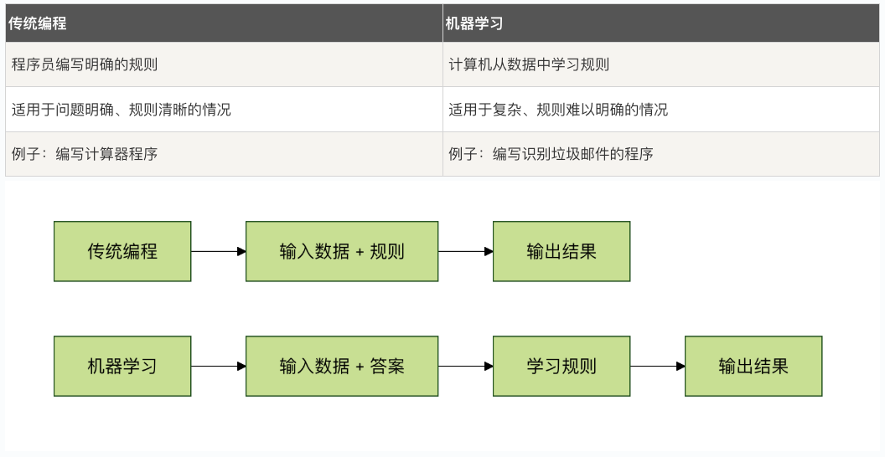
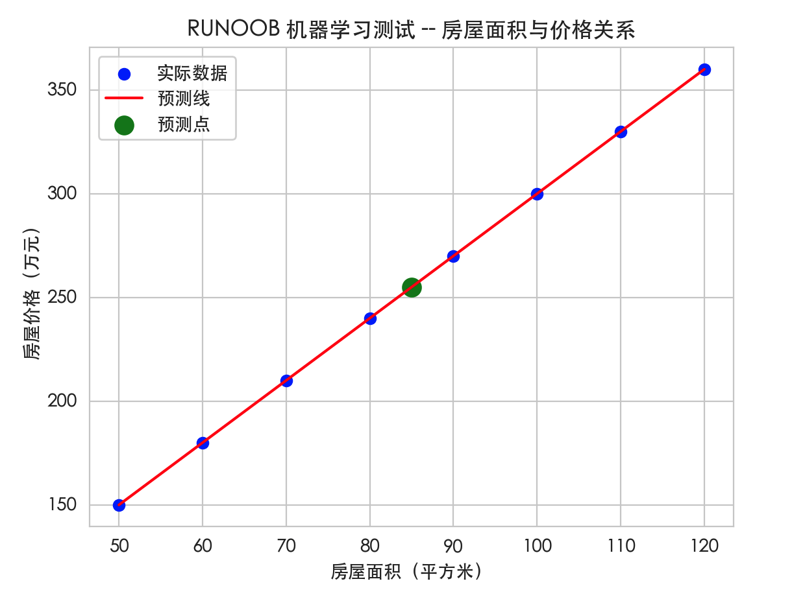

## 机器学习教程

机器学习（Machine Learning）是人工智能（AI）的一个分支，它使计算机系统能够利用数据和算法自动学习和改进其性能。
机器学习是让机器通过经验（数据）来做决策和预测。
机器学习已经广泛应用于许多领域，包括推荐系统、图像识别、语音识别、金融分析等。
举个例子，通过机器学习，汽车可以学习如何识别交通标志、行人和障碍物，以实现自动驾驶。

### 机器学习与传统编程的区别


### 机器学习的三大要素
机器学习包含三个基本要素：

#### 1. 数据
数据是机器学习的燃料，质量越高、数量越多的数据，通常能让模型学得越好。

* 训练数据：用来教模型的数据
* 测试数据：用来检验模型学习效果的数据
* 真实数据：模型在实际应用中遇到的新数据

#### 2. 算法
算法是机器学习的学习方法，不同的算法适用于不同类型的问题。
* 监督学习：有标准答案的学习
* 无监督学习：没有标准答案，自己找规律
* 强化学习：通过试错和奖励来学习

#### 3. 模型
模型是学习的结果，就像学生学到的知识一样。
* 训练过程：算法从数据中学习规律
* 推理过程：使用学到的规律做预测

### 实例
接下来我们通过一个简单的例子来理解机器学习的基本流程。
我们将使用 Python 创建一个简单的线性回归模型来预测房价。
实例
``` python

i# 导入需要的库
import numpy as np
import matplotlib.pyplot as plt
from sklearn.linear_model import LinearRegression
import seaborn as sns

# 设置图表风格，让图表更好看
sns.set_style("whitegrid")
# -------------------------- 设置中文字体 start --------------------------
plt.rcParams['font.sans-serif'] = [
    # Windows 优先
    'SimHei', 'Microsoft YaHei',
    # macOS 优先
    'PingFang SC', 'Heiti TC',
    # Linux 优先
    'WenQuanYi Micro Hei', 'DejaVu Sans'
]
# 修复负号显示为方块的问题
plt.rcParams['axes.unicode_minus'] = False
# -------------------------- 设置中文字体 end --------------------------

# 1. 准备数据
# 假设我们有房屋面积和对应的价格数据
# 房屋面积（平方米）
house_sizes = np.array([50, 60, 70, 80, 90, 100, 110, 120]).reshape(-1, 1)
# 房屋价格（万元）
house_prices = np.array([150, 180, 210, 240, 270, 300, 330, 360])

# 2. 创建并训练模型
# 创建线性回归模型
model = LinearRegression()
# 用数据训练模型（学习面积和价格之间的关系）
model.fit(house_sizes, house_prices)

# 3. 使用模型进行预测
# 预测 85 平方米的房屋价格
predicted_price = model.predict([[85]])
print(f"85 平方米的房屋预测价格：{predicted_price[0]:.2f} 万元")

# 4. 可视化结果
plt.scatter(house_sizes, house_prices, color='blue', label='实际数据')
plt.plot(house_sizes, model.predict(house_sizes), color='red', label='预测线')
plt.scatter([85], predicted_price, color='green', s=100, label='预测点')
plt.xlabel('房屋面积（平方米）')
plt.ylabel('房屋价格（万元）')
plt.title('RUNOOB 机器学习测试 -- 房屋面积与价格关系')
plt.legend()
plt.grid(True)
plt.show()

```
运行结果：
``` 
  85 平方米的房屋预测价格：255.00 万元
``` 
这个例子展示了机器学习的基本流程：

1 准备数据（房屋面积和价格）
2 选择算法（线性回归）
3 训练模型（让计算机学习面积和价格的关系）
4 使用模型预测（预测新面积的价格）
输出的图如下：

