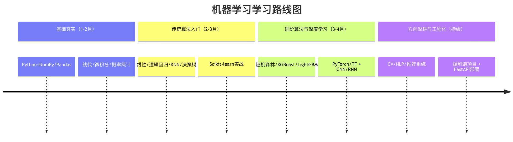
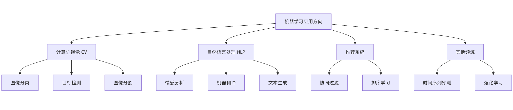

机器学习是当今最热门的技术领域之一，它让计算机能够从数据中学习并做出预测或决策。

对于初学者来说，面对海量的算法、数学理论和编程工具，很容易感到迷茫，不知从何入手。

本文将介绍从零基础到具备实践能力的机器学习学习路线图。




## 机器学习 - 学习课程列表
### 基础入门
* 基础入门	机器学习教程
* 基础入门	机器学习简介
* 基础入门	机器学习生命周期
* 基础入门	机器学习如何工作
* 基础入门	机器学习基础术语
* 基础入门	Python 入门机器学习
* 基础入门	Python 机器学习库
* 基础入门	常用数据类型
* 基础入门	机器学习应用
### 数据处理与统计
* 数据处理与统计	数据理解
* 数据处理与统计	数据清洗
* 数据处理与统计	特征工程
* 数据处理与统计	数据可视化
* 数据处理与统计	训练集测试集划分
* 数据处理与统计	统计学基础
* 数据处理与统计	概率思维
* 数据处理与统计	损失函数与梯度
* 数据处理与统计	过拟合、欠拟合、偏差与方差
### 监督学习
* 监督学习	机器学习算法
* 监督学习	线性回归
* 监督学习	多元线性回归
* 监督学习	多项式回归
* 监督学习	逻辑回归
* 监督学习	回归模型评估
* 监督学习	决策树
* 监督学习	支持向量机
* 监督学习	K 近邻算法
* 监督学习	集成学习
* 监督学习	朴素贝叶斯
* 监督学习	随机森林
* 监督学习	分类指标
### 无监督学习
* 无监督学习	聚类
* 无监督学习	降维
* 无监督学习	降维
### 强化学习
* 强化学习	强化学习基本框架
* 强化学习	强化学习探索vs开采
* 强化学习	强化学习 Q-learning 与 SARSA
* 强化学习	深度强化学习
### 深度学习
* 深度学习	神经网络的基本结构
* 深度学习	前向传播与反向传播
* 深度学习	深度学习vs传统机器学习
* 深度学习	常见网络类型
### 模型优化与工程
* 模型优化与工程	交叉验证
* 模型优化与工程	正则化
* 模型优化与工程	数据泄漏
* 模型优化与工程	集成方法
* 模型优化与工程	超参搜索
* 模型优化与工程	MLOps 概念
* 模型优化与工程	常见问题排查
### 机器学习的限制与边界
* 机器学习的限制与边界	可解释性问题
* 机器学习的限制与边界	假设限制
* 机器学习的限制与边界	数据偏差
* 机器学习的限制与边界	模型的现实成本
### 实战案例
* 实战案例	泰坦尼克号生存预测
* 实战案例	房价预测
* 实战案例	客户分群
* 实战案例	PCA 可视化
* 实战案例	强化学习示例

## 第一阶段：筑基篇 - 打好坚实基础
在接触复杂的算法之前，你需要先搭建起支撑知识大厦的地基。这个阶段的目标是掌握必要的数学、编程和数据分析技能。
### 核心技能一：编程语言 (Python)
Python 是机器学习领域的通用语言，因其语法简洁、库生态丰富而备受青睐。

学习目标：掌握 Python 基础语法、数据结构、函数和面向对象编程。

#### 关键库：

* NumPy：用于高效的数值计算，是几乎所有科学计算库的基础。
* Pandas：用于数据清洗、分析和处理，操作数据表格（DataFrame）的利器。
* Matplotlib / Seaborn：用于数据可视化，将数据转化为直观的图表。
接下来我么可以看一个案例。

测试数据 house_prices.csv 文件内容：
```csv
面积,价格,房龄,卧室数,城市
45,120,15,1,北京
60,180,12,2,北京
75,260,8,2,北京
90,320,6,3,北京
110,420,5,3,北京
130,520,3,4,北京
50,80,20,1,成都
70,120,15,2,成都
85,150,12,3,成都
100,190,10,3,成都
120,240,8,4,成都
140,300,5,4,成都
55,150,18,1,上海
70,220,14,2,上海
85,300,10,2,上海
100,380,8,3,上海
120,480,6,3,上海
150,650,4,4,上海
40,60,22,1,武汉
65,95,16,2,武汉
80,130,12,2,武汉
95,170,9,3,武汉
115,220,7,3,武汉
135,280,5,4,武汉
```

实例
```python
# 示例：使用 Pandas 和 Matplotlib 进行基础数据分析
import pandas as pd
import matplotlib.pyplot as plt

# -------------------------- 设置中文字体 start --------------------------
plt.rcParams['font.sans-serif'] = [
    # Windows 优先
    'SimHei', 'Microsoft YaHei',
    # macOS 优先
    'PingFang SC', 'Heiti TC',
    # Linux 优先
    'WenQuanYi Micro Hei', 'DejaVu Sans'
]
# 修复负号显示为方块的问题
plt.rcParams['axes.unicode_minus'] = False
# -------------------------- 设置中文字体 end --------------------------

# 1. 读取数据
data = pd.read_csv('house_prices.csv')
print("数据前5行：")
print(data.head())

# 2. 查看数据基本信息
print("\n数据信息：")
print(data.info())

# 3. 绘制房屋面积与价格的散点图
plt.figure(figsize=(10, 6))
plt.scatter(data['面积'], data['价格'], alpha=0.5)
plt.title('房屋面积 vs 价格')
plt.xlabel('面积 (平方米)')
plt.ylabel('价格 (万元)')
plt.grid(True)
plt.show()
```

执行后，输出的图如下：


### 核心技能二：必要数学知识
你不需要成为数学家，但需要理解算法背后的基本逻辑。

* 线性代数：理解向量、矩阵、矩阵乘法。这是理解数据在多维空间中表示和变换的基础。
* 微积分：重点是理解导数和偏导数的概念。它们是优化算法（如梯度下降）的核心，用于寻找模型的最佳参数。
* 概率与统计：理解均值、方差、标准差、概率分布、条件概率和贝叶斯定理。这对于评估模型、理解不确定性至关重要。
比喻：把机器学习模型想象成一个复杂的调音台。数学知识就是你理解每个旋钮（参数）如何影响最终声音（预测结果）的说明书。没有说明书，你只能盲目乱拧。


## 第二阶段：入门篇 - 掌握经典算法
有了坚实的基础，你可以开始探索机器学习的核心——算法。建议从最经典、最直观的算法开始。

#### 监督学习入门
监督学习是指用已有标签的数据来训练模型。

* 线性回归：预测连续值（如房价）。理解它的代价函数和梯度下降优化过程。
* 逻辑回归：解决分类问题（如判断邮件是否为垃圾邮件）。理解Sigmoid函数和决策边界。
* K-最近邻 (K-NN)：一种基于实例的简单分类/回归算法。
* 决策树：模拟人类决策过程，非常直观易懂。
#### 无监督学习入门
无监督学习用于发现数据内在的结构和模式。

* K-均值聚类：将数据自动分组到 K 个类别中。
* 主成分分析 (PCA)：用于数据降维和可视化，提取最重要的特征。
工具升级：在此阶段，开始系统性地使用 scikit-learn 库。它提供了统一的 API，让你能快速实现、比较和评估各种算法。

实例
```python
import numpy as np
from sklearn.model_selection import train_test_split
from sklearn.linear_model import LogisticRegression
from sklearn.metrics import accuracy_score, classification_report

# =========================
# 1. 构造可运行的测试数据
# 场景：是否通过考试（1=通过，0=未通过）
# 特征：学习时长、出勤率、作业完成率
# =========================
X = np.array([
    [2, 60, 50],
    [3, 65, 55],
    [4, 70, 65],
    [5, 75, 70],
    [6, 80, 75],
    [7, 85, 80],
    [8, 90, 85],
    [9, 92, 88],
    [10, 95, 90],
    [11, 97, 92],
    [1, 50, 40],
    [2, 55, 45],
    [3, 60, 50],
    [4, 65, 55],
    [5, 70, 60],
    [6, 75, 65],
    [7, 80, 70],
    [8, 85, 75],
    [9, 90, 80],
    [10, 95, 85]
])

y = np.array([
    0, 0, 0, 0, 1,
    1, 1, 1, 1, 1,
    0, 0, 0, 0, 0,
    1, 1, 1, 1, 1
])

# =========================
# 2. 划分训练集和测试集
# =========================
X_train, X_test, y_train, y_test = train_test_split(
    X, y, test_size=0.3, random_state=42
)

# =========================
# 3. 创建并训练模型
# =========================
model = LogisticRegression(max_iter=1000)
model.fit(X_train, y_train)

# =========================
# 4. 进行预测
# =========================
y_pred = model.predict(X_test)

# =========================
# 5. 评估模型性能
# =========================
print(f"模型准确率：{accuracy_score(y_test, y_pred):.2f}")
print("\n详细分类报告：")
print(classification_report(y_test, y_pred))
```

输出内容：
```
模型准确率：0.83

详细分类报告：
              precision    recall  f1-score   support

           0       0.67      1.00      0.80         2
           1       1.00      0.75      0.86         4

    accuracy                           0.83         6
   macro avg       0.83      0.88      0.83         6
weighted avg       0.89      0.83      0.84         6

```

## 第三阶段：进阶篇 - 深入核心领域
掌握了经典算法后，你可以向更现代、更强大的领域进发。

### 深入传统机器学习
* 集成学习：学习如何组合多个弱模型来构建一个强模型。
   * 随机森林：多棵决策树的集成，抗过拟合能力强。
   * 梯度提升树 (如XGBoost, LightGBM)：在竞赛和工业界极为流行的高性能算法。
* 支持向量机 (SVM)：理解其最大化"间隔"的核心思想。
* 模型评估与优化：深入学习交叉验证、超参数调优（如 GridSearchCV）、以及解决过拟合/欠拟合的方法。
### 踏入深度学习
当数据（特别是图像、文本、语音）变得复杂时，深度学习开始展现其强大能力。

* 神经网络基础：理解神经元、激活函数、前向传播、反向传播和损失函数。
* 深度学习框架：选择 PyTorch（研究友好、灵活）或 TensorFlow/Keras（生产环境成熟、生态完整）之一深入学习。
* 卷积神经网络 (CNN)：处理图像数据的标配，理解卷积层、池化层的作用。
* 循环神经网络 (RNN) 与长短时记忆网络 (LSTM)：处理序列数据（如文本、时间序列）的利器。

实例
```python
# 示例：使用 Keras 快速构建一个简单的神经网络
from tensorflow import keras
from tensorflow.keras import layers

model = keras.Sequential([
    layers.Dense(64, activation='relu', input_shape=(input_dim,)), # 隐藏层1
    layers.Dropout(0.2), # 丢弃层，防止过拟合
    layers.Dense(32, activation='relu'), # 隐藏层2
    layers.Dense(1, activation='sigmoid') # 输出层，用于二分类
])

model.compile(optimizer='adam',
              loss='binary_crossentropy',
              metrics=['accuracy'])

model.summary() # 打印模型结构
# 之后可以使用 model.fit 进行训练
```

## 第四阶段：应用与拓展篇 - 聚焦方向，解决实际问题
机器学习分支众多，此时你需要根据兴趣或职业规划选择一个方向深入。

#### 主要方向选择


* 计算机视觉 (CV)：深入研究 CNN 的变体（ResNet, YOLO），学习图像分割、目标检测。
* 自然语言处理 (NLP)：从词嵌入（Word2Vec）学到 Transformer 架构（BERT, GPT），掌握文本分类、情感分析、机器翻译。
* 推荐系统：学习协同过滤、矩阵分解、深度学习推荐模型。
* 强化学习：让智能体通过与环境交互来学习最优策略，是游戏 AI 和机器人控制的核心。


#### 工程化与部署
学习如何将训练好的模型部署到生产环境，提供真正的服务。

* 模型保存与加载（pickle, joblib, .h5 文件）。
* 使用Flask/FastAPI 构建简单的 API 服务。
* 了解Docker容器化和云服务（如 AWS SageMaker, Google AI Platform）的基本概念。


##  总结与资源推荐
#### 学习路径可视化
#### 实践是唯一的捷径
##### 最重要的建议：边学边做，项目驱动！

##### 1 模仿：复现教程和论文中的项目。
##### 2 实践：在 Kaggle、天池等平台参加入门级比赛。
##### 3 创造：尝试用机器学习解决一个你个人感兴趣的小问题（如分析你的运动数据、自动分类你的照片集）。
#### 优质资源推荐
* 经典课程：吴恩达《机器学习》（Coursera）， 李沐《动手学深度学习》。
* 实践平台：Kaggle（竞赛和数据集）， Colab / Jupyter Notebook（免费云端环境）。
* 知识巩固：阅读 scikit-learn、PyTorch 官方文档， 在 Stack Overflow 和相关论坛社区交流。


