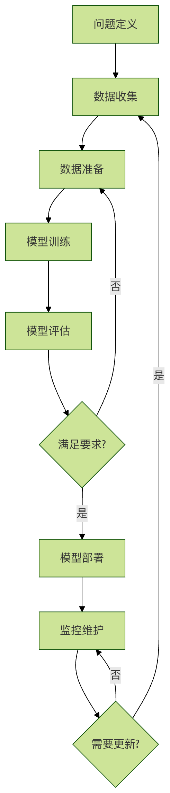

## 机器学习项目生命周期


机器学习项目就像建造一座房子，需要从设计图纸到施工再到验收的完整过程，每个环节都至关重要，缺一不可。

#### 机器学习流程的六个核心阶段：

* 1 问题定义：明确要解决什么问题
* 2 数据收集：获取相关数据
* 3 数据准备：清洗和预处理数据
* 4 模型训练：选择算法并训练模型
* 5 模型评估：评估模型性能
* 6 模型部署：将模型投入使用




## 第一阶段：问题定义
### 明确业务问题
问题定义是机器学习项目最重要的起点，就像导航前需要明确目的地一样。

关键问题
#### 我们要解决什么问题？
* 分类问题：判断邮件是否为垃圾邮件
* 回归问题：预测房价
* 聚类问题：客户分群
* 异常检测：发现信用卡欺诈

#### 为什么这个问题重要？
* 业务价值：提高效率、降低成本、增加收入
* 用户价值：改善体验、提供个性化服务

#### 成功的标准是什么？
* 量化指标：准确率达到 90% 以上
* 业务指标：转化率提升 20%

### 问题定义示例
```python

# 问题定义示例：电商推荐系统
class ProblemDefinition:
    def __init__(self):
        # 业务问题
        self.business_problem = "用户购买转化率低，需要提高推荐精准度"
        
        # 技术问题
        self.technical_problem = "基于用户行为预测用户可能购买的商品"
        
        # 问题类型
        self.problem_type = "推荐系统（分类+排序）"
        
        # 成功标准
        self.success_criteria = {
            "点击率提升": "15%",
            "转化率提升": "10%",
            "推荐准确率": "80%"
        }
        
        # 约束条件
        self.constraints = {
            "响应时间": "< 100ms",
            "数据隐私": "符合 GDPR 要求",
            "计算资源": "现有服务器配置"
        }
    
    def define_features_and_labels(self):
        """定义特征和标签"""
        features = {
            "用户特征": ["年龄", "性别", "购买历史", "浏览行为"],
            "商品特征": ["类别", "价格", "评分", "库存"],
            "上下文特征": ["时间", "设备", "地理位置"]
        }
        
        labels = {
            "主要标签": "是否点击",
            "次要标签": "是否购买",
            "辅助标签": "停留时间"
        }
        
        return features, labels
    
    def print_definition(self):
        """打印问题定义"""
        print("=" * 50)
        print("机器学习问题定义")
        print("=" * 50)
        print(f"业务问题：{self.business_problem}")
        print(f"技术问题：{self.technical_problem}")
        print(f"问题类型：{self.problem_type}")
        print("\n成功标准：")
        for metric, target in self.success_criteria.items():
            print(f"  {metric}：{target}")
        print("\n约束条件：")
        for constraint, limit in self.constraints.items():
            print(f"  {constraint}：{limit}")
        
        features, labels = self.define_features_and_labels()
        print("\n特征定义：")
        for category, items in features.items():
            print(f"  {category}：{', '.join(items)}")
        print("\n标签定义：")
        for label_type, label_name in labels.items():
            print(f"  {label_type}：{label_name}")

# 使用示例
problem = ProblemDefinition()
problem.print_definition()

```
输出内容：

```
==================================================
机器学习问题定义
==================================================
业务问题：用户购买转化率低，需要提高推荐精准度
技术问题：基于用户行为预测用户可能购买的商品
问题类型：推荐系统（分类+排序）

成功标准：
  点击率提升：15%
  转化率提升：10%
  推荐准确率：80%

约束条件：
  响应时间：< 100ms
  数据隐私：符合 GDPR 要求
  计算资源：现有服务器配置

特征定义：
  用户特征：年龄, 性别, 购买历史, 浏览行为
  商品特征：类别, 价格, 评分, 库存
  上下文特征：时间, 设备, 地理位置

标签定义：
  主要标签：是否点击
  次要标签：是否购买
  辅助标签：停留时间

```

## 第二阶段：数据收集
### 数据来源
数据是机器学习的燃料，没有合适的数据再好的算法也无法发挥作用。

常见数据来源
 * 1 内部数据：公司业务数据、用户行为数据
 * 2 外部数据：公开数据集、第三方数据服务
 * 3 网络爬虫：网页数据、社交媒体数据
 * 4 传感器数据：IoT 设备、监控系统

 数据收集示例
实例
```python
# 数据收集示例：模拟多种数据源
import pandas as pd
import numpy as np
from datetime import datetime, timedelta

class DataCollector:
    def __init__(self):
        self.collected_data = {}
    
    def collect_user_data(self, n_users=1000):
        """收集用户数据"""
        np.random.seed(42)
        
        user_data = {
            'user_id': range(1, n_users + 1),
            'age': np.random.randint(18, 65, n_users),
            'gender': np.random.choice(['男', '女'], n_users),
            'city': np.random.choice(['北京', '上海', '广州', '深圳'], n_users),
            'registration_date': [
                datetime.now() - timedelta(days=np.random.randint(1, 365))
                for _ in range(n_users)
            ]
        }
        
        self.collected_data['users'] = pd.DataFrame(user_data)
        print(f"收集了 {len(user_data['user_id'])} 条用户数据")
        return self.collected_data['users']
    
    def collect_behavior_data(self, n_behaviors=5000):
        """收集用户行为数据"""
        np.random.seed(42)
        
        user_ids = np.random.choice(range(1, 1001), n_behaviors)
        product_ids = np.random.choice(range(1, 501), n_behaviors)
        
        behavior_data = {
            'behavior_id': range(1, n_behaviors + 1),
            'user_id': user_ids,
            'product_id': product_ids,
            'behavior_type': np.random.choice(
                ['浏览', '点击', '加购物车', '购买'], n_behaviors, 
                p=[0.4, 0.3, 0.2, 0.1]
            ),
            'timestamp': [
                datetime.now() - timedelta(minutes=np.random.randint(1, 10080))
                for _ in range(n_behaviors)
            ],
            'duration': np.random.exponential(30, n_behaviors)  # 停留时间（秒）
        }
        
        self.collected_data['behaviors'] = pd.DataFrame(behavior_data)
        print(f"收集了 {len(behavior_data['behavior_id'])} 条行为数据")
        return self.collected_data['behaviors']
    
    def collect_product_data(self, n_products=500):
        """收集商品数据"""
        np.random.seed(42)
        
        categories = ['电子产品', '服装', '食品', '家居', '图书']
        product_data = {
            'product_id': range(1, n_products + 1),
            'category': np.random.choice(categories, n_products),
            'price': np.random.uniform(10, 1000, n_products),
            'rating': np.random.uniform(3.0, 5.0, n_products),
            'stock': np.random.randint(0, 1000, n_products)
        }
        
        self.collected_data['products'] = pd.DataFrame(product_data)
        print(f"收集了 {len(product_data['product_id'])} 条商品数据")
        return self.collected_data['products']
    
    def get_data_summary(self):
        """获取数据摘要"""
        print("\n数据收集摘要：")
        for name, df in self.collected_data.items():
            print(f"\n{name} 数据集：")
            print(f"  形状：{df.shape}")
            print(f"  列名：{list(df.columns)}")
            print(f"  缺失值：{df.isnull().sum().sum()}")
            print(f"  示例数据：")
            print(df.head(2))

# 使用示例
collector = DataCollector()
collector.collect_user_data()
collector.collect_behavior_data()
collector.collect_product_data()
collector.get_data_summary()
```

## 第三阶段：数据准备
### 数据准备的重要性
#### 数据准备占机器学习项目 60-80% 的时间，就像做菜前的准备工作一样重要。

数据准备的主要任务
* 1 数据清洗：处理缺失值、异常值、重复值
* 2 特征工程：创建新特征、选择重要特征
* 3 数据转换：标准化、归一化、编码
* 4 数据划分：训练集、验证集、测试集

数据准备示例
实例
```python
# 数据准备示例
import pandas as pd
import numpy as np
from sklearn.preprocessing import StandardScaler, LabelEncoder
from sklearn.model_selection import train_test_split

class DataPreparer:
    def __init__(self, data):
        self.data = data.copy()
        self.processed_data = None
   
    def clean_data(self):
        """数据清洗"""
        print("开始数据清洗...")
       
        # 1. 处理缺失值
        print(f"处理前缺失值数量：{self.data.isnull().sum().sum()}")
       
        # 数值列用均值填充
        numeric_columns = self.data.select_dtypes(include=[np.number]).columns
        for col in numeric_columns:
            if self.data[col].isnull().sum() > 0:
                self.data[col].fillna(self.data[col].mean(), inplace=True)
       
        # 类别列用众数填充
        categorical_columns = self.data.select_dtypes(include=['object']).columns
        for col in categorical_columns:
            if self.data[col].isnull().sum() > 0:
                mode_val = self.data[col].mode()[0]
                self.data[col].fillna(mode_val, inplace=True)
       
        print(f"处理后缺失值数量：{self.data.isnull().sum().sum()}")
       
        # 2. 处理重复值
        duplicates_before = self.data.duplicated().sum()
        self.data.drop_duplicates(inplace=True)
        duplicates_after = self.data.duplicated().sum()
        print(f"删除重复值：{duplicates_before - duplicates_after} 条")
       
        # 3. 处理异常值（简单方法：使用 IQR）
        for col in numeric_columns:
            Q1 = self.data[col].quantile(0.25)
            Q3 = self.data[col].quantile(0.75)
            IQR = Q3 - Q1
            lower_bound = Q1 - 1.5 * IQR
            upper_bound = Q3 + 1.5 * IQR
           
            outliers = ((self.data[col] < lower_bound) |
                       (self.data[col] > upper_bound)).sum()
            if outliers > 0:
                # 用边界值替换异常值
                self.data[col] = self.data[col].clip(lower_bound, upper_bound)
                print(f"处理 {col} 列的 {outliers} 个异常值")
       
        return self.data
   
    def feature_engineering(self):
        """特征工程"""
        print("\n开始特征工程...")
       
        # 1. 创建新特征（示例）
        if 'price' in self.data.columns and 'rating' in self.data.columns:
            # 创建性价比特征
            self.data['price_per_rating'] = self.data['price'] / self.data['rating']
            print("创建新特征：price_per_rating")
       
        # 2. 特征选择（简单示例：移除低方差特征）
        numeric_columns = self.data.select_dtypes(include=[np.number]).columns
        low_variance_features = []
       
        for col in numeric_columns:
            if self.data[col].var() < 0.01:  # 方差阈值
                low_variance_features.append(col)
       
        if low_variance_features:
            self.data.drop(columns=low_variance_features, inplace=True)
            print(f"移除低方差特征：{low_variance_features}")
       
        return self.data
   
    def transform_data(self):
        """数据转换"""
        print("\n开始数据转换...")
       
        # 1. 编码类别变量
        categorical_columns = self.data.select_dtypes(include=['object']).columns
        label_encoders = {}
       
        for col in categorical_columns:
            le = LabelEncoder()
            self.data[col] = le.fit_transform(self.data[col])
            label_encoders[col] = le
            print(f"编码类别变量：{col}")
       
        # 2. 标准化数值变量
        numeric_columns = self.data.select_dtypes(include=[np.number]).columns
        scaler = StandardScaler()
       
        if len(numeric_columns) > 0:
            self.data[numeric_columns] = scaler.fit_transform(self.data[numeric_columns])
            print(f"标准化数值变量：{list(numeric_columns)}")
       
        return self.data, label_encoders, scaler
   
    def split_data(self, target_column, test_size=0.2, val_size=0.2):
        """数据划分"""
        print(f"\n开始数据划分（测试集比例：{test_size}，验证集比例：{val_size}）...")
       
        X = self.data.drop(columns=[target_column])
        y = self.data[target_column]
       
        # 首先分离出测试集
        X_temp, X_test, y_temp, y_test = train_test_split(
            X, y, test_size=test_size, random_state=42
        )
       
        # 再从剩余数据中分离出验证集
        val_size_adjusted = val_size / (1 - test_size)
        X_train, X_val, y_train, y_val = train_test_split(
            X_temp, y_temp, test_size=val_size_adjusted, random_state=42
        )
       
        print(f"训练集大小：{X_train.shape[0]}")
        print(f"验证集大小：{X_val.shape[0]}")
        print(f"测试集大小：{X_test.shape[0]}")
       
        return {
            'X_train': X_train, 'y_train': y_train,
            'X_val': X_val, 'y_val': y_val,
            'X_test': X_test, 'y_test': y_test
        }
   
    def prepare_pipeline(self, target_column):
        """完整的数据准备流水线"""
        print("=" * 50)
        print("数据准备流水线")
        print("=" * 50)
       
        # 1. 数据清洗
        self.clean_data()
       
        # 2. 特征工程
        self.feature_engineering()
       
        # 3. 数据转换
        processed_data, encoders, scaler = self.transform_data()
       
        # 4. 数据划分
        splits = self.split_data(target_column)
       
        self.processed_data = processed_data
        return splits, encoders, scaler

# 创建示例数据并演示数据准备
np.random.seed(42)
sample_data = pd.DataFrame({
    'age': np.random.randint(18, 65, 1000),
    'income': np.random.normal(50000, 15000, 1000),
    'gender': np.random.choice(['男', '女'], 1000),
    'city': np.random.choice(['北京', '上海', '广州'], 1000),
    'target': np.random.choice([0, 1], 1000)
})

# 添加一些缺失值和异常值
sample_data.loc[np.random.choice(1000, 50), 'income'] = np.nan
sample_data.loc[np.random.choice(1000, 20), 'age'] = np.random.randint(100, 150)

preparer = DataPreparer(sample_data)
splits, encoders, scaler = preparer.prepare_pipeline('target')

```

## 第四阶段：模型训练
#### 模型选择策略
选择合适的模型是成功的关键，就像选择合适的工具来完成工作一样。

#### 模型选择考虑因素
   1. 问题类型：分类、回归、聚类等
   2. 数据特征：数据量、特征数量、数据类型
   3. 性能要求：准确率、速度、可解释性
   4. 资源约束：计算资源、时间限制

模型训练示例
实例
```python
# 模型训练示例
from sklearn.linear_model import LogisticRegression, LinearRegression
from sklearn.ensemble import RandomForestClassifier, RandomForestRegressor
from sklearn.svm import SVC, SVR
from sklearn.metrics import accuracy_score, mean_squared_error, classification_report

class ModelTrainer:
    def __init__(self):
        self.models = {}
        self.trained_models = {}
   
    def register_model(self, name, model, problem_type):
        """注册模型"""
        self.models[name] = {
            'model': model,
            'problem_type': problem_type
        }
        print(f"注册模型：{name}（{problem_type}）")
   
    def train_single_model(self, name, X_train, y_train):
        """训练单个模型"""
        if name not in self.models:
            raise ValueError(f"模型 {name} 未注册")
       
        model_info = self.models[name]
        model = model_info['model']
       
        print(f"\n训练模型：{name}")
        model.fit(X_train, y_train)
       
        self.trained_models[name] = model
        print(f"模型 {name} 训练完成")
       
        return model
   
    def train_all_models(self, X_train, y_train):
        """训练所有注册的模型"""
        print("\n开始训练所有模型...")
       
        for name in self.models.keys():
            try:
                self.train_single_model(name, X_train, y_train)
            except Exception as e:
                print(f"训练模型 {name} 时出错：{e}")
       
        return self.trained_models
   
    def evaluate_models(self, X_test, y_test):
        """评估所有训练好的模型"""
        print("\n模型评估结果：")
        print("-" * 50)
       
        results = {}
       
        for name, model in self.trained_models.items():
            problem_type = self.models[name]['problem_type']
           
            # 预测
            y_pred = model.predict(X_test)
           
            # 根据问题类型选择评估指标
            if problem_type == 'classification':
                accuracy = accuracy_score(y_test, y_pred)
                results[name] = {'accuracy': accuracy}
                print(f"{name}: 准确率 = {accuracy:.4f}")
               
                # 详细报告
                print(classification_report(y_test, y_pred))
               
            elif problem_type == 'regression':
                mse = mean_squared_error(y_test, y_pred)
                rmse = np.sqrt(mse)
                results[name] = {'mse': mse, 'rmse': rmse}
                print(f"{name}: MSE = {mse:.4f}, RMSE = {rmse:.4f}")
           
            print("-" * 50)
       
        return results
   
    def get_best_model(self, results, metric='accuracy'):
        """获取最佳模型"""
        if not results:
            return None
       
        best_model_name = max(results.keys(), key=lambda x: results[x].get(metric, 0))
        best_score = results[best_model_name][metric]
       
        print(f"\n最佳模型：{best_model_name}（{metric} = {best_score:.4f}）")
       
        return best_model_name, self.trained_models[best_model_name]

# 使用示例
trainer = ModelTrainer()

# 注册不同类型的模型
trainer.register_model('逻辑回归', LogisticRegression(random_state=42), 'classification')
trainer.register_model('随机森林', RandomForestClassifier(n_estimators=100, random_state=42), 'classification')
trainer.register_model('支持向量机', SVC(random_state=42), 'classification')

# 创建训练数据
X_train = splits['X_train']
y_train = splits['y_train']
X_test = splits['X_test']
y_test = splits['y_test']

# 训练所有模型
trained_models = trainer.train_all_models(X_train, y_train)

# 评估模型
results = trainer.evaluate_models(X_test, y_test)

# 获取最佳模型
best_name, best_model = trainer.get_best_model(results)

```

## 第五阶段：模型评估
### 评估指标选择
#### 选择合适的评估指标就像选择合适的尺子，不同的指标适用于不同的场景。

#### 常见评估指标
#### 分类问题：
* 准确率（Accuracy）：正确预测的比例
* 精确率（Precision）：预测为正的样本中真正为正的比例
* 召回率（Recall）：实际为正的样本中被正确预测为正的比例
* F1分数：精确率和召回率的调和平均

#### 回归问题：
* 均方误差（MSE）：预测值与真实值差的平方的平均
* 均方根误差（RMSE）：MSE 的平方根
* 平均绝对误差（MAE）：预测值与真实值差的绝对值的平均
* R² 分数：模型解释的方差比例

#### 模型评估示例
均方根误差（RMSE）：MSE 的平方根
平均绝对误差（MAE）：预测值与真实值差的绝对值的平均
R² 分数：模型解释的方差比例
模型评估示例
实例
```python
# 模型评估示例
import matplotlib.pyplot as plt
from sklearn.metrics import (
    accuracy_score, precision_score, recall_score, f1_score,
    confusion_matrix, roc_curve, auc
)

class ModelEvaluator:
    def __init__(self):
        self.evaluation_results = {}
   
    def evaluate_classification(self, y_true, y_pred, y_prob=None, model_name="Model"):
        """评估分类模型"""
        results = {}
       
        # 基本指标
        results['accuracy'] = accuracy_score(y_true, y_pred)
        results['precision'] = precision_score(y_true, y_pred, average='weighted')
        results['recall'] = recall_score(y_true, y_pred, average='weighted')
        results['f1'] = f1_score(y_true, y_pred, average='weighted')
       
        print(f"\n{model_name} 分类评估结果：")
        print(f"准确率：{results['accuracy']:.4f}")
        print(f"精确率：{results['precision']:.4f}")
        print(f"召回率：{results['recall']:.4f}")
        print(f"F1 分数：{results['f1']:.4f}")
       
        # 混淆矩阵
        cm = confusion_matrix(y_true, y_pred)
        print(f"\n混淆矩阵：")
        print(cm)
       
        # ROC 曲线（如果有概率预测）
        if y_prob is not None and len(np.unique(y_true)) == 2:
            fpr, tpr, thresholds = roc_curve(y_true, y_prob[:, 1])
            roc_auc = auc(fpr, tpr)
            results['roc_auc'] = roc_auc
           
            # 绘制 ROC 曲线
            plt.figure(figsize=(8, 6))
            plt.plot(fpr, tpr, color='darkorange', lw=2,
                    label=f'ROC 曲线 (AUC = {roc_auc:.2f})')
            plt.plot([0, 1], [0, 1], color='navy', lw=2, linestyle='--')
            plt.xlim([0.0, 1.0])
            plt.ylim([0.0, 1.05])
            plt.xlabel('假正率')
            plt.ylabel('真正率')
            plt.title(f'{model_name} ROC 曲线')
            plt.legend(loc="lower right")
            plt.grid(True)
            plt.show()
       
        self.evaluation_results[model_name] = results
        return results
   
    def evaluate_regression(self, y_true, y_pred, model_name="Model"):
        """评估回归模型"""
        results = {}
       
        # 基本指标
        mse = np.mean((y_true - y_pred) ** 2)
        rmse = np.sqrt(mse)
        mae = np.mean(np.abs(y_true - y_pred))
       
        # R² 分数
        ss_res = np.sum((y_true - y_pred) ** 2)
        ss_tot = np.sum((y_true - np.mean(y_true)) ** 2)
        r2 = 1 - (ss_res / ss_tot)
       
        results['mse'] = mse
        results['rmse'] = rmse
        results['mae'] = mae
        results['r2'] = r2
       
        print(f"\n{model_name} 回归评估结果：")
        print(f"均方误差 (MSE)：{mse:.4f}")
        print(f"均方根误差 (RMSE)：{rmse:.4f}")
        print(f"平均绝对误差 (MAE)：{mae:.4f}")
        print(f"R² 分数：{r2:.4f}")
       
        # 绘制预测 vs 真实值
        plt.figure(figsize=(8, 6))
        plt.scatter(y_true, y_pred, alpha=0.6)
        plt.plot([y_true.min(), y_true.max()], [y_true.min(), y_true.max()],
                'r--', lw=2)
        plt.xlabel('真实值')
        plt.ylabel('预测值')
        plt.title(f'{model_name} 预测 vs 真实值')
        plt.grid(True)
        plt.show()
       
        self.evaluation_results[model_name] = results
        return results
   
    def compare_models(self):
        """比较所有评估过的模型"""
        if not self.evaluation_results:
            print("没有可比较的模型评估结果")
            return
       
        print("\n模型比较：")
        print("-" * 50)
       
        # 创建比较表格
        comparison_data = []
        for model_name, results in self.evaluation_results.items():
            row = [model_name]
            for metric, value in results.items():
                row.append(f"{value:.4f}")
            comparison_data.append(row)
       
        # 打印表格
        headers = ["模型名称"] + list(self.evaluation_results.values())[0].keys()
        print("\t".join(headers))
        for row in comparison_data:
            print("\t".join(row))

# 使用示例
evaluator = ModelEvaluator()

# 评估分类模型
y_pred_class = best_model.predict(X_test)
y_prob_class = best_model.predict_proba(X_test)
evaluator.evaluate_classification(y_test, y_pred_class, y_prob_class, "最佳分类模型")

# 比较所有模型
evaluator.compare_models()
```

## 第六阶段：模型部署
#### 部署策略
模型部署是将模型投入实际使用的过程，就像将研发的产品推向市场一样。

部署方式
* 1 批量预测：定期处理大量数据
* 2 实时预测：在线服务，即时响应
* 3 嵌入式部署：将模型集成到现有系统
* 4 边缘部署：在设备端运行模型，减少延迟和带宽需求

模型部署示例
```python
# 模型部署示例
import pickle
import json
from datetime import datetime

class ModelDeployer:
    def __init__(self):
        self.deployed_models = {}
        self.deployment_logs = []
    
    def save_model(self, model, model_name, filepath=None):
        """保存模型"""
        if filepath is None:
            filepath = f"{model_name}.pkl"
        
        with open(filepath, 'wb') as f:
            pickle.dump(model, f)
        
        print(f"模型 {model_name} 已保存到 {filepath}")
        
        # 记录部署日志
        log_entry = {
            'timestamp': datetime.now().isoformat(),
            'action': 'save_model',
            'model_name': model_name,
            'filepath': filepath
        }
        self.deployment_logs.append(log_entry)
        
        return filepath
    
    def load_model(self, model_name, filepath):
        """加载模型"""
        with open(filepath, 'rb') as f:
            model = pickle.load(f)
        
        self.deployed_models[model_name] = model
        print(f"模型 {model_name} 已从 {filepath} 加载")
        
        # 记录部署日志
        log_entry = {
            'timestamp': datetime.now().isoformat(),
            'action': 'load_model',
            'model_name': model_name,
            'filepath': filepath
        }
        self.deployment_logs.append(log_entry)
        
        return model
    
    def create_prediction_service(self, model_name, encoders=None, scaler=None):
        """创建预测服务"""
        if model_name not in self.deployed_models:
            raise ValueError(f"模型 {model_name} 未部署")
        
        model = self.deployed_models[model_name]
        
        def predict_service(input_data):
            """预测服务函数"""
            try:
                # 数据预处理
                if encoders:
                    for col, encoder in encoders.items():
                        if col in input_data.columns:
                            input_data[col] = encoder.transform(input_data[col])
                
                if scaler:
                    numeric_cols = input_data.select_dtypes(include=['number']).columns
                    input_data[numeric_cols] = scaler.transform(input_data[numeric_cols])
                
                # 预测
                prediction = model.predict(input_data)
                
                # 如果是分类模型，也返回概率
                if hasattr(model, 'predict_proba'):
                    probability = model.predict_proba(input_data)
                    return {
                        'prediction': prediction.tolist(),
                        'probability': probability.tolist(),
                        'status': 'success',
                        'timestamp': datetime.now().isoformat()
                    }
                else:
                    return {
                        'prediction': prediction.tolist(),
                        'status': 'success',
                        'timestamp': datetime.now().isoformat()
                    }
            
            except Exception as e:
                return {
                    'error': str(e),
                    'status': 'error',
                    'timestamp': datetime.now().isoformat()
                }
        
        # 记录服务创建日志
        log_entry = {
            'timestamp': datetime.now().isoformat(),
            'action': 'create_service',
            'model_name': model_name
        }
        self.deployment_logs.append(log_entry)
        
        return predict_service
    
    def monitor_model(self, model_name, input_data, true_labels=None):
        """监控模型性能"""
        if model_name not in self.deployed_models:
            raise ValueError(f"模型 {model_name} 未部署")
        
        predict_service = self.create_prediction_service(model_name)
        
        # 获取预测结果
        result = predict_service(input_data)
        
        # 监控信息
        monitoring_info = {
            'timestamp': datetime.now().isoformat(),
            'model_name': model_name,
            'input_shape': input_data.shape,
            'prediction_count': len(result.get('prediction', [])),
            'status': result.get('status', 'unknown')
        }
        
        # 如果有真实标签，计算性能指标
        if true_labels is not None and 'prediction' in result:
            predictions = result['prediction']
            if len(predictions) == len(true_labels):
                accuracy = accuracy_score(true_labels, predictions)
                monitoring_info['accuracy'] = accuracy
        
        print("模型监控信息：")
        for key, value in monitoring_info.items():
            print(f"  {key}: {value}")
        
        return monitoring_info
    
    def get_deployment_logs(self):
        """获取部署日志"""
        return self.deployment_logs

# 使用示例
deployer = ModelDeployer()

# 保存最佳模型
model_path = deployer.save_model(best_model, "best_classification_model")

# 加载模型
deployer.load_model("best_classification_model", model_path)

# 创建预测服务
prediction_service = deployer.create_prediction_service(
    "best_classification_model", encoders, scaler
)

# 使用预测服务
test_input = X_test.head(5)
prediction_result = prediction_service(test_input)
print("\n预测结果：")
print(json.dumps(prediction_result, indent=2, ensure_ascii=False))

# 监控模型
deployer.monitor_model("best_classification_model", test_input, y_test.head(5).values)
```

## 完整流程示例
实例
```python
# 完整的机器学习流程示例
class MLProjectPipeline:
    def __init__(self):
        self.data_collector = DataCollector()
        self.data_preparer = None
        self.model_trainer = ModelTrainer()
        self.model_evaluator = ModelEvaluator()
        self.model_deployer = ModelDeployer()
    
    def run_complete_pipeline(self, target_column):
        """运行完整的机器学习流水线"""
        print("=" * 60)
        print("机器学习项目完整流程")
        print("=" * 60)
        
        # 1. 数据收集
        print("\n第1步：数据收集")
        print("-" * 30)
        user_data = self.data_collector.collect_user_data(1000)
        behavior_data = self.data_collector.collect_behavior_data(5000)
        
        # 合并数据（简化示例）
        merged_data = pd.merge(user_data, behavior_data, on='user_id', how='inner')
        
        # 创建目标变量（示例：是否购买）
        merged_data['purchased'] = (merged_data['behavior_type'] == '购买').astype(int)
        
        # 2. 数据准备
        print("\n第2步：数据准备")
        print("-" * 30)
        
        # 选择特征列
        feature_columns = ['age', 'gender', 'city', 'duration']
        if all(col in merged_data.columns for col in feature_columns):
            data_for_ml = merged_data[feature_columns + ['purchased']].copy()
            
            # 处理类别变量
            data_for_ml['gender'] = data_for_ml['gender'].map({'男': 0, '女': 1})
            data_for_ml['city'] = data_for_ml['city'].map({'北京': 0, '上海': 1, '广州': 2})
            
            # 数据准备
            self.data_preparer = DataPreparer(data_for_ml)
            splits, encoders, scaler = self.data_preparer.prepare_pipeline('purchased')
            
            # 3. 模型训练
            print("\n第3步：模型训练")
            print("-" * 30)
            
            # 注册模型
            self.model_trainer.register_model(
                '逻辑回归', LogisticRegression(random_state=42), 'classification'
            )
            self.model_trainer.register_model(
                '随机森林', RandomForestClassifier(n_estimators=100, random_state=42), 'classification'
            )
            
            # 训练模型
            trained_models = self.model_trainer.train_all_models(
                splits['X_train'], splits['y_train']
            )
            
            # 4. 模型评估
            print("\n第4步：模型评估")
            print("-" * 30)
            
            results = self.model_trainer.evaluate_models(
                splits['X_test'], splits['y_test']
            )
            
            best_name, best_model = self.model_trainer.get_best_model(results)
            
            # 5. 模型部署
            print("\n第5步：模型部署")
            print("-" * 30)
            
            # 保存模型
            model_path = self.model_deployer.save_model(best_model, "production_model")
            
            # 创建预测服务
            prediction_service = self.model_deployer.create_prediction_service(
                "production_model"
            )
            
            # 测试预测服务
            test_input = splits['X_test'].head(3)
            prediction_result = prediction_service(test_input)
            
            print("\n预测服务测试结果：")
            print(json.dumps(prediction_result, indent=2, ensure_ascii=False))
            
            print("\n" + "=" * 60)
            print("机器学习项目流程完成！")
            print("=" * 60)
            
            return {
                'data': data_for_ml,
                'splits': splits,
                'best_model': best_model,
                'best_model_name': best_name,
                'evaluation_results': results,
                'prediction_service': prediction_service
            }
        
        else:
            print("数据列不完整，无法继续流程")
            return None

# 运行完整流程
pipeline = MLProjectPipeline()
project_results = pipeline.run_complete_pipeline('purchased')
```
