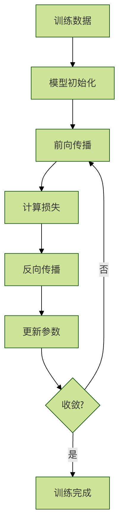
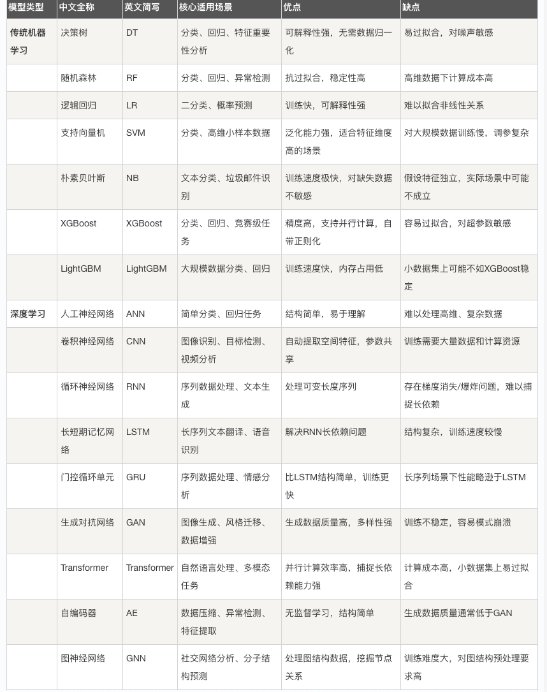

## 机器学习基础术语

学习机器学习就像学习一门新语言，需要先掌握基本词汇。这些术语构成了机器学习的"语言系统"，理解它们是深入学习的第一步。

想象一下你在教一个机器人认识水果：
* 数据：各种水果的图片和信息
* 特征：水果的颜色、形状、大小、味道
* 标签：这个水果叫什么名字（苹果、香蕉、橙子）
* 模型：机器人学到的"识别水果的方法"
* 训练：教机器人认识水果的过程
* 推理：机器人识别新水果的能力

### 数据（Data）
什么是数据？
数据是机器学习的"原材料"，就像厨师做菜需要的食材一样。没有数据，机器学习就无法进行。


#### 数据的类型
#####  1. 结构化数据
特点：有明确的格式和组织方式，像表格一样整齐

特点：有明确的格式和组织方式，像表格一样整齐

结构化数据示例：学生信息表
实例
```python
import pandas as pd
students_data = {
    '姓名': ['张三', '李四', '王五'],
    '年龄': [18, 19, 20],
    '成绩': [85, 92, 78],
    '班级': ['一班', '二班', '一班']
}
df = pd.DataFrame(students_data)
print(df)
```

输出：

```
  姓名  年龄  成绩  班级
0  张三  18  85  一班
1  李四  19  92  二班
2  王五  20  78  一班
```

#### 2. 非结构化数据
特点：没有固定格式，需要特殊处理

例子：

* 文本：评论、文章、邮件
* 图像：照片、医学影像
* 音频：语音、音乐
* 视频：监控录像、电影
```python
# 非结构化数据示例：文本和图像
text_data = "这个产品质量很好，我很满意！"
# image_data = 一张产品的照片
# audio_data = 顾客的语音评价
```

#### 数据质量的重要性
垃圾进，垃圾出（Garbage In, Garbage Out）是机器学习的重要原则。数据质量直接决定模型效果。

实例
```python

# 数据质量问题示例
import numpy as np
import pandas as pd
# 创建包含各种问题的数据
problematic_data = {
    '价格': [100, 200, None, 300, -50],  # 缺失值和异常值
    '评分': [4.5, '好', 3.8, 4.2, 5.0],  # 数据类型不一致
    '销量': [1000, 1200, 800, 1500, '很多']  # 文本和数字混合
}
df = pd.DataFrame(problematic_data)
print("有问题的数据：")
print(df)
print("\n数据问题分析：")
print(f"缺失值数量：{df.isnull().sum().sum()}")
print(f"数据类型：\n{df.dtypes}")

```


### 特征（Feature）
#### 什么是特征？
特征是数据的"可观察属性"，就像描述一个人的特征：身高、体重、发色、性格等。在机器学习中，特征是用来做预测的依据。

##### 特征选择的重要性：
* 好的特征能让模型事半功倍
* 坏的特征会让模型事倍功半
* 特征工程往往是决定模型效果的关键

#### 特征的类型
##### x1. 数值特征
特点：可以用数字表示，可以进行数学运算
```python
# 数值特征示例
numerical_features = {
    '年龄': [25, 30, 35, 40],
    '收入': [5000, 8000, 12000, 15000],
    '身高': [165, 170, 175, 180]
}
```

##### 2. 类别特征
特点：表示不同的类别，不能进行数学运算
```python
# 类别特征示例
categorical_features = {
    '性别': ['男', '女', '男', '女'],
    '学历': ['本科', '硕士', '博士', '本科'],
    '城市': ['北京', '上海', '广州', '深圳']
}
```

##### 3. 文本特征
特点：需要特殊处理才能被模型使用
```python

# 文本特征示例
text_features = {
    '评论': [
        '这个产品很好用，推荐购买！',
        '质量一般，不太满意。',
        '性价比高，值得入手。'
    ]
}

```

#### 特征工程示例
实例
```python
# 特征工程示例：从原始数据创建有用特征
import pandas as pd
import numpy as np
# 原始数据：房屋信息
house_data = {
    '面积': [80, 120, 60, 150, 90],
    '卧室数': [2, 3, 1, 4, 2],
    '建造年份': [2000, 2010, 1995, 2015, 2005],
    '价格': [200, 350, 150, 500, 280]
}
df = pd.DataFrame(house_data)
# 创建新特征
df['房龄'] = 2023 - df['建造年份']  # 房屋年龄
df['每平米价格'] = df['价格'] / df['面积']  # 单价
df['卧室面积比'] = df['卧室数'] / df['面积'] * 100  # 卧室占比
print("原始数据 + 新特征：")
print(df)
# 特征重要性分析
correlation = df.corr()['价格'].sort_values(ascending=False)
print("\n特征与价格的相关性：")
print(correlation)
```
#### 标签（Label）
##### 什么是标签？
标签是我们想要预测的"答案"，就像考试题的正确答案一样。在监督学习中，每个数据样本都有一个对应的标签。

###### 标签的作用：
* 指导模型学习方向
* 评估模型学习效果
* 定义问题的类型（分类、回归等）

##### 标签的类型
###### 1. 分类标签
特点：离散的类别值
```python
# 分类标签示例
classification_labels = {
    '邮件类型': ['垃圾邮件', '正常邮件', '垃圾邮件', '正常邮件'],
    '情感倾向': ['正面', '负面', '中性', '正面'],
    '疾病诊断': ['患病', '健康', '健康', '患病']
}
```

###### 2. 回归标签
特点：连续的数值值
```python
# 回归标签示例
regression_labels = {
    '房价': [200, 350, 150, 500, 280],
    '股票价格': [100, 120, 115, 130, 125],
    '销售额': [5000, 7000, 4500, 9000, 6000]
}
```
##### 标签质量的重要性
```python
# 标签质量问题示例
import numpy as np
# 模拟图像分类任务中的标签问题
image_data = ['cat1.jpg', 'dog1.jpg', 'cat2.jpg', 'dog2.jpg']
problematic_labels = ['猫', '犬', '猫咪', '狗']  # 标签不一致
# 标签标准化
label_mapping = {
    '猫': 'cat', '猫咪': 'cat',
    '犬': 'dog', '狗': 'dog'
}
standardized_labels = [label_mapping[label] for label in problematic_labels]
print("原始标签：", problematic_labels)
print("标准化标签：", standardized_labels)
```

### 模型（Model）
#### 什么是模型？
模型是机器学习算法从数据中学到的"规律"或"模式"，就像学生从课本中学到的知识一样。

模型的本质：
* 数学函数：输入特征，输出预测
* 参数集合：学到的规律的具体表示
* 决策规则：如何从输入得到输出

#### 模型的表示
实例
```python
# 简单线性模型示例
import numpy as np
import matplotlib.pyplot as plt
# 模拟数据
X = np.array([1, 2, 3, 4, 5])
y = np.array([2, 4, 6, 8, 10])
# 线性模型：y = w * x + b
# 学习到的参数：w = 2, b = 0
w, b = 2, 0
def linear_model(x):
    """线性模型函数"""
    return w * x + b
# 预测
predictions = linear_model(X)
# 可视化
plt.scatter(X, y, color='blue', label='真实数据')
plt.plot(X, predictions, color='red', label='模型预测')
plt.xlabel('输入 X')
plt.ylabel('输出 y')
plt.title('线性模型示例')
plt.legend()
plt.grid(True)
plt.show()
print(f"模型参数：w = {w}, b = {b}")
print(f"预测结果：{predictions}")

```

#### 模型的复杂度
实例
```python
# 模型复杂度对比
from sklearn.preprocessing import PolynomialFeatures
from sklearn.linear_model import LinearRegression
import numpy as np
# 生成非线性数据
np.random.seed(42)
X = np.random.rand(20, 1) * 10
y = np.sin(X) + np.random.randn(20, 1) * 0.1
# 简单模型（线性）
simple_model = LinearRegression()
simple_model.fit(X, y)
# 复杂模型（高次多项式）
poly_features = PolynomialFeatures(degree=10)
X_poly = poly_features.fit_transform(X)
complex_model = LinearRegression()
complex_model.fit(X_poly, y)
# 可视化
X_test = np.linspace(0, 10, 100).reshape(-1, 1)
X_test_poly = poly_features.transform(X_test)
plt.scatter(X, y, color='blue', label='训练数据')
plt.plot(X_test, simple_model.predict(X_test), color='green', label='简单模型')
plt.plot(X_test, complex_model.predict(X_test_poly), color='red', label='复杂模型')
plt.xlabel('X')
plt.ylabel('y')
plt.title('模型复杂度对比')
plt.legend()
plt.grid(True)
plt.show()

```

#### 训练（Training）

##### 什么是训练？
###### 
训练是模型学习的过程，就像学生上课学习知识一样。在训练过程中，模型不断调整参数，使预测结果越来越接近真实标签。




######  训练过程示例
实例
```python
# 训练过程示例：简单线性回归
import numpy as np
import matplotlib.pyplot as plt
# 生成训练数据
np.random.seed(42)
X = np.random.rand(50, 1) * 10
y = 3 * X + 2 + np.random.randn(50, 1) * 2
# 初始化模型参数
w, b = 0.0, 0.0
learning_rate = 0.01
epochs = 100
# 记录训练过程
loss_history = []
# 训练循环
for epoch in range(epochs):
    # 前向传播
    y_pred = w * X + b
    # 计算损失（均方误差）
    loss = np.mean((y_pred - y) ** 2)
    loss_history.append(loss)
    # 计算梯度
    dw = np.mean(2 * X * (y_pred - y))
    db = np.mean(2 * (y_pred - y))
    # 更新参数
    w -= learning_rate * dw
    b -= learning_rate * db
    if epoch % 10 == 0:
        print(f"Epoch {epoch}: Loss = {loss:.4f}, w = {w:.4f}, b = {b:.4f}")
# 可视化训练过程
plt.figure(figsize=(12, 4))
plt.subplot(1, 2, 1)
plt.plot(loss_history)
plt.xlabel('Epoch')
plt.ylabel('Loss')
plt.title('训练损失变化')
plt.grid(True)
plt.subplot(1, 2, 2)
plt.scatter(X, y, color='blue', label='训练数据')
plt.plot(X, w * X + b, color='red', label='训练后的模型')
plt.xlabel('X')
plt.ylabel('y')
plt.title('训练结果')
plt.legend()
plt.grid(True)
plt.tight_layout()
plt.show()
print(f"最终模型参数：w = {w:.4f}, b = {b:.4f}")
```

### 推理（Inference）

#### 什么是推理？
推理是使用训练好的模型进行预测的过程，就像学生用学到的知识解答考试题一样。

推理过程示例
实例
```python

# 推理过程示例
import numpy as np
# 假设我们已经训练好了一个房价预测模型
class HousePriceModel:
    def __init__(self):
        # 模拟训练好的参数
        self.feature_weights = {
            '面积': 2.5,
            '卧室数': 10.0,
            '房龄': -1.0,
            '地段评分': 50.0
        }
        self.bias = 50.0
    def predict(self, features):
        """
        使用训练好的模型进行房价预测
        """
        price = self.bias
        for feature_name, feature_value in features.items():
            if feature_name in self.feature_weights:
                price += self.feature_weights[feature_name] * feature_value
        return price
# 创建训练好的模型
model = HousePriceModel()
# 推理：预测新房价
new_houses = [
    {'面积': 80, '卧室数': 2, '房龄': 5, '地段评分': 8},
    {'面积': 120, '卧室数': 3, '房龄': 2, '地段评分': 9},
    {'面积': 60, '卧室数': 1, '房龄': 10, '地段评分': 6}
]
print("房价预测结果：")
for i, house in enumerate(new_houses, 1):
    predicted_price = model.predict(house)
    print(f"房子{i}：预测价格 {predicted_price:.2f} 万元")
# 批量推理
def batch_predict(model, house_list):
    """批量预测"""
    return [model.predict(house) for house in house_list]
batch_prices = batch_predict(model, new_houses)
print(f"\n批量预测结果：{batch_prices}")

```


```python
实例
# 完整的机器学习流程示例
import numpy as np
import pandas as pd
from sklearn.model_selection import train_test_split
from sklearn.linear_model import LinearRegression
from sklearn.metrics import mean_squared_error, r2_score
# 1. 数据准备
np.random.seed(42)
n_samples = 200
# 生成特征数据
area = np.random.normal(100, 30, n_samples)  # 面积
bedrooms = np.random.randint(1, 5, n_samples)  # 卧室数
age = np.random.randint(0, 20, n_samples)  # 房龄
location_score = np.random.randint(1, 10, n_samples)  # 地段评分
# 生成标签（房价）- 基于特征的线性组合加噪声
price = (area * 2.5 + bedrooms * 20 + age * -2 + location_score * 15 + 
         np.random.normal(0, 50, n_samples))
# 创建数据框
data = pd.DataFrame({
    '面积': area,
    '卧室数': bedrooms,
    '房龄': age,
    '地段评分': location_score,
    '价格': price
})
print("数据示例：")
print(data.head())
# 2. 划分训练集和测试集
features = ['面积', '卧室数', '房龄', '地段评分']
X = data[features]
y = data['价格']
X_train, X_test, y_train, y_test = train_test_split(X, y, test_size=0.2, random_state=42)
print(f"\n训练集大小：{X_train.shape[0]}")
print(f"测试集大小：{X_test.shape[0]}")
# 3. 训练模型
model = LinearRegression()
model.fit(X_train, y_train)
print(f"\n模型参数：")
for feature, coef in zip(features, model.coef_):
    print(f"{feature}: {coef:.2f}")
print(f"截距: {model.intercept_:.2f}")
# 4. 评估模型
y_train_pred = model.predict(X_train)
y_test_pred = model.predict(X_test)
train_mse = mean_squared_error(y_train, y_train_pred)
test_mse = mean_squared_error(y_test, y_test_pred)
train_r2 = r2_score(y_train, y_train_pred)
test_r2 = r2_score(y_test, y_test_pred)
print(f"\n模型评估：")
print(f"训练集 MSE: {train_mse:.2f}, R²: {train_r2:.2f}")
print(f"测试集 MSE: {test_mse:.2f}, R²: {test_r2:.2f}")
# 5. 推理（预测新数据）
new_houses = pd.DataFrame({
    '面积': [85, 120, 65],
    '卧室数': [2, 3, 1],
    '房龄': [3, 1, 8],
    '地段评分': [7, 9, 5]
})
predictions = model.predict(new_houses)
print(f"\n新房价预测：")
for i, price in enumerate(predictions, 1):
    print(f"房子{i}: {price:.2f} 万元")

```


### 常见机器学习网络类型
