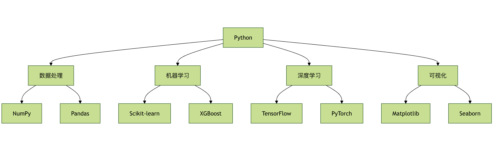
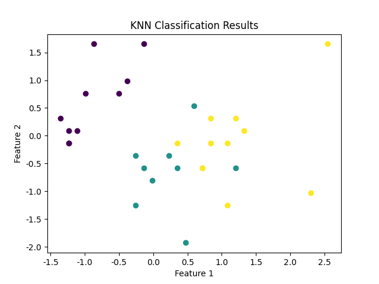

## Python 入门机器学习

Python是机器学习中最常用的编程语言之一，因其易于学习、强大的库支持和社区生态系统。
接下来，我将逐步说明如何通过Python入门机器学习，并介绍需要的一些常用库。

### 安装 Python 和必要的库
#### 方法一：官方安装器
首先，确保你已经安装了 Python，你可以访问Python 官方网站 https://www.python.org/ 下载和安装最新版本。

##### Windows 系统：
```
- 1. 下载安装程序后运行
- 2. 勾选 "Add Python to PATH"
- 3. 选择 "Install for all users"
- 4. 点击 "Install" 开始安装
```

##### macOS 系统：
```
# 方法1：使用官网安装包
# 下载 .pkg 文件并双击安装

# 方法2：使用 Homebrew
brew install python3
```

##### Linux 系统：
```
# Ubuntu/Debian
    sudo apt update
    sudo apt install python3 python3-pip

# CentOS/RHEL
    sudo yum install python3 python3-pip
```

#### 方法二：Anaconda 发行版
Anaconda 是专为数据科学设计的Python发行版，就像一个预装了所有工具的"机器学习工具箱"。

##### Anaconda 的优势
* 1预装常用库：NumPy、Pandas、Scikit-learn 等
* 2环境管理：conda 命令管理虚拟环境
* 3图形界面：Anaconda Navigator 提供可视化操作
* 4跨平台：支持所有主流操作系统

##### 安装 Anaconda
* 1访问 https://www.anaconda.com/products/distribution
* 2下载对应系统的安装包
* 3运行安装程序，按提示完成安装
* 4验证安装:
```bash
conda --version
python --version
```
如果你还不熟悉Python，可以先学习我们的Python教程。
如果你还不熟悉Conda，可以先学习我们的Anaconda教程。
建议按照 Anaconda，用于创建虚拟环境。

#### 为什么需要虚拟环境？
虚拟环境就像为每个项目准备的独立厨房，避免不同项目的"调料"（库版本）相互干扰。

##### 虚拟环境的好处
* 1依赖隔离：不同项目使用不同版本的库
* 2环境复现：方便在其他机器上重建相同环境
* 3权限管理：避免污染系统 Python 环境
* 4项目清理：删除项目时一并删除相关环境

#### 使用conda管理环境
```bash
# 创建环境
conda create -n ml_env python=3.8
# 激活环境
conda activate ml_env
# 安装包
conda install numpy pandas scikit-learn
# 列出环境
conda env list
# 删除环境
conda env remove -n ml_env
```

### 开发工具配置

#### Jupyter Notebook
Jupyter Notebook 是数据科学家的数字实验室，支持交互式编程和可视化展示。
```bash
安装和启动 Jupyter
# 安装 Jupyter
pip install jupyter
# 启动 Jupyter Notebook
jupyter notebook
# 启动 Jupyter Lab（更现代的界面）
jupyter lab
```

#### Jupyter 基本使用
实例
```python
# Jupyter Notebook 使用示例
# 在 Jupyter 中运行以下代码
# 1. 数据导入和探索
import pandas as pd
import numpy as np
import matplotlib.pyplot as plt
# 创建示例数据
data = {
    '姓名': ['张三', '李四', '王五', '赵六'],
    '年龄': [25, 30, 35, 28],
    '城市': ['北京', '上海', '广州', '深圳'],
    '薪资': [15000, 20000, 18000, 22000]
}
df = pd.DataFrame(data)
print("数据预览：")
print(df.head())
# 2. 数据可视化
plt.figure(figsize=(10, 4))
plt.subplot(1, 2, 1)
plt.bar(df['姓名'], df['年龄'])
plt.title('年龄分布')
plt.xlabel('姓名')
plt.ylabel('年龄')
plt.subplot(1, 2, 2)
plt.bar(df['姓名'], df['薪资'])
plt.title('薪资分布')
plt.xlabel('姓名')
plt.ylabel('薪资')
plt.tight_layout()
plt.show()
# 3. 简单统计分析
print("\n基本统计信息：")
print(df.describe())
print("\n城市分布：")
print(df['城市'].value_counts())
```

#### VS Code 配置
VS Code 是轻量级但功能强大的代码编辑器，通过插件可以变成专业的机器学习开发环境。

推荐插件
 * 1 Python：Microsoft 官方 Python 插件
 * 2 Jupyter：支持 Jupyter Notebook
 * 3 Python Docstring Generator：自动生成文档字符串
 * 4 Bracket Pair Colorizer：括号配对着色
 * 5 GitLens：增强 Git 功能

 ##### VS Code 配置示例
 ```
// .vscode/settings.json
{
    "python.defaultInterpreterPath": "./envs/ml_env/bin/python",
    "python.linting.enabled": true,
    "python.linting.pylintEnabled": true,
    "python.formatting.provider": "black",
    "python.testing.pytestEnabled": true,
    "jupyter.askForKernelRestart": false,
    "editor.fontSize": 14,
    "editor.tabSize": 4,
    "editor.insertSpaces": true
}
 ```


### 机器学习库安装
机器学习库安装
 ```
    pip install numpy pandas matplotlib seaborn scikit-learn
 ```

 如果你打算使用深度学习框架，安装如下：
```
    pip install torch  # 或者
    pip install tensorflow
```

##### 相关课程：
* Python 教程
* Numpy 教程
* Pandas 教程
* Matplotlib 教程
* scikit-learn 教程
* PyTorch 教程
* OpenCV 教程



在使用 Python 进行机器学习时，整个过程一般遵循以下步骤：

1. 导入必要的库 - 例如，NumPy、Pandas 和 Scikit-learn。

2. 加载和准备数据 - 数据是机器学习的核心。你需要加载数据并进行必要的预处理（例如数据清洗、缺失值填补等）。

3. 选择模型和算法 - 根据任务选择适合的机器学习算法（如线性回归、决策树等）。

4. 训练模型 - 使用训练集数据来训练模型。

5. 评估模型 - 使用测试集评估模型的准确性，并根据评估结果优化模型。

6. 调整模型和超参数 - 根据评估结果调整模型的超参数，进一步优化模型性能。

### 一个简单的机器学习例子：使用 Scikit-learn 做分类
Scikit-learn（简称 Sklearn）是一个开源的机器学习库，建立在 NumPy、SciPy 和 matplotlib 这些科学计算库之上，提供了简单高效的数据挖掘和数据分析工具。

Scikit-learn 包含了许多常见的机器学习算法，包括：

线性回归、岭回归、Lasso回归
支持向量机（SVM）
决策树、随机森林、梯度提升树
聚类算法（如K-Means、层次聚类、DBSCAN）
降维技术（如PCA、t-SNE）
神经网络
接下来我们通过一个简单的分类任务——使用鸢尾花数据集（Iris Dataset）来演示机器学习的流程，鸢尾花数据集是一个经典的数据集，包含 150 个样本，描述了三种不同类型的鸢尾花的花瓣和萼片的长度和宽度。

#### 步骤 1：导入库
导入需要的 Python 库：

```python
import numpy as np
import pandas as pd
from sklearn.datasets import load_iris
from sklearn.model_selection import train_test_split
from sklearn.tree import DecisionTreeClassifier
from sklearn.metrics import accuracy_score
```

#### 步骤 2：加载数据
使用 Scikit-learn 的 `load_iris` 函数加载数据集：

```python
# 加载鸢尾花数据集
iris = load_iris()

# 将数据转化为 pandas DataFrame
X = pd.DataFrame(iris.data, columns=iris.feature_names)  # 特征数据
y = pd.Series(iris.target)  # 标签数据

# 显示前五行数据
print(X.head())
```

打印输出数据如下所示：
```
   sepal length (cm)  sepal width (cm)  petal length (cm)  petal width (cm)
0                5.1               3.5                1.4               0.2
1                4.9               3.0                1.4               0.2
2                4.7               3.2                1.3               0.2
3                4.6               3.1                1.5               0.2
4                5.0               3.6                1.4               0.2
```


#### 步骤 3：数据集划分

将数据集划分为训练集和测试集，通常使用 70% 训练集和 30% 测试集的比例：
实例
```python

# 划分训练集和测试集（80% 训练集，20% 测试集）
X_train, X_test, y_train, y_test = train_test_split(X, y, test_size=0.2, random_state=42)
```

#### 步骤 4：特征缩放（标准化）
许多机器学习算法都依赖于特征的尺度，特别是像 K 最近邻算法。为了确保每个特征的均值为 0，标准差为 1，我们使用标准化来处理数据：

实例
```python
# 标准化特征
scaler = StandardScaler()
X_train = scaler.fit_transform(X_train)
X_test = scaler.transform(X_test)
```

#### 步骤 5：选择模型并训练
在这个例子中，我们选择 K-Nearest Neighbors（KNN） 算法来进行分类：
实例

```python
# 创建 KNN 分类器
knn = KNeighborsClassifier(n_neighbors=3)

# 训练模型
knn.fit(X_train, y_train)
```

#### 步骤 6：评估模型
训练完成后，我们使用测试集评估模型的准确性：
实例

```python
# 预测测试集
y_pred = knn.predict(X_test)

# 计算准确率
accuracy = accuracy_score(y_test, y_pred)
print(f'模型准确率: {accuracy:.2f}')

```

完成以上代码，输出结果为：


```python

模型准确率: 1.00
```

#### 步骤 7：可视化结果（可选）
你可以通过可视化来进一步了解模型的表现，尤其是在多维数据集的情况下。例如，你可以用二维图来显示 KNN 分类的结果（不过在这里需要对数据进行降维，简化为二维）。

实例
```python
import numpy as np
import pandas as pd
import matplotlib.pyplot as plt
from sklearn.datasets import load_iris
from sklearn.model_selection import train_test_split
from sklearn.preprocessing import StandardScaler
from sklearn.neighbors import KNeighborsClassifier
from sklearn.metrics import accuracy_score

# 加载鸢尾花数据集
iris = load_iris()

# 将数据转化为 pandas DataFrame
X = pd.DataFrame(iris.data, columns=iris.feature_names)  # 特征数据
y = pd.Series(iris.target)  # 标签数据

# 划分训练集和测试集（80% 训练集，20% 测试集）
X_train, X_test, y_train, y_test = train_test_split(X, y, test_size=0.2, random_state=42)

# 标准化特征
scaler = StandardScaler()
X_train = scaler.fit_transform(X_train)
X_test = scaler.transform(X_test)

# 创建 KNN 分类器
knn = KNeighborsClassifier(n_neighbors=3)

# 训练模型
knn.fit(X_train, y_train)

# 预测测试集
y_pred = knn.predict(X_test)

# 计算准确率
accuracy = accuracy_score(y_test, y_pred)

# 可视化 - 这里只是一个简单示例，具体可根据实际情况选择绘图方式
plt.scatter(X_test[:, 0], X_test[:, 1], c=y_pred, cmap='viridis', marker='o')
plt.title("KNN Classification Results")
plt.xlabel("Feature 1")
plt.ylabel("Feature 2")
plt.show()
```

输出图片如下所示：

