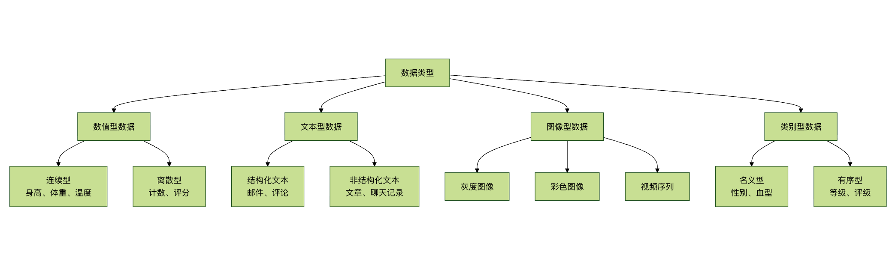

## 常用数据类型
本章将为你介绍机器学习中最常见的四种数据类型：数值型、文本型、图像型和类别型数据。

数据类型就像是食材的种类，不同的食材需要不同的处理方法。同样，不同类型的数据也需要不同的处理技术和算法。

### 四大数据类型分类


### 数值型数据
#### 什么是数值型数据？
数值型数据就像尺子测量的结果，可以进行数学运算，是机器学习中最常见的数据类型。
#### 数值型数据的分类

* 1. 连续型数值数据
实例
```python
# 连续型数值数据示例
import numpy as np
import pandas as pd
import matplotlib.pyplot as plt

def continuous_data_example():
    """连续型数值数据示例"""
    
    print("=== 连续型数值数据示例 ===")
    
    # 生成连续型数据
    np.random.seed(42)
    n_samples = 1000
    
    # 身高数据（连续型）
    heights = np.random.normal(170, 10, n_samples)  # 均值170，标准差10
    weights = heights * 0.7 + np.random.normal(0, 5, n_samples)  # 体重与身高相关
    temperatures = np.random.normal(36.5, 0.5, n_samples)  # 体温
    
    # 创建数据框
    continuous_data = pd.DataFrame({
        '身高(cm)': heights,
        '体重(kg)': weights,
        '体温(°C)': temperatures,
        '年龄': np.random.randint(18, 65, n_samples)
    })
    
    print("连续型数据示例：")
    print(continuous_data.head())
    print(f"\n数据统计信息：")
    print(continuous_data.describe())
    
    # 可视化连续型数据分布
    plt.figure(figsize=(12, 8))
    
    plt.subplot(2, 2, 1)
    plt.hist(continuous_data['身高(cm)'], bins=30, alpha=0.7, color='skyblue')
    plt.title('身高分布')
    plt.xlabel('身高 (cm)')
    plt.ylabel('频数')
    
    plt.subplot(2, 2, 2)
    plt.hist(continuous_data['体重(kg)'], bins=30, alpha=0.7, color='lightgreen')
    plt.title('体重分布')
    plt.xlabel('体重 (kg)')
    plt.ylabel('频数')
    
    plt.subplot(2, 2, 3)
    plt.hist(continuous_data['体温(°C)'], bins=30, alpha=0.7, color='salmon')
    plt.title('体温分布')
    plt.xlabel('体温 (°C)')
    plt.ylabel('频数')
    
    plt.subplot(2, 2, 4)
    plt.scatter(continuous_data['身高(cm)'], continuous_data['体重(kg)'], alpha=0.6)
    plt.title('身高 vs 体重')
    plt.xlabel('身高 (cm)')
    plt.ylabel('体重 (kg)')
    
    plt.tight_layout()
    plt.show()
    
    return continuous_data

# 运行示例
continuous_df = continuous_data_example()
```

* 2. 离散型数值数据
实例
```python
# 离散型数值数据示例
def discrete_data_example():
    """离散型数值数据示例"""
    
    print("\n=== 离散型数值数据示例 ===")
    
    # 生成离散型数据
    np.random.seed(42)
    n_samples = 500
    
    # 离散型数据
    customer_count = np.random.poisson(10, n_samples)  # 泊松分布：顾客数量
    product_rating = np.random.randint(1, 6, n_samples)  # 1-5星评分
    defect_count = np.random.binomial(20, 0.1, n_samples)  # 二项分布：缺陷数量
    call_duration = np.random.exponential(5, n_samples) * 60  # 指数分布：通话时长（秒）
    
    # 创建数据框
    discrete_data = pd.DataFrame({
        '顾客数量': customer_count,
        '产品评分': product_rating,
        '缺陷数量': defect_count,
        '通话时长(秒)': call_duration.astype(int)
    })
    
    print("离散型数据示例：")
    print(discrete_data.head())
    print(f"\n数据统计信息：")
    print(discrete_data.describe())
    
    # 可视化离散型数据
    plt.figure(figsize=(12, 8))
    
    plt.subplot(2, 2, 1)
    plt.hist(discrete_data['顾客数量'], bins=range(0, max(discrete_data['顾客数量'])+2), 
             alpha=0.7, color='orange')
    plt.title('顾客数量分布')
    plt.xlabel('顾客数量')
    plt.ylabel('频数')
    
    plt.subplot(2, 2, 2)
    value_counts = discrete_data['产品评分'].value_counts().sort_index()
    plt.bar(value_counts.index, value_counts.values, color='purple', alpha=0.7)
    plt.title('产品评分分布')
    plt.xlabel('评分')
    plt.ylabel('频数')
    
    plt.subplot(2, 2, 3)
    plt.hist(discrete_data['缺陷数量'], bins=range(0, max(discrete_data['缺陷数量'])+2), 
             alpha=0.7, color='red')
    plt.title('缺陷数量分布')
    plt.xlabel('缺陷数量')
    plt.ylabel('频数')
    
    plt.subplot(2, 2, 4)
    plt.hist(discrete_data['通话时长(秒)'], bins=30, alpha=0.7, color='brown')
    plt.title('通话时长分布')
    plt.xlabel('通话时长 (秒)')
    plt.ylabel('频数')
    
    plt.tight_layout()
    plt.show()
    
    return discrete_data

# 运行示例
discrete_df = discrete_data_example()
```

#### 数值型数据的处理方法
实例
```python
# 数值型数据处理方法
class NumericDataProcessor:
    def __init__(self):
        self.scalers = {}
        self.transformers = {}
    
    def detect_outliers(self, data, method='iqr'):
        """检测异常值"""
        outliers_info = {}
        
        for column in data.select_dtypes(include=[np.number]).columns:
            if method == 'iqr':
                Q1 = data[column].quantile(0.25)
                Q3 = data[column].quantile(0.75)
                IQR = Q3 - Q1
                lower_bound = Q1 - 1.5 * IQR
                upper_bound = Q3 + 1.5 * IQR
                
                outliers = data[(data[column] < lower_bound) | 
                               (data[column] > upper_bound)]
                
            elif method == 'zscore':
                z_scores = np.abs((data[column] - data[column].mean()) / data[column].std())
                outliers = data[z_scores > 3]
            
            outliers_info[column] = {
                'count': len(outliers),
                'indices': outliers.index.tolist(),
                'percentage': (len(outliers) / len(data)) * 100
            }
        
        return outliers_info
    
    def handle_missing_values(self, data, strategy='mean'):
        """处理缺失值"""
        processed_data = data.copy()
        
        for column in processed_data.select_dtypes(include=[np.number]).columns:
            if processed_data[column].isnull().sum() > 0:
                if strategy == 'mean':
                    processed_data[column].fillna(processed_data[column].mean(), inplace=True)
                elif strategy == 'median':
                    processed_data[column].fillna(processed_data[column].median(), inplace=True)
                elif strategy == 'mode':
                    processed_data[column].fillna(processed_data[column].mode()[0], inplace=True)
                elif strategy == 'forward':
                    processed_data[column].fillna(method='ffill', inplace=True)
                elif strategy == 'backward':
                    processed_data[column].fillna(method='bfill', inplace=True)
        
        return processed_data
    
    def normalize_data(self, data, method='minmax'):
        """数据标准化"""
        from sklearn.preprocessing import MinMaxScaler, StandardScaler, RobustScaler
        
        processed_data = data.copy()
        numeric_columns = data.select_dtypes(include=[np.number]).columns
        
        if method == 'minmax':
            scaler = MinMaxScaler()
        elif method == 'standard':
            scaler = StandardScaler()
        elif method == 'robust':
            scaler = RobustScaler()
        else:
            raise ValueError("方法必须是 'minmax', 'standard', 或 'robust'")
        
        processed_data[numeric_columns] = scaler.fit_transform(processed_data[numeric_columns])
        self.scalers[method] = scaler
        
        return processed_data
    
    def create_features(self, data):
        """特征工程"""
        processed_data = data.copy()
        numeric_columns = data.select_dtypes(include=[np.number]).columns
        
        # 创建多项式特征
        if len(numeric_columns) >= 2:
            col1, col2 = numeric_columns[0], numeric_columns[1]
            processed_data[f'{col1}_x_{col2}'] = data[col1] * data[col2]
            processed_data[f'{col1}_div_{col2}'] = data[col1] / (data[col2] + 1e-8)
        
        # 创建统计特征
        for column in numeric_columns:
            processed_data[f'{column}_log'] = np.log1p(data[column])
            processed_data[f'{column}_sqrt'] = np.sqrt(np.abs(data[column]))
            processed_data[f'{column}_square'] = data[column] ** 2
        
        return processed_data

# 使用示例
processor = NumericDataProcessor()

# 检测异常值
outliers = processor.detect_outliers(continuous_df)
print("\n异常值检测结果：")
for column, info in outliers.items():
    if info['count'] > 0:
        print(f"{column}: {info['count']} 个异常值 ({info['percentage']:.2f}%)")

# 数据标准化
normalized_data = processor.normalize_data(continuous_df, method='standard')
print("\n标准化后的数据示例：")
print(normalized_data.head())
```

### 文本型数据
#### 什么是文本型数据？
文本型数据就像人类语言的表达，包含丰富的语义信息，但需要特殊处理才能被机器学习模型使用。

#### 文本型数据的分类
##### 1. 结构化文本数据
实例
```python
# 结构化文本数据示例
import pandas as pd
import re
from collections import Counter

def structured_text_example():
    """结构化文本数据示例"""
    
    print("\n=== 结构化文本数据示例 ===")
    
    # 创建结构化文本数据
    structured_data = pd.DataFrame({
        '邮件ID': range(1, 11),
        '发件人': [
            'zhangsan@example.com', 'lisi@company.com', 'wangwu@service.com',
            'zhaoliu@business.com', 'qianqi@personal.com', 'sunba@tech.com',
            'zhoujiu@edu.com', 'wushi@org.com', 'zhengyi@gov.com',
            'chener@health.com'
        ],
        '主题': [
            '会议通知：明天下午3点开会',
            '产品报价：最新价格表',
            '客户反馈：服务满意度调查',
            '项目进度：第一阶段完成',
            '假期安排：国庆节放假通知',
            '技术更新：系统升级公告',
            '学术会议：论文征集通知',
            '培训通知：新员工培训',
            '政策文件：最新规定',
            '健康提醒：体检通知'
        ],
        '内容长度': [156, 234, 189, 145, 98, 267, 198, 134, 312, 87]
    })
    
    print("结构化文本数据示例：")
    print(structured_data)
    
    # 文本特征提取
    print("\n=== 文本特征分析 ===")
    
    # 邮箱域名分析
    domains = [email.split('@')[1] for email in structured_data['发件人']]
    domain_counts = Counter(domains)
    print(f"邮箱域名分布：{dict(domain_counts)}")
    
    # 主题关键词分析
    all_words = []
    for subject in structured_data['主题']:
        words = re.findall(r'[\u4e00-\u9fff]+', subject)  # 提取中文词汇
        all_words.extend(words)
    
    word_counts = Counter(all_words)
    print(f"主题词频：{dict(word_counts)}")
    
    # 内容长度统计
    print(f"内容长度统计：")
    print(structured_data['内容长度'].describe())
    
    return structured_data

# 运行示例
structured_text_df = structured_text_example()
```
##### 2. 非结构化文本数据
实例
```python
# 非结构化文本数据示例
def unstructured_text_example():
    """非结构化文本数据示例"""
    
    print("\n=== 非结构化文本数据示例 ===")
    
    # 创建非结构化文本数据
    unstructured_texts = [
        """
        人工智能技术正在快速发展，深度学习、机器学习、自然语言处理等领域取得了重大突破。
        这些技术在医疗、金融、教育、交通等多个行业都有广泛应用，为社会发展带来了新的机遇。
        未来，随着计算能力的提升和算法的改进，人工智能将在更多领域发挥重要作用。
        """,
        """
        今天天气真好，阳光明媚，微风徐徐。我决定去公园散步，享受这美好的时光。
        公园里有很多花，红的、黄的、紫的，五颜六色，非常美丽。小鸟在树上歌唱，
        蝴蝶在花丛中飞舞，一切都显得那么和谐自然。
        """,
        """
        股市今天表现强劲，上证指数上涨2.3%，深证成指上涨1.8%。
        科技股领涨，多只股票涨停。分析师认为，这主要得益于近期出台的利好政策。
        投资者信心得到提振，市场交投活跃，成交量明显放大。
        """,
        """
        健康生活方式包括合理饮食、适量运动、充足睡眠和良好心态。
        建议每天摄入蔬菜水果，减少油腻食物；每周至少运动3次，每次30分钟以上；
        保证7-8小时睡眠；学会调节情绪，保持积极乐观的心态。
        """
    ]
    
    text_categories = ['科技', '生活', '财经', '健康']
    
    # 创建数据框
    unstructured_df = pd.DataFrame({
        '文本': unstructured_texts,
        '类别': text_categories
    })
    
    print("非结构化文本数据示例：")
    for i, row in unstructured_df.iterrows():
        print(f"\n类别：{row['类别']}")
        print(f"文本：{row['文本'][:100]}...")
    
    return unstructured_df

# 运行示例
unstructured_text_df = unstructured_text_example()
```


#### 文本数据处理方法
```python
# 文本数据处理方法
import jieba
from sklearn.feature_extraction.text import TfidfVectorizer, CountVectorizer
from sklearn.preprocessing import LabelEncoder

class TextDataProcessor:
    def __init__(self):
        self.vectorizers = {}
        self.label_encoders = {}
    
    def clean_text(self, text):
        """文本清洗"""
        # 移除特殊字符和数字
        text = re.sub(r'[^\u4e00-\u9fff\s]', '', text)
        # 移除多余空格
        text = re.sub(r'\s+', ' ', text).strip()
        return text
    
    def tokenize_chinese(self, text):
        """中文分词"""
        words = jieba.lcut(text)
        # 移除停用词（简化版）
        stop_words = {'的', '了', '在', '是', '我', '有', '和', '就', '不', '人', '都', '一', '一个', '上', '也', '很', '到', '说', '要', '去', '你', '会', '着', '没有', '看', '好', '自己', '这'}
        words = [word for word in words if word not in stop_words and len(word) > 1]
        return words
    
    def extract_features(self, texts, method='tfidf'):
        """特征提取"""
        # 文本预处理
        cleaned_texts = [self.clean_text(text) for text in texts]
        
        if method == 'tfidf':
            vectorizer = TfidfVectorizer(max_features=1000, token_pattern=r'(?u)\b\w+\b')
        elif method == 'count':
            vectorizer = CountVectorizer(max_features=1000, token_pattern=r'(?u)\b\w+\b')
        else:
            raise ValueError("方法必须是 'tfidf' 或 'count'")
        
        features = vectorizer.fit_transform(cleaned_texts)
        self.vectorizers[method] = vectorizer
        
        return features.toarray(), vectorizer.get_feature_names_out()
    
    def analyze_text_statistics(self, texts):
        """文本统计分析"""
        stats = []
        
        for text in texts:
            cleaned_text = self.clean_text(text)
            words = self.tokenize_chinese(cleaned_text)
            
            stats.append({
                '字符数': len(text),
                '清洗后字符数': len(cleaned_text),
                '词数': len(words),
                '平均词长': np.mean([len(word) for word in words]) if words else 0,
                '唯一词数': len(set(words))
            })
        
        return pd.DataFrame(stats)
    
    def encode_labels(self, labels):
        """标签编码"""
        encoder = LabelEncoder()
        encoded_labels = encoder.fit_transform(labels)
        self.label_encoders['default'] = encoder
        return encoded_labels, encoder.classes_

# 使用示例
text_processor = TextDataProcessor()

# 文本统计分析
text_stats = text_processor.analyze_text_statistics(unstructured_text_df['文本'])
print("\n文本统计分析：")
print(text_stats)

# 特征提取
features, feature_names = text_processor.extract_features(
    unstructured_text_df['文本'], method='tfidf'
)
print(f"\n特征矩阵形状：{features.shape}")
print(f"前10个特征：{feature_names[:10]}")

# 标签编码
encoded_labels, label_classes = text_processor.encode_labels(
    unstructured_text_df['类别']
)
print(f"\n编码后的标签：{encoded_labels}")
print(f"标签类别：{label_classes}")
```

### 图像型数据
#### 什么是图像型数据？
图像型数据就像视觉世界的数字化表达，由像素点组成，包含丰富的空间和颜色信息。
#### 图像型数据的分类
##### 1. 灰度图像
实例
```python
# 灰度图像示例
import numpy as np
import matplotlib.pyplot as plt
from PIL import Image

def grayscale_image_example():
    """灰度图像示例"""
    
    print("\n=== 灰度图像示例 ===")
    
    # 创建简单的灰度图像
    # 创建一个 100x100 的灰度图像
    height, width = 100, 100
    
    # 创建渐变图像
    gradient = np.zeros((height, width))
    for i in range(height):
        gradient[i, :] = i  # 垂直渐变
    
    # 创建棋盘图案
    checkerboard = np.zeros((height, width))
    for i in range(0, height, 10):
        for j in range(0, width, 10):
            if (i // 10 + j // 10) % 2 == 0:
                checkerboard[i:i+10, j:j+10] = 255
    
    # 创建圆形图案
    circle = np.zeros((height, width))
    center_x, center_y = width // 2, height // 2
    radius = 30
    for i in range(height):
        for j in range(width):
            if (i - center_y) ** 2 + (j - center_x) ** 2 <= radius ** 2:
                circle[i, j] = 255
    
    # 显示图像
    plt.figure(figsize=(12, 4))
    
    plt.subplot(1, 3, 1)
    plt.imshow(gradient, cmap='gray')
    plt.title('渐变图像')
    plt.axis('off')
    
    plt.subplot(1, 3, 2)
    plt.imshow(checkerboard, cmap='gray')
    plt.title('棋盘图案')
    plt.axis('off')
    
    plt.subplot(1, 3, 3)
    plt.imshow(circle, cmap='gray')
    plt.title('圆形图案')
    plt.axis('off')
    
    plt.tight_layout()
    plt.show()
    
    # 图像数据信息
    print(f"渐变图像形状：{gradient.shape}")
    print(f"数据类型：{gradient.dtype}")
    print(f"像素值范围：{gradient.min()} - {gradient.max()}")
    
    return gradient, checkerboard, circle

# 运行示例
gradient_img, checkerboard_img, circle_img = grayscale_image_example()
```
##### 2. 彩色图像
```python
# 彩色图像示例
def color_image_example():
    """彩色图像示例"""
    
    print("\n=== 彩色图像示例 ===")
    
    height, width = 100, 100
    
    # 创建 RGB 彩色图像
    # 红色渐变
    red_gradient = np.zeros((height, width, 3), dtype=np.uint8)
    red_gradient[:, :, 0] = np.linspace(0, 255, width)  # 红色通道渐变
    
    # 绿色渐变
    green_gradient = np.zeros((height, width, 3), dtype=np.uint8)
    green_gradient[:, :, 1] = np.linspace(0, 255, width)  # 绿色通道渐变
    
    # 蓝色渐变
    blue_gradient = np.zeros((height, width, 3), dtype=np.uint8)
    blue_gradient[:, :, 2] = np.linspace(0, 255, width)  # 蓝色通道渐变
    
    # 彩虹图案
    rainbow = np.zeros((height, width, 3), dtype=np.uint8)
    for i in range(width):
        hue = i / width
        # 简化的 HSV 到 RGB 转换
        if hue < 1/3:
            rainbow[:, i] = [255 * (1 - 3*hue), 255 * 3*hue, 0]
        elif hue < 2/3:
            rainbow[:, i] = [0, 255 * (2 - 3*hue), 255 * (3*hue - 1)]
        else:
            rainbow[:, i] = [255 * (3*hue - 2), 0, 255 * (3 - 3*hue)]
    
    # 显示图像
    plt.figure(figsize=(12, 8))
    
    plt.subplot(2, 2, 1)
    plt.imshow(red_gradient)
    plt.title('红色渐变')
    plt.axis('off')
    
    plt.subplot(2, 2, 2)
    plt.imshow(green_gradient)
    plt.title('绿色渐变')
    plt.axis('off')
    
    plt.subplot(2, 2, 3)
    plt.imshow(blue_gradient)
    plt.title('蓝色渐变')
    plt.axis('off')
    
    plt.subplot(2, 2, 4)
    plt.imshow(rainbow)
    plt.title('彩虹图案')
    plt.axis('off')
    
    plt.tight_layout()
    plt.show()
    
    # 图像通道信息
    print(f"彩色图像形状：{rainbow.shape}")
    print(f"数据类型：{rainbow.dtype}")
    print(f"像素值范围：{rainbow.min()} - {rainbow.max()}")
    
    return red_gradient, green_gradient, blue_gradient, rainbow

# 运行示例
red_img, green_img, blue_img, rainbow_img = color_image_example()
```

#### 图像数据处理方法
```python
# 图像数据处理方法
from skimage import filters, feature, measure, transform
from skimage.color import rgb2gray, rgb2hsv

class ImageDataProcessor:
    def __init__(self):
        pass
    
    def resize_image(self, image, target_size):
        """调整图像大小"""
        from skimage.transform import resize
        return resize(image, target_size, anti_aliasing=True)
    
    def normalize_image(self, image):
        """图像归一化"""
        return (image - image.min()) / (image.max() - image.min())
    
    def extract_color_features(self, image):
        """提取颜色特征"""
        if len(image.shape) == 3:  # 彩色图像
            # 计算各通道的统计特征
            features = {}
            for i, channel in enumerate(['R', 'G', 'B']):
                channel_data = image[:, :, i]
                features[f'{channel}_mean'] = np.mean(channel_data)
                features[f'{channel}_std'] = np.std(channel_data)
                features[f'{channel}_min'] = np.min(channel_data)
                features[f'{channel}_max'] = np.max(channel_data)
            
            # 计算颜色直方图特征
            hist_r, _ = np.histogram(image[:, :, 0], bins=256, range=(0, 256))
            hist_g, _ = np.histogram(image[:, :, 1], bins=256, range=(0, 256))
            hist_b, _ = np.histogram(image[:, :, 2], bins=256, range=(0, 256))
            
            features.update({
                'hist_r_peak': np.argmax(hist_r),
                'hist_g_peak': np.argmax(hist_g),
                'hist_b_peak': np.argmax(hist_b)
            })
            
            return features
        else:  # 灰度图像
            return {
                'mean': np.mean(image),
                'std': np.std(image),
                'min': np.min(image),
                'max': np.max(image)
            }
    
    def extract_texture_features(self, image):
        """提取纹理特征"""
        if len(image.shape) == 3:
            image = rgb2gray(image)
        
        # 计算边缘特征
        edges = filters.sobel(image)
        edge_density = np.sum(edges > 0) / edges.size
        
        # 计算局部二值模式（简化版）
        lbp = feature.local_binary_pattern(image, P=8, R=1, method='uniform')
        lbp_hist, _ = np.histogram(lbp.ravel(), bins=10)
        
        return {
            'edge_density': edge_density,
            'lbp_hist': lbp_hist.tolist()
        }
    
    def augment_image(self, image):
        """图像增强"""
        augmented = []
        
        # 原图
        augmented.append(image)
        
        # 水平翻转
        augmented.append(np.fliplr(image))
        
        # 垂直翻转
        augmented.append(np.flipud(image))
        
        # 旋转90度
        augmented.append(np.rot90(image))
        
        # 亮度调整
        if len(image.shape) == 3:
            brightened = np.clip(image * 1.2, 0, 255).astype(np.uint8)
        else:
            brightened = np.clip(image * 1.2, 0, 1)
        augmented.append(brightened)
        
        return augmented
    
    def visualize_image_channels(self, image):
        """可视化图像通道"""
        if len(image.shape) == 3:
            plt.figure(figsize=(12, 3))
            
            plt.subplot(1, 4, 1)
            plt.imshow(image)
            plt.title('原始图像')
            plt.axis('off')
            
            plt.subplot(1, 4, 2)
            plt.imshow(image[:, :, 0], cmap='Reds')
            plt.title('红色通道')
            plt.axis('off')
            
            plt.subplot(1, 4, 3)
            plt.imshow(image[:, :, 1], cmap='Greens')
            plt.title('绿色通道')
            plt.axis('off')
            
            plt.subplot(1, 4, 4)
            plt.imshow(image[:, :, 2], cmap='Blues')
            plt.title('蓝色通道')
            plt.axis('off')
            
            plt.tight_layout()
            plt.show()

# 使用示例
image_processor = ImageDataProcessor()

# 提取颜色特征
color_features = image_processor.extract_color_features(rainbow_img)
print("\n颜色特征：")
for key, value in color_features.items():
    if not key.startswith('hist'):
        print(f"{key}: {value:.2f}")

# 提取纹理特征
texture_features = image_processor.extract_texture_features(checkerboard_img)
print("\n纹理特征：")
for key, value in texture_features.items():
    if key != 'lbp_hist':
        print(f"{key}: {value:.4f}")

# 图像增强
augmented_images = image_processor.augment_image(circle_img)
print(f"\n图像增强：生成了 {len(augmented_images)} 个变体")

# 可视化图像通道
image_processor.visualize_image_channels(rainbow_img)
```

### 类别型数据
#### 什么是类别型数据？
  类别型数据就像分类标签，表示不同的类别或分组，不能进行数学运算。
#### 类别型数据的分类
1. 名义型数据
```python
# 名义型数据示例
def nominal_data_example():
    """名义型数据示例"""
    
    print("\n=== 名义型数据示例 ===")
    
    # 创建名义型数据
    nominal_data = pd.DataFrame({
        '学生ID': range(1, 11),
        '姓名': ['张三', '李四', '王五', '赵六', '钱七', '孙八', '周九', '吴十', '郑十一', '陈十二'],
        '性别': ['男', '女', '男', '男', '女', '女', '男', '女', '男', '女'],
        '血型': ['A', 'B', 'O', 'AB', 'A', 'B', 'O', 'AB', 'A', 'O'],
        '城市': ['北京', '上海', '广州', '深圳', '北京', '上海', '广州', '深圳', '北京', '上海'],
        '专业': ['计算机', '数学', '物理', '化学', '计算机', '数学', '物理', '化学', '计算机', '数学']
    })
    
    print("名义型数据示例：")
    print(nominal_data)
    
    # 类别统计分析
    print("\n=== 类别统计分析 ===")
    
    for column in nominal_data.select_dtypes(include=['object']).columns:
        if column != '姓名':  # 跳过姓名列
            value_counts = nominal_data[column].value_counts()
            print(f"\n{column} 分布：")
            print(value_counts)
            print(f"唯一值数量：{len(value_counts)}")
    
    return nominal_data

# 运行示例
nominal_df = nominal_data_example()
```

2. 有序型数据
```python
# 有序型数据示例
def ordinal_data_example():
    """有序型数据示例"""
    
    print("\n=== 有序型数据示例 ===")
    
    # 创建有序型数据
    ordinal_data = pd.DataFrame({
        '产品ID': range(1, 11),
        '产品名称': [f'产品{i}' for i in range(1, 11)],
        '质量等级': ['优秀', '良好', '一般', '优秀', '良好', '一般', '差', '优秀', '良好', '一般'],
        '客户满意度': ['非常满意', '满意', '一般', '非常满意', '满意', '一般', '不满意', '非常满意', '满意', '一般'],
        '价格区间': ['高', '中', '低', '高', '中', '低', '低', '高', '中', '中'],
        '销量排名': [1, 3, 5, 2, 4, 7, 9, 6, 8, 10]
    })
    
    print("有序型数据示例：")
    print(ordinal_data)
    
    # 有序数据统计分析
    print("\n=== 有序数据统计分析 ===")
    
    # 定义顺序
    quality_order = ['差', '一般', '良好', '优秀']
    satisfaction_order = ['不满意', '一般', '满意', '非常满意']
    price_order = ['低', '中', '高']
    
    # 转换为有序类别
    ordinal_data['质量等级_有序'] = pd.Categorical(
        ordinal_data['质量等级'], categories=quality_order, ordered=True
    )
    ordinal_data['客户满意度_有序'] = pd.Categorical(
        ordinal_data['客户满意度'], categories=satisfaction_order, ordered=True
    )
    ordinal_data['价格区间_有序'] = pd.Categorical(
        ordinal_data['价格区间'], categories=price_order, ordered=True
    )
    
    # 统计分析
    for column in ['质量等级_有序', '客户满意度_有序', '价格区间_有序']:
        print(f"\n{column} 分布：")
        value_counts = ordinal_data[column].value_counts().sort_index()
        print(value_counts)
        
        # 计算中位数
        median_value = ordinal_data[column].median()
        print(f"中位数：{median_value}")
    
    return ordinal_data

# 运行示例
ordinal_df = ordinal_data_example()
```

#### 类别型数据处理方法
```python

# 类别型数据处理方法
from sklearn.preprocessing import LabelEncoder, OneHotEncoder, OrdinalEncoder

class CategoricalDataProcessor:
    def __init__(self):
        self.encoders = {}
        self.feature_names = {}
    
    def label_encoding(self, data, columns):
        """标签编码"""
        encoded_data = data.copy()
        
        for column in columns:
            encoder = LabelEncoder()
            encoded_data[f'{column}_encoded'] = encoder.fit_transform(data[column])
            self.encoders[f'{column}_label'] = encoder
            
            print(f"{column} 标签编码：")
            for i, category in enumerate(encoder.classes_):
                print(f"  {category} -> {i}")
        
        return encoded_data
    
    def one_hot_encoding(self, data, columns):
        """独热编码"""
        encoded_data = data.copy()
        
        for column in columns:
            encoder = OneHotEncoder(sparse=False, drop='first')  # 避免多重共线性
            encoded_features = encoder.fit_transform(data[[column]])
            
            # 创建新的列名
            feature_names = [f'{column}_{category}' for category in encoder.categories_[0][1:]]
            
            # 添加到数据框
            for i, feature_name in enumerate(feature_names):
                encoded_data[feature_name] = encoded_features[:, i]
            
            self.encoders[f'{column}_onehot'] = encoder
            self.feature_names[f'{column}_onehot'] = feature_names
            
            print(f"{column} 独热编码：创建了 {len(feature_names)} 个特征")
        
        return encoded_data
    
    def ordinal_encoding(self, data, columns, categories_list):
        """有序编码"""
        encoded_data = data.copy()
        
        for column, categories in zip(columns, categories_list):
            encoder = OrdinalEncoder(categories=[categories])
            encoded_data[f'{column}_ordinal'] = encoder.fit_transform(data[[column]])
            self.encoders[f'{column}_ordinal'] = encoder
            
            print(f"{column} 有序编码：")
            for i, category in enumerate(categories):
                print(f"  {category} -> {i}")
        
        return encoded_data
    
    def target_encoding(self, data, categorical_column, target_column):
        """目标编码"""
        encoded_data = data.copy()
        
        # 计算每个类别的目标均值
        target_means = data.groupby(categorical_column)[target_column].mean()
        
        # 应用编码
        encoded_data[f'{categorical_column}_target'] = data[categorical_column].map(target_means)
        
        print(f"{categorical_column} 目标编码：")
        for category, mean_value in target_means.items():
            print(f"  {category} -> {mean_value:.4f}")
        
        return encoded_data
    
    def frequency_encoding(self, data, columns):
        """频率编码"""
        encoded_data = data.copy()
        
        for column in columns:
            # 计算每个类别的频率
            frequency = data[column].value_counts(normalize=True)
            
            # 应用编码
            encoded_data[f'{column}_frequency'] = data[column].map(frequency)
            
            print(f"{column} 频率编码：")
            for category, freq in frequency.head().items():
                print(f"  {category} -> {freq:.4f}")
        
        return encoded_data
    
    def analyze_categorical_importance(self, data, categorical_columns, target_column):
        """分析类别特征重要性"""
        importance_scores = {}
        
        for column in categorical_columns:
            # 计算每个类别的目标均值差异
            category_means = data.groupby(column)[target_column].mean()
            mean_difference = category_means.max() - category_means.min()
            
            # 计算类别数量
            unique_count = data[column].nunique()
            
            # 简单的重要性评分
            importance = mean_difference * np.log(unique_count + 1)
            importance_scores[column] = importance
        
        # 排序
        sorted_importance = sorted(importance_scores.items(), key=lambda x: x[1], reverse=True)
        
        print("\n类别特征重要性：")
        for column, importance in sorted_importance:
            print(f"{column}: {importance:.4f}")
        
        return importance_scores

# 使用示例
cat_processor = CategoricalDataProcessor()

# 为名义型数据添加数值目标
nominal_df_with_target = nominal_df.copy()
nominal_df_with_target['成绩'] = np.random.randint(60, 100, len(nominal_df))

# 标签编码
label_encoded = cat_processor.label_encoding(
    nominal_df_with_target, ['性别', '血型', '城市']
)

# 独热编码
onehot_encoded = cat_processor.one_hot_encoding(
    nominal_df_with_target, ['专业']
)

# 目标编码
target_encoded = cat_processor.target_encoding(
    nominal_df_with_target, '城市', '成绩'
)

# 频率编码
frequency_encoded = cat_processor.frequency_encoding(
    nominal_df_with_target, ['性别', '血型']
)

# 分析特征重要性
importance_scores = cat_processor.analyze_categorical_importance(
    nominal_df_with_target, ['性别', '血型', '城市', '专业'], '成绩'
)
```


### 多模态数据融合

#### 数据类型融合示例
```python
# 多模态数据融合示例
class MultiModalDataProcessor:
    def __init__(self):
        self.numeric_processor = NumericDataProcessor()
        self.text_processor = TextDataProcessor()
        self.image_processor = ImageDataProcessor()
        self.categorical_processor = CategoricalDataProcessor()
    
    def create_multimodal_dataset(self):
        """创建多模态数据集"""
        print("\n=== 多模态数据集示例 ===")
        
        n_samples = 100
        
        # 数值特征
        numeric_features = {
            '年龄': np.random.randint(18, 65, n_samples),
            '收入': np.random.normal(50000, 15000, n_samples),
            '工作经验': np.random.randint(0, 20, n_samples)
        }
        
        # 类别特征
        categorical_features = {
            '性别': np.random.choice(['男', '女'], n_samples),
            '教育程度': np.random.choice(['高中', '本科', '硕士', '博士'], n_samples),
            '城市': np.random.choice(['北京', '上海', '广州', '深圳'], n_samples)
        }
        
        # 文本特征
        text_features = [
            f"这是第{i}个样本的文本描述，包含一些基本信息和特征。" 
            for i in range(n_samples)
        ]
        
        # 图像特征（模拟）
        image_features = np.random.rand(n_samples, 64, 64, 3)  # 模拟64x64彩色图像
        
        # 目标变量
        target = np.random.choice([0, 1], n_samples)
        
        # 创建数据集
        dataset = {
            'numeric': pd.DataFrame(numeric_features),
            'categorical': pd.DataFrame(categorical_features),
            'text': text_features,
            'image': image_features,
            'target': target
        }
        
        print(f"数据集大小：{n_samples}")
        print(f"数值特征：{list(numeric_features.keys())}")
        print(f"类别特征：{list(categorical_features.keys())}")
        print(f"文本特征：{len(text_features)} 条")
        print(f"图像特征：{image_features.shape}")
        print(f"目标变量：{np.bincount(target)}")
        
        return dataset
    
    def process_multimodal_data(self, dataset):
        """处理多模态数据"""
        print("\n=== 多模态数据处理 ===")
        
        processed_features = {}
        
        # 处理数值特征
        numeric_data = dataset['numeric']
        numeric_processed = self.numeric_processor.normalize_data(numeric_data, method='standard')
        processed_features['numeric'] = numeric_processed
        
        # 处理类别特征
        categorical_data = dataset['categorical']
        categorical_processed = self.categorical_processor.one_hot_encoding(
            categorical_data, list(categorical_data.columns)
        )
        # 只保留编码后的列
        categorical_encoded = categorical_processed.select_dtypes(include=[np.number])
        processed_features['categorical'] = categorical_encoded
        
        # 处理文本特征
        text_data = dataset['text']
        text_features, _ = self.text_processor.extract_features(text_data, method='tfidf')
        processed_features['text'] = text_features
        
        # 处理图像特征
        image_data = dataset['image']
        # 提取简单的图像特征（均值、标准差等）
        image_features = []
        for img in image_data:
            features = self.image_processor.extract_color_features(img)
            feature_vector = list(features.values())[:10]  # 取前10个特征
            image_features.append(feature_vector)
        
        processed_features['image'] = np.array(image_features)
        
        # 打印处理结果
        for modality, features in processed_features.items():
            if isinstance(features, pd.DataFrame):
                print(f"{modality} 特征：{features.shape}")
            else:
                print(f"{modality} 特征：{features.shape}")
        
        return processed_features
    
    def fuse_features(self, processed_features):
        """特征融合"""
        print("\n=== 特征融合 ===")
        
        # 将所有特征合并
        feature_arrays = []
        
        for modality, features in processed_features.items():
            if isinstance(features, pd.DataFrame):
                feature_arrays.append(features.values)
            else:
                feature_arrays.append(features)
        
        # 水平拼接
        fused_features = np.hstack(feature_arrays)
        
        print(f"融合后特征形状：{fused_features.shape}")
        
        return fused_features

# 使用示例
multimodal_processor = MultiModalDataProcessor()

# 创建多模态数据集
multimodal_dataset = multimodal_processor.create_multimodal_dataset()

# 处理多模态数据
processed_multimodal = multimodal_processor.process_multimodal_data(multimodal_dataset)

# 特征融合
fused_features = multimodal_processor.fuse_features(processed_multimodal)
```

