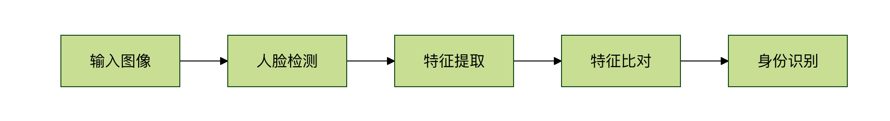

## 机器学习应用

机器学习应用可以分为几个主要领域，每个领域都有其独特的应用场景和挑战：

 1. 计算机视觉：让机器"看懂"世界
 2. 自然语言处理：让机器"理解"人类语言
 3. 推荐系统：个性化推荐内容
 4. 预测分析：预测未来趋势和结果
 5. 异常检测：发现不寻常的模式和事件


 #### 为什么这些应用需要机器学习？

想象一下，如果用传统编程方法来解决这些问题：
* 人脸识别：需要编写无数规则来描述人脸的各种变化（角度、光线、表情等）
* 语言翻译：需要为每种语言组合编写庞大的词典和语法规则
* 推荐系统：需要人工分析每个用户的喜好和每件商品的特征，并编写复杂的算法来匹配它们
机器学习让计算机能够从大量数据中自动学习这些复杂模式，大大简化了问题解决的过程。


### 计算机视觉应用

#### 人脸识别
应用场景：手机解锁、门禁系统、身份验证
工作原理：
    检测图像中的人脸位置
    提取人脸特征（眼睛间距、鼻子形状等）
    与数据库中的人脸特征比对，找到匹配的人脸


#### 自动驾驶
应用场景：特斯拉 Autopilot、百度 Apollo、谷歌 Waymo

核心任务：
* 物体检测：识别车辆、行人、交通标志
* 车道检测：确定车道边界
* 路径规划：决定行驶路线

实例
'''python
# 自动驾驶中的物体检测示例（概念代码）
import cv2
import numpy as np
def detect_objects(image):
    """
    检测图像中的物体（车辆、行人、交通标志等）
    """
    # 1. 预处理图像
    processed_image = preprocess_image(image)
    # 2. 使用训练好的深度学习模型检测物体
    # 这里使用预训练的 YOLO 模型作为示例
    boxes, classes, scores = yolo_model.detect(processed_image)
    # 3. 过滤低置信度的检测结果
    valid_detections = filter_detections(boxes, classes, scores)
    # 4. 在图像上绘制检测结果
    result_image = draw_detections(image, valid_detections)
    return result_image, valid_detections
# 实际应用中，这只是整个自动驾驶系统的一个组件
# 还需要结合传感器融合、路径规划等多个模块
'''

#### 医疗影像诊断

应用场景：X光片分析、CT扫描、病理切片分析

优势：
* 比人类医生更少疲劳
* 能发现人眼难以察觉的细微变化
* 可以快速处理大量影像

### 自然语言处理应用
#### 智能助手
应用场景：Siri、小爱同学、天猫精灵

核心功能：
* 语音识别：将语音转换为文字
* 意图理解：理解用户想要什么
* 对话管理：维持连贯的对话

实例
```python
# 智能助手的工作流程（简化示例）
import speech_recognition as sr
from textblob import TextBlob
class SmartAssistant:
    def __init__(self):
        self.recognizer = sr.Recognizer()
    def listen_and_respond(self):
        """监听用户语音并回应"""
        with sr.Microphone() as source:
            print("正在聆听...")
            audio = self.recognizer.listen(source)
        try:
            # 1. 语音识别
            text = self.recognizer.recognize_google(audio, language='zh-CN')
            print(f"用户说：{text}")
            # 2. 意图理解
            intent = self.understand_intent(text)
            # 3. 生成回应
            response = self.generate_response(intent, text)
            print(f"助手回应：{response}")
            return response
        except sr.UnknownValueError:
            return "抱歉，我没有听清楚，请再说一次"
    def understand_intent(self, text):
        """理解用户意图"""
        # 简化的意图识别
        if "天气" in text:
            return "weather"
        elif "时间" in text:
            return "time"
        elif "笑话" in text:
            return "joke"
        else:
            return "unknown"
    def generate_response(self, intent, text):
        """根据意图生成回应"""
        if intent == "weather":
            return "今天晴天，温度25度"
        elif intent == "time":
            from datetime import datetime
            return f"现在时间是{datetime.now().strftime('%H:%M')}"
        elif intent == "joke":
            return "为什么程序员喜欢黑夜？因为没有 bug！"
        else:
            return "抱歉，我还在学习中，无法理解这个问题"
# 使用示例
assistant = SmartAssistant()
# assistant.listen_and_respond()  # 实际运行时取消注释

```

#### 机器翻译
应用场景：谷歌翻译、百度翻译、有道翻译

工作原理：
 * 1. 将源语言文本编码为数字表示
 * 2. 通过神经网络学习语言间的映射关系
 * 3. 解码为目标语言文本

#### 情感分析
应用场景：产品评论分析、社交媒体监控、客户反馈处理
实例
```python
# 情感分析示例
from textblob import TextBlob
import jieba
def analyze_sentiment_chinese(text):
    """
    中文情感分析示例
    """
    # 使用 jieba 分词
    words = jieba.cut(text)
    word_list = " ".join(words)
    # 这里简化处理，实际应用中需要专门的中文情感分析模型
    # 可以使用 SnowNLP、BERT-Chinese 等库
    # 模拟情感分析结果
    positive_words = ["好", "棒", "喜欢", "满意", "推荐"]
    negative_words = ["差", "坏", "讨厌", "失望", "不推荐"]
    pos_count = sum(1 for word in positive_words if word in text)
    neg_count = sum(1 for word in negative_words if word in text)
    if pos_count > neg_count:
        return "正面情感"
    elif neg_count > pos_count:
        return "负面情感"
    else:
        return "中性情感"
# 测试示例
reviews = [
    "这个产品真的很棒，我非常喜欢！",
    "质量太差了，完全不值得购买。",
    "还可以，没什么特别的。"
]
for review in reviews:
    sentiment = analyze_sentiment_chinese(review)
    print(f"评论：{review}")
    print(f"情感：{sentiment}")
    print("---")
```

### 推荐系统应用

#### 电商推荐
应用场景：淘宝商品推荐、亚马逊推荐

推荐策略：
 * 协同过滤：基于用户行为相似性推荐
 * 内容推荐：基于商品特征相似性推荐
 * 混合推荐：结合多种策略

实例：
```python
# 简单的协同过滤推荐示例
import numpy as np
# 用户-商品评分矩阵（行是用户，列是商品）
ratings = np.array([
    [5, 3, 0, 1],  # 用户1对商品1、2、4的评分
    [4, 0, 0, 1],  # 用户2对商品1、4的评分
    [1, 1, 0, 5],  # 用户3对商品1、2、4的评分
    [1, 0, 0, 4],  # 用户4对商品1、4的评分
    [0, 1, 5, 4],  # 用户5对商品2、3、4的评分
])
def user_similarity(user1, user2):
    """计算两个用户的相似度（余弦相似度）"""
    # 找到两个用户都评分的商品
    common_items = np.where((user1 > 0) & (user2 > 0))[0]
    if len(common_items) == 0:
        return 0
    # 计算余弦相似度
    user1_ratings = user1[common_items]
    user2_ratings = user2[common_items]
    dot_product = np.dot(user1_ratings, user2_ratings)
    norm1 = np.linalg.norm(user1_ratings)
    norm2 = np.linalg.norm(user2_ratings)
    if norm1 == 0 or norm2 == 0:
        return 0
    return dot_product / (norm1 * norm2)
def recommend_items(user_id, ratings_matrix, k=2):
    """为指定用户推荐商品"""
    user_ratings = ratings_matrix[user_id]
    # 计算该用户与其他用户的相似度
    similarities = []
    for i, other_user in enumerate(ratings_matrix):
        if i != user_id:
            sim = user_similarity(user_ratings, other_user)
            similarities.append((i, sim))
    # 按相似度排序
    similarities.sort(key=lambda x: x[1], reverse=True)
    # 找到用户未评分的商品
    unrated_items = np.where(user_ratings == 0)[0]
    # 预测用户对未评分商品的评分
    predictions = []
    for item_id in unrated_items:
        weighted_sum = 0
        similarity_sum = 0
        for similar_user_id, similarity in similarities[:k]:
            if similarity > 0 and ratings_matrix[similar_user_id][item_id] > 0:
                weighted_sum += similarity * ratings_matrix[similar_user_id][item_id]
                similarity_sum += similarity
        if similarity_sum > 0:
            predicted_rating = weighted_sum / similarity_sum
            predictions.append((item_id, predicted_rating))
    # 按预测评分排序
    predictions.sort(key=lambda x: x[1], reverse=True)
    return predictions[:3]  # 返回前3个推荐
# 为用户0推荐商品
user_id = 0
recommendations = recommend_items(user_id, ratings)
print(f"为用户{user_id}推荐的商品：")
for item_id, predicted_rating in recommendations:
    print(f"商品{item_id + 1}，预测评分：{predicted_rating:.2f}")

```

#### 视频推荐
应用场景：抖音、YouTube、Netflix

特点：
* 实时推荐（根据用户当前行为调整）
* 多模态数据（视频内容、用户行为、时间等）
* 冷启动问题处理（新用户、新视频）


### 预测分析应用

#### 金融风控
应用场景：信用卡欺诈检测、贷款审批
实例
```python
# 简单的欺诈检测示例
import numpy as np
from sklearn.ensemble import RandomForestClassifier
from sklearn.model_selection import train_test_split
# 模拟交易数据
# 特征：交易金额、交易时间、商户类型、地点等
# 标签：0=正常，1=欺诈
np.random.seed(42)
# 生成模拟数据
n_samples = 1000
n_features = 4
# 正常交易
normal_transactions = np.random.normal(loc=[100, 14, 2, 3], scale=[50, 4, 1, 1], 
                                     size=(int(n_samples * 0.95), n_features))
# 欺诈交易（通常金额异常、时间异常等）
fraud_transactions = np.random.normal(loc=[500, 3, 4, 1], scale=[200, 2, 1, 0.5], 
                                    size=(int(n_samples * 0.05), n_features))
# 合并数据并添加标签
X = np.vstack([normal_transactions, fraud_transactions])
y = np.hstack([np.zeros(len(normal_transactions)), np.ones(len(fraud_transactions))])
# 划分训练集和测试集
X_train, X_test, y_train, y_test = train_test_split(X, y, test_size=0.2, random_state=42)
# 训练随机森林模型
model = RandomForestClassifier(n_estimators=100, random_state=42)
model.fit(X_train, y_train)
# 评估模型
accuracy = model.score(X_test, y_test)
print(f"模型准确率：{accuracy:.2f}")
# 预测新交易
new_transaction = np.array([[450, 2, 4, 1]])  # 异常交易
fraud_probability = model.predict_proba(new_transaction)[0][1]
print(f"新交易是欺诈的概率：{fraud_probability:.2f}")
if fraud_probability > 0.5:
    print("警告：检测到可疑交易！")
else:
    print("交易正常。")
```

#### 股价预测
应用场景：量化交易、投资决策

挑战：
* 市场噪声大
* 非平稳时间序列
* 受多种因素影响


### 异常检测应用
#### 网络安全
应用场景：入侵检测、恶意软件识别

工作原理：
    学习正常网络流量模式
    检测偏离正常模式的行为
    触发警报或阻断连接

#### 工业质检
应用场景：产品缺陷检测、设备故障预测
实例
```python
# 简单的异常检测示例
import numpy as np
from sklearn.ensemble import IsolationForest
import matplotlib.pyplot as plt
# 模拟传感器数据（正常数据 + 少量异常）
np.random.seed(42)
# 正常数据：设备正常运行时的传感器读数
normal_data = np.random.normal(loc=10, scale=1, size=(200, 2))
# 异常数据：设备故障时的传感器读数
anomaly_data = np.random.normal(loc=[15, 5], scale=[1, 1], size=(10, 2))
# 合并数据
all_data = np.vstack([normal_data, anomaly_data])
# 使用孤立森林进行异常检测
model = IsolationForest(contamination=0.05, random_state=42)
predictions = model.fit_predict(all_data)
# 可视化结果
plt.figure(figsize=(10, 6))
normal_points = all_data[predictions == 1]
anomaly_points = all_data[predictions == -1]
plt.scatter(normal_points[:, 0], normal_points[:, 1],
           c='blue', label='正常数据')
plt.scatter(anomaly_points[:, 0], anomaly_points[:, 1],
           c='red', label='异常数据')
plt.xlabel('传感器1读数')
plt.ylabel('传感器2读数')
plt.title('设备运行状态异常检测')
plt.legend()
plt.grid(True)
plt.show()
print(f"检测到 {len(anomaly_points)} 个异常点")

```


