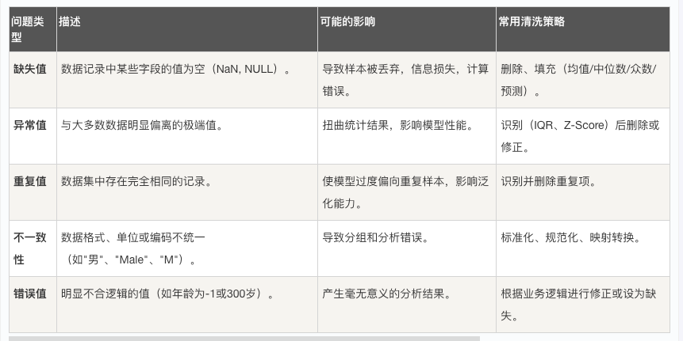

## 数据清洗

在机器学习中，我们常常听到一句话："垃圾进，垃圾出"，这句话生动地比喻了数据质量对于模型性能的决定性影响。
想象一下，你是一位大厨，准备烹饪一道美味佳肴。即使你的厨艺再高超，如果食材不新鲜、有泥沙或者残缺不全，最终做出的菜肴也必然大打折扣。
在机器学习中，原始数据就是我们的"食材"，而数据清洗就是那个至关重要的"备菜"过程。它旨在识别、纠正或移除数据中的错误、不一致、重复和不完整的部分，为后续的模型"烹饪"准备好干净、高质量的"食材"。

本文将带你系统性地了解数据清洗的核心概念、常用方法，并通过清晰的代码示例，让你掌握这项数据科学家的必备技能。

###  一、 数据清洗为何如此重要？
在深入技术细节之前，让我们先理解为什么数据清洗是机器学习流程中不可或缺的一环。

####  1.1 提升模型性能与准确性
    脏数据（如异常值、错误值）会误导模型学习错误的规律。清洗后的干净数据能让模型更准确地捕捉数据中的真实模式，从而做出更可靠的预测。

####  1.2 保证分析结果的可靠性
    无论是探索性数据分析还是最终的商业决策，基于错误数据得出的结论都是危险的。数据清洗确保了分析基础的坚实可靠。

####  1.3 提高算法稳定性
    许多机器学习算法对数据质量非常敏感。例如，基于距离的算法（如 KNN、SVM）会受异常值的严重影响，而缺失值可能导致整个样本无法被使用。
####  1.4 节省计算资源与时间
    清洗掉无关、重复的数据可以减少数据集大小，从而降低模型训练的计算成本和时间。
    为了更直观地理解数据清洗在机器学习全流程中的位置，请看下面的流程图：

从上图可以看出，数据清洗是预处理的第一步，并且当模型效果不佳时，我们常常需要回溯到这一步来检查并改进数据质量。


###  二、 常见的数据问题与清洗策略
数据清洗通常针对以下几类常见问题展开。我们可以通过一个简单的表格来快速了解：



接下来，我们将使用 Python 的 pandas 和 numpy 库，通过具体代码来演示如何解决这些问题。

###  三、 动手实践：使用 Python 进行数据清洗
假设我们有一个名为 customer_data.csv 的客户数据集，它包含了一些典型的数据质量问题。

####  3.1 环境准备与数据加载
首先，确保你已安装必要的库，然后加载数据。
实例

```python
# 导入必要的库
import pandas as pd
import numpy as np

# 加载数据集
df = pd.read_csv('customer_data.csv') # 请替换为你的文件路径

# 查看数据的基本信息和前几行
print("数据集形状（行，列）:", df.shape)
print("\n数据前5行：")
print(df.head())
print("\n数据基本信息：")
print(df.info())
print("\n数据统计描述：")
print(df.describe())
```

####  3.2 处理缺失值
发现缺失值是第一步。pandas 提供了方便的方法。
实例
```python
# 1. 检查缺失值
print("各列缺失值数量：")
print(df.isnull().sum())

# 2. 处理缺失值 - 方法一：删除
# 删除任何包含缺失值的行（适用于缺失值很少的情况）
df_dropped = df.dropna()
print(f"\n删除缺失值后，数据形状: {df_dropped.shape}")

# 3. 处理缺失值 - 方法二：填充
# 更常用的方法是根据列的特性进行填充
df_filled = df.copy()

# 对于数值型列（如'年龄'），用中位数填充（比均值更抗异常值影响）
if '年龄' in df_filled.columns:
    df_filled['年龄'].fillna(df_filled['年龄'].median(), inplace=True)

# 对于分类列（如'城市'），用众数（最频繁出现的值）填充
if '城市' in df_filled.columns:
    df_filled['城市'].fillna(df_filled['城市'].mode()[0], inplace=True)

# 对于可能随时间变化的列（如'上次消费金额'），有时用0填充更有业务意义
if '上次消费金额' in df_filled.columns:
    df_filled['上次消费金额'].fillna(0, inplace=True)

print("\n填充缺失值后，各列缺失值数量：")
print(df_filled.isnull().sum())
```
####  3.3 识别与处理异常值
异常值处理需要谨慎，因为有时它们代表了重要的特殊事件。
实例
```python
# 我们以'年收入'为例，假设它应该是一个合理的正值
if '年收入' in df_filled.columns:
    # 方法一：使用四分位距（IQR）法识别
    Q1 = df_filled['年收入'].quantile(0.25)
    Q3 = df_filled['年收入'].quantile(0.75)
    IQR = Q3 - Q1
    lower_bound = Q1 - 1.5 * IQR
    upper_bound = Q3 + 1.5 * IQR

    # 找出异常值
    outliers = df_filled[(df_filled['年收入'] < lower_bound) | (df_filled['年收入'] > upper_bound)]
    print(f"\n使用IQR法发现的'年收入'异常值数量: {len(outliers)}")

    # 处理异常值：这里选择用上下边界值进行截断（Winsorization）
    df_filled['年收入'] = np.where(df_filled['年收入'] > upper_bound, upper_bound,
                                   np.where(df_filled['年收入'] < lower_bound, lower_bound, df_filled['年收入']))

    print("已对'年收入'的异常值进行截断处理。")
```

####  3.4 处理重复值
重复的记录会增加计算负担并可能带来偏差。

实例
```python
# 检查并删除完全重复的行
duplicate_rows = df_filled.duplicated()
print(f"\n发现完全重复的行数: {duplicate_rows.sum()}")

# 删除这些重复行，只保留第一次出现的记录
df_cleaned = df_filled.drop_duplicates()
print(f"删除重复值后，数据形状: {df_cleaned.shape}")
```
####  3.5 处理不一致性
确保数据格式和值的统一。

实例
```python
# 1. 标准化文本格式：例如，将'城市'列统一为首字母大写
if '城市' in df_cleaned.columns:
    df_cleaned['城市'] = df_cleaned['城市'].str.title()

# 2. 映射统一值：例如，将性别信息统一为'男'和'女'
if '性别' in df_cleaned.columns:
    gender_mapping = {'male': '男', 'female': '女', 'M': '男', 'F': '女'}
    df_cleaned['性别'] = df_cleaned['性别'].replace(gender_mapping)
    # 也可以使用 .map() 函数，但 .replace() 更灵活，未指定的值保持不变

# 3. 转换数据类型：确保数值列是数字类型
if '年龄' in df_cleaned.columns:
    df_cleaned['年龄'] = pd.to_numeric(df_cleaned['年龄'], errors='coerce') # errors='coerce'将错误转换为NaN
    # 转换后，可以再次用中位数填充因转换产生的新NaN
    df_cleaned['年龄'].fillna(df_cleaned['年龄'].median(), inplace=True)

print("\n数据清洗完成！查看清洗后的数据前5行：")
print(df_cleaned.head())
```


###  四、 总结与最佳实践

通过上面的步骤，我们已经完成了一轮基本的数据清洗。记住，数据清洗不是一个一次性的步骤，而是一个迭代的过程。以下是一些最佳实践：

先探索，后清洗：在动手清洗之前，务必使用 df.describe()、df.info()、可视化（如直方图、箱线图）等手段充分了解你的数据。
备份原始数据：永远保留一份原始的、未经修改的数据副本。所有清洗操作都应在副本上进行。
记录清洗步骤：将你的清洗逻辑（如为什么用中位数填充、异常值的边界如何确定）记录下来。这对于项目可复现性和团队协作至关重要。
结合业务逻辑：数据清洗不是纯数学操作。例如，"年龄=0"在人口统计数据中是错误，但在婴幼儿产品数据中可能是合理的。始终与领域专家保持沟通。
迭代进行：清洗后，进入建模阶段。如果模型效果不佳，应回头检查数据质量，可能需要调整清洗策略。
数据清洗可能占到一个数据科学项目 60%-80% 的时间，虽然繁琐，但它是构建强大、可靠机器学习模型的基石。掌握了它，你就为成为优秀的数据科学家迈出了坚实的一步。