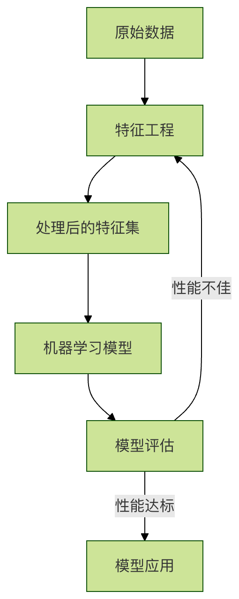
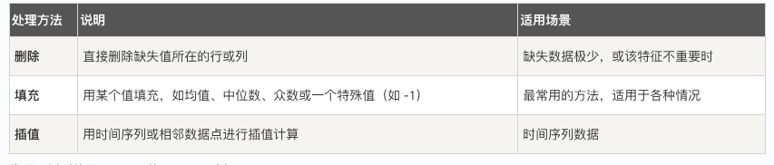
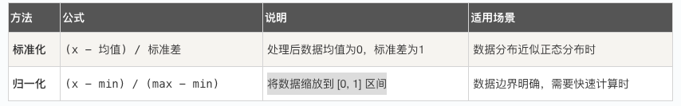
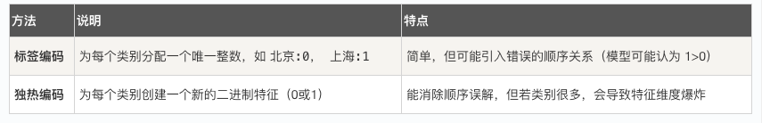
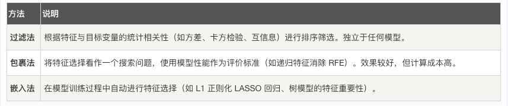

## 特征工程

想象一下，你是一位厨师，要做一道美味的菜肴，机器学习模型就像你的"烹饪算法"，而原始数据就是你从市场买回来的各种食材：有蔬菜、肉类、调料，但可能有些是带泥的，有些是整块的，有些味道很冲。特征工程，就是将这些原始"食材"进行清洗、切割、腌制、搭配，最终处理成可以直接下锅烹饪的"半成品"的过程，它是连接原始数据与机器学习模型的桥梁，是决定模型性能上限的关键步骤。

简单来说，特征工程是利用领域知识，通过一系列技术手段，从原始数据中提取、构造、选择出对机器学习模型更有价值、更易学习的特征（变量）的过程。

### 一、为什么特征工程如此重要？
在机器学习项目中，数据和特征的质量直接决定了模型性能的上限，而模型和算法只是逼近这个上限。一个优秀的特征工程可以：
* 1. 提升模型性能：好的特征能让模型更容易发现数据中的规律。
* 2. 加速模型训练：减少无关或冗余特征，可以降低计算复杂度。
* 3. 增强模型泛化能力：防止模型过拟合于训练数据中的噪声。
* 4. 适应模型需求：不同的模型对数据有不同的假设（如线性模型假设线性关系），特征工程可以使数据满足这些假设。
我们可以用以下流程图来直观理解特征工程在整个机器学习流程中的位置：


### 二、特征工程的核心操作
特征工程主要包含三大类操作：特征处理、特征构造和特征选择。

#### 1. 特征处理
##### a) 处理缺失值
数据中经常存在缺失值（如 NaN, NULL），需要合理处理。


代码示例（使用 Python 的 pandas 库）：
实例
```python
import pandas as pd
import numpy as np

# 创建一个包含缺失值的示例 DataFrame
data = {'年龄': [25, np.nan, 30, 35, np.nan],
        '工资': [50000, 54000, np.nan, 62000, 58000],
        '城市': ['北京', '上海', '广州', np.nan, '北京']}
df = pd.DataFrame(data)
print("原始数据：")
print(df)

# 1. 删除缺失值（删除任何包含 NaN 的行）
df_dropped = df.dropna()
print("\n删除缺失值后：")
print(df_dropped)

# 2. 填充缺失值
# 数值列用均值填充
df_filled = df.copy()
df_filled['年龄'].fillna(df_filled['年龄'].mean(), inplace=True)
df_filled['工资'].fillna(df_filled['工资'].mean(), inplace=True)
# 类别列用众数填充
df_filled['城市'].fillna(df_filled['城市'].mode()[0], inplace=True)
print("\n填充缺失值后：")
print(df_filled)
```

##### b) 处理异常值
异常值是与大部分数据明显不同的值，可能会干扰模型。常用检测方法有：
* 标准差法：认为超出均值 ± 3倍标准差范围的值是异常值。
* 箱线图法：认为小于 Q1 - 1.5*IQR 或大于 Q3 + 1.5*IQR 的值是异常值（IQR = Q3 - Q1）。
处理方式可以是删除、替换为边界值或视为缺失值处理。


##### c) 数据标准化/归一化
许多模型（如 SVM、KNN、神经网络）对特征的尺度敏感。我们需要将不同尺度的特征转换到同一尺度。

代码示例（使用 scikit-learn 库）：
实例
```python
from sklearn.preprocessing import StandardScaler, MinMaxScaler
import numpy as np

# 示例数据
data = np.array([[1000, 25],
                 [1500, 30],
                 [800, 20],
                 [1200, 28]])

# 标准化
scaler_standard = StandardScaler()
data_standardized = scaler_standard.fit_transform(data)
print("标准化后的数据（均值~0， 标准差~1）：")
print(data_standardized)
print(f"均值： {data_standardized.mean(axis=0)}")
print(f"标准差： {data_standardized.std(axis=0)}")

# 归一化
scaler_minmax = MinMaxScaler()
data_normalized = scaler_minmax.fit_transform(data)
print("\n归一化后的数据（范围[0,1]）：")
print(data_normalized)

```


#### 2. 特征构造
通过组合或转换现有特征，创造出新的、更具预测力的特征。
##### a) 对数值特征进行变换
 * 多项式特征：创建特征的平方、立方等，帮助线性模型学习非线性关系。
 * 分箱：将连续年龄分为"青年"、"中年"、"老年"等区间，将连续数据离散化。
 * 数学变换：使用对数、指数等变换改变数据分布。

##### b) 对类别特征进行编码
机器学习模型无法直接处理"北京"、"上海"这样的文本。需要将其转换为数字。


代码示例：
```python
import pandas as pd
from sklearn.preprocessing import LabelEncoder, OneHotEncoder

# 示例数据
df_cat = pd.DataFrame({'城市': ['北京', '上海', '广州', '北京', '深圳']})

# 标签编码
le = LabelEncoder()
df_cat['城市_标签编码'] = le.fit_transform(df_cat['城市'])
print("标签编码结果：")
print(df_cat)

# 独热编码
# 方法1: 使用 pandas 的 get_dummies
df_onehot_pd = pd.get_dummies(df_cat['城市'], prefix='城市')
print("\n使用 pandas 进行独热编码：")
print(df_onehot_pd)

# 方法2: 使用 sklearn 的 OneHotEncoder (更常用于管道)
ohe = OneHotEncoder(sparse_output=False) # sparse_output=False 返回数组而非稀疏矩阵
encoded_array = ohe.fit_transform(df_cat[['城市']]) # 注意输入是二维的
print("\n使用 sklearn 进行独热编码（数组形式）：")
print(encoded_array)
print("新特征名称：", ohe.get_feature_names_out())
```

#### 3. 特征选择
从所有特征中挑选出最重要的一个子集，以降低维度、减少过拟合风险。

代码示例（基于特征重要性进行选择）：

```python
from sklearn.datasets import load_breast_cancer
from sklearn.ensemble import RandomForestClassifier
import pandas as pd
import matplotlib.pyplot as plt

# 加载数据集
data = load_breast_cancer()
X = pd.DataFrame(data.data, columns=data.feature_names)
y = data.target

# 训练一个随机森林模型，它会计算特征重要性
model = RandomForestClassifier(n_estimators=100, random_state=42)
model.fit(X, y)

# 获取特征重要性
importances = model.feature_importances_
feature_importance_df = pd.DataFrame({
    '特征': data.feature_names,
    '重要性': importances
}).sort_values('重要性', ascending=False)

print("特征重要性排序：")
print(feature_importance_df.head(10)) # 查看最重要的10个特征

# 可视化
plt.figure(figsize=(10, 6))
plt.barh(feature_importance_df['特征'][:10], feature_importance_df['重要性'][:10])
plt.xlabel('特征重要性')
plt.title('Top 10 特征重要性')
plt.gca().invert_yaxis() # 让最重要的在顶部
plt.show()

# 假设我们选择重要性大于0.03的特征
selected_features = feature_importance_df[feature_importance_df['重要性'] > 0.03]['特征'].tolist()
print(f"\n筛选出的特征： {selected_features}")

```

### 三、实践练习：动手处理一个简单数据集
* 任务：对著名的泰坦尼克号乘客数据集进行基础的特征工程，为预测乘客是否生还做准备。
* 步骤提示：
    1 加载数据（可使用 seaborn 库中的 load_dataset('titanic')）。
    2 观察数据：查看特征类型、缺失值情况。
    3 特征处理：
        3.1 处理缺失值（如用中位数填充age，用众数填充embarked）。
        3.2 将sex（性别）特征进行标签编码或独热编码。
        3.3 对age（年龄）进行分箱，创建新的年龄段特征。
    4 特征构造：
        结合sibsp（兄弟姐妹/配偶数）和parch（父母/子女数），构造新的family_size（家庭规模）特征。
    5 特征选择：
        5.1 删除你认为明显无关的特征（如passenger_id, name, ticket）。
        5.2 尝试计算数值特征与生存目标的相关性，筛选特征。
    通过这个练习，你将亲身体会到，原始数据如何通过一步步的特征工程，变得对机器学习模型更加"友好"。

### 总结
特征工程是机器学习中一门结合了艺术（领域知识、经验、直觉）与科学（统计方法、算法）的技艺。它没有一成不变的规则，需要根据具体数据、问题和模型反复尝试和迭代。对于初学者，掌握本文介绍的基础方法并勤加练习，你就已经为构建有效的机器学习模型打下了最坚实的一块基石。记住，优秀的模型往往源于优秀的特征。
