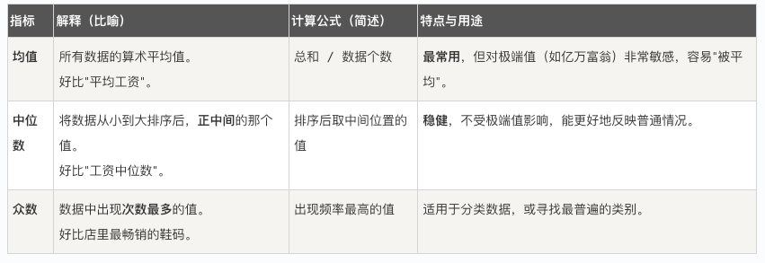
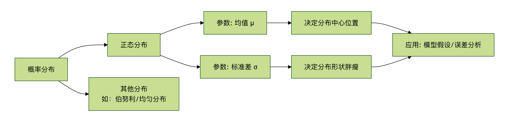

## 统计学基础

在学习各种炫酷的算法之前，我们需要先打好一个至关重要的基础——统计学。

我们可以把统计学想象成机器学习的语言和工具箱，没有它，机器学习模型就像没有地图的探险家，无法理解数据、做出预测或评估自己的表现。

本文将为你系统性地介绍机器学习中必备的统计学核心概念，用通俗的语言和生动的例子，帮助你构建坚实的理论基础。


### 为什么机器学习需要统计学？
**核心原因** ：机器学习本质上是从数据中学习规律，并用这个规律对未知情况进行预测或决策。而统计学，正是研究如何收集、分析、解释和呈现数据的科学。

   * 数据理解：统计学帮助我们描述数据的基本特征（比如平均身高、收入分布），这是数据清洗和探索的第一步。
   * 规律挖掘：它提供了从数据中推断出普遍规律（模型）的方法，并告诉我们这个规律有多可靠。
   * 预测与评估：统计学理论支撑着我们如何用模型进行预测，以及如何客观地评估一个模型的好坏（是瞎猜还是真懂？）。
   * 不确定性量化：现实世界充满噪音，统计学让我们能够度量预测中的不确定性（例如，"我有95%的把握认为明天会下雨"）。
简单来说，统计学是机器学习的理论基石，让智能从玄学变为科学。

### 核心概念一：描述性统计
描述性统计就像给数据拍快照和体检报告，用几个关键指标来概括数据集的全貌。这是任何数据分析项目的起点。
#### 1. 集中趋势：数据围绕哪里聚集？
这组指标告诉我们数据的中心或典型值在哪里。



示例：一个部门5名员工的月薪（单位：千元）为：[30, 35, 40, 45, 200]（老板也在其中）。

  * 均值 = (30+35+40+45+200)/5 = 70。这个值因为老板的200而虚高，不能代表员工收入。
  * 中位数 = 排序后的第三个数 40。这个值更能代表该部门"典型"员工的收入。
  * 众数 = 所有值只出现一次，所以没有众数。

#### 2. 离散程度：数据有多分散？
光知道中心不够，我们还需要知道数据是紧密围绕中心，还是散落四处。离散程度衡量数据的波动性或多样性。


接上例：计算员工薪资的标准差（均值用40估算更合理）。

    1. 计算方差：[(30-40)² + (35-40)² + (40-40)² + (45-40)² + (200-40)²] / 4 ≈ 5875
    2. 标准差 = √5875 ≈ 76.65。这个巨大的标准差（76.65）远大于均值（40），强烈提示数据中存在极端异常值（老板的200），需要进一步分析。

#### 3. 数据分布与可视化
数字指标是抽象的，图表能让我们直观"看到"数据。
    直方图：展示数据在不同区间（桶）内的频率分布。可以看出数据是单峰还是多峰，是否对称。
    箱线图：用一个"箱子"和"触须"展示数据的最小值、第一四分位数（Q1）、中位数（Q2）、第三四分位数（Q3）、最大值，是识别异常值的利器。

实例
```python
# Python 示例：使用 matplotlib 和 seaborn 绘制箱线图来识别异常值
import matplotlib.pyplot as plt
import seaborn as sns
import numpy as np

# 员工薪资数据，包含一个异常值
salaries = np.array([30, 35, 40, 45, 200])
employee_names = ['Alice', 'Bob', 'Charlie', 'Diana', 'Boss']

plt.figure(figsize=(8, 5))
# 创建箱线图
sns.boxplot(y=salaries)
plt.title('Department Salary Distribution (Boxplot)')
plt.ylabel('Salary (k)')
plt.grid(axis='y', linestyle='--', alpha=0.7)

# 标注出异常值对应的点
for i, (name, salary) in enumerate(zip(employee_names, salaries)):
    if salary > 45 + 1.5 * (45-35): # 简单异常值判断规则
        plt.annotate(f'{name}: {salary}', xy=(0, salary), xytext=(0.2, salary),
                     arrowprops=dict(facecolor='red', shrink=0.05))
plt.show()
```
代码解释：
* sns.boxplot() 绘制箱线图。箱体从 Q1 到 Q3，中间线是中位数。
* 箱线图的"触须"通常延伸到 1.5 倍四分位距（IQR = Q3 - Q1）以内的最远数据点，之外的点被视为异常值并用点单独标出。图中 200 这个点被清晰地识别为异常值。

### 核心概念二：概率与分布
如果说描述性统计是看历史，那么概率就是预测未来。它量化了某件事情发生的可能性。

#### 1. 基本概率
 * 概率 P(A)：事件 A 发生的可能性，范围在 0（不可能）到 1（必然）之间。
 * 条件概率 P(A|B)：在事件 B 已经发生的条件下，事件 A 发生的概率。这是理解很多机器学习算法（如朴素贝叶斯）的关键。
    * 公式：P(A|B) = P(A 且 B) / P(B)

#### 2. 概率分布
描述一个随机变量取各种可能值的概率规律。机器学习中最重要的是：
* 正态分布（高斯分布）：
    * 形状：著名的"钟形曲线"，左右对称。
    * 参数：由**均值（μ）**决定中心位置，**标准差（σ）**决定曲线的"胖瘦"（分散程度）。
    * 重要性：自然界和社会科学中大量现象都近似服从正态分布（如身高、测量误差）。中心极限定理指出，多个独立随机变量之和趋向于正态分布，这使其成为统计推断的基石。
    * 68-95-99.7 法则：数据落在均值±1σ、±2σ、±3σ范围内的概率分别约为68%、95%、99.7%。


### 核心概念三：推断性统计
这是统计学的"升级版"，目标是从样本数据推断总体的性质。机器学习中，我们总在用有限的数据（样本）训练模型，希望它能在无限的真实世界（总体）中表现良好。
#### 1. 中心极限定理
* 核心思想：无论总体是什么分布，当我们从总体中抽取大量独立的随机样本，并计算每个样本的均值，这些样本均值的分布会趋近于一个正态分布。

* 对机器学习的意义：这为我们利用正态分布的性质来对模型参数（如均值）进行假设检验和构建置信区间提供了理论依据。即使我们不知道总体的真实分布，也能对基于样本得到的估计值进行可靠性分析。

#### 2. 假设检验
用于判断一个关于总体的假设（如"新药无效"）是否被样本数据所支持。

* 零假设（H0）：通常表示"没有效果"、"没有差异"（默认立场）。
* 备择假设（H1）：我们希望证实的假设（如"新药有效"）。
* P值：在零假设成立的前提下，观察到当前样本数据（或更极端数据）的概率。
     * 如何判断：如果P值很小（通常 < 0.05），意味着在 H0 下当前情况极难发生，于是我们有足够证据拒绝 H0，接受 H1。
* 显著性水平（α）：判断P值是否"足够小"的阈值，常设为 0.05。
机器学习中的应用：用于特征选择，判断某个特征与目标变量之间是否存在统计上显著的相关性，而非偶然关联。

#### 3. 相关性与因果性
这是数据分析中最容易混淆，也最重要的概念之一。

* 相关性：衡量两个变量同时变化的趋势。常用**相关系数（-1 到 1）**表示。
    *  1：完全正相关（同增同减）。
    * -1：完全负相关（一增一减）。
    *  0：无线性相关。
* 因果性：指一个变量（因）的变化直接导致另一个变量（果）的变化。

关键区别：相关性不等于因果性！
* 经典谬误：夏天冰淇淋销量和溺水人数高度正相关。但这并不意味着吃冰淇淋导致溺水。其共同原因（混杂变量）是天气炎热。
* 对机器学习的启示：机器学习模型（尤其是预测模型）善于发现相关性，但无法自行确定因果性。将模型发现的强相关关系误认为是因果关系，是实践中常见的错误。建立因果模型需要更严谨的实验设计（如随机对照试验）或特殊的因果推断方法。


### 实践练习：用 Python 进行基础统计分析
让我们用 Python 和著名的 pandas、seaborn 库，对一个真实数据集进行简单的描述性和探索性统计分析。

#### 1. 导入必要的库
```python
import pandas as pd
import seaborn as sns
import matplotlib.pyplot as plt
import numpy as np

# 1. 加载数据集（这里使用 seaborn 自带的'tips'小费数据集）
df = sns.load_dataset('tips')
print("数据集前5行：")
print(df.head())
print(f"\n数据集形状：{df.shape}") # 查看行数和列数
print("\n基本信息：")
print(df.info())
print("\n描述性统计：")
print(df.describe())

# 2. 探索数值型变量：总账单（total_bill）和小费（tip）
print(f"\n总账单的均值：{df['total_bill'].mean():.2f}")
print(f"总账单的中位数：{df['total_bill'].median():.2f}")
print(f"总账单的标准差：{df['total_bill'].std():.2f}")
print(f"小费与总账单的相关系数：{df['tip'].corr(df['total_bill']):.3f}")

# 3. 可视化
fig, axes = plt.subplots(2, 2, figsize=(12, 10))

# 3.1 总账单的直方图与密度估计
sns.histplot(df['total_bill'], kde=True, ax=axes[0, 0])
axes[0, 0].set_title('Distribution of Total Bill')
axes[0, 0].axvline(df['total_bill'].mean(), color='red', linestyle='--', label=f'Mean: {df["total_bill"].mean():.1f}')
axes[0, 0].axvline(df['total_bill'].median(), color='green', linestyle='--', label=f'Median: {df["total_bill"].median():.1f}')
axes[0, 0].legend()

# 3.2 小费与总账单的散点图（看相关性）
sns.scatterplot(data=df, x='total_bill', y='tip', hue='time', ax=axes[0, 1])
axes[0, 1].set_title('Tip vs Total Bill (Colored by Meal Time)')

# 3.3 按性别分组的小费箱线图（比较组间差异）
sns.boxplot(data=df, x='sex', y='tip', ax=axes[1, 0])
axes[1, 0].set_title('Tip Amount by Gender')

# 3.4 吸烟与否的账单均值柱状图
bill_by_smoker = df.groupby('smoker')['total_bill'].mean().reset_index()
sns.barplot(data=bill_by_smoker, x='smoker', y='total_bill', ax=axes[1, 1])
axes[1, 1].set_title('Average Total Bill by Smoking Status')
for index, row in bill_by_smoker.iterrows():
    axes[1, 1].text(index, row['total_bill']+0.5, f"{row['total_bill']:.1f}", ha='center')

plt.tight_layout()
plt.show()
```

练习任务：

运行代码：在你的 Python 环境中运行上述代码，观察输出和图表。

解读结果：

从描述性统计表中，你能说出总账单的大致范围和中位数吗？
小费和总账单是正相关还是负相关？从散点图中能看出来吗？
从箱线图看，男性和女性给的小费中位数有显著差异吗？
提出假设：基于"吸烟与否的账单均值"柱状图，你能提出一个可以用于假设检验的零假设吗？（例如：H0: 吸烟者和非吸烟者的平均账单没有差异）。


