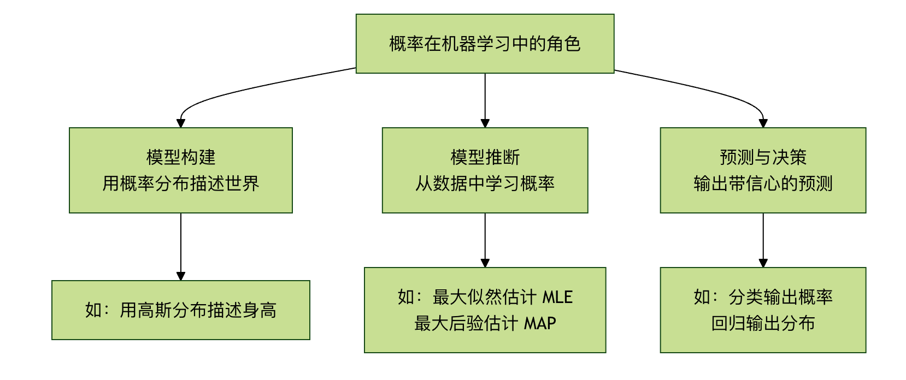
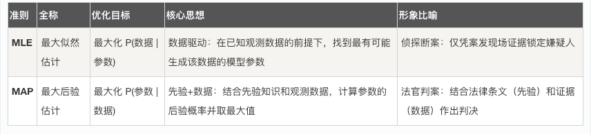

## 概率思维
想象一下，你正在教一个朋友识别猫和狗的照片，你不会说：这张图100%是猫，而可能会说：这张图看起来有 90% 的可能是猫，因为它有尖耳朵和胡须。这种可能性的表述，正是概率思维的核心。

在现实世界中，机器学习模型处理的数据几乎总是充满不确定性的：图像可能模糊、语音可能有噪音、用户行为难以预测。概率为我们提供了一套严谨的数学语言，来描述、量化和处理这种不确定性。它不仅是高级模型（如贝叶斯网络、高斯过程）的基础，更是理解模型输出、评估预测信心和做出稳健决策的关键。

简而言之，概率思维是将猜测转化为可量化的信心的桥梁，是机器学习从硬编码规则迈向智能推理的重要一步。
### 核心概率概念快速入门
#### 1. 概率是什么？
概率是对某个事件发生的可能性的度量，范围在 0 到 1 之间。
* P(A) = 0：事件 A 不可能发生。
* P(A) = 1：事件 A 必然发生。
* 0 < P(A) < 1：事件 A 以一定的可能性发生。
在机器学习中，一个事件可以是：这张图片是猫、用户明天会点击这个广告、下一个单词是你好。

#### 2. 条件概率：世界是相互关联的
条件概率 P(A|B) 表示在事件 B 已经发生的条件下，事件 A 发生的概率。这是机器学习中至关重要的概念。

生活化比喻：
P(下雨)：今天下雨的一般概率（先验概率）。
P(下雨 | 乌云密布)：在已经看到"乌云密布"的条件下，今天下雨的概率（后验概率）。显然，后者的概率值会更高。

公式： P(A|B) = P(A 且 B) / P(B)，要求 P(B) > 0。

#### 3. 贝叶斯定理：从结果反推原因
贝叶斯定理是条件概率的一个华丽应用，它教会我们如何用新证据（数据）来更新我们对一个假设的信念。
公式： P(假设 | 数据) = [ P(数据 | 假设) * P(假设) ] / P(数据)

让我们拆解这个"魔法公式"：
*   P(假设)：先验概率。在看到任何数据之前，我们对假设的初始信念。
        例如：在收到邮件前，我们认为任何邮件是垃圾邮件的概率是 30%。
*   P(数据 | 假设)：似然度。如果假设成立，我们观察到当前这批数据的可能性有多大。
        例如：如果一封邮件确实是垃圾邮件，那么它里面出现"免费"、"获奖"这些词的概率有多高。
*   P(数据)：证据。观察到当前数据的总体概率，通常是一个归一化常数。
*   P(假设 | 数据)：后验概率。在观察到数据之后，我们对假设更新后的信念。这是我们最终追求的目标！
        例如：在看到了邮件中包含"免费"、"获奖"这些词后，这封邮件是垃圾邮件的更新概率是 95%。

贝叶斯定理的精髓：它提供了一个系统性的框架，将我们的先验知识（P(假设)）与观测到的数据（P(数据|假设)）结合起来，得到更准确的更新后认知（P(假设|数据)）。

### 第二部分：概率在机器学习中的三大角色

概率思维渗透在机器学习的各个环节，主要扮演以下三种角色：

#### 角色一：模型构建 —— 用概率描述世界
许多机器学习模型本质上是一个**概率模型**。我们假设观测到的数据是由某个潜在的概率分布生成的。

示例 1：逻辑回归 它直接输出一个概率值。对于一个二分类问题（猫/狗），逻辑回归模型不会只说"这是猫"，而是输出 P(类别=猫 | 图像数据)=0.9，表示模型有 90% 的信心认为这是猫。

示例 2：朴素贝叶斯分类器 直接应用贝叶斯定理进行分类。它假设特征之间相互独立，计算 P(垃圾邮件 | 词1， 词2...)，并选择概率更高的类别
实例
```python
# 一个简化的思想示例：计算后验概率（非完整代码）
# 假设我们已从数据中统计出以下概率（似然和先验）
P_单词_给定_垃圾 = {"免费": 0.8, "会议": 0.1}  # 在垃圾邮件中，"免费"出现的概率
P_单词_给定_正常 = {"免费": 0.1, "会议": 0.9}  # 在正常邮件中，"会议"出现的概率
P_垃圾 = 0.3  # 先验概率：任意邮件是垃圾邮件的概率
P_正常 = 0.7  # 先验概率：任意邮件是正常的概率

# 对于一封包含"免费"和"会议"的邮件，计算它是垃圾邮件的后验概率（简化计算）
# 根据贝叶斯公式（忽略证据分母，因为比较时抵消）
score_垃圾 = P_单词_给定_垃圾["免费"] * P_单词_给定_垃圾["会议"] * P_垃圾
score_正常 = P_单词_给定_正常["免费"] * P_单词_给定_正常["会议"] * P_正常

print(f"属于垃圾邮件的得分: {score_垃圾:.4f}")
print(f"属于正常邮件的得分: {score_正常:.4f}")

if score_垃圾 > score_正常:
    print("预测：这是一封垃圾邮件。")
else:
    print("预测：这是一封正常邮件。")
```


#### 角色二：模型推断与学习 —— 寻找最可能的解释
如何从数据中找到那个最有可能生成这些数据的概率模型（即学习模型参数）？这里有两个核心思想：

* 1. 最大似然估计 核心思想：寻找能使观测到当前数据的概率（似然度）最大化的模型参数。 比喻：侦探破案。侦探会问："在哪种作案动机和方式下，最有可能产生我们目前看到的所有现场痕迹？" MLE 就是在寻找这个"最可能"的假设。 优点：数据驱动，完全依赖数据。 潜在缺点：如果数据量少，可能过拟合；忽略先验知识。

* 2. 最大后验估计 核心思想：在最大似然的基础上，融入我们对参数的先验知识（P(假设)），寻找能使后验概率最大化的参数。 比喻：有经验的侦探破案。他不仅看现场痕迹（数据），还会结合已知的嫌疑人惯用手法（先验）来综合判断。 优点：能利用领域知识，在小数据集上表现更稳健，防止过拟合。




#### 角色三：预测与决策 —— 输出带信心的答案

一个优秀的模型不仅要给出预测，还要给出预测的不确定性。

* 分类任务：输出每个类别的概率（如：猫: 0.85， 狗: 0.12， 兔子: 0.03）。这比单纯输出"猫"包含了更多信息。我们可以根据概率阈值做决策（如：只有最高概率 > 0.8 时才采纳）。

* 回归任务：高级的回归模型（如概率回归、贝叶斯线性回归）可以预测一个分布（如高斯分布），而不仅仅是一个点估计值。它会告诉你："预测价格是100万元，并且有95%的把握认为真实价格在95万到105万之间。"


### 第三部分：实践练习 —— 用概率思维解决一个简单问题
场景：一个简单的疾病检测。已知：

  * 疾病在总人口中的发病率（先验概率）P(病) = 0.001。
  * 检测方法的准确率：如果真有病，检测为阳性的概率 P(阳|病) = 0.99（灵敏度）。如果没病，检测为阴性的概率 P(阴|健康) = 0.99（特异度）。
  * 问题：如果一个人检测结果是阳性，他真正患病的概率 P(病|阳) 是多少？
直觉陷阱：很多人会认为高达 99%。让我们用贝叶斯定理来计算。
```python
# 定义已知概率
P_disease = 0.001          # P(病)
P_positive_given_disease = 0.99   # P(阳|病)
P_negative_given_healthy = 0.99   # P(阴|健康)

# 计算派生概率
P_healthy = 1 - P_disease          # P(健康)
P_positive_given_healthy = 1 - P_negative_given_healthy  # P(阳|健康) = 1 - 特异度

# 计算全概率 P(阳)
# P(阳) = P(阳|病)*P(病) + P(阳|健康)*P(健康)
P_positive = (P_positive_given_disease * P_disease) + (P_positive_given_healthy * P_healthy)

# 应用贝叶斯定理计算 P(病|阳)
P_disease_given_positive = (P_positive_given_disease * P_disease) / P_positive

print(f"即使检测为阳性，真正患病的后验概率 P(病|阳) 仅为: {P_disease_given_positive:.2%}")
```

运行结果与思考： 你会惊讶地发现，P(病|阳) 只有大约 9%！这是因为疾病发病率很低（先验概率低），导致假阳性的数量远多于真阳性。这个例子深刻地展示了：
  1. 先验知识的重要性：忽略基础发病率会导致严重误判。
  2. 贝叶斯推理的力量：它迫使我们将所有相关信息（基础率、检测准确率）纳入考量。
  3. 概率思维的实用性：它能纠正我们直觉上的系统性偏差。

### 总结与进阶方向
#### 概率思维的核心收获：
概率思维的核心收获：
* 1 拥抱不确定性：世界是不确定的，模型的输出也应是概率化的。
* 2 贝叶斯是更新的哲学：通过 先验 + 数据 -> 后验 的框架，持续用新证据修正认知。
* 3 决策需要概率：一个好的预测应该附带"信心分数"，以支持风险可控的决策。

#### 如果你想继续深入：
* 理论层面：学习概率图模型，它用图结构优雅地表示变量间的复杂概率依赖关系。
* 算法层面：探索变分推断和马尔可夫链蒙特卡洛方法，它们是求解复杂贝叶斯模型的利器。
* 应用层面：研究贝叶斯优化（用于超参数调优）、高斯过程（用于回归和优化）以及深度生成模型（如变分自编码器 VAE、扩散模型）。

