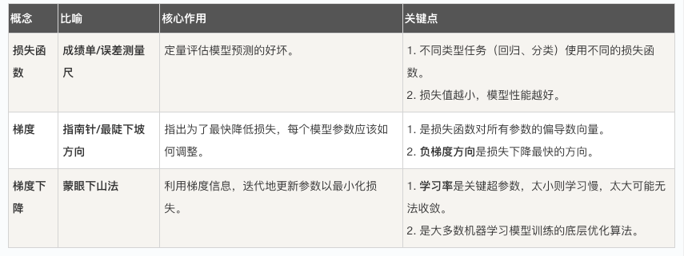

## 损失函数与梯度
本章节我们将一起探索两个至关重要的核心概念：**损失函数 和 梯度**，它们是机器学习算法能够学习和改进的基石。

想象一下，你在学习投篮，每次投球后，你都会观察球是进了、偏左了还是偏右了。这个观察结果与完美进球之间的差距，就是你的损失。而为了下次投得更准，你会根据这次偏差的方向和大小来调整你的姿势和力度，这个调整的方向和大小就类似于梯度。

在机器学习中，模型就是那个学习者，损失函数衡量它的错误程度，而梯度则告诉它如何改进。理解它们，你就掌握了机器学习如何工作的核心逻辑。
### 一、 损失函数：模型的成绩单
#### 1.1 什么是损失函数？
**损失函数**，有时也叫代价函数或目标函数，是一个用来量化模型预测值与真实值之间差异的函数。
* 核心作用：它给模型的预测表现打了一个具体的"分数"。这个分数越低，说明模型预测得越准确；分数越高，说明预测误差越大。
* 类比理解：就像考试一样，损失函数的"分数"就是模型的考试成绩。我们的终极目标就是通过"学习"（调整模型参数），让这个分数（损失）越来越低。

#### 1.2 常见损失函数举例
不同的任务需要使用不同的评分标准，以下是两个最基础的损失函数：

**均方误差 - 适用于回归问题（预测连续值，如房价、温度）**
均方误差计算的是所有样本的预测值与真实值之差的平方的平均值。

公式： MSE = (1/n) * Σ(真实值ᵢ - 预测值ᵢ)²
n：样本数量
Σ：求和符号
真实值ᵢ：第 i 个样本的真实值
预测值ᵢ：模型对第 i 个样本的预测值
特点：由于使用了平方，它对较大的误差惩罚更重（误差为 2 时，平方后贡献为 4；误差为 10时，平方后贡献高达 100）。

实例
```python
import numpy as np

# 假设我们有 5 个样本的真实值和预测值
y_true = np.array([3, -0.5, 2, 7, 4])      # 真实值
y_pred = np.array([2.5, 0.0, 2, 8, 5])     # 预测值

# 手动计算 MSE
n = len(y_true)
squared_errors = (y_true - y_pred) ** 2    # 计算每个样本的平方误差
mse_manual = np.sum(squared_errors) / n    # 求和并取平均
print(f"手动计算的 MSE: {mse_manual}")

# 使用 sklearn 库函数验证
from sklearn.metrics import mean_squared_error
mse_sklearn = mean_squared_error(y_true, y_pred)
print(f"Sklearn 计算的 MSE: {mse_sklearn}")

```
**交叉熵损失 - 适用于分类问题（预测类别，如图片是猫还是狗）**
交叉熵衡量的是**模型预测的概率分布**与**真实的概率分布**之间的差异。在二分类中，真实分布通常是 [1, 0]（是类别 A）或 [0, 1]（是类别 B）。

**二分类公式（对数损失）** ： Log Loss = - (1/n) * Σ [真实值ᵢ * log(预测概率ᵢ) + (1 - 真实值ᵢ) * log(1 - 预测概率ᵢ)]

直观理解：当真实标签为1时，我们希望模型预测的概率也接近1。如果此时模型预测了一个很低的概率（比如 0.1），那么 log(0.1) 会是一个很大的负数，再乘以前面的负号，就会导致损失值变得很大，表示惩罚很重。

代码示例：
实例
```python
import numpy as np
from sklearn.metrics import log_loss

# 二分类示例：真实标签（1代表"是"，0代表"否"）
y_true_binary = np.array([1, 0, 0, 1]) # 真实类别：是，否，否，是
# 模型预测为"是"这个类别的概率
y_pred_prob = np.array([0.9, 0.1, 0.2, 0.8]) # 预测概率：0.9, 0.1, 0.2, 0.8

# 使用 sklearn 计算交叉熵损失（对数损失）
ce_loss = log_loss(y_true_binary, y_pred_prob)
print(f"交叉熵损失 (Log Loss): {ce_loss}")
```

### 二、 梯度：指引优化方向的"指南针"
现在我们知道了如何给模型打分（损失函数），接下来最关键的问题是：模型如何根据这个分数来改进自己？ 答案就是通过梯度。
#### 2.1 什么是梯度？
在机器学习中，模型通常由许多参数（或叫权重）构成。我们可以把损失函数 L 看作是所有这些参数的函数：L(w1, w2, ..., wn)。

  *  梯度 就是损失函数对每个参数的偏导数所构成的向量。
  *  数学表示：∇L = [∂L/∂w1, ∂L/∂w2, ..., ∂L/∂wn]
  *  核心意义：
     * 1 方向：梯度向量所指的方向，是损失函数在该点上升最快的方向。
     * 2 大小：每个偏导数的绝对值大小，表示损失函数对该参数变化的敏感度。

#### 2.2 为什么梯度能指引优化？
我们的目标是 **最小化损失函数**  。既然梯度指向了损失上升最快的方向，那么它的反方向 -∇L 自然就是损失 **下降最快** 的方向。

优化过程（梯度下降）可以形象地理解为：
```
  你站在一座山谷（损失曲面）的某个山坡上，蒙着眼睛想要走到谷底（损失最小点）。你每走一步前，都用脚感受一下四周哪个方向最陡峭（计算梯度），然后朝着最陡峭的下坡方向（负梯度方向）迈出一步（更新参数）。重复这个过程，你最终就能到达谷底。
```
这个过程可以用下面的流程图概括：


#### 2.3 梯度下降的简单示例
让我们用一个最简单的例子——只有一个参数 w 的线性模型，来演示梯度下降。

假设我们的损失函数是 L(w) = w²。显然，当 w = 0 时，损失最小。

梯度计算：∇L = dL/dw = 2w
参数更新公式：w_new = w_old - η * (2 * w_old)
η 是学习率，控制每一步迈多大。

```python
import numpy as np
import matplotlib.pyplot as plt

# 定义损失函数 L(w) = w^2
def loss(w):
    return w ** 2

# 定义梯度 dL/dw = 2*w
def gradient(w):
    return 2 * w

# 梯度下降算法
def gradient_descent(start_w, learning_rate, iterations):
    w = start_w
    w_history = [w]  # 记录 w 的变化历史
    loss_history = [loss(w)]  # 记录损失的变化历史

    for i in range(iterations):
        grad = gradient(w)  # 计算当前点的梯度
        w = w - learning_rate * grad  # 沿负梯度方向更新参数
        w_history.append(w)
        loss_history.append(loss(w))

    return w_history, loss_history

# 执行梯度下降：从 w=5 开始，学习率 0.1，迭代 20 次
w_start = 5.0
lr = 0.1
iters = 20
w_hist, loss_hist = gradient_descent(w_start, lr, iters)

print(f"初始 w: {w_hist[0]:.4f}, 初始损失: {loss_hist[0]:.4f}")
print(f"最终 w: {w_hist[-1]:.4f}, 最终损失: {loss_hist[-1]:.4f}")

# 可视化优化过程
plt.figure(figsize=(12, 4))

# 图1：损失函数曲线及优化路径
plt.subplot(1, 2, 1)
w_vals = np.linspace(-6, 6, 100)
plt.plot(w_vals, loss(w_vals), label='L(w) = w²')
plt.scatter(w_hist, loss_hist, c='red', s=20, label='Gradient Descent Steps')
plt.plot(w_hist, loss_hist, 'r--', alpha=0.5)
plt.xlabel('Parameter w')
plt.ylabel('Loss L(w)')
plt.title('Gradient Descent on L(w)=w²')
plt.legend()
plt.grid(True)

# 图2：损失值随迭代次数的下降曲线
plt.subplot(1, 2, 2)
plt.plot(range(len(loss_hist)), loss_hist, 'b-o')
plt.xlabel('Iteration')
plt.ylabel('Loss')
plt.title('Loss Reduction Over Iterations')
plt.grid(True)

plt.tight_layout()
plt.show()
```

运行这段代码，你会看到：

左边的图展示了参数 w 如何从 5.0 开始，一步步"滚下"抛物线，最终接近最小值点 0。
右边的图展示了损失值如何随着迭代次数的增加而迅速下降。

### 三、 核心要点与联系总结


它们之间的关系链是： 模型做出预测 → 损失函数计算误差 → 计算误差相对于各参数的梯度 → 沿负梯度方向更新参数 → 模型改进 → 重复...