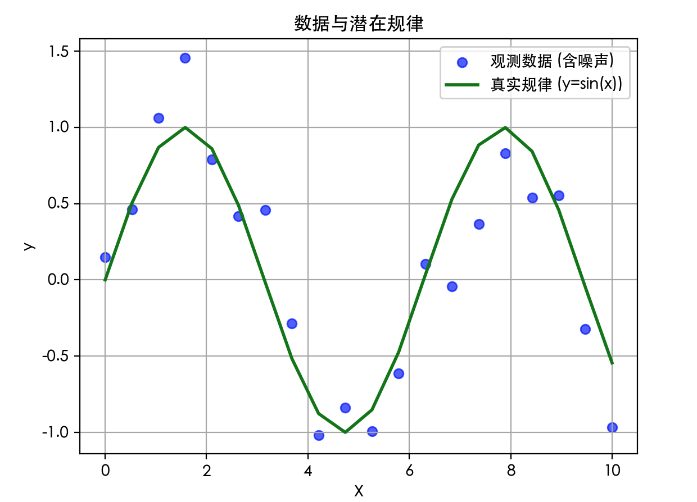
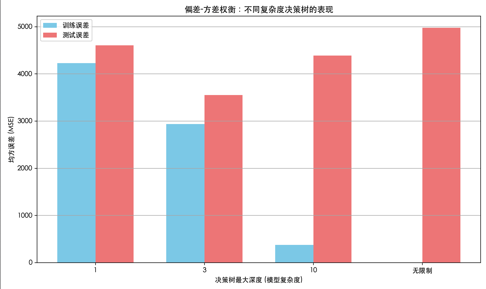

## 过拟合、欠拟合、偏差与方差
在机器学习的世界里，构建一个模型就像训练一位学生，我们的目标是希望这位学生不仅能记住课本上的例题（训练数据），更能深刻理解背后的原理，从而在全新的、从未见过的考题（测试数据）上也能取得好成绩。然而，这位学生在学习过程中可能会遇到两种典型问题：

一种是学得太死板，只会生搬硬套例题（欠拟合）；
另一种是学得太聪明，把例题的标点符号甚至笔迹特点都背下来了，导致面对新题时不知所措（过拟合）。
理解 **过拟合 与 欠拟合** ，以及其背后更深层的理论概念——偏差 与 方差，是每一位机器学习实践者从入门走向精通的关键一步。它们解释了模型为何会犯错，并为我们指明了模型改进的方向。

### 一、核心概念：模型的表现与"拟合"状态
首先，让我们通过一个直观的例子来理解什么是拟合。假设我们想用一个数学模型来拟合一组散点数据。
实例
```python
import numpy as np
import matplotlib.pyplot as plt

# -------------------------- 设置中文字体 start --------------------------
plt.rcParams['font.sans-serif'] = [
    # Windows 优先
    'SimHei', 'Microsoft YaHei',
    # macOS 优先
    'PingFang SC', 'Heiti TC',
    # Linux 优先
    'WenQuanYi Micro Hei', 'DejaVu Sans'
]
# 修复负号显示为方块的问题
plt.rcParams['axes.unicode_minus'] = False
# -------------------------- 设置中文字体 end --------------------------

# 生成模拟数据：在正弦曲线基础上加入一些随机噪声
np.random.seed(42)
X = np.linspace(0, 10, 20)
y_true = np.sin(X)                     # 真实的潜在规律（我们不知道）
y_noise = np.random.randn(20) * 0.3   # 随机噪声
y = y_true + y_noise                  # 我们实际观测到的数据

plt.scatter(X, y, label='观测数据 (含噪声)', color='blue', alpha=0.6)
plt.plot(X, y_true, label='真实规律 (y=sin(x))', color='green', linewidth=2)
plt.xlabel('X')
plt.ylabel('y')
plt.title('数据与潜在规律')
plt.legend()
plt.grid(True)
plt.show()
```
我们的目标是找到一条曲线（模型），能最好地描述这些蓝色散点（数据）所反映的规律。
模型对数据的描述程度，就是拟合。



#### 1. 欠拟合
欠拟合 是指模型过于简单，无法捕捉数据中的基本规律或模式。就像一个学生只学了加法，却要去解微积分题目。
*  表现：模型在训练数据上表现就很差（例如，准确率低，误差大）。
*  原因：模型复杂度太低，特征不足，或训练不充分。
*  类比：用一条直线（一次多项式）去拟合有明显弯曲趋势的数据。
实例
```python
from sklearn.linear_model import LinearRegression
from sklearn.preprocessing import PolynomialFeatures
from sklearn.metrics import mean_squared_error

# 尝试用1阶多项式（直线）拟合
poly = PolynomialFeatures(degree=1)
X_poly1 = poly.fit_transform(X.reshape(-1, 1))
model_under = LinearRegression()
model_under.fit(X_poly1, y)
y_pred_under = model_under.predict(X_poly1)

mse_train_under = mean_squared_error(y, y_pred_under)
print(f"欠拟合模型在训练集上的均方误差 (MSE): {mse_train_under:.4f}")
```
输出：

```
欠拟合模型在训练集上的均方误差 (MSE): 0.4402
欠拟合模型在训练集上的均方误差 (MSE): 0.4402
```

#### 2. 恰到好处的拟合

这是理想状态。模型足够复杂以学习数据中的关键模式，但又不会复杂到去学习随机噪声。它能在训练集和未知的测试集上都表现良好。

* 表现：在训练集和测试集上的误差都较低，且两者接近。
* 类比：用一个适当阶数的多项式（例如3阶）来拟合数据。

实例
```python
# 尝试用3阶多项式拟合
poly = PolynomialFeatures(degree=3)
X_poly3 = poly.fit_transform(X.reshape(-1, 1))
model_good = LinearRegression()
model_good.fit(X_poly3, y)
y_pred_good = model_good.predict(X_poly3)

mse_train_good = mean_squared_error(y, y_pred_good)
print(f"良好拟合模型在训练集上的均方误差 (MSE): {mse_train_good:.4f}")
```
输出：
```python
欠拟合模型在训练集上的均方误差 (MSE): 0.4402
良好拟合模型在训练集上的均方误差 (MSE): 0.3988
```

#### 3. 过拟合

过拟合 是指模型过于复杂，不仅学习了数据中的真实规律，还"记住"了训练数据中的随机噪声和异常值。

 * 表现：模型在训练数据上表现极好（误差极小），但在新的、未见过的数据上表现急剧下降，泛化能力差。
 * 原因：模型复杂度过高，训练数据量太少。
 * 类比：用一个非常高阶的多项式（例如15阶）去拟合数据，使得曲线穿过了几乎每一个数据点，变得极度扭曲。
实例
```python
import numpy as np
import matplotlib.pyplot as plt
from sklearn.linear_model import LinearRegression
from sklearn.preprocessing import PolynomialFeatures
from sklearn.metrics import mean_squared_error

# -------------------------- 设置中文字体 start --------------------------
plt.rcParams['font.sans-serif'] = [
    # Windows 优先
    'SimHei', 'Microsoft YaHei',
    # macOS 优先
    'PingFang SC', 'Heiti TC',
    # Linux 优先
    'WenQuanYi Micro Hei', 'DejaVu Sans'
]
# 修复负号显示为方块的问题
plt.rcParams['axes.unicode_minus'] = False
# -------------------------- 设置中文字体 end --------------------------

# 生成模拟数据：在正弦曲线基础上加入一些随机噪声
np.random.seed(42)
X = np.linspace(0, 10, 20)
y_true = np.sin(X)                     # 真实的潜在规律（我们不知道）
y_noise = np.random.randn(20) * 0.3   # 随机噪声
y = y_true + y_noise                  # 我们实际观测到的数据

# 尝试用1阶多项式（直线）拟合
poly = PolynomialFeatures(degree=1)
X_poly1 = poly.fit_transform(X.reshape(-1, 1))
model_under = LinearRegression()
model_under.fit(X_poly1, y)
y_pred_under = model_under.predict(X_poly1)

mse_train_under = mean_squared_error(y, y_pred_under)
print(f"欠拟合模型在训练集上的均方误差 (MSE): {mse_train_under:.4f}")

# 尝试用3阶多项式拟合
poly = PolynomialFeatures(degree=3)
X_poly3 = poly.fit_transform(X.reshape(-1, 1))
model_good = LinearRegression()
model_good.fit(X_poly3, y)
y_pred_good = model_good.predict(X_poly3)

mse_train_good = mean_squared_error(y, y_pred_good)
print(f"良好拟合模型在训练集上的均方误差 (MSE): {mse_train_good:.4f}")

# 尝试用15阶多项式拟合（极易过拟合）
poly = PolynomialFeatures(degree=15)
X_poly15 = poly.fit_transform(X.reshape(-1, 1))
model_over = LinearRegression()
model_over.fit(X_poly15, y)
y_pred_over = model_over.predict(X_poly15)

mse_train_over = mean_squared_error(y, y_pred_over)
print(f"过拟合模型在训练集上的均方误差 (MSE): {mse_train_over:.4f}")

# 可视化三种拟合状态
plt.figure(figsize=(15, 4))

# 欠拟合
plt.subplot(1, 3, 1)
plt.scatter(X, y, alpha=0.6)
plt.plot(X, y_pred_under, color='red', linewidth=2, label='欠拟合 (1阶)')
plt.plot(X, y_true, color='green', linestyle='--', label='真实规律')
plt.title(f'欠拟合\n训练MSE: {mse_train_under:.4f}')
plt.legend()
plt.grid(True)

# 良好拟合
plt.subplot(1, 3, 2)
plt.scatter(X, y, alpha=0.6)
plt.plot(X, y_pred_good, color='red', linewidth=2, label='良好拟合 (3阶)')
plt.plot(X, y_true, color='green', linestyle='--', label='真实规律')
plt.title(f'良好拟合\n训练MSE: {mse_train_good:.4f}')
plt.legend()
plt.grid(True)

# 过拟合
plt.subplot(1, 3, 3)
plt.scatter(X, y, alpha=0.6)
plt.plot(X, y_pred_over, color='red', linewidth=2, label='过拟合 (15阶)')
plt.plot(X, y_true, color='green', linestyle='--', label='真实规律')
plt.title(f'过拟合\n训练MSE: {mse_train_over:.4f}')
plt.legend()
plt.grid(True)

plt.tight_layout()
plt.show()
```


从图中可以清晰看到：
 * 欠拟合（左）：红色直线完全无法捕捉数据的波动趋势。
 * 良好拟合（中）：红色曲线大致遵循了绿色真实规律的趋势。
 * 过拟合（右）：红色曲线剧烈波动，试图穿过每一个蓝色散点，包括噪声点，完全失去了正弦曲线的光滑形态。

### 二、理论基石：偏差与方差分解
偏差和方差为我们理解过拟合与欠拟合提供了理论框架。它们描述了模型误差的两个不同来源。
我们可以将模型的总误差分解为：偏差² + 方差 + 不可减少的误差。
#### 1. 偏差
* 定义：模型预测值的期望（即平均预测值）与真实值之间的差距。反映了模型本身的系统性错误，即模型对问题本质的假设是否有误。
* 高偏差的表现：模型过于简单，无法刻画数据特征，导致欠拟合。无论用什么数据训练，结果都偏离真实值。
* 例子：始终用"房价=面积×1000"这个简单线性模型来预测各种房子，忽略了地段、楼层等重要因素，这就是高偏差。

#### 2. 方差
* 定义：模型预测值自身的波动范围。反映了模型对训练数据中随机噪声的敏感程度。
* 高方差的表现：模型过于复杂，对训练数据中的微小变化（包括噪声）反应过度，导致过拟合。换一组数据训练，得到的模型可能完全不同。
* 例子：一个深度神经网络，如果不对其进行任何约束，它可能会为每一套独特的训练数据生成一套完全不同的、极度复杂的预测规则，这就是高方差。

#### 3. 偏差-方差权衡
这是一个机器学习中的核心权衡。我们无法同时最小化偏差和方差。


* 增加模型复杂度：通常可以降低偏差（模型能力变强），但会增加方差（更容易学到噪声）。
* 降低模型复杂度：通常可以降低方差（模型更稳定），但会增加偏差（模型能力变弱）。
我们的目标就是找到图中的"最佳点"，使得总误差最小。

### 三、诊断与应对策略

如何判断模型处于哪种状态？如何解决？

#### 1. 诊断方法：学习曲线
学习曲线是绘制模型在训练集和验证集上的性能（如误差）随训练样本数或模型复杂度变化的曲线。
实例
```python
import numpy as np
import matplotlib.pyplot as plt
from sklearn.datasets import load_diabetes
from sklearn.model_selection import train_test_split
from sklearn.model_selection import learning_curve
from sklearn.pipeline import make_pipeline
from sklearn.linear_model import LinearRegression
from sklearn.preprocessing import PolynomialFeatures, StandardScaler
from sklearn.metrics import mean_squared_error
import warnings
warnings.filterwarnings('ignore')

# -------------------------- 设置中文字体 start --------------------------
plt.rcParams['font.sans-serif'] = [
    # Windows 优先
    'SimHei', 'Microsoft YaHei',
    # macOS 优先
    'PingFang SC', 'Heiti TC',
    # Linux 优先
    'WenQuanYi Micro Hei', 'DejaVu Sans'
]
# 修复负号显示为方块的问题
plt.rcParams['axes.unicode_minus'] = False
# 设置图表样式
plt.rcParams['figure.figsize'] = (10, 6)
plt.rcParams['axes.grid'] = True
plt.rcParams['grid.alpha'] = 0.3
# -------------------------- 设置中文字体 end --------------------------

# 加载数据
data = load_diabetes()
X, y = data.data, data.target
# 只使用一个特征（更适合多项式回归演示）
X = X[:, np.newaxis, 2]  # 选择第三个特征（BMI）
X_train, X_test, y_train, y_test = train_test_split(X, y, test_size=0.2, random_state=42)

# 定义学习曲线绘制函数（优化版）
def plot_learning_curve(estimator, title, X, y, cv=5, train_sizes=np.linspace(0.1, 1.0, 10)):
    """
    绘制学习曲线
    参数：
        estimator: 模型估计器
        title: 图表标题
        X: 特征数据
        y: 目标变量
        cv: 交叉验证折数
        train_sizes: 训练样本比例
    """
    # 获取学习曲线数据
    train_sizes_abs, train_scores, test_scores = learning_curve(
        estimator, X, y, cv=cv, scoring='neg_mean_squared_error',
        train_sizes=train_sizes, random_state=42, n_jobs=-1
    )
    
    # 计算均值和标准差
    train_scores_mean = -train_scores.mean(axis=1)
    train_scores_std = train_scores.std(axis=1)
    test_scores_mean = -test_scores.mean(axis=1)
    test_scores_std = test_scores.std(axis=1)
    
    # 绘制学习曲线
    plt.figure(figsize=(10, 6))
    plt.fill_between(train_sizes_abs, 
                     train_scores_mean - train_scores_std,
                     train_scores_mean + train_scores_std, 
                     alpha=0.1, color='r')
    plt.fill_between(train_sizes_abs,
                     test_scores_mean - test_scores_std,
                     test_scores_mean + test_scores_std,
                     alpha=0.1, color='g')
    
    # 绘制均值曲线
    plt.plot(train_sizes_abs, train_scores_mean, 'o-', color='r', linewidth=2,
             markersize=8, label='训练集 MSE')
    plt.plot(train_sizes_abs, test_scores_mean, 'o-', color='g', linewidth=2,
             markersize=8, label='验证集 MSE')
    
    # 设置图表属性
    plt.xlabel('训练样本数量', fontsize=12)
    plt.ylabel('均方误差 (MSE)', fontsize=12)
    plt.title(title, fontsize=14, pad=20)
    plt.legend(loc='upper right', fontsize=11)
    plt.tight_layout()
    plt.show()
    
    # 打印模型在测试集上的表现
    estimator.fit(X_train, y_train)
    y_pred = estimator.predict(X_test)
    mse = mean_squared_error(y_test, y_pred)
    print(f"{title} - 测试集 MSE: {mse:.2f}")

# 1. 欠拟合模型（1阶多项式 - 线性回归）
print("="*60)
print("欠拟合模型（1阶多项式 - 线性回归）")
print("="*60)
plot_learning_curve(
    make_pipeline(StandardScaler(), PolynomialFeatures(1), LinearRegression()),
    '欠拟合模型学习曲线（1阶多项式）',
    X, y
)

# 2. 良好拟合模型（2阶多项式）
print("\n" + "="*60)
print("良好拟合模型（2阶多项式）")
print("="*60)
plot_learning_curve(
    make_pipeline(StandardScaler(), PolynomialFeatures(2), LinearRegression()),
    '良好拟合模型学习曲线（2阶多项式）',
    X, y
)

# 3. 过拟合模型（8阶多项式）
print("\n" + "="*60)
print("过拟合模型（8阶多项式）")
print("="*60)
plot_learning_curve(
    make_pipeline(StandardScaler(), PolynomialFeatures(8), LinearRegression()),
    '过拟合模型学习曲线（8阶多项式）',
    X, y
)

# 额外：可视化不同阶数模型的拟合效果
plt.figure(figsize=(12, 8))
X_plot = np.linspace(X.min(), X.max(), 100).reshape(-1, 1)

# 绘制原始数据点
plt.scatter(X_train, y_train, alpha=0.5, label='训练数据', color='blue', s=30)
plt.scatter(X_test, y_test, alpha=0.5, label='测试数据', color='orange', s=30)

# 绘制不同阶数的拟合曲线
orders = [1, 2, 8]
colors = ['red', 'green', 'purple']
labels = ['1阶（欠拟合）', '2阶（良好拟合）', '8阶（过拟合）']

for i, order in enumerate(orders):
    model = make_pipeline(StandardScaler(), PolynomialFeatures(order), LinearRegression())
    model.fit(X_train, y_train)
    y_plot = model.predict(X_plot)
    plt.plot(X_plot, y_plot, color=colors[i], linewidth=2, label=labels[i])

plt.xlabel('BMI 特征（标准化）', fontsize=12)
plt.ylabel('糖尿病进展指标', fontsize=12)
plt.title('不同阶数多项式回归的拟合效果对比', fontsize=14, pad=20)
plt.legend(fontsize=11)
plt.tight_layout()
plt.show()
```

如何解读学习曲线？


#### 2. 应对策略

根据诊断结果，我们可以采取不同策略：

**解决欠拟合（高偏差）** ：
* 增加模型复杂度：使用更强大的模型（如从线性模型切换到树模型、神经网络）。
* 添加更多特征：挖掘或构造更有意义的特征。
* 减少正则化：如果使用了正则化（如 L1、L2），尝试减弱其强度。
* 延长训练时间：对于迭代模型（如神经网络），训练更多轮次。

**解决过拟合（高方差）** ：
* 获取更多训练数据：最有效的方法之一。
* 降低模型复杂度：选择更简单的模型（如降低多项式阶数、减少树深度、减少神经网络层数）。
* 特征选择：移除不相关或冗余的特征。
* 增加正则化：
    L1 正则化 (Lasso)：倾向于产生稀疏权重，可用于特征选择。
    L2 正则化 (Ridge)：使权重衰减，倾向于让所有权重都较小。
    Dropout（用于神经网络）：在训练中随机"丢弃"一部分神经元。
* 早停（用于迭代模型）：当验证集误差不再下降时停止训练。

### 四、实践练习：在真实数据集上体验
让我们在经典的波士顿房价数据集（或糖尿病数据集，因为波士顿数据集已弃用）上实践一下。

```python
import numpy as np
import matplotlib.pyplot as plt
from sklearn.datasets import load_diabetes
from sklearn.model_selection import train_test_split
from sklearn.tree import DecisionTreeRegressor
from sklearn.metrics import mean_squared_error

# -------------------------- 设置中文字体 start --------------------------
plt.rcParams['font.sans-serif'] = [
    # Windows 优先
    'SimHei', 'Microsoft YaHei',
    # macOS 优先
    'PingFang SC', 'Heiti TC',
    # Linux 优先
    'WenQuanYi Micro Hei', 'DejaVu Sans'
]
# 修复负号显示为方块的问题
plt.rcParams['axes.unicode_minus'] = False
# -------------------------- 设置中文字体 end --------------------------

# 加载数据
data = load_diabetes()
X, y = data.data, data.target
X_train, X_test, y_train, y_test = train_test_split(X, y, test_size=0.2, random_state=42)

# 尝试不同复杂度的决策树
max_depths = [1, 3, 10, None]  # None 表示不限制深度，树会一直生长直到"纯"
train_errors = []
test_errors = []

for depth in max_depths:
    model = DecisionTreeRegressor(max_depth=depth, random_state=42)
    model.fit(X_train, y_train)

    y_train_pred = model.predict(X_train)
    y_test_pred = model.predict(X_test)

    train_error = mean_squared_error(y_train, y_train_pred)
    test_error = mean_squared_error(y_test, y_test_pred)

    train_errors.append(train_error)
    test_errors.append(test_error)

    print(f"树最大深度: {depth if depth is not None else '无限制'}")
    print(f"  训练集 MSE: {train_error:.2f}")
    print(f"  测试集 MSE: {test_error:.2f}")
    print("-" * 30)

# 可视化
plt.figure(figsize=(10, 6))
depths = [str(d) if d else '无限制' for d in max_depths]
x_index = np.arange(len(depths))
width = 0.35

plt.bar(x_index - width/2, train_errors, width, label='训练误差', color='skyblue')
plt.bar(x_index + width/2, test_errors, width, label='测试误差', color='lightcoral')

plt.xlabel('决策树最大深度 (模型复杂度)')
plt.ylabel('均方误差 (MSE)')
plt.title('偏差-方差权衡：不同复杂度决策树的表现')
plt.xticks(x_index, depths)
plt.legend()
plt.grid(True, axis='y')
plt.tight_layout()
plt.show()
```



分析结果：

* 深度=1：模型非常简单，训练和测试误差都较高 -> 高偏差，欠拟合。
* 深度=3：模型复杂度增加，两项误差都显著下降，且比较接近 -> 偏差与方差平衡，良好拟合。
* 深度=10 或 无限制：模型非常复杂，训练误差极低，但测试误差开始上升（或远高于训练误差） -> 高方差，过拟合。


### 总结
理解过拟合、欠拟合、偏差与方差，是构建优秀机器学习模型的基石。记住这个核心循环：
 1. 训练模型 -> 评估其在训练集和验证集上的表现。
 2. 通过学习曲线或误差对比诊断问题：是高偏差（欠拟合）还是高方差（过拟合）？
 3. 应用相应的策略（增加复杂度/数据、正则化等）进行改进。
 4. 回到第 1 步，直到在验证集上获得满意的、泛化能力强的模型。