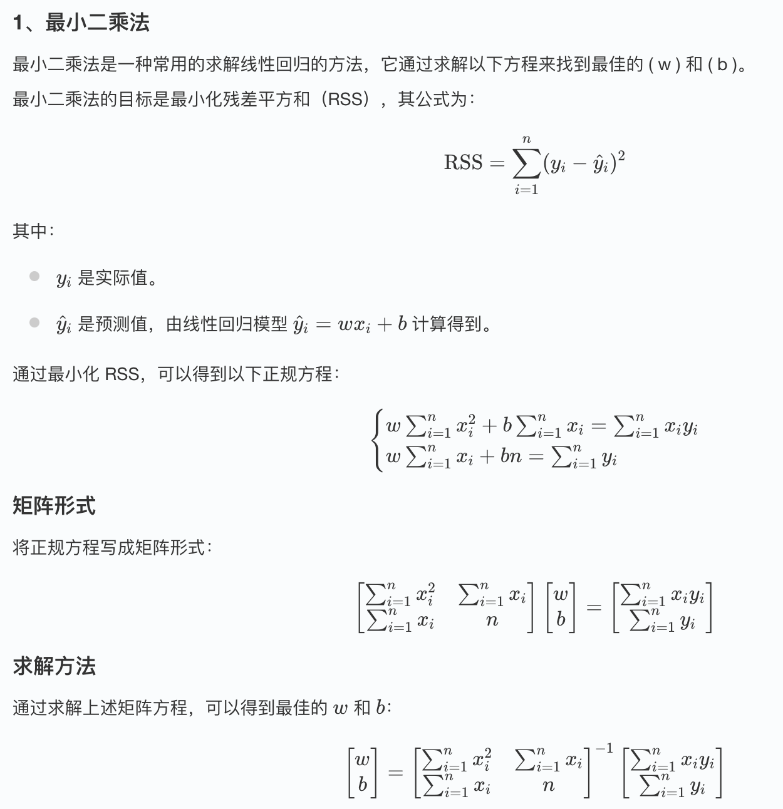
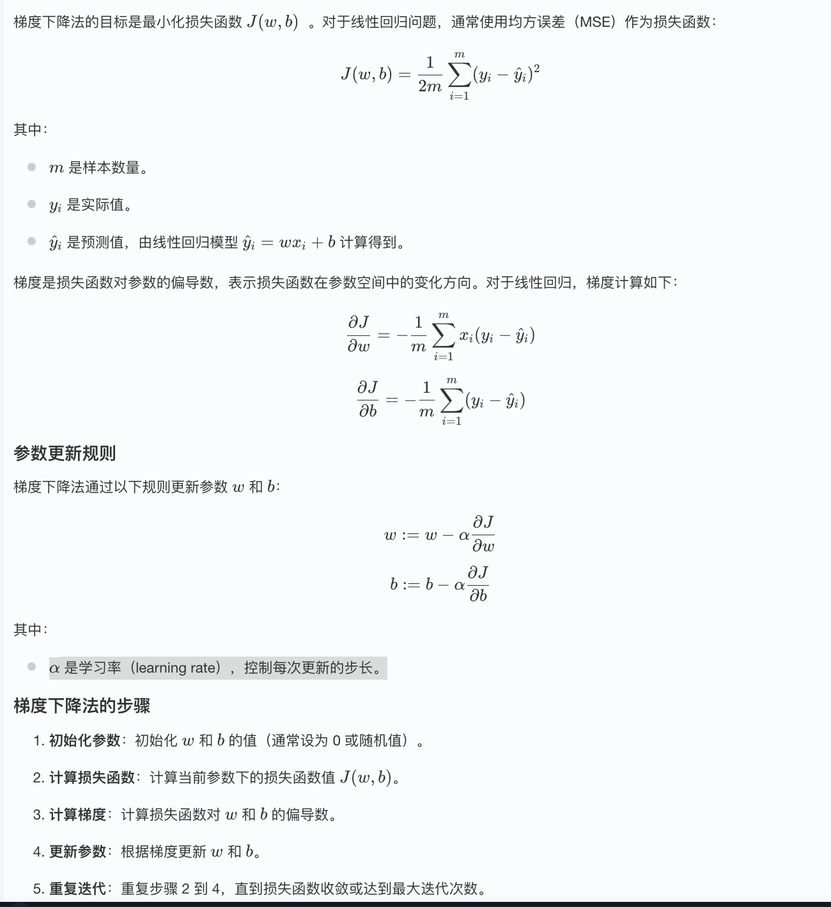
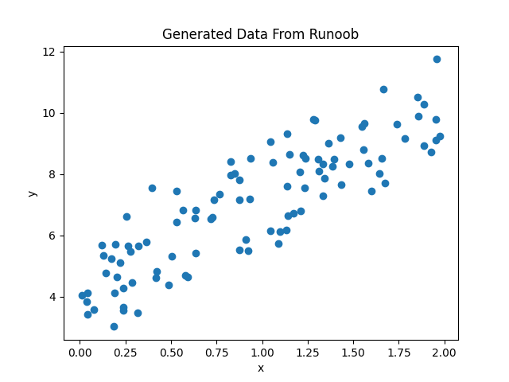
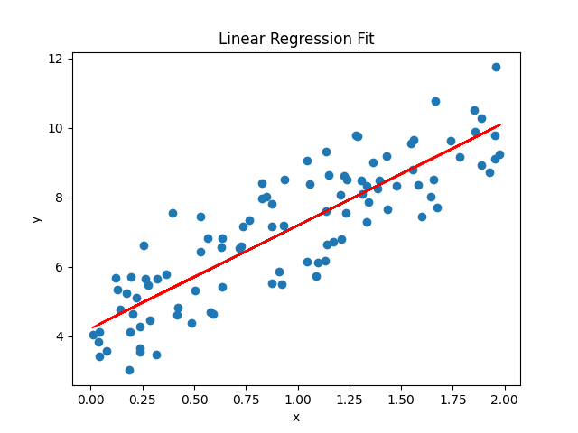
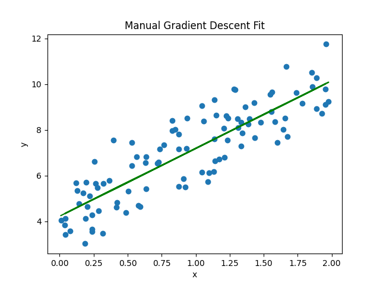

## 线性回归 (Linear Regression)

线性回归（Linear Regression）是机器学习中最基础且广泛应用的算法之一。

线性回归 (Linear Regression) 是一种用于预测连续值的最基本的机器学习算法，它假设目标变量 y 和特征变量 x 之间存在线性关系，并试图找到一条最佳拟合直线来描述这种关系。
```
y = w * x + b
```
其中：
    y 是预测值
    x 是特征变量
    w 是权重 (斜率)
    b 是偏置 (截距)

线性回归的目标是找到最佳的w和b，使得预测值y与真实值之间的误差最小。常用的误差函数是均方误差 (MSE)：
```
MSE = 1/n * Σ(y_i - y_pred_i)^2
```
其中：
    y_i 是实际值。
    y_pred_i 是预测值。
    n 是数据点的数量。
我们的目标是通过调整 w 和 b ，使得 MSE 最小化。     


### 如何求解线性回归？
#### 1、最小二乘法



#### 2、梯度下降法




### 使用 Python 实现线性回归

下面我们通过一个简单的例子来演示如何使用 Python 实现线性回归。

#### 1、导入必要的库

实例
```python
import numpy as np
import matplotlib.pyplot as plt
from sklearn.linear_model import LinearRegression
```
#### 2、生成模拟数据
实例
```python
import numpy as np
import matplotlib.pyplot as plt
from sklearn.linear_model import LinearRegression

# 生成一些随机数据
np.random.seed(0)
x = 2 * np.random.rand(100, 1)
y = 4 + 3 * x + np.random.randn(100, 1)

# 可视化数据
plt.scatter(x, y)
plt.xlabel('x')
plt.ylabel('y')
plt.title('Generated Data From Runoob')
plt.show()
```

显示如下所示：



#### 3、使用 Scikit-learn 进行线性回归

实例
```python
import numpy as np
import matplotlib.pyplot as plt
from sklearn.linear_model import LinearRegression

# 生成一些随机数据
np.random.seed(0)
x = 2 * np.random.rand(100, 1)
y = 4 + 3 * x + np.random.randn(100, 1)

# 创建线性回归模型
model = LinearRegression()

# 拟合模型
model.fit(x, y)

# 输出模型的参数
print(f"斜率 (w): {model.coef_[0][0]}")
print(f"截距 (b): {model.intercept_[0]}")

# 预测
y_pred = model.predict(x)

# 可视化拟合结果
plt.scatter(x, y)
plt.plot(x, y_pred, color='red')
plt.xlabel('x')
plt.ylabel('y')
plt.title('Linear Regression Fit')
plt.show()
```
输出结果：
```
斜率 (w): 2.968467510701019
截距 (b): 4.222151077447231
```
显示如下所示：



我们可以使用 score() 方法来评估模型性能，返回 R^2 值。

实例
```python

import numpy as np
from sklearn.linear_model import LinearRegression

# 生成一些随机数据
np.random.seed(0)
x = 2 * np.random.rand(100, 1)
y = 4 + 3 * x + np.random.randn(100, 1)

# 创建线性回归模型
model = LinearRegression()

# 拟合模型
model.fit(x, y)
# 计算模型得分
score = model.score(x, y)
print("模型得分:", score)

```

输出结果为：
```
模型得分: 0.7469629925504755
```

#### 4、手动实现梯度下降法


实例
```python
import numpy as np
import matplotlib.pyplot as plt
from sklearn.linear_model import LinearRegression

# 生成一些随机数据
np.random.seed(0)
x = 2 * np.random.rand(100, 1)
y = 4 + 3 * x + np.random.randn(100, 1)

# 初始化参数
w = 0
b = 0
learning_rate = 0.1
n_iterations = 1000

# 梯度下降
for i in range(n_iterations):
    y_pred = w * x + b
    dw = -(2/len(x)) * np.sum(x * (y - y_pred))
    db = -(2/len(x)) * np.sum(y - y_pred)
    w = w - learning_rate * dw
    b = b - learning_rate * db

# 输出最终参数
print(f"手动实现的斜率 (w): {w}")
print(f"手动实现的截距 (b): {b}")

# 可视化手动实现的拟合结果
y_pred_manual = w * x + b
plt.scatter(x, y)
plt.plot(x, y_pred_manual, color='green')
plt.xlabel('x')
plt.ylabel('y')
plt.title('Manual Gradient Descent Fit')
plt.show()
```
输出结果：
```
手动实现的斜率 (w): 2.968467510701028
手动实现的截距 (b): 4.222151077447219
```
显示如下所示：


