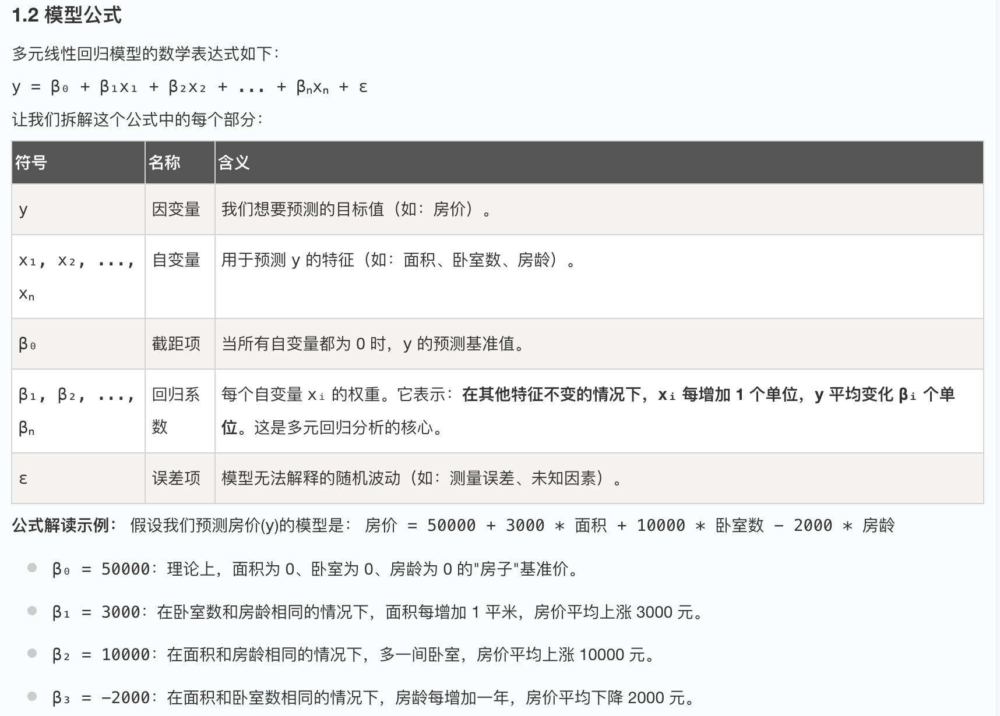
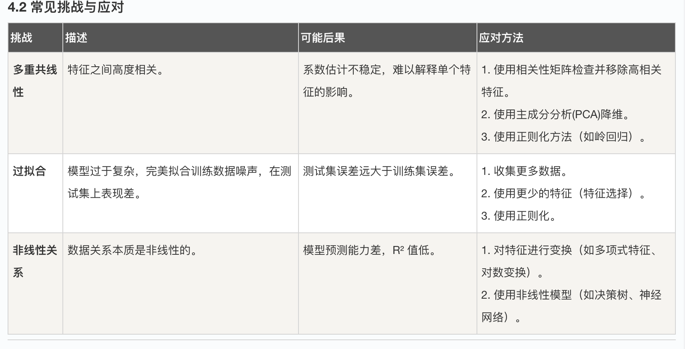

## 多元线性回归

在上一篇文章中，我们探讨了简单线性回归，它帮助我们理解了一个特征（自变量）如何影响一个目标（因变量）。然而，现实世界中的问题往往更加复杂。例如，预测房价时，我们不能只看房屋面积，还需要考虑卧室数量、地理位置、房龄等多个因素。这时，我们就需要 多元线性回归。

简单来说，多元线性回归是简单线性回归的自然延伸，它允许我们同时分析多个自变量对一个因变量的影响。本文将带你从零开始，全面理解多元线性回归的核心概念、数学原理、实现方法以及实际应用。

### 一、 什么是多元线性回归？
1.1 核心概念
多元线性回归是一种用于建立多个自变量（也叫特征、解释变量）与一个连续型因变量（也叫目标、响应变量）之间线性关系的统计方法。

一个生动的比喻： 想象你是一位大厨，正在调试一道汤的味道（目标）。简单线性回归就像你只通过加盐量来调整咸淡。而多元线性回归则像你同时控制盐、糖、辣椒、酱油等多种调料（特征）的用量，来综合决定汤的最终口味。多元回归让你能分析每种调料对味道的具体贡献。

1.2 模型公式


### 二、 如何"训练"一个多元线性回归模型？
"训练"模型，本质上是根据我们已有的数据，找到一组最优的回归系数 (β₀, β₁, ..., βₙ)，使得模型的预测值尽可能接近真实值。这个过程通常通过 最小二乘法 来完成。
#### 2.1 目标：最小化损失函数
我们使用 *残差平方和* 作为损失函数，来衡量模型的预测误差。 RSS = Σ(yᵢ - ŷᵢ)² 其中，yᵢ 是第 i 个真实值，ŷᵢ 是模型对第 i 个样本的预测值。
*训练目标就是找到一组系数，使得 RSS 的值达到最小。*

#### 2.2 求解过程（矩阵形式）
当特征数量很多时，使用矩阵运算能更高效地表示和求解。模型可以写成： Y = Xβ + ε 其中：
* Y 是包含所有目标值的列向量。
* X 是设计矩阵，第一列通常全为 1（对应截距项 β₀），后续每一列对应一个特征。
* β 是包含所有回归系数的列向量。
* ε 是误差项向量。
通过最小二乘法推导，可以得到系数 β 的最优解（闭合解）为： β = (XᵀX)⁻¹XᵀY 这个公式在理论上非常完美，但在实际编程中，我们通常使用数值优化库（如 scikit-learn）来高效、稳定地计算，它会自动处理矩阵求逆等复杂操作。

### 三、 使用 Python 实现多元线性回归
让我们通过一个完整的例子，使用流行的机器学习库 scikit-learn 来构建一个多元线性回归模型。
#### 3.1 环境准备与数据加载
首先，确保安装了必要的库，并加载一个示例数据集。
实例
```python
# 导入必要的库
import numpy as np
import pandas as pd
import matplotlib.pyplot as plt
from sklearn.model_selection import train_test_split
from sklearn.linear_model import LinearRegression
from sklearn.metrics import mean_squared_error, r2_score
from sklearn.datasets import fetch_california_housing # 一个经典的多变量数据集

# 加载加州房价数据集
california = fetch_california_housing()
df = pd.DataFrame(california.data, columns=california.feature_names)
df['MedHouseVal'] = california.target # 添加目标列：房屋中位数价格

print("数据集形状:", df.shape)
print("\n前5行数据:")
print(df.head())
print("\n特征说明:")
print(california.DESCR[:500]) # 打印部分描述
```
#### 3.2 数据探索与预处理
在建模前，了解数据的基本情况至关重要。
实例
```python
# 1. 查看数据基本信息
print(df.info())
print("\n基本统计描述:")
print(df.describe())

# 2. 划分特征(X)和目标(y)
X = df.drop('MedHouseVal', axis=1) # 特征矩阵：包含除房价外的所有列
y = df['MedHouseVal'] # 目标向量：房价

# 3. 划分训练集和测试集（70%训练，30%测试）
X_train, X_test, y_train, y_test = train_test_split(X, y, test_size=0.3, random_state=42)
print(f"\n训练集样本数: {X_train.shape[0]}, 测试集样本数: {X_test.shape[0]}")
```

#### 3.3 创建、训练与评估模型
现在，我们创建线性回归模型，用训练数据"拟合"它，并在测试集上评估其性能。

实例
```python
# 1. 创建模型实例
model = LinearRegression()

# 2. 训练模型（拟合数据）
model.fit(X_train, y_train)

# 3. 使用训练好的模型进行预测
y_train_pred = model.predict(X_train)
y_test_pred = model.predict(X_test)

# 4. 评估模型性能
# 均方误差 (MSE) - 越小越好
train_mse = mean_squared_error(y_train, y_train_pred)
test_mse = mean_squared_error(y_test, y_test_pred)

# 决定系数 (R²) - 越接近1越好，表示模型解释力越强
train_r2 = r2_score(y_train, y_train_pred)
test_r2 = r2_score(y_test, y_test_pred)

print("=== 模型性能评估 ===")
print(f"训练集 MSE: {train_mse:.4f}, R²: {train_r2:.4f}")
print(f"测试集 MSE: {test_mse:.4f}, R²: {test_r2:.4f}")

# 5. 查看学到的模型参数
print("\n=== 模型参数 ===")
print(f"截距 (β₀): {model.intercept_:.4f}")
print("回归系数 (β₁, β₂, ...):")
for feature, coef in zip(X.columns, model.coef_):
    print(f"  {feature}: {coef:.4f}")

```


#### 3.4 解读结果与可视化
理解系数和评估指标的含义。

实例
```python

# 可视化：真实值 vs 预测值 (测试集)
plt.figure(figsize=(8, 6))
plt.scatter(y_test, y_test_pred, alpha=0.5)
plt.plot([y.min(), y.max()], [y.min(), y.max()], 'r--', lw=2) # 绘制理想对角线
plt.xlabel('真实房价')
plt.ylabel('预测房价')
plt.title('多元线性回归：真实值 vs 预测值（测试集）')
plt.grid(True, linestyle='--', alpha=0.7)
plt.show()

# 可视化：特征重要性（通过系数绝对值大小近似表示）
features = X.columns
coefs = model.coef_
plt.figure(figsize=(10, 6))
bars = plt.barh(features, np.abs(coefs)) # 使用绝对值比较影响大小
plt.xlabel('回归系数绝对值')
plt.title('特征对房价的影响大小（基于系数绝对值）')
# 为条形图添加数值标签
for bar, coef in zip(bars, coefs):
    width = bar.get_width()
    plt.text(width + 0.01, bar.get_y() + bar.get_height()/2, f'{coef:.4f}', va='center')
plt.grid(True, axis='x', linestyle='--', alpha=0.7)
plt.tight_layout()
plt.show()

```


### 四、 多元线性回归的注意事项与挑战
#### 4.1 关键假设
线性回归模型的有效性建立在几个统计假设之上：

线性关系：自变量与因变量之间存在线性关系。
独立性：观测值之间相互独立。
同方差性：误差项的方差在所有观测中保持恒定。
正态性：误差项服从正态分布。
无多重共线性：自变量之间不应存在高度相关性。

#### 4.2 常见挑战与应对


### 五、 动手练习：巩固你的理解
现在，轮到你动手实践了！请按顺序完成以下练习，以巩固对多元线性回归的理解。

#### 练习 1：模型解读
使用上面代码输出的模型系数，回答以下问题：
    哪个特征对加州房价的正向影响最大？（根据系数值判断）
    哪个特征对加州房价有负向影响？
    如何解释 AveRooms（平均房间数）的系数？请用一句完整的话描述。

#### 练习 2：诊断多重共线性
    计算特征 X 的相关性矩阵（df.corr()）。
    找出相关性绝对值大于 0.7 的特征对。它们可能存在多重共线性。
    （选做）尝试从模型中移除其中一个高相关特征，重新训练，观察系数和 R² 分数如何变化。
#### 练习 3：尝试新数据集
    从 sklearn.datasets 中加载另一个回归数据集，如 load_diabetes（糖尿病数据集）。
    重复本文中的建模步骤：数据探索、划分、训练、评估、可视化。
    对比两个数据集上模型的性能，思考可能的原因。