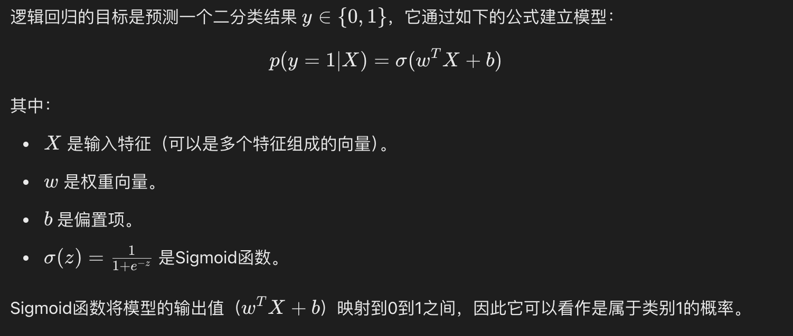
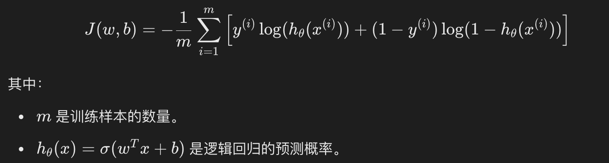
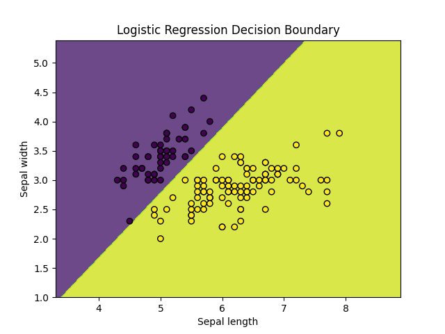

## 逻辑回归（Logistic Regression）
逻辑回归（Logistic Regression）是一种广泛应用于分类问题的统计学习方法，尽管名字中带有"回归"，但它实际上是一种用于二分类或多分类问题的算法。

逻辑回归通过使用逻辑函数（也称为 Sigmoid 函数）将线性回归的输出映射到 0 和 1 之间，从而预测某个事件发生的概率。

逻辑回归广泛应用于各种分类问题，例如：

垃圾邮件检测（是垃圾邮件/不是垃圾邮件）
疾病预测（患病/不患病）
客户流失预测（流失/不流失）
#### 逻辑回归模型

#### 损失函数
逻辑回归的损失函数是对数损失函数（Log Loss），其形式如下：



#### 梯度下降法求解
和线性回归一样，逻辑回归通常也使用梯度下降法来优化损失函数，求解参数 w 和 b。逻辑回归的梯度更新规则如下：
通过不断更新 w 和 b，直到损失函数收敛。

## 使用 Python 实现逻辑回归
接下来，我们将使用 Python 和 Scikit-learn 库来实现一个简单的逻辑回归模型。
#### 1、导入必要的库
1、导入必要的库
实例
```python
import numpy as np
import matplotlib.pyplot as plt
from sklearn.datasets import load_iris
from sklearn.model_selection import train_test_split
from sklearn.linear_model import LogisticRegression
from sklearn.metrics import accuracy_score, confusion_matrix, classification_report
```

#### 2、加载数据集
2、加载数据集
我们将使用 Scikit-learn 自带的 Iris 数据集。Iris 数据集包含 150 个样本，每个样本有 4 个特征，目标是将样本分为 3 类。为了简化问题，我们只使用前两个特征，并将问题转化为二分类问题。

实例
```python
# 加载数据集
iris = load_iris()
X = iris.data[:, :2]  # 只使用前两个特征
y = (iris.target != 0) * 1  # 将目标转化为二分类问题

# 划分训练集和测试集
X_train, X_test, y_train, y_test = train_test_split(X, y, test_size=0.3, random_state=42)
```

#### 3、训练逻辑回归模型
实例
```python
# 创建逻辑回归模型
model = LogisticRegression()

# 训练模型
model.fit(X_train, y_train)
```
#### 4、模型评估
```python
import numpy as np
import matplotlib.pyplot as plt
from sklearn.datasets import load_iris
from sklearn.model_selection import train_test_split
from sklearn.linear_model import LogisticRegression
from sklearn.metrics import accuracy_score, confusion_matrix, classification_report

# 加载数据集
iris = load_iris()
X = iris.data[:, :2]  # 只使用前两个特征
y = (iris.target != 0) * 1  # 将目标转化为二分类问题

# 划分训练集和测试集
X_train, X_test, y_train, y_test = train_test_split(X, y, test_size=0.3, random_state=42)


# 创建逻辑回归模型
model = LogisticRegression()

# 训练模型
model.fit(X_train, y_train)

# 预测测试集
y_pred = model.predict(X_test)

# 计算准确率
accuracy = accuracy_score(y_test, y_pred)
print(f"模型准确率: {accuracy:.2f}")

# 混淆矩阵
conf_matrix = confusion_matrix(y_test, y_pred)
print("混淆矩阵:")
print(conf_matrix)

# 分类报告
class_report = classification_report(y_test, y_pred)
print("分类报告:")
print(class_report)
```

输出结果为：
```
模型准确率: 1.00
混淆矩阵:
[[19  0]
 [ 0 26]]
分类报告:
              precision    recall  f1-score   support

           0       1.00      1.00      1.00        19
           1       1.00      1.00      1.00        26

    accuracy                           1.00        45
   macro avg       1.00      1.00      1.00        45
weighted avg       1.00      1.00      1.00        45
```

#### 5、可视化决策边界
```python
实例
import numpy as np
import matplotlib.pyplot as plt
from sklearn.datasets import load_iris
from sklearn.model_selection import train_test_split
from sklearn.linear_model import LogisticRegression
from sklearn.metrics import accuracy_score, confusion_matrix, classification_report

# 加载数据集
iris = load_iris()
X = iris.data[:, :2]  # 只使用前两个特征
y = (iris.target != 0) * 1  # 将目标转化为二分类问题

# 划分训练集和测试集
X_train, X_test, y_train, y_test = train_test_split(X, y, test_size=0.3, random_state=42)


# 创建逻辑回归模型
model = LogisticRegression()

# 训练模型
model.fit(X_train, y_train)

# 预测测试集
y_pred = model.predict(X_test)

# 可视化决策边界
x_min, x_max = X[:, 0].min() - 1, X[:, 0].max() + 1
y_min, y_max = X[:, 1].min() - 1, X[:, 1].max() + 1
xx, yy = np.meshgrid(np.arange(x_min, x_max, 0.01),
                     np.arange(y_min, y_max, 0.01))

Z = model.predict(np.c_[xx.ravel(), yy.ravel()])
Z = Z.reshape(xx.shape)

plt.contourf(xx, yy, Z, alpha=0.8)
plt.scatter(X[:, 0], X[:, 1], c=y, edgecolors='k', marker='o')
plt.xlabel('Sepal length')
plt.ylabel('Sepal width')
plt.title('Logistic Regression Decision Boundary')
plt.show()
```

显示如下：


#### 总结
* 逻辑回归通过使用Sigmoid函数将线性回归的输出转换为概率值，用于解决二分类问题。
* 逻辑回归的训练过程通过最小化对数损失函数来优化模型参数。
* 梯度下降法是常用的优化方法，用来更新模型参数 w 和 b
* Python中的scikit-learn库提供了简单易用的接口来实现逻辑回归，并且能够轻松地进行模型训练、评估和可视化。
