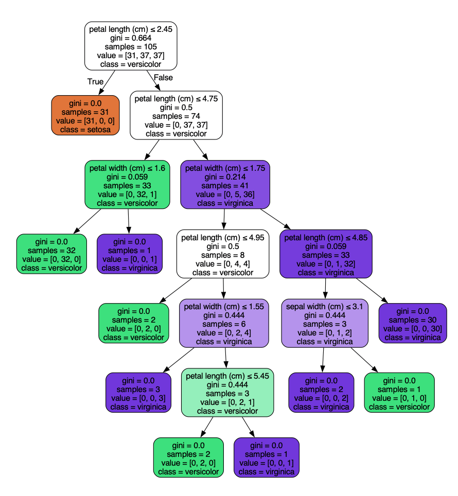

## 决策树（Decision Tree）

决策树（Decision Tree）是一种常用的机器学习算法，广泛应用于分类和回归问题。
决策树通过树状结构来表示决策过程，每个内部节点代表一个特征或属性的测试，每个分支代表测试的结果，每个叶节点代表一个类别或值。

### 决策树的基本概念
 * 节点（Node）：树中的每个点称为节点。根节点是树的起点，内部节点是决策点，叶节点是最终的决策结果。
 * 分支（Branch）：从一个节点到另一个节点的路径称为分支。
 * 分裂（Split）：根据某个特征将数据集分成多个子集的过程。
 * 纯度（Purity）：衡量一个子集中样本的类别是否一致。纯度越高，说明子集中的样本越相似。

### 决策树的工作原理
决策树通过递归地将数据集分割成更小的子集来构建树结构。具体步骤如下：
    1 选择最佳特征：根据某种标准（如信息增益、基尼指数等）选择最佳特征进行分割。
    2 分割数据集：根据选定的特征将数据集分成多个子集。
    3 递归构建子树：对每个子集重复上述过程，直到满足停止条件（如所有样本属于同一类别、达到最大深度等）。
    4 生成叶节点：当满足停止条件时，生成叶节点并赋予类别或值。

### 决策树的构建标准
在构建决策树时，我们需要选择最佳特征进行分割，常用的标准有：
1. 信息增益（Information Gain）

   
   其中 Entropy 是数据集的熵，用来衡量数据的不确定性。

2. 基尼指数（Gini Index）

其中 pi 是类别 i 的样本占比。基尼指数越小，表示数据集越纯净。

3. 均方误差（MSE）
用于回归问题，衡量预测值和真实值的差异。
MSE 越小，表示回归树的预测效果越好。

### 决策树的优缺点

#### 优点
* 易于理解和解释：决策树的结构直观，易于理解和解释。
* 处理多种数据类型：可以处理数值型和类别型数据。
* 不需要数据标准化：决策树不需要对数据进行标准化或归一化处理。
#### 缺点
* 容易过拟合：决策树容易过拟合，特别是在数据集较小或树深度较大时。
* 对噪声敏感：决策树对噪声数据较为敏感，可能导致模型性能下降。
* 不稳定：数据的小变化可能导致生成完全不同的树。

### 使用Python实现决策树
接下来，我们将使用Python的scikit-learn库来实现一个简单的决策树分类器。
首先，确保你已经安装了scikit-learn库。如果没有安装，可以使用以下命令进行安装：
#### 1. 安装必要的库
首先，确保你已经安装了scikit-learn库。如果没有安装，可以使用以下命令进行安装：
```python
    pip install scikit-learn
```

#### 2. 导入库并加载数据集
我们将使用scikit-learn自带的鸢尾花（Iris）数据集来演示决策树的使用。
实例
```python
    from sklearn.datasets import load_iris
    from sklearn.model_selection import train_test_split
    from sklearn.tree import DecisionTreeClassifier
    from sklearn.metrics import accuracy_score

    # 加载鸢尾花数据集
    iris = load_iris()
    X = iris.data
    y = iris.target

    # 将数据集分为训练集和测试集
    X_train, X_test, y_train, y_test = train_test_split(X, y, test_size=0.3, random_state=42)
```

#### 3. 训练决策树模型
接下来，我们使用DecisionTreeClassifier来训练决策树模型。
实例
```python
    # 创建决策树分类器
    clf = DecisionTreeClassifier()

    # 训练模型
    clf.fit(X_train, y_train)
```


#### 4. 预测与评估
使用训练好的模型对测试集进行预测，并评估模型的准确率。
实例
```python
# 对测试集进行预测
y_pred = clf.predict(X_test)

# 计算准确率
accuracy = accuracy_score(y_test, y_pred)
print(f"模型准确率: {accuracy:.2f}")
```
输出结果：
```
模型准确率: 1.00
```

#### 5. 可视化决策树

为了更直观地理解决策树的结构，我们可以使用graphviz库来可视化决策树。

graphviz 下载地址：https://graphviz.org/download/
    Windows 平台可以下载适用于 Windows 的安装包（.msi 文件）。
    Linux 平台可以使用安装包的命令安装，如 apt install graphviz
    macOS 平台安装命令 brew install graphviz。
也可以源码安装，下载最新的源码包（.tar.gz 文件）。
```bash
tar -zxvf graphviz-<version>.tar.gz
cd graphviz-<version>
./configure
make
sudo make install
```
安装完成后，可以通过以下命令验证 Graphviz 是否安装成功：
```bash
    dot -V
```
输出类似以下内容，说明安装成功：
```bash
    dot - graphviz version 12.2.1 (20241206.2353)
```
安装 graphviz 库：

实例
```bash
pip install graphviz
```
然后，使用以下代码生成决策树的可视化图：

实例
```python
from sklearn.datasets import load_iris
from sklearn.model_selection import train_test_split
from sklearn.tree import DecisionTreeClassifier
from sklearn.metrics import accuracy_score
from sklearn.tree import export_graphviz
import graphviz


# 加载鸢尾花数据集
iris = load_iris()
X = iris.data
y = iris.target

# 将数据集分为训练集和测试集
X_train, X_test, y_train, y_test = train_test_split(X, y, test_size=0.3, random_state=42)

# 创建决策树分类器
clf = DecisionTreeClassifier()

# 训练模型
clf.fit(X_train, y_train)

# 对测试集进行预测
y_pred = clf.predict(X_test)

# 计算准确率
accuracy = accuracy_score(y_test, y_pred)
print(f"模型准确率: {accuracy:.2f}")

# 导出决策树为dot文件
dot_data = export_graphviz(clf, out_file=None, 
                           feature_names=iris.feature_names,  
                           class_names=iris.target_names,  
                           filled=True, rounded=True,  
                           special_characters=True)

# 使用graphviz渲染决策树
graph = graphviz.Source(dot_data)
graph.render("iris_decision_tree")  # 保存为PDF文件
graph.view()  # 在浏览器中查看
```

执行以上代码，会生成一个 iris_decision_tree.pdf 文件，显示如下：



