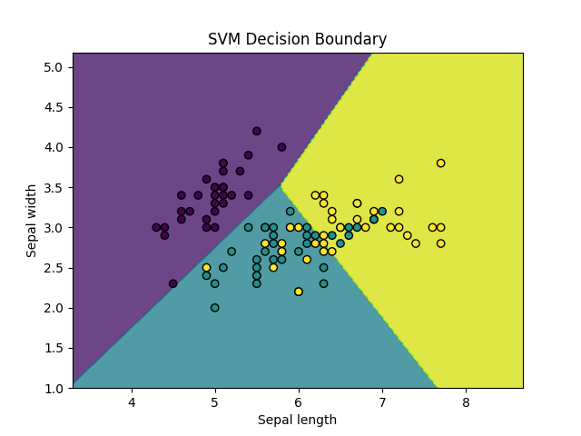

## 支持向量机
#### 超平面：
支持向量机（Support Vector Machine，简称 SVM）是一种监督学习算法，主要用于分类和回归问题。
SVM 的核心思想是找到一个最优的超平面，将不同类别的数据分开。这个超平面不仅要能够正确分类数据，还要使得两个类别之间的间隔（margin）最大化。
超平面：
    在二维空间中，超平面是一个直线。
    在三维空间中，超平面是一个平面。
    在更高维空间中，超平面是一个分割空间的超平面。

#### 支持向量：
    支持向量是离超平面最近的样本点。这些支持向量对于定义超平面至关重要。
    支持向量机通过最大化支持向量到超平面的距离（即最大化间隔）来选择最佳的超平面。

#### 最大间隔：
    SVM的目标是最大化分类间隔，使得分类边界尽可能远离两类数据点。这可以有效地减少模型的泛化误差。

#### 核技巧（Kernel Trick）：
    对于非线性可分的数据，SVM使用核函数将数据映射到更高维的空间，在这个空间中，数据可能是线性可分的。
    常用的核函数有：线性核、多项式核、径向基函数（RBF）核等。

### SVM 分类流程
    1 选择一个超平面：找到一个能够最大化分类边界的超平面。
    2 训练支持向量：通过支持向量机算法，选择离超平面最近的样本点作为支持向量。
    3 通过最大化间隔来找到最优超平面：选择一个最优超平面，使得间隔最大化。
    4 使用核函数处理非线性问题：通过核函数将数据映射到高维空间来解决非线性可分问题。


## 使用 Python 实现 SVM
接下来，我们将使用 Python 中的 scikit-learn 库来实现一个简单的 SVM 分类器。
### 1. 安装必要的库
首先，确保你已经安装了scikit-learn库。如果没有安装，可以使用以下命令进行安装：
```python
    pip install scikit-learn
```
### 2. 导入库
```python
    import numpy as np
    import matplotlib.pyplot as plt
    from sklearn import svm, datasets
    from sklearn.model_selection import train_test_split
    from sklearn.metrics import accuracy_score
```
### 3. 加载数据集
我们将使用scikit-learn自带的鸢尾花（Iris）数据集。
```python
    # 加载鸢尾花数据集
    iris = datasets.load_iris()
    X = iris.data[:, :2]  # 只使用前两个特征
    y = iris.target
```
### 4. 划分训练集和测试集
```python
    # 将数据集划分为训练集和测试集
    X_train, X_test, y_train, y_test = train_test_split(X, y, test_size=0.3, random_state=42)
```
### 5. 训练 SVM 模型
```python
    # 创建SVM分类器
    clf = svm.SVC(kernel='linear')  # 使用线性核函数

    # 训练模型
    clf.fit(X_train, y_train)
```
### 6. 预测与评估
```python
    # 在测试集上进行预测
    y_pred = clf.predict(X_test)

    # 计算准确率
    accuracy = accuracy_score(y_test, y_pred)
    print(f"模型准确率: {accuracy:.2f}")
```
### 7. 可视化结果
```python
import numpy as np
import matplotlib.pyplot as plt
from sklearn import svm, datasets
from sklearn.model_selection import train_test_split
from sklearn.metrics import accuracy_score

# 加载鸢尾花数据集
iris = datasets.load_iris()
X = iris.data[:, :2]  # 只使用前两个特征
y = iris.target

# 将数据集划分为训练集和测试集
X_train, X_test, y_train, y_test = train_test_split(X, y, test_size=0.3, random_state=42)

# 创建SVM分类器
clf = svm.SVC(kernel='linear')  # 使用线性核函数

# 训练模型
clf.fit(X_train, y_train)

# 在测试集上进行预测
y_pred = clf.predict(X_test)

# 计算准确率
accuracy = accuracy_score(y_test, y_pred)
print(f"模型准确率: {accuracy:.2f}")

# 绘制决策边界
def plot_decision_boundary(X, y, model):
    h = .02  # 网格步长
    x_min, x_max = X[:, 0].min() - 1, X[:, 0].max() + 1
    y_min, y_max = X[:, 1].min() - 1, X[:, 1].max() + 1
    xx, yy = np.meshgrid(np.arange(x_min, x_max, h),
                         np.arange(y_min, y_max, h))
    Z = model.predict(np.c_[xx.ravel(), yy.ravel()])
    Z = Z.reshape(xx.shape)
    plt.contourf(xx, yy, Z, alpha=0.8)
    plt.scatter(X[:, 0], X[:, 1], c=y, edgecolors='k', marker='o')
    plt.xlabel('Sepal length')
    plt.ylabel('Sepal width')
    plt.title('SVM Decision Boundary')
    plt.show()

plot_decision_boundary(X_train, y_train, clf)
```

执行以上代码，输出为：
```
模型准确率: 0.80
```
图片显示为：


