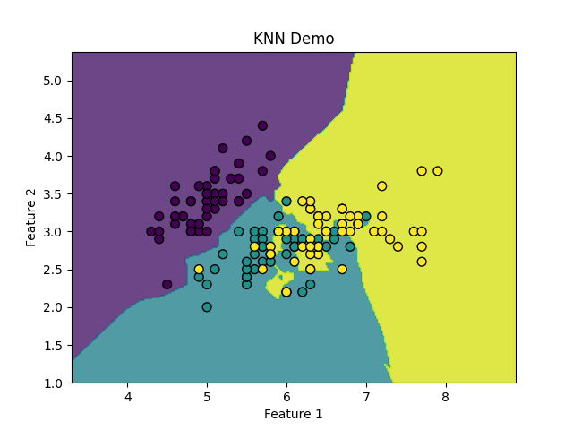
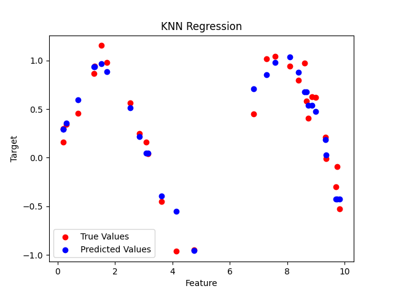

## K近邻算法
K 近邻算法（K-Nearest Neighbors，简称 KNN）是一种简单且常用的分类和回归算法。
    K 近邻算法属于监督学习的一种，核心思想是通过计算待分类样本与训练集中各个样本的距离，找到距离最近的 K 个样本，然后根据这 K 个样本的类别或值来预测待分类样本的类别或值。
#### KNN的基本原理
KNN 算法的基本原理可以概括为以下几个步骤：

    1 计算距离：计算待分类样本与训练集中每个样本的距离。常用的距离度量方法有欧氏距离、曼哈顿距离等。
    2 选择 K 个最近邻：根据计算出的距离，选择距离最近的 K 个样本。
    3 投票或平均：对于分类问题，K 个最近邻中出现次数最多的类别即为待分类样本的类别；对于回归问题，K 个最近邻的值的平均值即为待分类样本的值。
#### KNN的特点
    1 简单易理解：KNN 算法的原理非常简单，容易理解和实现。
    2 无需训练：KNN 是一种"懒惰学习"算法，不需要显式的训练过程，所有的计算都在预测时进行。
    3 对数据分布无假设：KNN 不对数据的分布做任何假设，适用于各种类型的数据。
    4 计算复杂度高：由于 KNN 需要在预测时计算所有样本的距离，当数据集较大时，计算复杂度会很高。
#### KNN算法的优缺点
##### 优点
    简单易用：KNN 算法的原理简单，易于理解和实现。
    无需训练：KNN 不需要显式的训练过程，所有的计算都在预测时进行。
    适用于多分类问题：KNN 可以轻松处理多分类问题。

##### 缺点
    计算复杂度高：KNN 需要在预测时计算所有样本的距离，当数据集较大时，计算复杂度会很高。
    对噪声敏感：KNN对噪声数据较为敏感，噪声数据可能会影响预测结果。
    需要选择合适的K值：K值的选择对模型的性能有很大影响，选择合适的 K 值是一个挑战。

#### KNN 算法的实现步骤

##### 1. 导入必要的库
首先，我们需要导入一些常用的 Python 库，如 numpy 用于数值计算，matplotlib 用于绘图，sklearn 用于加载数据集和评估模型。

实例
```python
import numpy as np
import matplotlib.pyplot as plt
from sklearn import datasets
from sklearn.model_selection import train_test_split
from sklearn.neighbors import KNeighborsClassifier
from sklearn.metrics import accuracy_score
```
##### 2. 加载数据集
我们使用 sklearn 中的 load_iris 函数加载经典的鸢尾花数据集。这个数据集包含 150 个样本，每个样本有 4 个特征，目标是将样本分为 3 类。

实例
```python
# 加载Iris数据集
iris = datasets.load_iris()
X = iris.data[:, :2]  # 只取前两个特征，便于可视化
y = iris.target
```

##### 3. 数据预处理
在应用 KNN 算法之前，通常需要对数据进行标准化处理，以确保每个特征对距离计算的贡献是相同的。

实例
```python
# 将数据集拆分为训练集和测试集
X_train, X_test, y_train, y_test = train_test_split(X, y, test_size=0.3, random_state=42)
```

##### 4. 训练 KNN 模型
接下来，我们使用 sklearn 中的 KNeighborsClassifier 来训练 KNN 模型。这里我们选择 K=3，即选择 3 个最近邻。

实例
```python
# 创建KNN模型，设置K值为3
knn = KNeighborsClassifier(n_neighbors=3)

# 训练模型
knn.fit(X_train, y_train)
```

##### 5. 预测与评估
使用训练好的模型对测试集进行预测，并计算模型的准确率。

实例
```python
   # 在测试集上进行预测
    y_pred = knn.predict(X_test)

    # 计算准确率
    accuracy = accuracy_score(y_test, y_pred)
    print(f"KNN模型的准确率: {accuracy:.4f}")
```
输出如下：

```python
KNN模型的准确率: 0.7556
```
##### 6. 可视化 KNN 分类结果
为了更直观地理解 KNN 的分类效果，我们可以绘制数据点以及决策边界。

这里我们将数据集的前两个特征作为输入特征。

实例
```python
import numpy as np
import matplotlib.pyplot as plt
from sklearn import datasets
from sklearn.model_selection import train_test_split
from sklearn.neighbors import KNeighborsClassifier
from sklearn.metrics import accuracy_score

# 加载Iris数据集
iris = datasets.load_iris()
X = iris.data[:, :2]  # 只取前两个特征，便于可视化
y = iris.target

# 将数据集拆分为训练集和测试集
X_train, X_test, y_train, y_test = train_test_split(X, y, test_size=0.3, random_state=42)

# 创建KNN模型，设置K值为3
knn = KNeighborsClassifier(n_neighbors=3)

# 训练模型
knn.fit(X_train, y_train)

# 在测试集上进行预测
y_pred = knn.predict(X_test)

# 计算准确率
accuracy = accuracy_score(y_test, y_pred)
print(f"KNN模型的准确率: {accuracy:.4f}")

# 绘制决策边界和数据点
h = .02  # 网格步长
x_min, x_max = X[:, 0].min() - 1, X[:, 0].max() + 1
y_min, y_max = X[:, 1].min() - 1, X[:, 1].max() + 1

# 创建一个二维网格，表示不同的样本空间
xx, yy = np.meshgrid(np.arange(x_min, x_max, h),
                     np.arange(y_min, y_max, h))

# 使用KNN模型预测网格中的每个点的类别
Z = knn.predict(np.c_[xx.ravel(), yy.ravel()])
Z = Z.reshape(xx.shape)

# 绘制决策边界
plt.contourf(xx, yy, Z, alpha=0.8)

# 绘制训练数据点
plt.scatter(X[:, 0], X[:, 1], c=y, edgecolors='k', marker='o', s=50)
plt.title("KNN Demo")
plt.xlabel("Feature 1")
plt.ylabel("Feature 2")
plt.show()
```
显示如下所示：



##### 7. 调整 K 值
K 值的选择对模型的性能有重要影响。

通常我们通过交叉验证或可视化方法选择最佳的 K 值。

实例
```python
# 尝试不同的K值并绘制准确率变化
k_range = range(1, 21)
accuracies = []

for k in k_range:
    knn = KNeighborsClassifier(n_neighbors=k)
    knn.fit(X_train, y_train)
    y_pred = knn.predict(X_test)
    accuracy = accuracy_score(y_test, y_pred)
    accuracies.append(accuracy)

# 绘制K值与准确率的关系
plt.plot(k_range, accuracies, marker='o')
plt.title("K值与准确率的关系")
plt.xlabel("K值")
plt.ylabel("准确率")
plt.show()
```


##### 8. 使用 KNN 进行回归任务
KNN 同样可以用于回归任务（KNN Regression）。

在回归任务中，KNN 根据 K 个最近邻的目标值进行平均来预测输出。

实例
```python
import numpy as np
import matplotlib.pyplot as plt
from sklearn.model_selection import train_test_split
from sklearn.neighbors import KNeighborsRegressor

# 生成示例数据
X = np.random.rand(100, 1) * 10
y = np.sin(X).ravel() + 0.1 * np.random.randn(100)

# 拆分为训练集和测试集
X_train, X_test, y_train, y_test = train_test_split(X, y, test_size=0.3, random_state=42)

# 创建KNN回归模型
knn_reg = KNeighborsRegressor(n_neighbors=5)

# 训练模型
knn_reg.fit(X_train, y_train)

# 在测试集上进行预测
y_pred = knn_reg.predict(X_test)

# 可视化回归结果
plt.scatter(X_test, y_test, color='red', label='True Values')
plt.scatter(X_test, y_pred, color='blue', label='Predicted Values')
plt.title("KNN Regression")
plt.xlabel("Feature")
plt.ylabel("Target")
plt.legend()
plt.show()
```

红色为真实值，蓝色为预测值：

