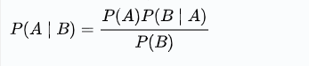
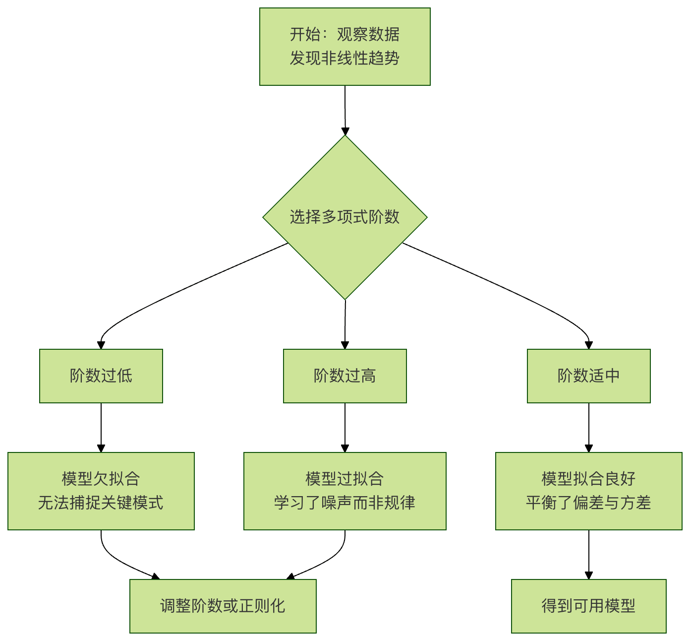
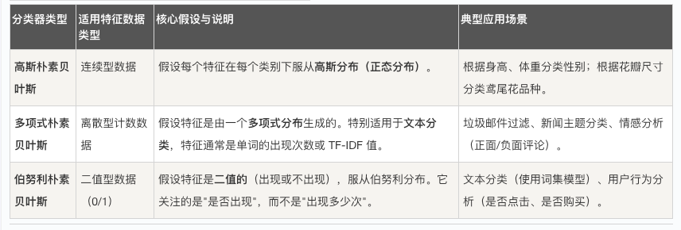

## 朴素贝叶斯

想象一下，你正在网上书店浏览，系统根据你之前购买过《三体》和《流浪地球》，向你推荐了《球状闪电》。这个猜你喜欢的功能背后，很可能就用到了我们今天要讲的 朴素贝叶斯（Naive Bayes） 算法。

朴素贝叶斯是一种基于 贝叶斯定理 的简单而高效的 概率分类算法。

朴素贝叶斯的核心思想是：通过已知的某些特征（比如你买过的书），来计算某个事件（比如你会喜欢另一本书）发生的概率，并选择概率最高的类别作为预测结果。

它的朴素（Naive）之处在于一个关键假设：所有特征之间是相互独立的。也就是说，在判断你是否喜欢《球状闪电》时，算法认为购买过《三体》和购买过《流浪地球》这两个特征对你的决策影响是互不相关的。虽然在现实中，特征之间常有联系，但这个简化的假设让计算变得非常高效，且在许多实际场景中（尤其是文本分类）效果出奇地好。

## 核心原理：贝叶斯定理
要理解朴素贝叶斯，必须先了解它的基石——贝叶斯定理。它描述了在已知一些条件的情况下，如何更新某个事件发生的概率。

### 1. 贝叶斯公式
公式看起来可能有点抽象，但我们用一个例子来理解它：


```
P(A|B) = [P(B|A) * P(A)] / P(B)
```
场景：判断一封邮件是否是垃圾邮件（Spam）。

* A： 邮件是"垃圾邮件"这个事件。
* B： 邮件中包含"免费"这个词这个特征。
* P(A)： 任意一封邮件是垃圾邮件的 先验概率（比如，根据历史数据，100封邮件里有20封是垃圾邮件，那么 P(垃圾邮件) = 0.2）。
* P(B|A)： 在已知邮件是垃圾邮件的情况下，其中出现"免费"这个词的 条件概率（比如，垃圾邮件中80%都包含"免费"，那么 P(免费|垃圾邮件) = 0.8）。
* P(B)： 任意一封邮件中出现"免费"这个词的 总概率（比如，所有邮件中都有"免费"这个词，那么 P(免费) = 0.5）。
* P(A|B)： 我们最终想求的，在 已知邮件包含"免费"这个词 的条件下，这封邮件是垃圾邮件的 后验概率。
贝叶斯定理的精髓：它利用了我们已经知道的信息（垃圾邮件的普遍规律 P(A) 和垃圾邮件用词习惯 P(B|A)），结合新观察到的证据（这封邮件里有"免费"），来修正我们对这个具体事件的判断（这封邮件是垃圾邮件的可能性 P(A|B)）。

### 2. "朴素"在哪里？
真正的贝叶斯分类器在计算 P(B|A) 时，需要考虑所有特征（B1， B2， B3...）的联合概率 P(B1， B2， B3... | A)，这非常复杂。

朴素贝叶斯做出了一个强大的简化假设：所有特征都相互条件独立。这意味着：


P(B1， B2， B3... | A) ≈ P(B1|A) * P(B2|A) * P(B3|A) * ...

这个假设将复杂的联合概率计算，简化成了多个简单概率的乘法，极大地降低了计算成本。


## 三、 工作流程与分类器类型
朴素贝叶斯分类器的工作流程可以概括为以下几步：


根据特征数据的不同类型，朴素贝叶斯主要有以下几种变体：


## 四、 动手实践：用 Python 实现垃圾邮件分类
让我们用一个简化的例子，亲手实现一个基于多项式朴素贝叶斯的垃圾邮件分类器。

### 1. 场景与数据准备
我们有一些已经标记好的邮件文本（spam 或 ham 正常邮件）。

实例
``` python
# 示例训练数据：每行是一条邮件内容，后面是标签（'spam' 或 'ham'）
train_data = [
    ("免费获取 iPhone 大奖！点击链接", "spam"),
    ("老板，下午三点开会，请准时参加", "ham"),
    ("恭喜您中奖了！立即领取您的奖金", "spam"),
    ("项目报告已发到您的邮箱，请查收", "ham"),
    ("限时特价，全场五折，仅限今天", "spam"),
    ("周末聚餐定在晚上七点，老地方", "ham")
]
```

2. 代码实现步骤
实例
```python
# 导入必要的库
from sklearn.feature_extraction.text import CountVectorizer
from sklearn.naive_bayes import MultinomialNB
from sklearn.pipeline import make_pipeline
import numpy as np

# 示例训练数据：每行是一条邮件内容，后面是标签（'spam' 或 'ham'）
train_data = [
    ("免费获取 iPhone 大奖！点击链接", "spam"),
    ("老板，下午三点开会，请准时参加", "ham"),
    ("恭喜您中奖了！立即领取您的奖金", "spam"),
    ("项目报告已发到您的邮箱，请查收", "ham"),
    ("限时特价，全场五折，仅限今天", "spam"),
    ("周末聚餐定在晚上七点，老地方", "ham")
]

# 1. 准备数据：将文本和标签分开
texts = [data[0] for data in train_data]  # 邮件文本列表
labels = [data[1] for data in train_data] # 对应标签列表

# 2. 创建并训练模型管道
model = make_pipeline(CountVectorizer(), MultinomialNB())
model.fit(texts, labels)

# 3. 准备新邮件进行预测
new_emails = [
    "免费领取优惠券，机会难得！",  # 预期为 spam
    "明天上午十点电话会议讨论预算"   # 预期为 ham
]

# 4. 进行预测
predictions = model.predict(new_emails)
prediction_proba = model.predict_proba(new_emails) # 获取预测概率

# 5. 输出结果（修复引号问题 + 动态匹配概率标签）
# 获取模型的类别顺序（避免硬编码索引）
class_names = model.classes_
for email, pred, proba in zip(new_emails, predictions, prediction_proba):
    # 修复引号嵌套问题：内层改用单引号，或外层用单引号
    print(f'邮件内容: "{email}"')
    print(f"  预测类别: {pred}")
    # 动态输出每个类别的概率（更健壮）
    for cls, prob in zip(class_names, proba):
        print(f"  属于'{cls}'的概率: {prob:.4f}")
    print("-" * 40)

```


3. 代码解析

数据分离：将训练数据中的文本和标签分别存入两个列表，这是 sklearn 库要求的格式。

构建模型管道：
   * CountVectorizer()：这是一个 文本特征提取器。它把每封邮件（一段文本）转换成一个数字向量。向量的每个位置代表一个词（如"免费"、"会议"），值代表这个词在该邮件中出现的次数。
   * MultinomialNB()：这就是我们的 多项式朴素贝叶斯分类器。它接收上一步产生的数字向量，并学习这些向量与标签（spam/ham）之间的概率关系。
   * make_pipeline() 将这两个步骤自动串联，训练时先转换再分类，预测时亦然。
    
模型训练：model.fit(texts, labels) 是核心训练过程。算法在这里计算了：
    先验概率 P(ham) 和 P(spam)。
    每个单词在 ham 和 spam 类别下的条件概率 P(单词 | ham) 和 P(单词 | spam)。
预测与输出：对于新邮件，模型先将其转换为特征向量，然后根据贝叶斯公式计算它属于每个类别的概率，最后输出概率更高的类别。

输出：
```python
  属于'ham'的概率: 0.5000
  属于'spam'的概率: 0.5000
----------------------------------------
邮件内容: "明天上午十点电话会议讨论预算"
  预测类别: ham
  属于'ham'的概率: 0.5000
  属于'spam'的概率: 0.5000
```

## 五、 优缺点与注意事项
优点
    简单高效：原理简单，训练和预测速度非常快，适合大规模数据集。
    对小规模数据表现好：即使训练数据不多，也能取得不错的效果。
    适合高维数据：特别擅长处理像文本这样特征维度（单词数）非常高的数据。
    对无关特征相对鲁棒：由于"朴素"的独立性假设，个别无关特征对整体结果影响较小。
缺点与注意事项
    "朴素"假设的局限性：现实中特征往往相关，这个强假设可能影响精度。例如，在文本中，"纽约"和"时报"经常一起出现，并非独立。
    概率估计的准确性：计算出的"概率"值更多是用于分类排序，其绝对数值可能并不完全准确。
    零概率问题：如果某个特征在训练集的某个类别中从未出现，那么它的条件概率为 0，会导致整个后验概率为 0。常用 拉普拉斯平滑（在 sklearn 中通过 alpha 参数设置）来解决，即给所有特征的计数加一个小的常数，避免零值。

六、 练习与挑战
为了巩固你对朴素贝叶斯的理解，请尝试以下练习：
    1. 修改练习：在上面的代码中，尝试添加更多训练数据，特别是包含"链接"、"会议"、"报告"等词的邮件，观察预测结果和概率的变化。
    2. 参数调优：查阅 sklearn 文档，了解 MultinomialNB 中的 alpha 参数（平滑参数）。尝试将其设置为 0.1、0.5、1.0，看看对预测概率有什么影响。
    3. 更换分类器：将代码中的 MultinomialNB() 替换为 BernoulliNB()（伯努利朴素贝叶斯），注意 CountVectorizer 可能需要设置 binary=True 来生成二值特征。比较两者在简单示例上的表现。
    4. 实战挑战：使用 sklearn 自带的 fetch_20newsgroups 数据集（一个经典的新闻文本分类数据集），尝试用朴素贝叶斯来对不同主题的新闻进行分类。
    
    朴素贝叶斯作为入门机器学习的一个绝佳起点，它用简洁的数学公式展现了概率论的魅力，并以其实用性在文本分类、推荐系统、情感分析等领域牢牢占据一席之地。理解它，你就掌握了打开许多智能应用黑箱的第一把钥匙。