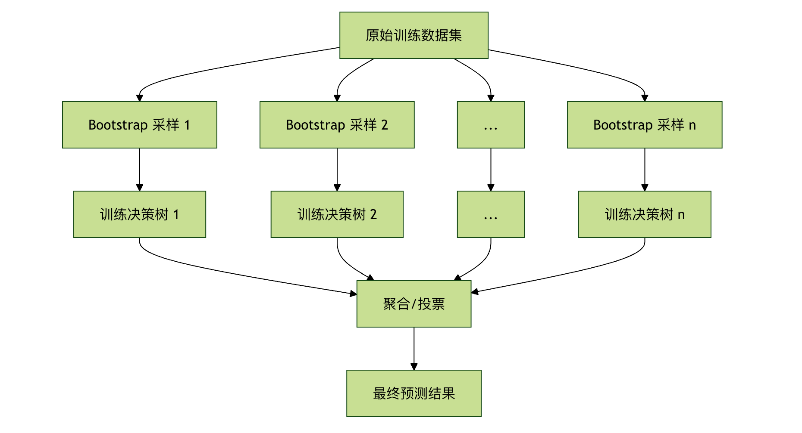
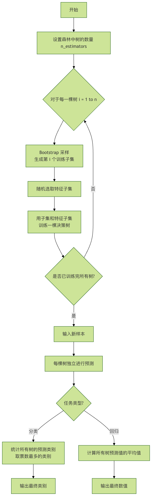
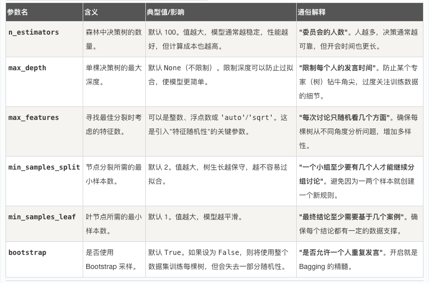
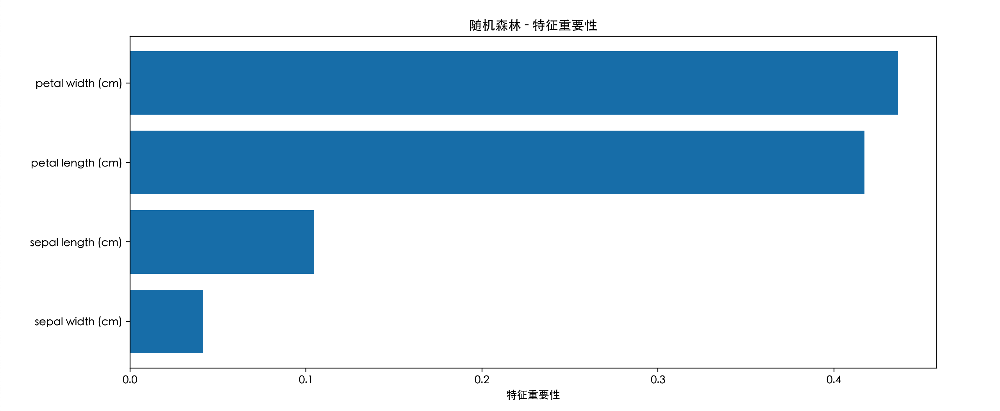

## 随机森林

想象一下，你正在参加一个重要的知识竞赛，面对一个难题，你是更相信一位顶尖专家的判断，还是更相信由 100 位水平不错的选手投票得出的结果？在大多数情况下，集体的智慧往往能弥补个人的偏见和局限，从而做出更稳定、更准确的决策。

在机器学习的世界里，随机森林（Random Forest） 正是这种集体智慧思想的杰出代表。它通过构建大量的决策树，并让它们共同投票来做出预测，从而成为最强大、最受欢迎的机器学习算法之一。

### 什么是随机森林？

随机森林 是一种基于集成学习（Ensemble Learning）的机器学习算法。它的核心思想非常简单：三个臭皮匠，顶个诸葛亮。
  * 森林： 指的是由多棵 决策树（Decision Tree） 组成的集合。
  * 随机： 指的是在构建每一棵决策树时，算法会引入两种随机性，确保每棵树都与众不同。
最终，对于分类任务，森林通过 投票（多数决） 给出结果；对于回归任务，则通过 取平均值 给出结果。

### 核心思想：Bagging 与随机性
随机森林的成功建立在两大基石之上：
#### Bagging（Bootstrap Aggregating）: 
    Bootstrap（自助采样）： 从原始训练数据集中有放回地随机抽取样本，生成多个不同的子训练集。这意味着同一个样本可能在一个子集中出现多次，而另一个样本可能一次都不出现。
    Aggregating（聚合）： 用每个子训练集独立训练一棵决策树，最后将所有树的结果聚合起来（投票或平均）。



#### 特征随机性：

在构建每棵树的每个节点进行分裂时，算法不会考虑所有的特征，而是从全部特征中随机选取一个子集，然后从这个子集中选择最优分裂特征。
这进一步增强了树与树之间的差异性，让森林看到问题的不同侧面。
简单来说，随机森林通过让每棵树在略有不同的数据和特征视角下进行训练，创造了一个多样化的专家委员会。 即使其中一些树犯了错误，其他正确的树也能通过投票将其纠正，从而获得比单棵决策树更稳定、更强大的性能。


### 算法流程与关键参数
#### 随机森林的工作步骤
让我们通过一个流程图来清晰地看透它的工作过程：


#### 关键超参数详解
在使用scikit-learn库时，理解以下几个核心参数至关重要：



### 实战演练 - 代码示例
让我们用一个经典的鸢尾花（Iris）分类数据集来实战一下。

####  示例 1：基础分类任务
实例
```python
# 导入必要的库
from sklearn.datasets import load_iris
from sklearn.model_selection import train_test_split
from sklearn.ensemble import RandomForestClassifier
from sklearn.metrics import accuracy_score, classification_report

# 1. 加载数据
iris = load_iris()
X = iris.data  # 特征：花萼长度、宽度，花瓣长度、宽度
y = iris.target # 标签：三种鸢尾花

# 2. 划分训练集和测试集
X_train, X_test, y_train, y_test = train_test_split(X, y, test_size=0.3, random_state=42)

# 3. 创建随机森林分类器
# 这里我们设置 100 棵树，并限制最大深度为 5
rf_clf = RandomForestClassifier(n_estimators=100, max_depth=5, random_state=42)

# 4. 训练模型
rf_clf.fit(X_train, y_train)

# 5. 在测试集上进行预测
y_pred = rf_clf.predict(X_test)

# 6. 评估模型性能
print("测试集准确率：", accuracy_score(y_test, y_pred))
print("\n分类报告：")
print(classification_report(y_test, y_pred, target_names=iris.target_names))
```

代码解析：

1. 导入库： RandomForestClassifier 是随机森林分类器。
2. 加载数据： 鸢尾花数据集有 150 个样本，4 个特征，3 个类别。
3. 数据划分： 将 70% 的数据用于训练，30% 用于测试，验证模型对新数据的泛化能力。
4. 实例化模型： random_state=42 确保每次运行结果可复现。
5. 训练模型： fit 方法会构建 100 棵决策树。
6. 预测与评估： 用训练好的森林对测试集预测，并计算准确率等指标。
输出：
```
      setosa       1.00      1.00      1.00        19
  versicolor       1.00      1.00      1.00        13
   virginica       1.00      1.00      1.00        13

    accuracy                           1.00        45
   macro avg       1.00      1.00      1.00        45
weighted avg       1.00      1.00      1.00        45

```

####  示例 2：查看特征重要性
示例 2：查看特征重要性
随机森林还有一个强大功能：评估每个特征对预测的贡献程度。

实例
```python
# 导入必要的库
from sklearn.datasets import load_iris
from sklearn.model_selection import train_test_split
from sklearn.ensemble import RandomForestClassifier
from sklearn.metrics import accuracy_score, classification_report

import pandas as pd
import matplotlib.pyplot as plt

# -------------------------- 设置中文字体 start --------------------------
plt.rcParams['font.sans-serif'] = [
    # Windows 优先
    'SimHei', 'Microsoft YaHei',
    # macOS 优先
    'PingFang SC', 'Heiti TC',
    # Linux 优先
    'WenQuanYi Micro Hei', 'DejaVu Sans'
]
# 修复负号显示为方块的问题
plt.rcParams['axes.unicode_minus'] = False
# -------------------------- 设置中文字体 end --------------------------

# 1. 加载数据
iris = load_iris()
X = iris.data  # 特征：花萼长度、宽度，花瓣长度、宽度
y = iris.target # 标签：三种鸢尾花

# 2. 划分训练集和测试集
X_train, X_test, y_train, y_test = train_test_split(X, y, test_size=0.3, random_state=42)

# 3. 创建随机森林分类器
# 这里我们设置 100 棵树，并限制最大深度为 5
rf_clf = RandomForestClassifier(n_estimators=100, max_depth=5, random_state=42)

# 4. 训练模型
rf_clf.fit(X_train, y_train)

# 5. 在测试集上进行预测
y_pred = rf_clf.predict(X_test)

# 6. 评估模型性能
print("测试集准确率：", accuracy_score(y_test, y_pred))
print("\n分类报告：")


# 获取特征重要性
feature_importances = rf_clf.feature_importances_
features = iris.feature_names

# 创建 DataFrame 便于查看
importance_df = pd.DataFrame({
    '特征': features,
    '重要性': feature_importances
}).sort_values('重要性', ascending=False)

print("特征重要性排序：")
print(importance_df)

# 可视化
plt.figure(figsize=(8, 5))
plt.barh(importance_df['特征'], importance_df['重要性'])
plt.xlabel('特征重要性')
plt.title('随机森林 - 特征重要性')
plt.gca().invert_yaxis() # 让最重要的特征显示在顶部
plt.show()
```



输出分析： 
    你可能会发现花瓣长度和花瓣宽度的重要性远高于花萼的尺寸。这非常符合植物学常识，花瓣特征确实是区分不同鸢尾花的关键。这个功能对于特征筛选和数据理解极具价值。


### 第四部分：优点、缺点与应用场景
### 优点
  高准确率： 集成学习通常能取得当前数据下顶尖的性能。
  抗过拟合能力强： 得益于 Bagging 和随机特征选择，即使不剪枝，也不容易过拟合。
  对数据要求友好： 能处理数值型和类别型特征，不需要特征缩放（如归一化）。
  提供特征重要性： 内置的特征评估是宝贵的副产品。
  并行化容易： 每棵树的训练是独立的，可以轻松并行加速。

### 缺点
  模型可解释性差： 成百上千棵树组成的"黑箱"，比单棵决策树难解释得多。
  训练和预测速度较慢： 树的数量多时，需要更多的计算资源和时间。
  内存占用大： 需要存储整个森林的所有树结构。

### 典型应用场景
  分类问题： 如垃圾邮件识别、疾病诊断、图像分类。
  回归问题： 如房价预测、销售额预测。
  特征选择： 利用其输出的特征重要性进行特征筛选。
  缺失值处理： 随机森林有较好的处理缺失值的天然能力。