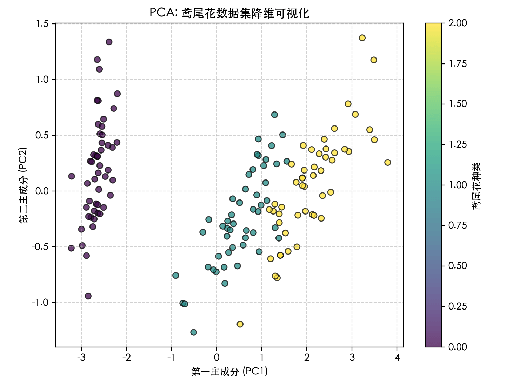

## 无监督学习 - 降维
想象一下，你是一位摄影师，正在整理一个包含数百万张高分辨率照片的图库。每张照片都由数百万个像素点（特征）组成。如果你想快速找到所有海边日落的照片，直接比较每张照片的每一个像素点几乎是不可能的，因为数据量太大、太"胖"了。

在机器学习中，我们常常面临类似的困境：数据集拥有成百上千个特征（维度）。这不仅会导致计算速度极慢（维度灾难），还可能因为许多特征是冗余或无关的，反而干扰我们找到数据中真正的规律。

降维（Dimensionality Reduction），就是无监督学习中的一种核心技术，它像一位数据健身教练，帮助我们将高维数据减肥到低维空间，同时尽可能保留最重要的信息。今天，我们就来深入浅出地学习降维。
### 降维的基本概念
#### 什么是降维？
    简单来说，降维就是减少数据集特征数量的过程。它通过某种数学变换，将原始高维空间中的数据点，映射到一个新的、维度更低的空间中。

#### 为什么要降维？
降维绝非简单地丢弃数据，其核心价值在于：

   1 可视化：人类最多能直观理解三维空间。通过降维到 2D 或 3D，我们可以将高维数据画出来，直观地观察其结构、分组和异常点。
   2 提升效率：更少的数据维度意味着更小的存储空间、更快的训练速度和更低的计算成本。
   3 去除噪声与冗余：许多算法（尤其是距离计算类算法如KNN）在高维空间中会因不相关或重复的特征而性能下降。降维可以提炼出数据的精华。
   4 缓解维度灾难：在高维空间中，数据会变得极其稀疏，导致许多机器学习模型难以找到有效的模式。

#### 核心思想：信息保留
降维的关键挑战是：如何在降低维度的同时，最大限度地保留原始数据中有价值的信息（如方差、数据结构）？ 不同的降维算法对此有不同的答案。

### 主流降维算法详解
降维算法主要分为两大类：线性降维 和 非线性降维。

#### 线性降维：主成分分析
主成分分析（PCA） 是最经典、最常用的线性降维方法。它的目标是为数据找到一组新的坐标轴（称为"主成分"），使得数据在这些新轴上的投影方差最大。

##### PCA 的工作原理（四步走）：
中心化：将每个特征减去其平均值，使数据分布的中心移动到坐标原点。
计算协方差矩阵：这个矩阵描述了数据各个特征之间的相关性。
特征值分解：计算协方差矩阵的特征值和特征向量。特征向量 指明了新坐标轴（主成分）的方向，特征值 则代表了数据在该方向上的方差大小。特征值越大，该方向包含的信息越多。
选择主成分：将特征值从大到小排序，选择前 k 个最大的特征值对应的特征向量，构成一个投影矩阵。
数据转换：将原始数据乘以这个投影矩阵，就得到了降维到 k 维的新数据。

实例
```python
# 导入必要的库
import numpy as np
import matplotlib.pyplot as plt
from sklearn.decomposition import PCA
from sklearn.datasets import load_iris

# -------------------------- 设置中文字体 start --------------------------
plt.rcParams['font.sans-serif'] = [
    # Windows 优先
    'SimHei', 'Microsoft YaHei',
    # macOS 优先
    'PingFang SC', 'Heiti TC',
    # Linux 优先
    'WenQuanYi Micro Hei', 'DejaVu Sans'
]
# 修复负号显示为方块的问题
plt.rcParams['axes.unicode_minus'] = False
# -------------------------- 设置中文字体 end --------------------------

# 1. 加载经典的鸢尾花数据集（4个特征）
iris = load_iris()
X = iris.data  # 原始数据：150个样本，4个特征
y = iris.target # 标签，用于可视化着色

print(f"原始数据形状: {X.shape}")  # 输出: (150, 4)

# 2. 创建PCA模型，指定降维到2维
pca = PCA(n_components=2)

# 3. 拟合模型（计算主成分）并转换数据
X_pca = pca.fit_transform(X)

print(f"降维后数据形状: {X_pca.shape}") # 输出: (150, 2)
print(f"各主成分解释的方差比例: {pca.explained_variance_ratio_}")
# 输出可能类似: [0.9246, 0.0530] 表示第一主成分保留了92.5%的信息，第二主成分保留了5.3%

# 4. 可视化降维结果
plt.figure(figsize=(8, 6))
scatter = plt.scatter(X_pca[:, 0], X_pca[:, 1], c=y, edgecolor='k', alpha=0.7)
plt.xlabel('第一主成分 (PC1)')
plt.ylabel('第二主成分 (PC2)')
plt.title('PCA: 鸢尾花数据集降维可视化')
plt.colorbar(scatter, label='鸢尾花种类')
plt.grid(True, linestyle='--', alpha=0.5)
plt.show()
```
代码解读：
* PCA(n_components=2)：初始化模型，n_components 参数指定要保留的主成分数量（即降维后的维度）。
* fit_transform(X)：这是一个组合方法，先计算数据的均值和主成分方向（fit），然后立即将数据转换到新空间（transform）。
* explained_variance_ratio_：这是PCA一个非常重要的属性，它告诉我们每个新特征（主成分）保留了原始数据多少的方差（信息量）。这帮助我们决定选择多少个主成分是合适的。



PCA 的优缺点
    优点：计算高效，原理清晰，能有效去除线性相关性。
    缺点：它是一种线性方法，假设数据的主成分是线性的。对于像"瑞士卷"这样的非线性流形数据，PCA效果不佳。

#### 非线性降维：t-SNE
当数据具有复杂的非线性结构时，我们需要非线性降维方法。t-分布随机邻域嵌入（t-SNE） 是当前最流行的可视化导向的非线性降维算法。

##### t-SNE的核心思想
t-SNE 专注于保留数据的局部结构。它试图让在高维空间中"相似"（距离近）的点，在低维映射中也"相似"；而高维中"不相似"的点，在低维中则远离。
实例
```python
# 导入必要的库
import numpy as np
import matplotlib.pyplot as plt
from sklearn.decomposition import PCA
from sklearn.manifold import TSNE
from sklearn.datasets import make_swiss_roll # 生成瑞士卷数据

# -------------------------- 设置中文字体 start --------------------------
plt.rcParams['font.sans-serif'] = [
    # Windows 优先
    'SimHei', 'Microsoft YaHei',
    # macOS 优先
    'PingFang SC', 'Heiti TC',
    # Linux 优先
    'WenQuanYi Micro Hei', 'DejaVu Sans'
]
# 修复负号显示为方块的问题
plt.rcParams['axes.unicode_minus'] = False
# -------------------------- 设置中文字体 end --------------------------

# 1. 生成一个非线性数据集：瑞士卷
X_swiss, color = make_swiss_roll(n_samples=1000, noise=0.1)
print(f"瑞士卷数据形状: {X_swiss.shape}") # (1000, 3)

# 2. 使用PCA（线性方法）尝试降维
pca = PCA(n_components=2)
X_swiss_pca = pca.fit_transform(X_swiss)

# 3. 使用t-SNE（非线性方法）降维
# perplexity（困惑度）是t-SNE的关键参数，通常介于5到50之间，表示对局部/全局结构的平衡关注
tsne = TSNE(n_components=2, perplexity=30, random_state=42)
X_swiss_tsne = tsne.fit_transform(X_swiss)

# 4. 对比可视化
fig, axes = plt.subplots(1, 2, figsize=(15, 6))

# PCA结果
axes[0].scatter(X_swiss_pca[:, 0], X_swiss_pca[:, 1], c=color, cmap='viridis')
axes[0].set_title('PCA降维结果')
axes[0].set_xlabel('PC1')
axes[0].set_ylabel('PC2')

# t-SNE结果
sc = axes[1].scatter(X_swiss_tsne[:, 0], X_swiss_tsne[:, 1], c=color, cmap='viridis')
axes[1].set_title('t-SNE降维结果 (perplexity=30)')
axes[1].set_xlabel('t-SNE 1')
axes[1].set_ylabel('t-SNE 2')

plt.colorbar(sc, ax=axes[1], label='瑞士卷的"高度"')
plt.tight_layout()
plt.show()
```
代码解读：
    perplexity 参数：可以理解为对每个点考虑多少个近邻。值小则更关注局部结构，值大则更关注全局结构。它是t-SNE最重要的调参对象。
    random_state：确保结果可复现，因为t-SNE的优化过程是随机的。
    从可视化结果可以清晰看到，PCA将瑞士卷"压扁"了，丢失了其非线性卷曲结构；而t-SNE则更好地在二维平面上展开了这个卷，保留了数据的局部邻接关系。


t-SNE的优缺点
优点：对复杂非线性数据的可视化效果极佳，能清晰展现聚类结构。
缺点：
    计算速度慢，不适合大数据集。
    结果具有随机性，每次运行可能略有不同。
    超参数敏感，perplexity 需要调整。
    主要用于可视化（2D/3D），降维后的特征通常不用于后续的机器学习任务，因为其低维空间的距离意义发生了变化。

### 如何选择降维方法与关键参数
算法选择流程图

关键参数指南
PCA: n_components

可以设为整数（如2），指定具体维度。
可以设为 0 < n < 1 的小数（如0.95），表示保留累计方差贡献率达到该阈值所需的最少主成分。
实例
```python
# 保留95%的方差信息
pca = PCA(n_components=0.95)
pca.fit(X)
print(f"为保留95%方差，需要 {pca.n_components_} 个主成分")
```

t-SNE: perplexity
    典型值在5到50之间。
    对于小数据集（<100样本），建议使用更小的值。
    最佳值通常接近数据中每个点的"近邻"数量。需要通过实验观察可视化效果来选择。

### 实践练习与总结
#### 动手练习：在MNIST手写数字数据集上应用降维
实例
```python
from sklearn.datasets import fetch_openml
from sklearn.preprocessing import StandardScaler

# 1. 加载MNIST数据集（只取部分样本以加快速度）
mnist = fetch_openml('mnist_784', version=1, as_frame=False)
X_mnist, y_mnist = mnist.data[:3000] / 255.0, mnist.target[:3000] # 归一化，取前3000个样本
print(f"MNIST数据形状: {X_mnist.shape}") # (3000, 784) -> 784维！

# 2. 先用PCA快速降到50维，去除大量噪声
pca = PCA(n_components=50)
X_mnist_pca = pca.fit_transform(X_mnist)
print(f"PCA后形状: {X_mnist_pca.shape}")

# 3. 再用t-SNE将50维数据降到2维进行可视化
tsne = TSNE(n_components=2, perplexity=40, n_iter=300, random_state=42)
X_mnist_tsne = tsne.fit_transform(X_mnist_pca)

# 4. 可视化
plt.figure(figsize=(10, 8))
scatter = plt.scatter(X_mnist_tsne[:, 0], X_mnist_tsne[:, 1],
                      c=y_mnist.astype(int), cmap='tab10', alpha=0.6, s=5)
plt.colorbar(scatter, ticks=range(10), label='手写数字')
plt.title('MNIST手写数字数据集经PCA预处理后的t-SNE可视化')
plt.xlabel('t-SNE 1')
plt.ylabel('t-SNE 2')
plt.grid(True, linestyle='--', alpha=0.3)
plt.show()
```
练习目标：观察不同数字（0-9）是否在二维平面上形成了清晰的簇。尝试修改 perplexity 参数（如改为10或50），看看可视化效果如何变化。

#### 总结与核心要点
降维的本质：是信息压缩与提炼，而非简单丢弃数据。目标是用更少的维度表达尽可能多的原始信息。

PCA（线性之王）：通过最大化方差寻找数据最主要的线性方向。高效、稳定，适合预处理和去除线性相关。
t-SNE（可视化利器）：通过保持数据点间的局部相似性来揭示非线性结构。效果惊艳，但计算慢、结果随机，主要用于探索性数据分析。

工作流程：
    明确目标：是为了可视化，还是为了给下游模型输入更精炼的特征？
    数据探索：先可视化部分数据，对其线性/非线性有个初步感觉。
    方法实验：根据目标和数据结构选择算法，并调整关键参数。
    评估结果：通过可视化、信息保留率或下游任务性能来评估降维效果。
降维是打开高维数据黑箱的一把关键钥匙。

掌握 PCA 和 t-SNE，你就能在面对复杂数据时，既能俯瞰全局结构，也能为后续的机器学习模型准备好精兵简政的特征，大大提升数据分析的效率和深度。