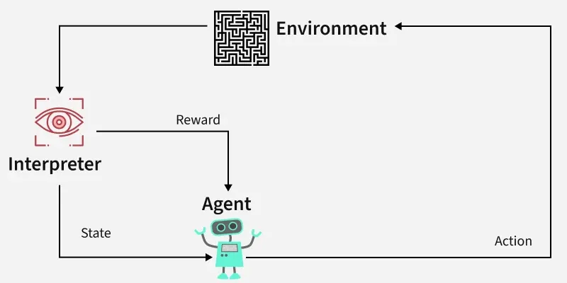
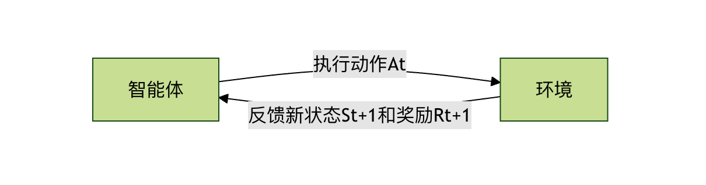
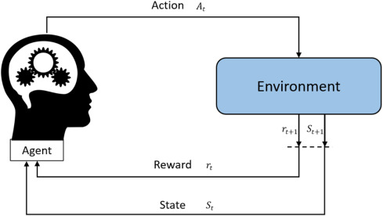
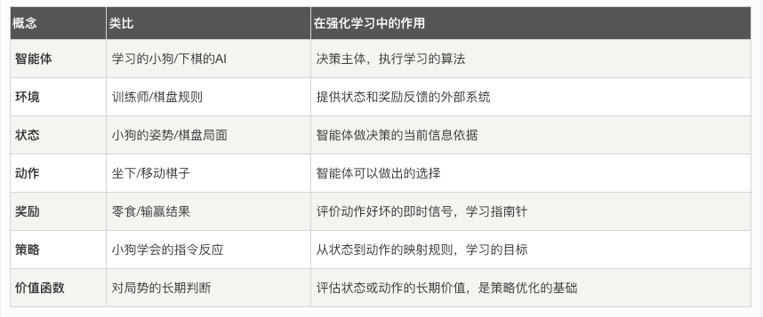

## 强化学习基本框架
想象一下，你正在教一只小狗学习坐下这个指令。你不会直接告诉它坐下这个动作的每一个肌肉该如何运动，而是会这样做：
  1  你发出坐下的口令。
  2  小狗尝试做出某个动作（可能是坐下，也可能是趴下或转圈）。
  3  如果它坐下了，你立刻给它一块零食作为奖励。
  4  如果它做错了，你就不给奖励，或者发出一个轻微的不对的信号。
  5  经过多次尝试，小狗会逐渐明白：听到坐下后做出坐下的动作，就能获得零食。于是它学会了这个指令。

**强化学习** 就是让计算机（或智能体）像这只小狗一样，通过与环境互动、根据获得的奖励或惩罚来学习如何做出一系列决策，以达成某个长期目标。

它与我们熟悉的**监督学习**（有标准答案的"老师"）和**无监督学习**（寻找数据内在结构）有本质区别。强化学习是从经验中学习，核心是试错与延迟奖励。
### 强化学习的核心要素
为了形式化地描述这个学习过程，我们引入几个核心概念，它们共同构成了强化学习的基本框架。
#### 智能体与环境
这是强化学习中最基本的一对互动关系。
* 智能体： 就是学习的主体，是做出决策的实体。在上面的例子中，小狗就是智能体。在计算机中，它可以是一个算法、一个程序或一个机器人。
* 环境： 是智能体所处的外部世界，智能体与之互动。对于小狗来说，环境就是你、零食、地板等一切外部事物。环境会接收智能体的动作，并给出新的状态和奖励。

 
它们的关系是一个持续的循环：智能体观察环境 -> 做出动作 -> 环境反馈新的状态和奖励 -> 智能体再次观察...

#### 状态、动作与奖励
这是描述每一次互动的三个关键信息。
* 状态： 在某个时刻，环境情况的完整描述。比如，在教小狗的例子中，状态可能包括：小狗是站着的、你手里有零食、你刚说了坐下。状态是智能体做决策的依据。
* 动作： 智能体在某个状态下可以做出的选择。对于小狗，动作集合可能是 {坐下， 趴下， 站立， 转圈...}。
* 奖励： 环境在智能体执行一个动作后，反馈给智能体的一个标量信号。它定义了什么是好，什么是坏。奖励是智能体学习的唯一指南针。给小狗零食就是正奖励 (+1)，说不对可以看作是轻微的负奖励 (-0.1)。

#### 策略
策略 是智能体的大脑或行为准则。它定义了在任意给定状态下，智能体应该采取哪个动作。
策略可以是一个简单的查表函数，也可以是一个复杂的深度神经网络。强化学习的终极目标，就是找到一个最优策略，使得智能体从环境中获得的长期累积奖励最大化。
   * 示例： 一个简单的策略可能是：如果状态是听到坐下指令，那么以 90% 的概率选择坐下动作，以 10% 的概率选择其他动作。

#### 价值函数
奖励告诉智能体当前动作的即时好坏，但智能体更需要关心长期收益。价值函数 就是用来衡量这个长期收益的工具。

它回答的问题是：从当前状态开始，一直遵循某个策略走下去，我预期能获得的总奖励是多少？
    状态价值函数 V(s)： 衡量在状态 s 下，遵循当前策略的长期价值。
    动作价值函数 Q(s, a)： 衡量在状态 s 下，执行特定动作 a 后，再遵循当前策略的长期价值。它比状态价值函数更常用，因为它能直接指导动作选择。
为什么需要价值函数？ 想象一个象棋游戏。吃掉对方一个兵会得到即时的小奖励，但可能导致十步之后被"将死"而获得巨大的负奖励。价值函数通过计算和预估，能帮助智能体避免这种贪图小利而输掉全局的行为。
### 核心互动流程：马尔可夫决策过程
强化学习问题通常被建模为 马尔可夫决策过程。这个名字听起来复杂，但其实它只是将我们上面提到的要素用数学形式组织起来，描述智能体与环境互动的一个标准框架。

MDP 的核心思想是：下一个状态和奖励只取决于当前状态和当前采取的动作，与之前的历史无关（即马尔可夫性）。

一次完整的 MDP 交互周期如下：
1 在时刻 t，环境处于状态 S_t。
2 智能体观察到这个状态。
3 智能体根据其策略 π，选择一个动作 A_t。
4 环境接收到这个动作。
5 环境根据其内在的动态规律，转移到下一个状态 S_{t+1}，并产生一个标量奖励 R_{t+1}，反馈给智能体。
6 时间步前进 (t = t+1)，新的循环开始。


智能体的目标，就是通过不断经历这个循环，学习到一个策略 π*，使得从任意初始状态开始，获得的累积奖励的期望值（即回报）最大化。

### 一个简单代码示例：网格世界
让我们用一个经典的网格世界例子来具体化这些概念。假设有一个 4x4 的网格，智能体从起点 S 出发，目标是到达终点 G。走到障碍物 # 会失败，每走一步都有一个小惩罚（鼓励尽快到达终点）。
```
S . . .
. # . .
. . # .
. . . G
```
状态： 每个网格的坐标，如 (0,0), (0,1)... (3,3)。共 16 个状态。
动作： {上， 下， 左， 右}。
奖励：
到达 G： +10
碰到 # 或走出边界： -5
其他普通移动： -0.1 （鼓励高效路径）
策略： 我们需要学习一个表格，记录在每个状态（格子）下，应该朝哪个方向走。
下面是一个极度简化的 Q-learning（一种经典强化学习算法）的伪代码演示，用于学习这个网格世界的最优路径。

实例
```python
import numpy as np
import random
from typing import Dict, List, Tuple

# ====================== 1. 环境模拟（网格世界） ======================
class GridWorldEnv:
    """简单的网格世界环境，用于演示Q-Learning"""
    def __init__(self, grid_size: Tuple[int, int] = (5, 5),
                 start_pos: Tuple[int, int] = (0, 0),
                 goal_pos: Tuple[int, int] = (4, 4),
                 obstacle_pos: List[Tuple[int, int]] = [(1, 1), (2, 2), (3, 1)]):
        self.grid_size = grid_size
        self.start_pos = start_pos
        self.goal_pos = goal_pos
        self.obstacle_pos = obstacle_pos
        self.current_pos = start_pos
       
        # 动作定义：0-上, 1-下, 2-左, 3-右
        self.actions = ['up', 'down', 'left', 'right']
        self.num_actions = len(self.actions)
       
    def reset(self) -> int:
        """重置环境，返回初始状态的索引"""
        self.current_pos = self.start_pos
        return self.pos_to_state(self.current_pos)
   
    def pos_to_state(self, pos: Tuple[int, int]) -> int:
        """将坐标位置转换为状态索引"""
        return pos[0] * self.grid_size[1] + pos[1]
   
    def state_to_pos(self, state: int) -> Tuple[int, int]:
        """将状态索引转换为坐标位置"""
        return (state // self.grid_size[1], state % self.grid_size[1])
   
    def random_action(self) -> int:
        """随机选择一个动作（探索）"""
        return random.randint(0, self.num_actions - 1)
   
    def action_to_direction(self, action: int) -> str:
        """将动作索引转换为方向名称"""
        return self.actions[action]
   
    def step(self, action: int) -> Tuple[int, float, bool]:
        """
        执行动作，返回(next_state, reward, done)
        """
        x, y = self.current_pos
       
        # 根据动作更新位置
        if action == 0:  # 上
            x = max(0, x - 1)
        elif action == 1:  # 下
            x = min(self.grid_size[0] - 1, x + 1)
        elif action == 2:  # 左
            y = max(0, y - 1)
        elif action == 3:  # 右
            y = min(self.grid_size[1] - 1, y + 1)
       
        # 检查是否碰到障碍物
        new_pos = (x, y)
        if new_pos in self.obstacle_pos:
            new_pos = self.current_pos  # 碰到障碍物，位置不变
       
        self.current_pos = new_pos
        next_state = self.pos_to_state(new_pos)
       
        # 计算奖励
        if new_pos == self.goal_pos:
            reward = 100.0  # 到达终点，大奖励
            done = True
        elif new_pos in self.obstacle_pos:
            reward = -50.0  # 碰到障碍物，惩罚
            done = False
        else:
            reward = -1.0  # 每走一步小惩罚，鼓励尽快到达终点
            done = False
       
        return next_state, reward, done

# ====================== 2. Q-Learning 主程序 ======================
if __name__ == "__main__":
    # 初始化环境
    env = GridWorldEnv(
        grid_size=(5, 5),          # 5x5网格
        start_pos=(0, 0),          # 起点
        goal_pos=(4, 4),           # 终点
        obstacle_pos=[(1,1), (2,2), (3,1)]  # 障碍物位置
    )
   
    # 计算状态数量
    num_states = env.grid_size[0] * env.grid_size[1]
    num_actions = env.num_actions
   
    # 初始化Q表（动作价值函数），形状为 [状态数量，动作数量]
    Q_table = np.zeros([num_states, num_actions])
   
    # 定义超参数
    learning_rate = 0.1       # 学习率
    discount_factor = 0.9     # 折扣因子
    epsilon = 0.1             # 探索率
    total_episodes = 1000     # 训练轮数
   
    # 训练过程
    for episode in range(total_episodes):
        state = env.reset()    # 重置环境到起点，获取初始状态 S
        done = False           # 标记本轮是否结束
        total_reward = 0       # 记录本轮总奖励
       
        while not done:
            # 1. ε-贪婪策略选择动作
            if random.uniform(0, 1) < epsilon:
                action = env.random_action()  # 探索：随机选动作
            else:
                # 利用：选Q值最高的动作，处理平局情况
                q_values = Q_table[state]
                max_q = np.max(q_values)
                best_actions = np.where(q_values == max_q)[0]
                action = random.choice(best_actions)  # 平局时随机选一个
           
            # 2. 执行动作，与环境交互
            next_state, reward, done = env.step(action)
            total_reward += reward
           
            # 3. 更新Q表（核心：Q-Learning公式）
            # Q(S, A) = Q(S, A) + α * [ R + γ * max(Q(S', a')) - Q(S, A) ]
            old_value = Q_table[state, action]
            next_max = np.max(Q_table[next_state])  # 下一状态的最大Q值
           
            # 计算目标Q值
            target = reward + discount_factor * next_max
            # 更新Q值
            new_value = old_value + learning_rate * (target - old_value)
            Q_table[state, action] = new_value
           
            # 4. 进入下一个状态
            state = next_state
       
        # 每100轮打印一次训练进度
        if (episode + 1) % 100 == 0:
            print(f"Episode {episode + 1}/{total_episodes}, Total Reward: {total_reward:.1f}")
   
    # ====================== 3. 提取最优策略 ======================
    policy: Dict[int, str] = {}
    print("\n=== 学习完成后的最优策略 ===")
    for s in range(num_states):
        best_action_idx = np.argmax(Q_table[s])
        best_action = env.action_to_direction(best_action_idx)
        policy[s] = best_action
       
        # 打印每个状态的最优动作（按网格位置）
        pos = env.state_to_pos(s)
        if pos in env.obstacle_pos:
            action_str = "障碍物"
        elif pos == env.goal_pos:
            action_str = "终点"
        else:
            action_str = best_action
        print(f"位置 {pos}: 最优动作 = {action_str}")
   
    # ====================== 4. 测试最优策略 ======================
    print("\n=== 测试最优策略 ===")
    state = env.reset()
    done = False
    steps = 0
    path = [env.state_to_pos(state)]
   
    while not done and steps < 50:  # 最多50步，防止无限循环
        best_action_idx = np.argmax(Q_table[state])
        next_state, reward, done = env.step(best_action_idx)
        path.append(env.state_to_pos(next_state))
        state = next_state
        steps += 1
   
    print(f"路径: {path}")
    print(f"到达终点步数: {steps}")
    print(f"是否到达终点: {env.current_pos == env.goal_pos}")
 ```
代码解析：
Q_table 是核心的动作价值函数，形状为 [状态数量，动作数量]（示例中为25×4，对应5×5网格的25个状态、上下左右4个动作）。Q_table[s, a] 代表在状态 s（网格位置的索引）下执行动作 a（0-3对应上下左右）的长期价值，初始值全为0，通过训练逐步更新。
env.step(action) 模拟马尔可夫决策过程（MDP）的核心交互逻辑：输入动作索引后，先更新智能体的网格位置（碰到障碍物则位置不变），再返回三元组 (next_state, reward, done)——next_state 是新状态的索引，reward 是差异化奖励（终点+100、障碍物-50、每步-1），done 标记是否到达终点（本轮结束）。
Q-Learning 的核心更新公式 Q(S,A) = Q(S,A) + α * [R + γ * max(Q(S', a')) - Q(S,A)] 在代码中被拆解实现：先获取当前Q值 old_value，再计算下一状态的最大Q值 next_max，接着算出目标价值 target = 奖励 + 折扣因子 × 下一状态最大Q值，最后用学习率 α 混合旧值与目标值，得到更新后的Q值，实现对动作价值的迭代修正。
epsilon（探索率）通过ε-贪婪策略平衡"利用"与"探索"：以 epsilon 概率随机选动作（探索未知），以 1-epsilon 概率选当前状态下Q值最大的动作（利用已知最优）；代码还优化了Q值平局的情况——若多个动作Q值相同，随机选择其一，避免单一选择导致的策略固化。
代码额外实现了状态与网格位置的双向映射（pos_to_state/state_to_pos）、动作与方向名称的转换（action_to_direction），以及训练后的策略提取与测试：遍历所有状态，取每个状态下Q值最大的动作作为最优策略，并验证该策略从起点到终点的路径与步数。
输出：
```
Episode 100/1000, Total Reward: 93.0
Episode 200/1000, Total Reward: 90.0
Episode 300/1000, Total Reward: 92.0
Episode 400/1000, Total Reward: 90.0
Episode 500/1000, Total Reward: 93.0
Episode 600/1000, Total Reward: 93.0
Episode 700/1000, Total Reward: 91.0
Episode 800/1000, Total Reward: 93.0
Episode 900/1000, Total Reward: 93.0
Episode 1000/1000, Total Reward: 93.0

=== 学习完成后的最优策略 ===
位置 (0, 0): 最优动作 = right
位置 (0, 1): 最优动作 = right
位置 (0, 2): 最优动作 = down
位置 (0, 3): 最优动作 = down
位置 (0, 4): 最优动作 = down
位置 (1, 0): 最优动作 = up
位置 (1, 1): 最优动作 = 障碍物
位置 (1, 2): 最优动作 = right
位置 (1, 3): 最优动作 = down
位置 (1, 4): 最优动作 = left
位置 (2, 0): 最优动作 = down
位置 (2, 1): 最优动作 = down
位置 (2, 2): 最优动作 = 障碍物
位置 (2, 3): 最优动作 = down
位置 (2, 4): 最优动作 = down
位置 (3, 0): 最优动作 = down
位置 (3, 1): 最优动作 = 障碍物
位置 (3, 2): 最优动作 = right
位置 (3, 3): 最优动作 = right
位置 (3, 4): 最优动作 = down
位置 (4, 0): 最优动作 = right
位置 (4, 1): 最优动作 = right
位置 (4, 2): 最优动作 = right
位置 (4, 3): 最优动作 = right
位置 (4, 4): 最优动作 = 终点

=== 测试最优策略 ===
路径: [(0, 0), (0, 1), (0, 2), (1, 2), (1, 3), (2, 3), (3, 3), (3, 4), (4, 4)]
到达终点步数: 8
是否到达终点: True

```
### 总结与实践思考
强化学习的基本框架可以总结为：智能体通过与环境进行马尔可夫决策过程式的交互，根据获得的奖励信号，不断优化其策略（通常通过学习和更新价值函数来实现），最终目标是最大化长期累积奖励。

