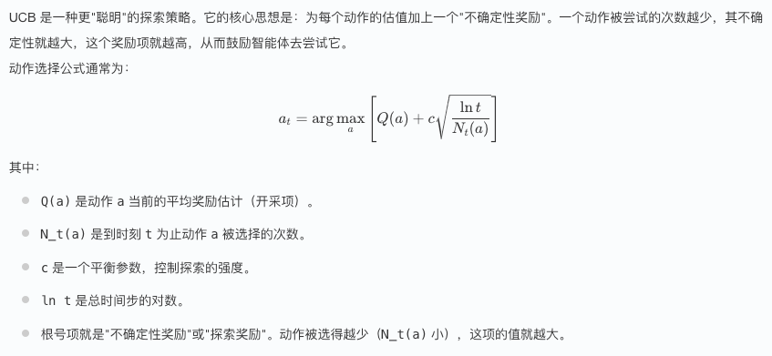
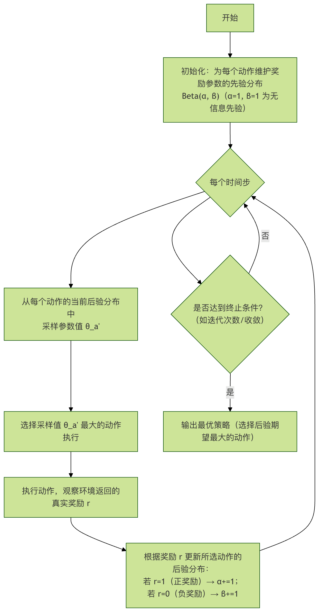

## 强化学习探索vs开采

在强化学习的世界里，智能体（Agent）就像一个在未知环境中不断学习、成长的探险家。它面临着一个贯穿始终的核心矛盾：是应该探索（Exploration） 未知领域，寻找可能带来更高回报的新路径，还是应该开采（Exploitation） 已知的最佳策略，稳定地获取当前已知的最大收益？这个"探索与开采的权衡"（Exploration-Exploitation Trade-off），是强化学习算法设计中最基本、最关键的挑战之一。理解并处理好这个矛盾，是智能体从新手成长为大师的必经之路。

### 什么是探索与开采？
让我们先通过一个生活中的比喻来理解这两个核心概念。

想象一下，你每天中午都要选择一家餐馆吃饭。

 * 开采（Exploitation）：你选择去你已知的、最喜欢的那家餐馆。你知道那里的菜合你口味，价格合适，服务质量稳定。选择开采意味着你基于当前已知的最佳信息做出决策，目的是最大化眼前的确定性收益。在强化学习中，这对应智能体选择当前估值（如Q值）最高的动作。
 * 探索（Exploration）：你决定尝试一家从未去过的新餐馆。这家新餐馆可能非常难吃，让你后悔不已；但也可能出乎意料地美味，成为你新的最爱。选择探索意味着你为了获取更多关于环境的信息而采取行动，目的是优化长期的未来收益。在强化学习中，这对应智能体随机选择动作，或者选择非当前最优的动作，以更新其对环境模型的认知。

强化学习智能体的目标，不是赢得某一次午餐，而是在无数次午餐选择中，获得最大的长期满足感（累积奖励）。如果只开采不探索，你可能永远发现不了那家更好的新餐馆，长期收益无法达到最优。如果只探索不开采，你可能会浪费大量时间和金钱在糟糕的餐馆上，无法享受已知的最佳选择。


### 为什么需要权衡？
探索与开采之所以需要权衡，根源在于环境的不确定性和智能体知识的不完整性。

信息有限：智能体初始时对环境一无所知，它必须通过探索来收集数据，构建对世界（状态、动作、奖励、转移概率）的认知模型。
机会成本：探索未知动作可能会获得较低的即时奖励（甚至惩罚），这相当于为获取信息付出了成本。如果过度探索，会牺牲大量本可获得的短期收益。
最优解的动态性：在非平稳环境中，最优策略可能会随时间变化。即使智能体找到了当前最优策略，也需要持续进行一定程度的探索，以适应环境变化，防止策略过时。
因此，一个优秀的强化学习算法必须在"利用现有知识获取收益"和"探索未知以改进知识"之间找到一个动态平衡点。


### 常见的探索策略
如何将探索机制融入到算法中？以下是几种经典的方法：

#### ε-贪心策略 (ε-Greedy)
这是最简单、最常用的探索策略。智能体在绝大多数时间（概率为 1-ε）选择当前认为最优的动作（开采），但会以一个小概率 ε（例如 5%）完全随机地选择一个动作（探索）。
实例
```python
import numpy as np

def epsilon_greedy(q_values, epsilon=0.1):
    """
    实现 ε-贪心策略
    Args:
        q_values: 一个数组，表示当前状态下每个动作的Q值估计。
        epsilon: 探索概率，介于0和1之间。
    Returns:
        selected_action: 根据策略选出的动作索引。
    """
    n_actions = len(q_values)
    
    # 以概率 epsilon 进行探索（随机选择）
    if np.random.random() < epsilon:
        selected_action = np.random.randint(n_actions)
    # 以概率 1-epsilon 进行开采（选择Q值最大的动作）
    else:
        # 如果多个动作Q值相同，随机选择一个
        selected_action = np.random.choice(np.where(q_values == np.max(q_values))[0])
    
    return selected_action

# 示例：假设在某个状态下，三个动作的Q值估计为 [1.5, 2.8, 2.3]
state_q_values = [1.5, 2.8, 2.3]
for i in range(10):
    action = epsilon_greedy(state_q_values, epsilon=0.2)
    print(f"第{i+1}次选择: 动作 {action} (Q值: {state_q_values[action]:.1f})")
```
优点：简单易懂，易于实现。 缺点：探索时完全随机，没有利用任何已有信息（比如某个动作虽然非最优，但Q值接近最优，它被探索的概率和Q值很低的糟糕动作是一样的）。

#### 上置信界算法 (Upper Confidence Bound, UCB)

UCB 是一种更"聪明"的探索策略。它的核心思想是：为每个动作的估值加上一个"不确定性奖励"。一个动作被尝试的次数越少，其不确定性就越大，这个奖励项就越高，从而鼓励智能体去尝试它。

动作选择公式通常为：

实例
```python
import numpy as np
import math

class UCB:
    def __init__(self, n_actions, c=2):
        self.n_actions = n_actions
        self.c = c  # 探索参数
        self.Q = np.zeros(n_actions)  # 动作价值估计
        self.N = np.zeros(n_actions)  # 动作选择次数
        self.total_steps = 0
   
    def select_action(self):
        self.total_steps += 1
        # 确保每个动作至少被选择一次
        if np.any(self.N == 0):
            action = np.random.choice(np.where(self.N == 0)[0])
        else:
            # 计算每个动作的UCB值： Q(a) + c * sqrt(ln(t) / N(a))
            ucb_values = self.Q + self.c * np.sqrt(np.log(self.total_steps) / self.N)
            action = np.argmax(ucb_values)
        return action
   
    def update(self, action, reward):
        """更新动作的价值估计"""
        self.N[action] += 1
        # 增量更新Q值: NewEstimate = OldEstimate + (1/N) * (Target - OldEstimate)
        self.Q[action] += (reward - self.Q[action]) / self.N[action]

# 模拟一个多臂老虎机问题，每个臂的真实奖励概率不同
true_means = [0.1, 0.5, 0.9]  # 三个臂的真实平均奖励
n_actions = len(true_means)
bandit = UCB(n_actions, c=2)

total_reward = 0
for step in range(1000):
    action = bandit.select_action()
    # 模拟拉动老虎机臂，以一定概率获得奖励1，否则为0
    reward = 1 if np.random.random() < true_means[action] else 0
    bandit.update(action, reward)
    total_reward += reward

print(f"UCB策略在1000步后获得的总奖励: {total_reward}")
print(f"各动作被选择的次数: {bandit.N}")
print(f"各动作的Q值估计: {bandit.Q}")
```
优点：探索更有目的性，会优先探索不确定性高（尝试次数少）的动作，能更快地收敛到最优动作。 缺点：需要维护每个动作被选择的次数，在动作空间连续或巨大时可能不适用。

#### 汤普森采样 (Thompson Sampling)
这是一种基于贝叶斯思想的概率性方法。智能体为每个动作的奖励分布（例如伯努利分布的参数 θ_a）维护一个先验分布（如 Beta 分布）。每一步，智能体从每个动作的后验分布中采样一个可能的奖励参数 θ_a，然后选择采样值最大的那个动作执行。收到真实奖励后，再根据结果更新该动作的后验分布。



过程说明：

初始化：为每个动作 a 假设其获得奖励的概率 θ_a 服从 Beta(α=1, β=1) 分布，这是一个均匀先验。
采样：每一步，从每个动作 a 的当前 Beta(α_a, β_a) 分布中独立采样一个值 θ_a'。
选择：执行采样值 θ_a' 最大的动作。
更新：如果获得奖励 r=1，则将该动作的 α 加1；如果 r=0，则将 β 加1。这相当于用观测数据更新了贝叶斯后验分布。
优点：自然地平衡探索与开采，理论性质优良，在实践中往往表现非常出色。 缺点：需要假设奖励分布的形式，并且计算可能比 ε-贪心更复杂。


### 探索与开采的动态平衡
在实际应用中，探索策略往往不是静态的，而是随着智能体的学习进程动态调整的。

初期重探索：在训练刚开始时，智能体对环境一无所知，应该设置较高的探索率（如较大的 ε 或 c），广泛收集数据。
后期重开采：随着学习的进行，智能体对环境的认知越来越准确，应该逐渐降低探索率（例如让 ε 随时间衰减），将重心转移到利用已学到的优秀策略上，以稳定获得高回报。
这种动态调整的过程，模拟了人类"从广泛尝试到精益求精"的学习过程。

### 实践练习：对比不同策略
让我们设计一个简单的实验，在经典的"多臂老虎机"问题上对比 ε-贪心 和 UCB 策略的性能。

#### 任务：
创建一个有 5 个臂的老虎机，每个臂的真实奖励概率分别为 [0.1, 0.2, 0.8, 0.5, 0.3]。
分别实现 ε-贪心（ε=0.1）和 UCB（c=2）策略。
让每个策略运行 2000 步，记录每一步的即时奖励和累积奖励。
绘制累积奖励随时间步变化的曲线，并观察哪个策略能更快、更稳定地获得更高的总奖励。

#### 思考：
尝试调整 ε 和 c 参数，观察对结果有什么影响？
如果最优臂（概率0.8）和次优臂（概率0.5）的差距变小，策略的表现会如何变化？
在更复杂的强化学习环境（如 Gym 中的游戏）中，如何将这些探索策略与 Q-Learning、DQN 等算法结合？