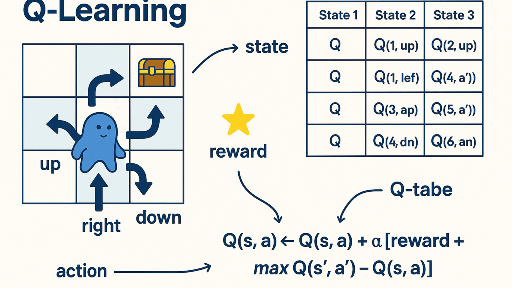
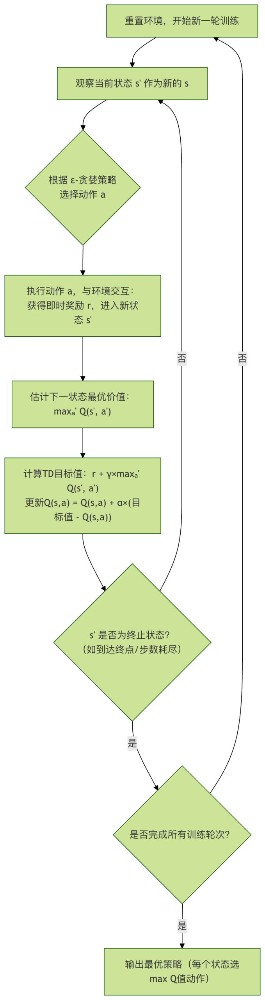
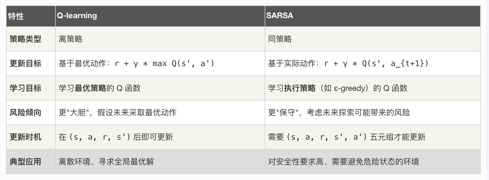
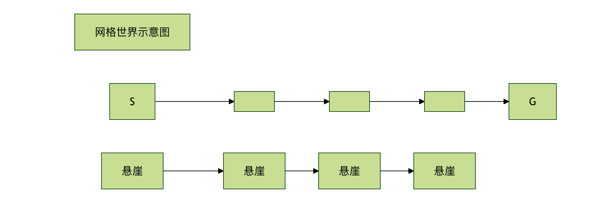

## 强化学习 Q-learning 与 SARSA
在人工智能的领域中，强化学习是一种让智能体通过与环境交互来学习如何达成目标的方法。

想象一下教一只小狗学习新指令：它做出一个动作（如坐下），你给予奖励（一块零食），它就会逐渐学会在听到指令时做出正确的反应。Q-learning 和 SARSA 就是强化学习中两种经典且至关重要的算法，它们是智能体学习什么动作在什么状态下最好的核心工具。本文将为你清晰地解析这两种算法的原理、区别与实现。

### 强化学习与马尔可夫决策过程基础
在深入 Q-learning 和 SARSA 之前，我们需要理解它们共同的理论框架。

#### 核心概念
强化学习问题通常被建模为 **马尔可夫决策过程（Markov Decision Process, MDP）**。它包含以下几个关键要素：
   * 智能体： 做出决策和学习的主体。
   * 环境： 智能体交互的外部世界。
   * 状态： 在特定时刻，对环境的描述。
   * 动作： 智能体在某个状态下可以执行的操作。
   * 奖励： 智能体执行动作后，环境反馈的即时收益信号。
   * 策略： 智能体在给定状态下选择动作的规则，是学习的目标。
#### 目标与价值函数
智能体的终极目标是最大化长期累积奖励，而不仅仅是即时奖励。为此，我们引入了价值函数。
   * 状态价值函数 V(s)： 表示从状态 s 开始，遵循特定策略能获得的期望累积奖励。
   * 动作价值函数 Q(s, a)： 表示在状态 s 下执行动作 a，然后遵循特定策略能获得的期望累积奖励。Q-learning 和 SARSA 的核心就是学习这个Q函数。
为了平衡即时奖励和未来奖励，我们使用折扣因子 γ (取值范围通常为 [0, 1])。未来第 k 步的奖励会被乘以 γ^k，这意味着智能体更看重近期奖励。


### Q-learning: 离策略的时序差分学习
Q-learning 是一种离策略算法，由 Watkins 于 1989 年提出。它的核心思想是智能体通过学习一个最优的 Q 值表来间接找到最优策略。

#### 算法核心：Q 值更新公式
Q-learning 的学习过程通过以下公式驱动： Q(s_t, a_t) ← Q(s_t, a_t) + α * [ r_{t+1} + γ * max_{a} Q(s_{t+1}, a) - Q(s_t, a_t) ]

让我们拆解这个公式：
   * Q(s_t, a_t)： 在时间 t，状态 s_t 下采取动作 a_t 的当前估计值。
   * α： 学习率，控制新信息覆盖旧信息的程度（0 < α ≤ 1）。
   * r_{t+1}： 执行动作 a_t 后获得的即时奖励。
   * γ： 折扣因子，衡量未来奖励的重要性。
   * max_{a} Q(s_{t+1}, a)： 在下一个状态 s_{t+1} 中，所有可能动作里最大的 Q 值。这代表了基于当前 Q 表估计的、未来可能获得的最佳收益。
   * [ r_{t+1} + γ * max_{a} Q(s_{t+1}, a) - Q(s_t, a_t) ]： 称为时序差分误差。它是"目标值"（即时奖励加未来最佳估计）与"当前估计值"的差值。算法通过减小这个误差来更新 Q 值。

#### 离策略的含义
Q-learning 被称为离策略，是因为它在更新 Q 值时，用于评估未来价值的动作（max_{a} Q(s_{t+1}, a)）与智能体实际执行探索的动作是分离的。
   * 行为策略： 用于选择实际执行动作的策略（如 ε-greedy，以一定概率随机探索）。
   * 目标策略： 用于更新 Q 值的策略，是一个完全贪婪的策略（总是选择当前 Q 值最大的动作）。
这种分离使得 Q-learning 能够大胆地利用其对最优路径的估计进行学习，即使当前正在采取随机探索。



算法流程


### SARSA：同策略的时序差分学习
SARSA 的名称来源于其更新过程涉及的状态-动作序列：(S_t, A_t, R_{t+1}, S_{t+1}, A_{t+1})。它是一种同策略算法。

#### 算法核心：Q 值更新公式
SARSA 的更新公式与 Q-learning 非常相似，但有一个关键区别： Q(s_t, a_t) ← Q(s_t, a_t) + α * [ r_{t+1} + γ * Q(s_{t+1}, a_{t+1}) - Q(s_t, a_t) ]

请注意第二部分：

* Q-learning 使用： γ * max_{a} Q(s_{t+1}, a)
* SARSA 使用： γ * Q(s_{t+1}, a_{t+1})
在 SARSA 中，用于估计未来价值的是智能体在下一个状态 s_{t+1} 下实际将要执行的动作 a_{t+1} 的 Q 值。

#### 同策略的含义
SARSA 被称为同策略，是因为它用于更新 Q 值的策略（目标策略）和用于选择动作的策略（行为策略）是同一个，通常都是 ε-greedy 策略。

* 它评估和优化的是它正在执行的策略。
* 它学习到的是在考虑未来探索风险下的策略，因此通常更"保守"。

### Q-learning 与 SARSA 的对比
理解两者的区别是掌握它们的关键。下面的表格清晰地总结了核心差异：


经典悬崖漫步问题示例
这个例子能生动体现两者的区别。假设一个网格世界，智能体从起点 S 走到终点 G，下方是悬崖，掉下去会有巨大负奖励并回到起点。



* Q-learning： 由于它假设未来总是走最优（最安全）路径，它会很快学会贴着悬崖边的最短路径（路径1），因为它"相信"自己不会掉下去。
* SARSA： 由于它考虑到自己未来仍有 ε 概率随机探索，可能会掉下悬崖。因此，它会学习到一条更靠上的安全路径（路径2），尽管更长，但长期期望回报更高。
结论： 在需要平衡探索与利用、且错误动作代价高昂的环境中，SARSA 通常能学到更安全、更稳健的策略。

### 代码实践：用 Python 实现 Q-learning 和 SARSA

我们将用一个简单的 4x4 网格世界来演示两种算法。目标是让智能体从左上角 (0,0) 走到右下角 (3,3)。

#### 环境设置
实例
```python
import numpy as np
import random

class GridWorld:
    def __init__(self, size=4):
        self.size = size
        self.state = (0, 0) # 起点
        self.goal = (size-1, size-1) # 终点
        self.actions = ['up', 'down', 'left', 'right']
        self.action_map = {'up': (-1, 0), 'down': (1, 0), 'left': (0, -1), 'right': (0, 1)}

    def reset(self):
        """重置环境到起点"""
        self.state = (0, 0)
        return self.state

    def step(self, action):
        """执行动作，返回 (下一状态, 奖励, 是否终止)"""
        move = self.action_map[action]
        next_state = (self.state[0] + move[0], self.state[1] + move[1])

        # 边界检查：如果出界，则留在原地
        if not (0 <= next_state[0] < self.size and 0 <= next_state[1] < self.size):
            next_state = self.state

        self.state = next_state

        # 奖励设置：到达目标奖励 10，其他移动奖励 -1（鼓励尽快到达）
        if next_state == self.goal:
            reward = 10
            done = True
        else:
            reward = -1
            done = False

        return next_state, reward, done

    def get_actions(self):
        return self.actions
```
#### Q-learning 算法实现
实例
```python
def q_learning(env, episodes=500, alpha=0.1, gamma=0.9, epsilon=0.1):
    """
    实现 Q-learning 算法
    env: 环境对象
    episodes: 训练轮数
    alpha: 学习率
    gamma: 折扣因子
    epsilon: ε-greedy 策略中的探索概率
    """
    # 初始化 Q 表，维度为 [网格行, 网格列, 动作数]
    q_table = np.zeros((env.size, env.size, len(env.actions)))

    for episode in range(episodes):
        state = env.reset()
        done = False

        while not done:
            # 1. ε-greedy 策略选择动作
            if random.uniform(0, 1) < epsilon:
                action_idx = random.randint(0, len(env.actions)-1) # 探索：随机选
            else:
                action_idx = np.argmax(q_table[state[0], state[1], :]) # 利用：选Q值最大的
            action = env.actions[action_idx]

            # 2. 执行动作，得到反馈
            next_state, reward, done = env.step(action)

            # 3. Q-learning 核心更新
            # 当前状态-动作对的 Q 值
            current_q = q_table[state[0], state[1], action_idx]
            # 下一个状态的最大 Q 值（离策略的关键）
            next_max_q = np.max(q_table[next_state[0], next_state[1], :])
            # 计算目标 Q 值
            target_q = reward + gamma * next_max_q
            # 更新 Q 表
            q_table[state[0], state[1], action_idx] = current_q + alpha * (target_q - current_q)

            # 转移到下一个状态
            state = next_state

    return q_table
```
#### SARSA 算法实现
实例
```python
def sarsa(env, episodes=500, alpha=0.1, gamma=0.9, epsilon=0.1):
    """
    实现 SARSA 算法
    参数含义同 Q-learning
    """
    q_table = np.zeros((env.size, env.size, len(env.actions)))

    for episode in range(episodes):
        state = env.reset()
        done = False

        # SARSA 需要先为初始状态选择一个动作
        if random.uniform(0, 1) < epsilon:
            action_idx = random.randint(0, len(env.actions)-1)
        else:
            action_idx = np.argmax(q_table[state[0], state[1], :])
        action = env.actions[action_idx]

        while not done:
            # 1. 执行上一步选好的动作
            next_state, reward, done = env.step(action)

            # 2. 为下一个状态选择动作（同策略，依然用 ε-greedy）
            if random.uniform(0, 1) < epsilon:
                next_action_idx = random.randint(0, len(env.actions)-1)
            else:
                next_action_idx = np.argmax(q_table[next_state[0], next_state[1], :])
            next_action = env.actions[next_action_idx]

            # 3. SARSA 核心更新
            current_q = q_table[state[0], state[1], action_idx]
            # 关键区别：使用下一个状态**实际要执行的动作**的 Q 值
            next_q = q_table[next_state[0], next_state[1], next_action_idx]
            target_q = reward + gamma * next_q
            q_table[state[0], state[1], action_idx] = current_q + alpha * (target_q - current_q)

            # 4. 为下一步迭代更新状态和动作
            state = next_state
            action_idx = next_action_idx
            action = next_action

    return q_table
```

#### 测试与策略可视化
实例
```python
def test_policy(env, q_table, episodes=10):
    """测试学到的策略"""
    total_rewards = []
    for _ in range(episodes):
        state = env.reset()
        done = False
        total_reward = 0
        steps = []

        while not done:
            # 测试时使用贪婪策略（不探索）
            action_idx = np.argmax(q_table[state[0], state[1], :])
            action = env.actions[action_idx]
            next_state, reward, done = env.step(action)
            steps.append(action[0].upper()) # 记录动作首字母
            total_reward += reward
            state = next_state

        total_rewards.append(total_reward)
        print(f"Episode steps: {steps}, Total reward: {total_reward}")

    print(f"平均奖励: {np.mean(total_rewards):.2f}")

# 创建环境
env = GridWorld(size=4)

print("=== 训练并测试 Q-learning ===")
q_table_ql = q_learning(env, episodes=1000)
test_policy(env, q_table_ql)

print("\n=== 训练并测试 SARSA ===")
env.reset() # 重置环境状态
q_table_sarsa = sarsa(env, episodes=1000)
test_policy(env, q_table_sarsa)

# 简单比较最终策略
print("\n=== 策略对比（从起点(0,0)出发的动作）===")
start_q_values = q_table_ql[0, 0, :]
start_sarsa_values = q_table_sarsa[0, 0, :]
print(f"Q-learning Q值: {dict(zip(env.actions, start_q_values))}")
print(f"推荐动作: {env.actions[np.argmax(start_q_values)]}")
print(f"SARSA Q值: {dict(zip(env.actions, start_sarsa_values))}")
print(f"推荐动作: {env.actions[np.argmax(start_sarsa_values)]}")

```

