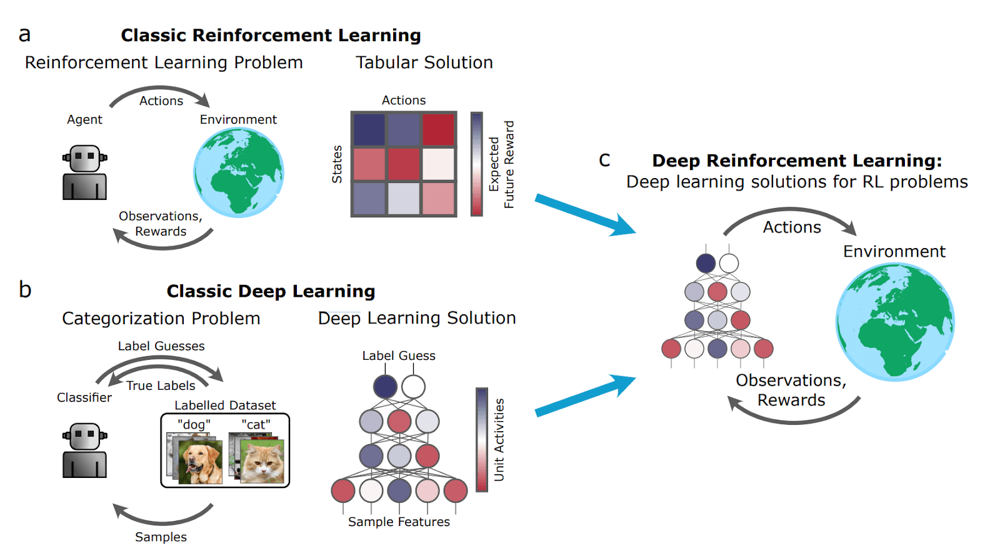
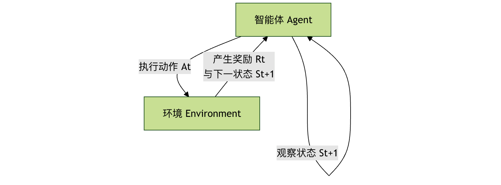

## 深度强化学习

深度强化学习是人工智能领域一个令人兴奋的交叉方向，我们可以把它拆解成两个部分来理解：

**强化学习** 是核心思想，它模拟了人类或动物通过"试错"来学习的过程。想象一下教小狗学习新指令：当它做对了，你会给它零食作为奖励；做错了，就没有奖励甚至可能有轻微的惩罚。经过多次尝试，小狗就能学会在特定情境下做出正确的动作以获得奖励。强化学习中的智能体（Agent）就像这只小狗，它通过与环境（Environment）互动，根据获得的奖励（Reward）来调整自己的行为策略（Policy）。

**深度学习** 则是一种强大的工具。当强化学习面对的环境非常复杂（比如电子游戏画面、机器人传感器数据）时，传统的数学方法很难直接从中提取有用的特征来决策。深度学习，特别是深度神经网络，擅长处理这类高维、复杂的原始数据（如图像、声音），能够自动学习数据的层次化特征表示。

因此，深度强化学习 = 强化学习的决策框架 + 深度学习的感知与表示能力。它让智能体能够直接从复杂的原始输入（如像素）中学习如何采取最优行动，以达成长期目标。



### 核心概念与基本框架
要理解深度强化学习，首先需要掌握其基础框架中的几个核心角色和它们之间的关系。

#### 强化学习的基本要素
* 智能体 (Agent)
角色：学习者与决策者。
职责：观察环境状态，根据所学策略选择动作，执行动作，并从环境中接收反馈（新状态和奖励）。

* 环境 (Environment)
角色：智能体交互的一切外部事物。
职责：接收智能体的动作，更新自身状态，并给出相应的奖励。

* 状态 (State, s)
定义：环境在某一时刻的具体情况描述。在深度强化学习中，状态通常是高维的，比如一帧游戏图像。

* 动作 (Action, a)
定义：智能体在给定状态下可以做出的选择。例如，在游戏中可能是"向上"、"向左"、"开火"等。

* 奖励 (Reward, r)
定义：环境对智能体动作的即时反馈信号，是一个标量值。奖励是智能体学习的"指南针"，其目标是最大化长期累积奖励。

* 策略 (Policy, π)
定义：智能体的行为准则，是从状态到动作的映射函数。它告诉智能体在什么状态下应该做什么动作。策略可以是确定性的（a = π(s)），也可以是随机性的（a ~ π(a|s)）。

* 价值函数 (Value Function)
1 定义：用于评估状态或状态-动作对的好坏。它代表了从当前状态（或执行当前动作后）开始，未来能获得的预期累积奖励。
2 状态价值函数 V(s)：在状态 s 下，遵循当前策略所能获得的预期回报。
3 动作价值函数 Q(s, a)：在状态 s 下执行动作 a，然后遵循当前策略所能获得的预期回报。


#### 交互流程
智能体与环境的交互是一个持续的循环过程，可以用以下流程图清晰地表示：



这个循环不断重复，智能体收集大量的交互数据（s, a, r, s'），并利用这些数据来改进自己的策略。

### 深度强化学习的主要算法
深度强化学习的算法家族主要分为两大类：基于价值 (Value-Based) 和 基于策略 (Policy-Based)，以及结合两者优点的 演员-评论家 (Actor-Critic) 方法。

#### 1. 基于价值的深度 Q 网络
这类算法的核心是学习最优的 动作价值函数 Q(s, a)。一旦学到了准确的 Q 函数，最优策略就很简单：在每个状态 s 下，选择能使 Q(s, a) 最大的动作 a。

深度 Q 网络 (DQN) 是里程碑式的工作。它用深度神经网络来近似复杂的 Q 函数。

##### DQN 的关键技术创新：
 * 经验回放 (Experience Replay)：智能体将交互经验 (s, a, r, s') 存储在一个记忆库中。训练时，随机从库中抽取一批经验进行学习。这打破了数据间的相关性，使训练更稳定、更高效。
 * 目标网络 (Target Network)：使用一个结构相同但参数更新较慢的"目标网络"来计算学习目标（Q 目标值），而用另一个"在线网络"进行动作选择和实时更新。这解决了训练中目标值不断移动的问题，大大提高了稳定性。

##### 一个简化的 DQN 训练流程：
1 初始化在线网络 Q 和目标网络 Q_target（参数相同），清空经验回放池。
2 智能体根据当前状态 s，以一定概率随机或根据 Q 网络选择动作 a。
3 执行动作，环境返回奖励 r 和新状态 s'，将经验 (s, a, r, s') 存入回放池。
4 从回放池中随机采样一批经验。
5 对于每个样本，计算目标 Q 值：y = r + γ * max_a' Q_target(s', a')。其中 γ 是折扣因子，用于权衡即时奖励和未来奖励。
6 以 (y - Q(s, a))^2 作为损失，通过梯度下降更新在线网络 Q 的参数。
7 每隔一定步数，将在线网络的参数复制给目标网络。
8重复步骤 2-7。

##### 优点与局限：
优点：样本效率相对较高，训练相对稳定。
局限：天然难以处理连续动作空间（因为需要计算 max_a Q(s,a)），且通常只能学习确定性策略。


#### 2. 基于策略的策略梯度方法
这类方法直接参数化策略 π(a|s; θ)（例如用一个神经网络表示），并通过优化策略参数 θ 来直接最大化期望回报。

**核心思想**：通过计算期望回报 J(θ) 关于策略参数 θ 的梯度（即策略梯度），然后沿梯度方向更新参数，使策略越来越好。

REINFORCE 算法 是一种经典的策略梯度算法。其更新公式为： θ ← θ + α * ∇_θ log π(a|s; θ) * G_t 其中 G_t 是从当前时刻到回合结束的累积奖励，α 是学习率。

**优点与局限**：

优点：可以直接学习随机策略，天然适用于连续动作空间。
局限：基于整个回合的更新，方差很大，导致训练不稳定，样本效率低。


#### 3. 演员-评论家方法
演员-评论家框架巧妙地将基于价值和基于策略的方法结合起来，取长补短。

* 演员 (Actor)：一个策略网络，负责根据状态生成动作。它像一位演员，在评论家的指导下改进自己的"演技"（策略）。
* 评论家 (Critic)：一个价值网络（通常是 Q 网络或 V 网络），负责评估演员在某个状态下所做动作的价值。它像一位评论家，对演员的表现进行打分。

##### 工作流程：
演员根据当前状态 s 和自身策略，选择并执行动作 a。
环境反馈奖励 r 和新状态 s'。
评论家根据 (s, a, r, s') 计算 TD 误差（ Temporal-Difference Error，一种衡量预测价值与实际价值差异的信号）。
评论家利用这个误差来更新自己的价值评估网络，使其打分更准。
演员利用评论家提供的"评分"（如 TD 误差或优势函数）来更新自己的策略网络，使自己更倾向于选择能获得高评分的动作。

优势：演员-评论家方法通常比纯策略梯度方法（如 REINFORCE）方差更小、更稳定，同时又比纯价值方法（如 DQN）更擅长处理连续动作和随机策略。A3C, A2C, PPO, SAC 等都是非常成功的演员-评论家算法。


### 实践：用 DQN 玩 CartPole 游戏
让我们通过一个经典的控制问题 CartPole（平衡杆）来直观感受 DQN。在这个环境中，小车可以左右移动，目标是保持车上的杆子竖直不倒。

#### 环境设置
我们使用 OpenAI Gym 这个强化学习工具包。

实例
```python
# 安装必要库 (在Jupyter Notebook或命令行中运行)
# !pip install gym numpy torch

import gym
import numpy as np
import random
import torch
import torch.nn as nn
import torch.optim as optim
import collections

# 创建环境
env = gym.make('CartPole-v1')
state_dim = env.observation_space.shape[0]  # 状态维度：4 (小车位置，速度，杆角度，角速度)
action_dim = env.action_space.n            # 动作维度：2 (向左，向右)
print(f"状态空间维度: {state_dim}, 动作空间大小: {action_dim}")
```

#### 定义 Q 网络
这是一个简单的全连接神经网络，输入是状态，输出是每个动作对应的 Q 值。

实例
```python
class DQN(nn.Module):
    def __init__(self, state_dim, action_dim):
        super(DQN, self).__init__()
        self.fc1 = nn.Linear(state_dim, 128)  # 第一层全连接层
        self.fc2 = nn.Linear(128, 128)        # 第二层全连接层
        self.fc3 = nn.Linear(128, action_dim) # 输出层，每个动作一个Q值

    def forward(self, x):
        x = torch.relu(self.fc1(x))  # 使用ReLU激活函数引入非线性
        x = torch.relu(self.fc2(x))
        return self.fc3(x)           # 输出Q值，不经过激活函数
```

#### 定义经验回放池

用于存储和采样过去的经验。

实例
```python
class ReplayBuffer:
    def __init__(self, capacity):
        self.buffer = collections.deque(maxlen=capacity)  # 双端队列，自动淘汰旧经验

    def add(self, state, action, reward, next_state, done):
        self.buffer.append((state, action, reward, next_state, done))

    def sample(self, batch_size):
        transitions = random.sample(self.buffer, batch_size)
        # 将数据整理成按列堆叠的张量，便于神经网络批量处理
        state, action, reward, next_state, done = zip(*transitions)
        return (np.array(state), action, reward, np.array(next_state), done)

    def size(self):
        return len(self.buffer)
```

#### 定义 DQN 智能体
整合了网络、经验回放和训练逻辑。

实例

class DQNAgent:
定义 DQN 智能体
整合了网络、经验回放和训练逻辑。

实例
```python
class DQNAgent:
    def __init__(self, state_dim, action_dim, lr=1e-3, gamma=0.98, epsilon=0.01,
                 target_update_freq=10, buffer_size=10000, batch_size=64):
        self.action_dim = action_dim
        self.q_net = DQN(state_dim, action_dim)          # 在线网络
        self.target_q_net = DQN(state_dim, action_dim)   # 目标网络
        self.target_q_net.load_state_dict(self.q_net.state_dict()) # 初始参数一致
        self.optimizer = optim.Adam(self.q_net.parameters(), lr=lr) # 优化器

        self.gamma = gamma               # 折扣因子
        self.epsilon = epsilon           # 探索率（最终）
        self.target_update_freq = target_update_freq # 目标网络更新频率
        self.batch_size = batch_size
        self.buffer = ReplayBuffer(buffer_size)
        self.count = 0                   # 记录更新步数

    def take_action(self, state, epsilon=None):
        """根据epsilon-greedy策略选择动作"""
        if epsilon is None:
            epsilon = self.epsilon
        if np.random.random() < epsilon:
            return np.random.randint(self.action_dim)  # 探索：随机选择
        else:
            state = torch.tensor(state, dtype=torch.float).unsqueeze(0) # 增加批次维度
            with torch.no_grad():
                q_values = self.q_net(state)
            return q_values.argmax().item()            # 利用：选择Q值最大的动作

    def update(self):
        """从经验回放池采样并更新网络"""
        if self.buffer.size() < self.batch_size:
            return

        # 1. 采样
        states, actions, rewards, next_states, dones = self.buffer.sample(self.batch_size)
        # 转换为PyTorch张量
        states = torch.tensor(states, dtype=torch.float)
        actions = torch.tensor(actions).unsqueeze(1)      # 形状变为[batch_size, 1]，便于gather操作
        rewards = torch.tensor(rewards, dtype=torch.float).unsqueeze(1)
        next_states = torch.tensor(next_states, dtype=torch.float)
        dones = torch.tensor(dones, dtype=torch.float).unsqueeze(1)

        # 2. 计算当前Q值 (Q(s, a))
        current_q_values = self.q_net(states).gather(1, actions)  # 只取出执行动作a对应的Q值

        # 3. 计算目标Q值 (r + γ * max_a' Q_target(s', a'))
        with torch.no_grad():
            next_q_values = self.target_q_net(next_states).max(1)[0].unsqueeze(1) # 取下一状态的最大Q值
            target_q_values = rewards + self.gamma * next_q_values * (1 - dones) # 如果回合结束(done=1)，则没有未来奖励

        # 4. 计算损失 (均方误差)
        loss = nn.MSELoss()(current_q_values, target_q_values)

        # 5. 梯度下降更新在线网络
        self.optimizer.zero_grad()
        loss.backward()
        # 可选：梯度裁剪，防止梯度爆炸
        # torch.nn.utils.clip_grad_norm_(self.q_net.parameters(), max_norm=10)
        self.optimizer.step()

        self.count += 1
        # 6. 定期更新目标网络
        if self.count % self.target_update_freq == 0:
            self.target_q_net.load_state_dict(self.q_net.state_dict())

```

#### 训练循环
实例
```python
def train_agent(env, agent, num_episodes=500, max_steps=500, initial_epsilon=0.9, epsilon_decay=0.995):
    """训练智能体"""
    return_list = []  # 记录每个回合的总奖励
    epsilon = initial_epsilon

    for i_episode in range(num_episodes):
        state, _ = env.reset()
        episode_return = 0
        done = False

        for step in range(max_steps):
            # 1. 选择并执行动作
            action = agent.take_action(state, epsilon)  # 使用衰减的探索率
            next_state, reward, done, truncated, _ = env.step(action)
            # 2. 存储经验
            agent.buffer.add(state, action, reward, next_state, done)
            state = next_state
            episode_return += reward

            # 3. 更新网络
            agent.update()

            if done or truncated:
                break

        # 探索率衰减
        epsilon = max(agent.epsilon, epsilon * epsilon_decay)

        return_list.append(episode_return)
        if (i_episode + 1) % 50 == 0:
            print(f"回合: {i_episode+1}, 平均奖励 (最近50回合): {np.mean(return_list[-50:]):.1f}, 探索率: {epsilon:.3f}")

    print("训练完成！")
    return return_list
```

# 创建智能体并开始训练

agent = DQNAgent(state_dim, action_dim, lr=1e-3, gamma=0.99, epsilon=0.01)
returns = train_agent(env, agent, num_episodes=300)
测试训练好的智能体
实例
```python
def test_agent(env, agent, num_episodes=5, render=True):
    """测试智能体表现"""
    total_rewards = []
    for i in range(num_episodes):
        state, _ = env.reset()
        episode_return = 0
        done = False
        while not done:
            if render:
                env.render()  # 可视化环境，在本地运行时可以看到小车平衡杆子
            action = agent.take_action(state)  # 测试时使用最小的探索率（即纯利用）
            next_state, reward, done, truncated, _ = env.step(action)
            state = next_state
            episode_return += reward
            if done or truncated:
                break
        total_rewards.append(episode_return)
        print(f"测试回合 {i+1}: 总奖励 = {episode_return}")
    env.close()
    print(f"平均测试奖励: {np.mean(total_rewards):.1f}")

# 测试智能体
test_agent(env, agent, num_episodes=3, render=False) # 在无GUI环境中设置render=False

```

### 深度强化学习的挑战与未来方向
尽管取得了巨大成功，深度强化学习仍面临诸多挑战：
* 样本效率低下：通常需要远超人类或传统方法的交互数据才能学会一项任务。
* 训练不稳定：对超参数（学习率、网络结构等）非常敏感，训练过程容易发散。
* 奖励设计困难：如何设计出能正确引导智能体达成最终目标的奖励函数，本身就是一个难题。
* 安全性与可解释性：如何确保智能体的行为安全、可靠、符合预期，并理解其决策过程。
未来的研究正朝着更高效的算法（如基于模型的强化学习）、更强大的表示学习、多任务与元学习、以及与现实世界安全对齐等方向深入发展。

### 总结与练习
深度强化学习通过结合深度学习的感知能力和强化学习的决策框架，使机器能够学会在复杂环境中完成高级任务。你已了解了其核心概念、主要算法家族，并通过 DQN 的实践代码有了直观体验。

#### 练习与思考：
* 修改代码：尝试调整 DQNAgent 中的超参数（如 lr, gamma, batch_size），观察它们对训练速度和最终性能的影响。
* 更换环境：尝试将代码应用到 Gym 中的其他环境，如 MountainCar-v0 或 LunarLander-v2。注意调整状态和动作的维度。
* 算法对比：阅读并尝试实现一个简单的策略梯度算法（如 REINFORCE）来解决 CartPole 问题，对比其与 DQN 在训练稳定性、样本效率上的差异。
* 深入探索：选择一个现代的高级算法（如 PPO 或 SAC），阅读其论文或开源实现，理解它如何解决了 DQN 或策略梯度中的哪些问题。

