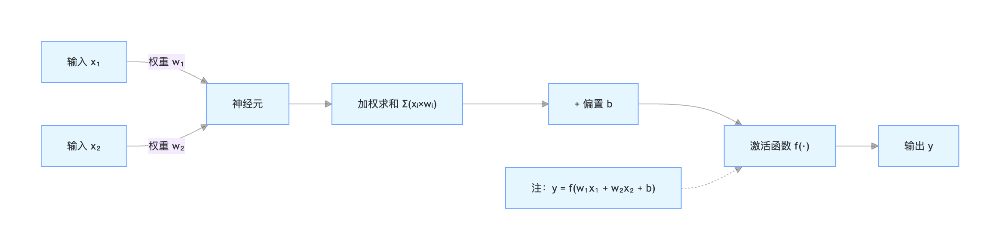
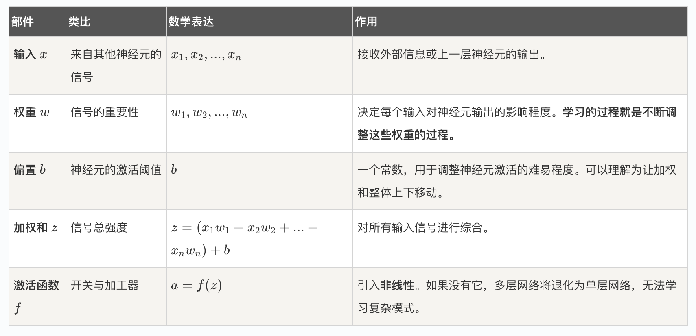
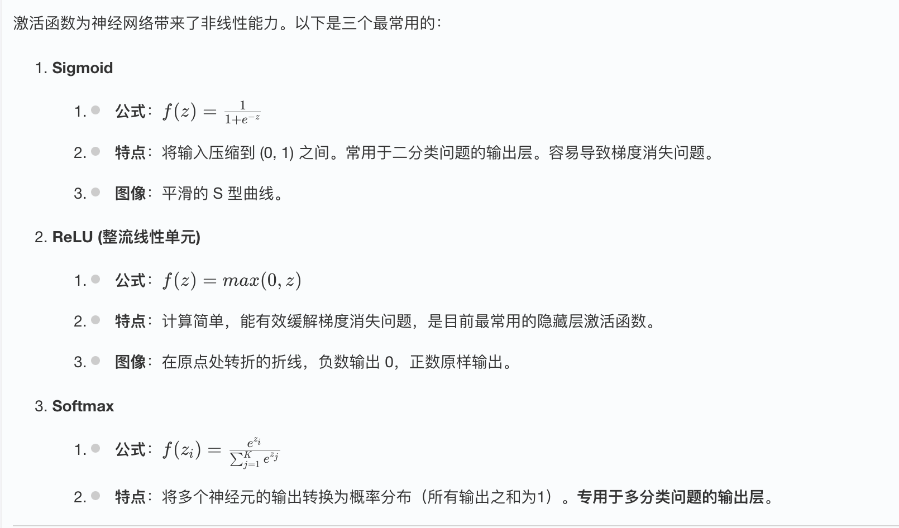
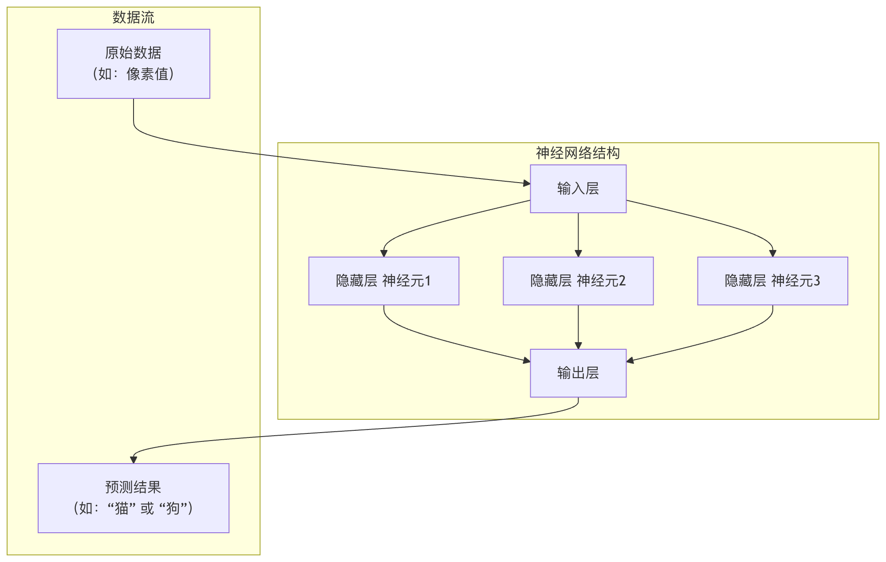
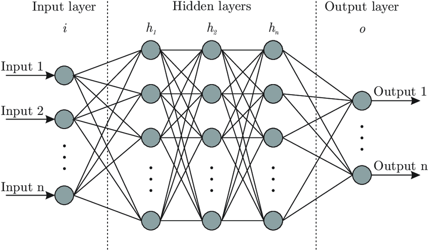
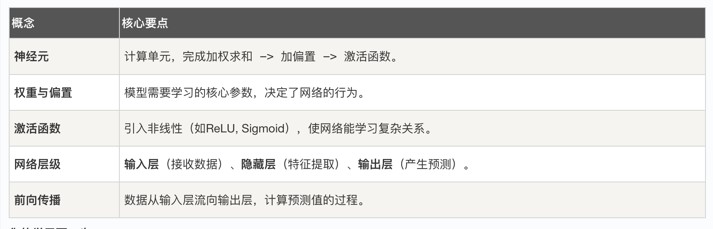

## 神经网络的基本结构
在人工智能的浪潮中，深度学习无疑是其中最耀眼的明星，而构成深度学习核心的，正是神经网络。它模仿人脑神经元的工作方式，通过层层连接与计算，赋予了机器学习和认知的能力。

对于初学者而言，理解神经网络的基本结构，是打开深度学习大门的第一把钥匙。

本文将带你从零开始，一步步拆解神经网络的构成，并用生动的比喻和清晰的代码，让你彻底掌握其工作原理。

### 神经网络是什么？一个生动的比喻
想象一下，你正在教一个从未见过猫和狗的小朋友区分它们，你会怎么做？

1 你可能会先给他看很多猫和狗的图片。神经网络是什么？
2 你会指出特征：看，猫的耳朵通常是尖的，脸比较圆；狗的耳朵可能下垂，脸型更长。
3 小朋友的大脑（神经网络）会接收这些图片（输入数据）和你的指导（标签）。
4 他大脑中的神经元会开始工作，尝试找出区分猫和狗的关键模式（如耳朵形状、脸型）。
5 经过多次纠正和学习，他大脑中形成了一个判断模型。下次再看到新动物图片时，他就能自信地说出这是猫或这是狗。
**神经网络就是这个小朋友的大脑的简化数学模型**， 它是一个由大量人工神经元相互连接构成的网络系统，能够从输入数据中自动学习特征和模式，并用于预测或决策。

### 神经网络的基本组成单元：神经元
神经元是神经网络最基本的计算单元，它模拟了生物神经元接收信号-处理信号-传递信号的过程。

#### 一个神经元的工作流程
一个典型的人工神经元主要做三件事：

实例
```python
# 这是一个神经元计算的伪代码逻辑，帮助你理解过程
def artificial_neuron(inputs, weights, bias):
    """
    模拟一个人工神经元的计算过程。
    参数:
        inputs: 输入信号列表，例如 [x1, x2, x3]
        weights: 对应每个输入的权重列表，例如 [w1, w2, w3]
        bias: 偏置项，一个常数
    返回:
        output: 神经元的输出
    """
    # 1. 加权求和：将每个输入乘以其对应的权重，然后加上偏置
    weighted_sum = 0
    for i in range(len(inputs)):
        weighted_sum += inputs[i] * weights[i]
    weighted_sum += bias

    # 2. 激活函数处理：通过一个非线性函数，决定是否"激活"并输出信号
    output = activation_function(weighted_sum)

    return output

```

让我们用一张图和一个表格来更直观地理解：



#### 神经元各部件功能详解：


#### 常见的激活函数


### 神经网络的层级结构
单个神经元能力有限，就像单个脑细胞无法思考一样。当我们将大量神经元按层组织起来，就形成了强大的神经网络。一个典型的神经网络包含以下三层：



#### 1. 输入层
角色：网络的感官，负责接收原始数据。
特点：该层的神经元数量通常等于输入数据的特征数。例如，一张28x28像素的灰度图展平后就是784个特征，对应784个输入神经元。输入层不做任何计算，只是传递数据。

#### 2. 隐藏层
角色：网络的大脑，负责进行复杂的特征提取和转换。
特点：
介于输入层和输出层之间，可以有一层或多层（深度学习就源于此）。
每一层的神经元都接收前一层所有神经元的输出作为输入，并计算自己的输出传递给下一层（这称为全连接）。
隐藏层中的神经元使用如 ReLU 等激活函数，引入非线性

#### 3. 输出层
角色：网络的决策者，输出最终的预测结果。
特点：神经元数量由任务决定。

* 二分类：1个神经元（用Sigmoid）或2个神经元（用Softmax）。
* 多分类（K类）：K个神经元（用Softmax）。
* 回归（预测一个连续值）：1个神经元（通常不用激活函数）。




### 实战：用 Python 构建一个神经网络
理论说得再多，不如动手实践。下面我们用 NumPy 库从零开始构建一个最简单的三层神经网络（1个隐藏层），并进行一次前向传播计算。

实例
```python
import numpy as np

# 定义激活函数
def sigmoid(x):
    """Sigmoid 激活函数"""
    return 1 / (1 + np.exp(-x))

def relu(x):
    """ReLU 激活函数"""
    return np.maximum(0, x)

# 初始化一个简单的神经网络
def initialize_network(input_size, hidden_size, output_size):
    """
    初始化网络权重和偏置。
    参数:
        input_size: 输入层神经元数
        hidden_size: 隐藏层神经元数
        output_size: 输出层神经元数
    返回:
        network: 包含各层参数的字典
    """
    np.random.seed(42)  # 设置随机种子，确保每次运行结果一致
    network = {}
    # 初始化 输入层->隐藏层 的参数
    # 权重矩阵形状: (下一层神经元数， 上一层神经元数)
    network['W1'] = np.random.randn(hidden_size, input_size) * 0.01
    network['b1'] = np.zeros((hidden_size, 1))  # 偏置是列向量
    # 初始化 隐藏层->输出层 的参数
    network['W2'] = np.random.randn(output_size, hidden_size) * 0.01
    network['b2'] = np.zeros((output_size, 1))
    return network

# 前向传播函数
def forward_propagation(network, X):
    """
    执行前向传播，计算网络输出。
    参数:
        network: 包含权重和偏置的字典
        X: 输入数据，形状为 (特征数, 样本数)
    返回:
        y_pred: 网络预测输出
        cache: 缓存中间结果（用于后续的反向传播）
    """
    # 获取参数
    W1, b1, W2, b2 = network['W1'], network['b1'], network['W2'], network['b2']

    # 第1层计算: 输入层 -> 隐藏层
    Z1 = np.dot(W1, X) + b1  # 加权和
    A1 = relu(Z1)            # 通过ReLU激活函数

    # 第2层计算: 隐藏层 -> 输出层
    Z2 = np.dot(W2, A1) + b2 # 加权和
    A2 = sigmoid(Z2)         # 通过Sigmoid激活函数（假设是二分类）

    # 缓存中间结果，反向传播时会用到
    cache = {'Z1': Z1, 'A1': A1, 'Z2': Z2, 'A2': A2}
    return A2, cache

# --- 让我们来运行它！---
# 1. 定义网络结构：2个输入特征，3个隐藏神经元，1个输出（二分类）
input_size = 2
hidden_size = 3
output_size = 1

# 2. 初始化网络
my_network = initialize_network(input_size, hidden_size, output_size)
print("权重 W1 的形状（隐藏层 x 输入层）:", my_network['W1'].shape)
print("偏置 b1 的形状:", my_network['b1'].shape)
print("权重 W2 的形状（输出层 x 隐藏层）:", my_network['W2'].shape)

# 3. 创建一个样本输入数据（2个特征，1个样本）
# X 的列代表样本，行代表特征
X_sample = np.array([[1.5], [-0.5]])  # 形状 (2, 1)
print("\n输入数据 X:", X_sample.T) # .T 是为了转置打印，便于观看

# 4. 执行前向传播
y_pred, cache = forward_propagation(my_network, X_sample)
print("\n神经网络预测输出 (A2):", y_pred)
# 如果输出 > 0.5，我们可以认为是类别1，否则是类别0
predicted_class = 1 if y_pred > 0.5 else 0
print(f"预测类别: {predicted_class}")
```
##### 代码解读与输出分析：

##### 初始化：我们创建了一个 2-3-1 结构的网络。W1 是一个 3x2 的矩阵，表示2个输入到3个隐藏神经元的连接权重。

##### 前向传播：

* 输入 [1.5, -0.5] 首先与 W1 相乘并加上 b1，得到隐藏层的加权和 Z1。
* Z1 经过 ReLU 函数，得到隐藏层的激活值 A1。
* A1 再与 W2 相乘并加上 b2，得到输出层的加权和 Z2。
* Z2 最后经过 Sigmoid 函数，压缩到(0,1)之间，作为最终的预测概率 A2。

输出：由于权重是随机初始化的，这个未经训练的网络的预测输出 A2 也是一个随机值（接近0.5）。**训练神经网络的目的，就是通过大量数据，反复调整 W1, b1, W2, b2，使得 A2 对于不同输入能产生有意义的预测。**

### 核心概念总结与学习路径
通过本文，你已经掌握了神经网络的基石：

概念	核心要点
神经元	计算单元，完成加权求和 -> 加偏置 -> 激活函数。
权重与偏置	模型需要学习的核心参数，决定了网络的行为。
激活函数	引入非线性（如ReLU, Sigmoid），使网络能学习复杂关系。
网络层级	输入层（接收数据）、隐藏层（特征提取）、输出层（产生预测）。
前向传播	数据从输入层流向输出层，计算预测值的过程。


**你的学习下一步**：
* 1 损失函数：如何量化网络预测的好坏（如均方误差、交叉熵损失）？
* 2 反向传播与梯度下降：神经网络如何根据"坏"的程度，自动调整权重和偏置（这是学习的本质）？
* 3 使用框架实战：用 TensorFlow 或 PyTorch 等现代框架，可以轻松构建和训练更复杂的网络，无需从零开始写 NumPy 代码。
理解基本结构后，你将发现所有复杂的深度学习模型（如CNN用于图像，RNN用于语音）都是在这个基础结构上，通过改变神经元的连接方式和层级功能演变而来的。现在，你已经拥有了继续探索深度学习广阔世界的地图。