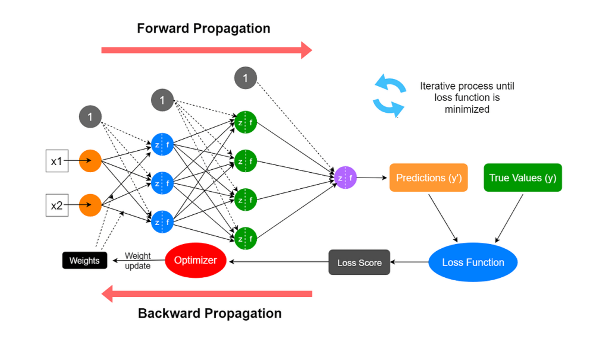
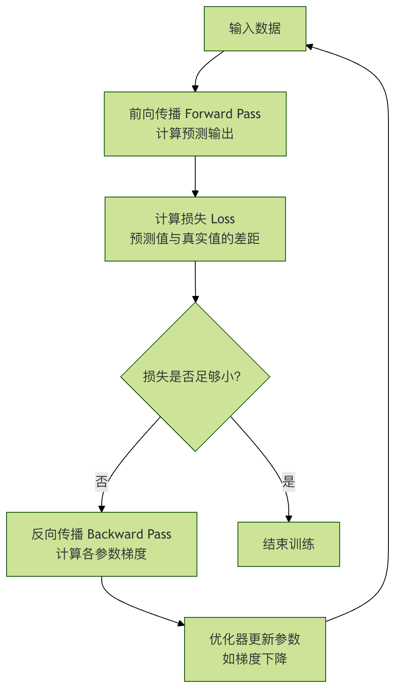

## 前向传播与反向传播
在深度学习中，前向传播与反向传播是支撑其运转的两大核心支柱。它们如同一个硬币的两面，共同构成了神经网络从学习到应用的完整闭环，透彻理解这两个过程，是打开深度学习大门的第一把钥匙。

本文将带你一步步拆解这两个看似复杂的概念，用清晰的逻辑和生动的比喻，让你不仅知其然，更知其所以然。

### 什么是前向传播与反向传播？
在深入细节之前，让我们先建立一个宏观的认知。

想象一下，你正在教一个孩子识别猫和狗。你给他看一张图片（输入），他根据自己大脑中已有的知识（网络参数，即权重和偏置）进行判断，然后告诉你这是猫（输出）。这个看图片 -> 大脑处理 -> 给出答案的过程，就是**前向传播**。

但孩子的判断可能出错。你告诉他：不对，这是狗。这个正确答案与孩子答案之间的差异，就是误差。孩子需要根据这个误差，回头去反思：我大脑里的哪些知识（参数）导致了这次误判？我应该如何调整它们，下次才能认对？这个根据误差，从后往前调整知识的过程，就是**反向传播**。

在神经网络中：
* 前向传播：数据从输入层，经过隐藏层，最终到达输出层，并产生预测结果的过程。这是一个推理过程。
* 反向传播：根据前向传播产生的预测结果与真实值之间的误差，从输出层开始，反向逐层计算每个参数（权重和偏置）对总误差的"贡献"大小（即梯度），并据此更新参数。这是一个学习过程。



它们的关系可以用一个简单的学习循环图来表示：




### 前向传播：神经网络的推理之路
前向传播是神经网络进行预测的前向通道。让我们通过一个最简单的三层神经网络（输入层、一个隐藏层、输出层）来理解它。

#### 核心概念与计算
假设我们要预测房价，输入是房屋面积 x。我们的微型网络结构如下：
输入层：一个神经元，接收 x。
隐藏层：一个神经元，拥有权重 w1 和偏置 b1。
输出层：一个神经元，拥有权重 w2 和偏置 b2，输出预测房价 y_pred。

前向传播的计算分为两步：
**1、隐藏层计算** ：输入 x 与权重 w1、偏置 b1 结合，然后通过一个激活函数（例如Sigmoid，记作 σ），产生隐藏层输出 a1。
```python
z1 = w1 * x + b1
a1 = σ(z1) = 1 / (1 + exp(-z1))
```
* z1 是线性变换结果。
* a1 是经过非线性激活后的输出，这赋予了网络学习复杂模式的能力。

**2、输出层计算** ：隐藏层输出 a1 作为输入，与输出层的权重 w2、偏置 b2 结合，产生最终预测 y_pred。这里为了简化，假设输出层不使用激活函数（即线性输出）。
```python
y_pred = w2 * a1 + b2
```
代码示例：手动实现前向传播
实例
```python
import numpy as np

def sigmoid(x):
    """Sigmoid激活函数"""
    return 1 / (1 + np.exp(-x))

# 初始化网络参数（通常随机初始化，这里为演示指定值）
w1, b1 = 2.0, -1.0  # 隐藏层参数
w2, b2 = 1.5, 0.5   # 输出层参数

def forward_pass(x):
    """执行一次前向传播"""
    # 隐藏层计算
    z1 = w1 * x + b1
    a1 = sigmoid(z1)  # 应用激活函数
   
    # 输出层计算
    y_pred = w2 * a1 + b2  # 线性输出
   
    # 返回中间结果和最终预测，便于后续理解
    return {'z1': z1, 'a1': a1, 'y_pred': y_pred}

# 假设房屋面积为 3（单位：百平方米）
x_input = 3.0
result = forward_pass(x_input)
print(f"输入 x = {x_input}")
print(f"隐藏层线性输出 z1 = w1*x + b1 = {result['z1']:.4f}")
print(f"隐藏层激活输出 a1 = sigmoid(z1) = {result['a1']:.4f}")
print(f"最终预测房价 y_pred = w2*a1 + b2 = {result['y_pred']:.4f}")
```
输出示例：
```
输入 x = 3.0
隐藏层线性输出 z1 = w1*x + b1 = 5.0000
隐藏层激活输出 a1 = sigmoid(z1) = 0.9933
最终预测房价 y_pred = w2*a1 + b2 = 1.9899
```
这个 y_pred 就是网络对面积为3的房屋的预测价格。但显然，这个预测值（基于我们随便设定的参数）很可能与真实房价相差甚远。如何衡量这个差距并改进呢？这就需要**损失函数**和接下来的**反向传播**。

### 损失函数：好坏的衡量标尺
在反向传播开始之前，我们必须先量化预测值 y_pred 与真实值 y_true 之间的差距。这就是损失函数的作用。

##### 常用损失函数：
* 均方误差：适用于回归问题（如预测房价、温度）。 Loss = (1/N) * Σ (y_true - y_pred)^2
* 交叉熵损失：适用于分类问题（如图像分类、垃圾邮件识别）。

以均方误差为例，对于单个样本：
```python
Loss = (y_true - y_pred)^2
```
我们的目标就是通过调整 w1, b1, w2, b2，让这个 Loss 值尽可能小。

### 反向传播：神经网络的学习引擎
反向传播是深度学习的学习算法核心。其本质是链式法则在神经网络中的高效应用。目标是计算损失函数 L 对每个参数（w1, b1, w2, b2）的**偏导数（梯度）**，即 ∂L/∂w1, ∂L/∂b1 等。这些梯度指明了为了减小损失，每个参数应该朝哪个方向、以多大的幅度调整。

#### 理解梯度：下山的方向与步幅
想象你蒙着眼站在一座山上（损失曲面），目标是找到山谷的最低点（最小损失）。你每走一步前，都需要用脚感受一下周围最陡的下坡方向。这个最陡的下坡方向就是梯度。反向传播就是帮你精确计算出脚下每一个点（对应每一组参数）的梯度。

#### 反向传播计算步骤（链式求导）
我们继续沿用前面的微型网络，并假设真实房价 y_true = 2.5，损失函数为均方误差 L = (y_true - y_pred)^2。

反向传播从输出层开始，反向逐层计算梯度：

##### 计算输出层参数的梯度

* 损失 L 对预测值 y_pred 的梯度： ∂L/∂y_pred = -2 * (y_true - y_pred)
* 因为 y_pred = w2 * a1 + b2，所以： ∂L/∂w2 = (∂L/∂y_pred) * (∂y_pred/∂w2) = (∂L/∂y_pred) * a1 ∂L/∂b2 = (∂L/∂y_pred) * (∂y_pred/∂b2) = (∂L/∂y_pred) * 1

##### 计算隐藏层参数的梯度
* 首先，需要损失 L 对隐藏层输出 a1 的梯度。a1 通过 y_pred 影响 L： ∂L/∂a1 = (∂L/∂y_pred) * (∂y_pred/∂a1) = (∂L/∂y_pred) * w2
* 然后，a1 = σ(z1)，Sigmoid函数的导数 σ'(z) = σ(z)*(1-σ(z))。
* 最后，计算 L 对隐藏层参数 w1, b1 的梯度： ∂L/∂w1 = (∂L/∂a1) * (∂a1/∂z1) * (∂z1/∂w1) = (∂L/∂a1) * σ'(z1) * x ∂L/∂b1 = (∂L/∂a1) * (∂a1/∂z1) * (∂z1/∂b1) = (∂L/∂a1) * σ'(z1) * 1

#### 代码示例：手动实现反向传播

实例
```python
# 接续前向传播的代码和结果
y_true = 2.5
y_pred = result['y_pred']
a1 = result['a1']
z1 = result['z1']
x = x_input

print(f"真实值 y_true = {y_true}")
print(f"预测值 y_pred = {y_pred:.4f}")
print(f"初始损失 Loss = {(y_true - y_pred)**2:.4f}")
print("\n--- 开始反向传播计算梯度 ---")

# 1. 计算损失对y_pred的梯度
dL_dy_pred = -2 * (y_true - y_pred)
print(f"梯度 ∂L/∂y_pred = -2*(y_true - y_pred) = {dL_dy_pred:.4f}")

# 2. 计算输出层参数 w2, b2 的梯度
dL_dw2 = dL_dy_pred * a1
dL_db2 = dL_dy_pred * 1
print(f"梯度 ∂L/∂w2 = (∂L/∂y_pred) * a1 = {dL_dw2:.4f}")
print(f"梯度 ∂L/∂b2 = (∂L/∂y_pred) * 1 = {dL_db2:.4f}")

# 3. 计算损失对隐藏层输出a1的梯度
dL_da1 = dL_dy_pred * w2
print(f"梯度 ∂L/∂a1 = (∂L/∂y_pred) * w2 = {dL_da1:.4f}")

# 4. 计算Sigmoid函数的导数在z1处的值
def sigmoid_derivative(x):
    """Sigmoid函数的导数"""
    s = sigmoid(x)
    return s * (1 - s)

sigma_prime_z1 = sigmoid_derivative(z1)
print(f"Sigmoid导数 σ'(z1) = σ(z1)*(1-σ(z1)) = {sigma_prime_z1:.4f}")

# 5. 计算隐藏层参数 w1, b1 的梯度
dL_dw1 = dL_da1 * sigma_prime_z1 * x
dL_db1 = dL_da1 * sigma_prime_z1 * 1
print(f"梯度 ∂L/∂w1 = (∂L/∂a1) * σ'(z1) * x = {dL_dw1:.4f}")
print(f"梯度 ∂L/∂b1 = (∂L/∂a1) * σ'(z1) * 1 = {dL_db1:.4f}")
```

#### 输出示例：
```
真实值 y_true = 2.5
预测值 y_pred = 1.9899
初始损失 Loss = 0.2602


--- 开始反向传播计算梯度 ---
梯度 ∂L/∂y_pred = -2*(y_true - y_pred) = -1.0202
梯度 ∂L/∂w2 = (∂L/∂y_pred) * a1 = -1.0134
梯度 ∂L/∂b2 = (∂L/∂y_pred) * 1 = -1.0202
梯度 ∂L/∂a1 = (∂L/∂y_pred) * w2 = -1.5303
Sigmoid导数 σ'(z1) = σ(z1)*(1-σ(z1)) = 0.0066
梯度 ∂L/∂w1 = (∂L/∂a1) * σ&#39;(z1) * x = -0.0304
梯度 ∂L/∂b1 = (∂L/∂a1) * σ&#39;(z1) * 1 = -0.0101
```
现在，我们得到了所有参数的梯度。这些负值意味着，如果增加这些参数的值，损失会增大（因为梯度方向是上升方向）。为了减小损失，我们应该沿着**梯度的反方向**调整参数。

### 参数更新：梯度下降
拿到梯度后，我们使用梯度下降算法来更新参数：
```
参数 = 参数 - 学习率 * 该参数的梯度
```
其中，学习率是一个非常重要的超参数，它控制了每次参数更新的步长。步长太小，学习缓慢；步长太大，可能无法收敛甚至发散。

#### 代码示例：应用梯度下降更新参数

实例
```python
learning_rate = 0.1

# 更新参数
w1_new = w1 - learning_rate * dL_dw1
b1_new = b1 - learning_rate * dL_db1
w2_new = w2 - learning_rate * dL_dw2
b2_new = b2 - learning_rate * dL_db2

print("--- 更新后的参数 ---")
print(f"w1: {w1:.4f} -> {w1_new:.4f}")
print(f"b1: {b1:.4f} -> {b1_new:.4f}")
print(f"w2: {w2:.4f} -> {w2_new:.4f}")
print(f"b2: {b2:.4f} -> {b2_new:.4f}")

# 用新参数做一次前向传播，验证损失是否减小
def forward_pass_with_params(x, w1, b1, w2, b2):
    z1 = w1 * x + b1
    a1 = sigmoid(z1)
    y_pred = w2 * a1 + b2
    return y_pred

y_pred_new = forward_pass_with_params(x_input, w1_new, b1_new, w2_new, b2_new)
loss_new = (y_true - y_pred_new)**2
print(f"\n用新参数预测: y_pred_new = {y_pred_new:.4f}")
print(f"更新后的损失 New Loss = {loss_new:.4f}")
print(f"损失变化: {loss_new - (y_true-y_pred)**2:.4f} (负值表示损失减小)")
```


输出示例：
```
--- 更新后的参数 ---
w1: 2.0000 -> 2.0030
b1: -1.0000 -> -0.9990
w2: 1.5000 -> 1.6013
b2: 0.5000 -> 0.6020

用新参数预测: y_pred_new = 2.1933
更新后的损失 New Loss = 0.0940
损失变化: -0.1662 (负值表示损失减小)
```
太好了！经过一次 **前向传播 -> 计算损失 -> 反向传播 -> 梯度下降更新** 的完整循环，我们的预测值 y_pred 从 1.99 更接近真实值 2.5，损失也从 0.260 下降到了 0.094。将这个循环重复成千上万次（在大量数据上），神经网络就能学习到有效的参数，做出准确的预测。

### 实践练习：巩固你的理解
现在，是时候动手巩固所学知识了。

* 练习 1：扩展网络 修改上面的代码，将隐藏层神经元增加到2个。你需要初始化 w1 为一个形状为 (2,) 的数组（两个权重），b1 为 (2,) 的数组。相应地调整前向传播和反向传播的计算。观察网络能力的变化。

* 练习 2：更换激活函数 将Sigmoid激活函数替换为ReLU函数（f(x) = max(0, x)）。你需要重新推导并实现ReLU的导数（f'(x) = 1 if x>0 else 0）。比较使用不同激活函数时，训练过程有何不同。

* 练习 3：实现一个训练循环 编写一个完整的训练循环，在某个简单数据集（例如，自己构造 y = 2x + 1 + 噪声 的数据）上，训练一个微型网络去拟合它。设置迭代次数（epoch），在每次迭代后打印损失，观察损失是否随着训练持续下降。

*练习 4：理解学习率的影响 在练习3的基础上，尝试不同的 learning_rate（如 0.01, 0.1, 0.5, 1.0）。观察学习率过大或过小时，损失曲线的变化（是震荡、发散还是收敛缓慢），深刻理解学习率作为步幅的重要性。

### 总结
前向传播与反向传播是神经网络学习的核心动态：
1 **前向传播是推理路径**，它利用当前参数将输入映射为输出，并计算当前表现的得分（损失）。
2 **反向传播是学习算法**，它利用链式法则，高效地计算出损失函数对网络中每一个参数的梯度，指明了参数优化的方向。
3 **梯度下降是优化策略**，它根据反向传播提供的梯度，以学习率为步长，实际更新参数，使网络的表现逐步改善。

