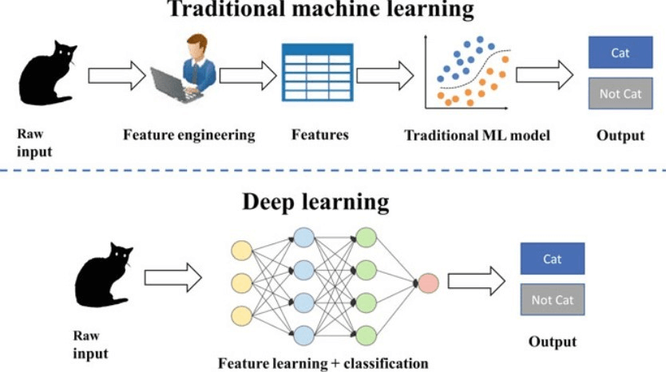
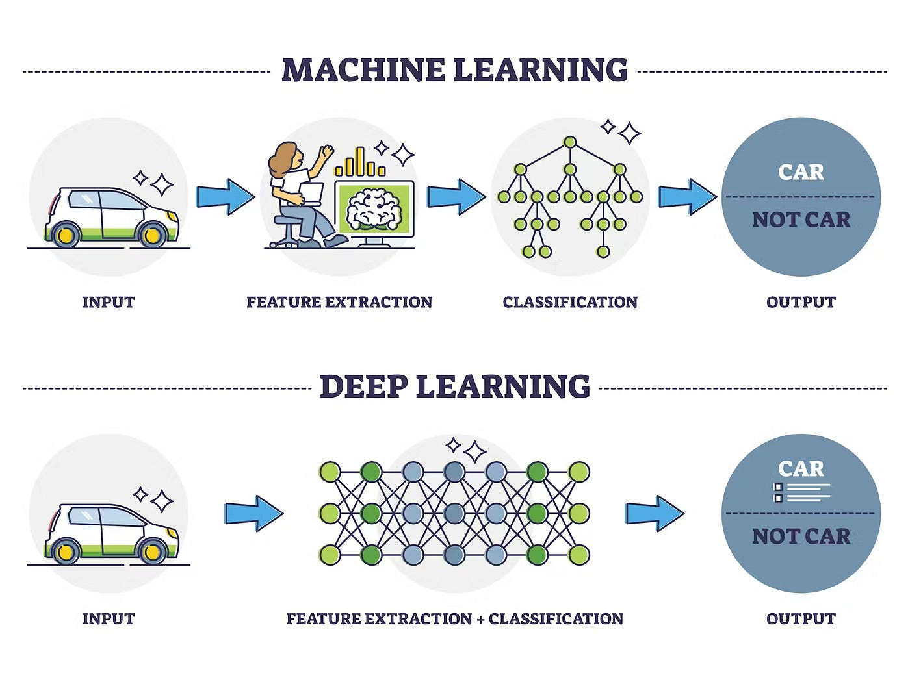
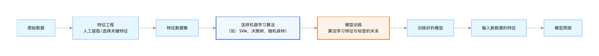
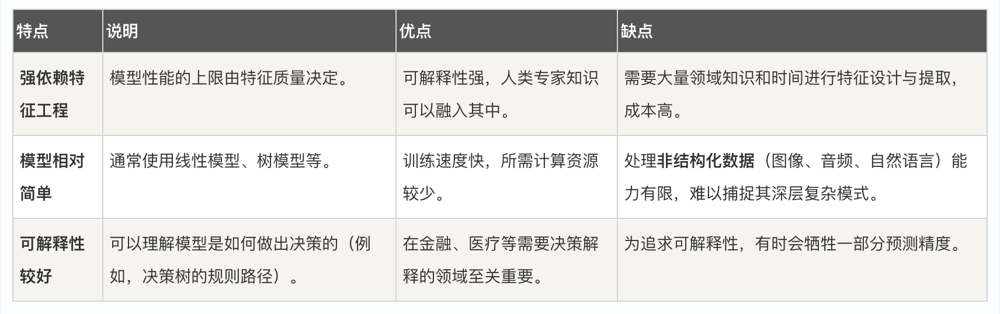
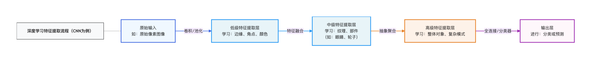
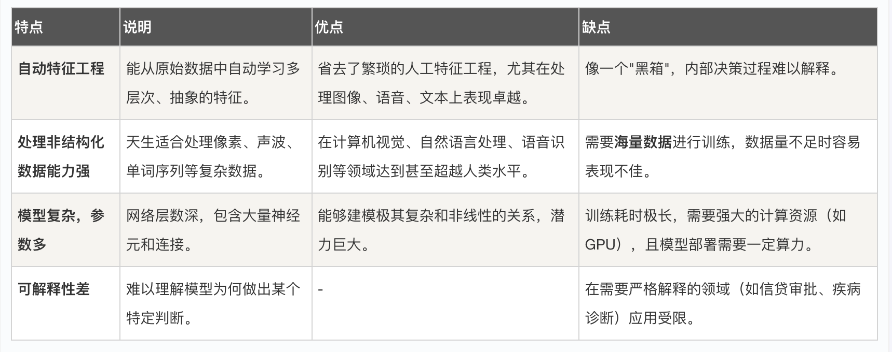
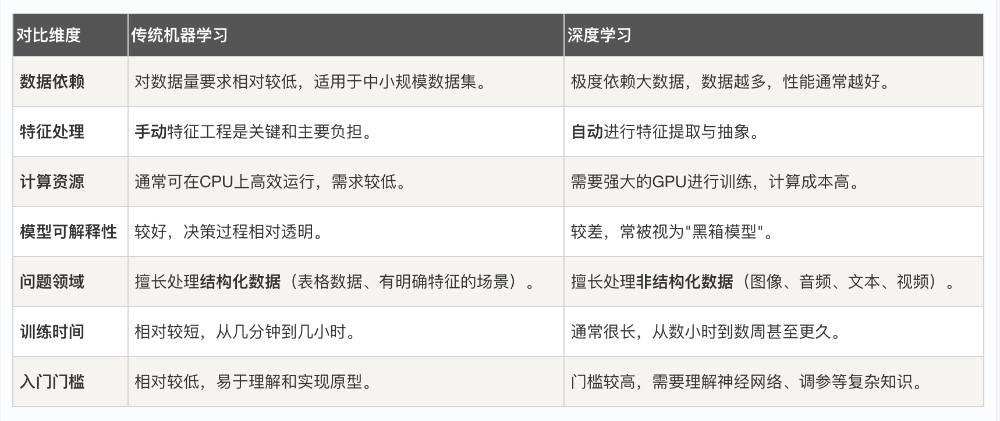

## 深度学习 vs 传统机器学习

想象一下，你正在教一个孩子识别猫和狗。传统的方法可能是：你拿出一本图画书，指着图片说这是猫，它有尖耳朵、胡须和一条长尾巴；这是狗，它的耳朵可能下垂，鼻子更长。你是在明确地告诉孩子区分两者的规则和特征。

而另一种方法则是：你给孩子看成千上万张猫和狗的图片，只是简单地告诉每张图片是猫还是狗。经过足够多的观察，孩子的大脑自己会总结出猫和狗那些难以言喻的、复杂的区别特征，比如毛发的纹理、眼睛的神态、身体的轮廓。这种方法更接近于让数据自己说话。

这两种教学方法，恰好对应了机器学习领域两大重要的范式：**传统机器学习** 和 **深度学习** 。本文将为初学者清晰地解析两者的核心思想、工作原理、优缺点以及适用场景，帮助你建立宏观的理解，并为后续的学习选择方向。

## 第一部分：传统机器学习 —— 基于规则与特征的分析师
传统机器学习可以看作是一位需要清晰指令和结构化数据的分析师。

### 什么是传统机器学习？
传统机器学习是一系列算法的集合，其核心思想是：从数据中学习规律（模型），并用这个规律对新的数据进行预测或决策。它的成功极度依赖于一个前置且关键的步骤：特征工程。

### 核心工作流程
让我们通过一个流程图来直观理解传统机器学习的工作过程：

#### 流程解析：

特征工程：这是最核心、最依赖人工智慧的环节。你需要从原始数据（如图像的像素、文本的单词）中，提取出对解决问题有帮助的、可量化的特征。例如，在垃圾邮件识别中，特征可能是是否包含免费一词、发件人地址是否在通讯录中等。
算法选择与训练：将处理好的特征数据输入给选定的算法（如支持向量机 SVM、决策树）。算法会尝试找到一个函数或规则，能够最好地根据这些特征来预测结果（如是垃圾邮件或不是）。
预测：当新邮件到来时，系统先提取同样的特征，然后交给训练好的模型进行判断。

### 主要特点与优缺点

简单比喻：传统机器学习就像一个拥有强大公式和统计工具，但必须由你亲自准备好所有分析材料的分析师。

## 第二部分：深度学习 —— 自动学习的感知者

深度学习是机器学习的一个子领域，它试图模仿人脑神经元的工作方式，让机器自动从原始数据中学习多层次的特征表示。

### 什么是深度学习？
深度学习的核心是人工神经网络，尤其是层数很深的深度神经网络。它的最大特点是能够端到端地学习：你输入最原始的数据（如图像的原始像素），它就能输出最终的结果（如图像类别），中间复杂的特征提取过程由网络自动完成。

### 核心工作架构
深度学习，特别是用于图像识别的卷积神经网络，其学习过程是分层的、由浅入深的：

#### 架构解析：
1 分层特征学习：网络的第一层可能只学会识别图像中的边缘和角点。第二层将这些边缘组合起来，学会识别简单的纹理和形状（如圆形、条纹）。更深的层则将这些简单形状组合成复杂的部件和对象（如眼睛、车门）。最后几层将这些部件组合成完整的对象概念（如猫、汽车）。
2 端到端学习：你不需要告诉网络什么是边缘或纹理。你只需要提供大量带标签的原始数据（图片和对应的猫/狗标签），通过反向传播算法，网络会自动调整内部数百万甚至数十亿的参数，自己学会哪些像素组合模式对应猫，哪些对应狗。

### 主要特点与优缺点

简单比喻：深度学习就像一个拥有多层信息处理网络、能通过大量观察自我成长的感知者，但它如何得出结论的过程却不太透明。

## 第三部分：关键对比与如何选择
现在，让我们将两者放在一起进行直接对比，并给出选择建议。

### 核心差异对比表

### 实践选择指南：我该用哪个？
你可以遵循以下决策思路：

#### 你的数据是什么类型的？
* 如果是结构化的表格数据（如Excel表格，包含年龄、收入、购买历史等列），优先考虑传统机器学习（如梯度提升树 XGBoost、随机森林）。
* 如果是图像、语音、文本或序列数据，深度学习（CNN、RNN、Transformer）通常是更优选择。

#### 你有多少数据？
* 数据量有限（几千到几万条）时，传统机器学习往往更稳健。
* 拥有海量数据（数十万以上）时，深度学习的威力才能充分发挥。

#### 你对模型解释性有要求吗？
* 在金融风控、医疗辅助诊断等场景，必须能解释为什么拒绝贷款或为什么怀疑此疾病，传统机器学习是更安全的选择。
* 在图像分类、语音助手、推荐系统等场景，效果优先，可接受黑箱，则深度学习占优。

#### 你的计算资源如何？
* 如果没有强大的GPU和充足时间，从传统机器学习开始是更务实的选择。

**一句话总结：传统机器学习是数据分析的艺术，而深度学习是感知与表示的科学。**  它们不是取代关系，而是互补的工具箱。一个优秀的AI实践者，应当根据具体问题，从工具箱中选择最合适的工具。