## 常见网络类型
想象一下，我们正在教一个孩子识别猫和狗。

最初，我们会给他看很多猫和狗的图片，并告诉他这是猫、这是狗，慢慢地，孩子的大脑会从这些图片中总结出规律：猫的耳朵通常是尖的，脸比较圆；狗的耳朵可能下垂，脸型更长，这个过程，本质上就是**学习特征和建立模式。**

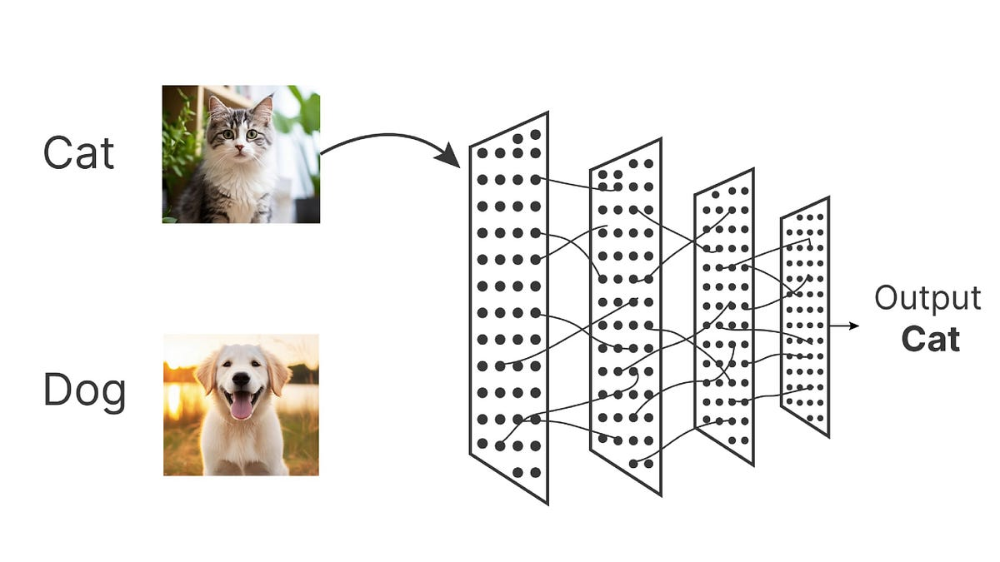

深度学习，作为机器学习的一个强大分支，其核心就是让计算机模拟这个过程，它通过构建多层的神经网络，让机器能够自动从海量数据中学习并提取复杂的特征，最终完成识别图像、理解语言、预测趋势等高级任务。而不同的任务，需要不同结构的网络来处理。本文将带你了解几种最核心、最常见的深度学习网络类型，理解它们的设计思想与典型应用。

### 深度学习网络

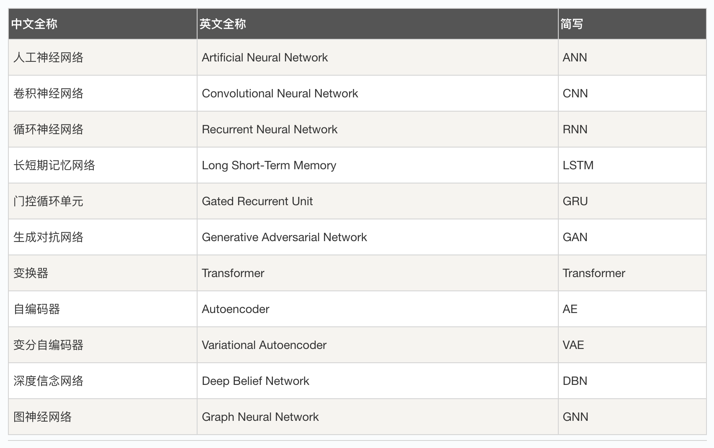


## 神经网络基础与全连接网络

在深入各类网络之前，我们需要理解最基础的模型——全连接网络，也称为多层感知机。

### 核心思想：万物皆可连接
全连接网络是深度学习中最直接的架构，顾名思义，每一层的每一个神经元都与相邻层的每一个神经元相连接。

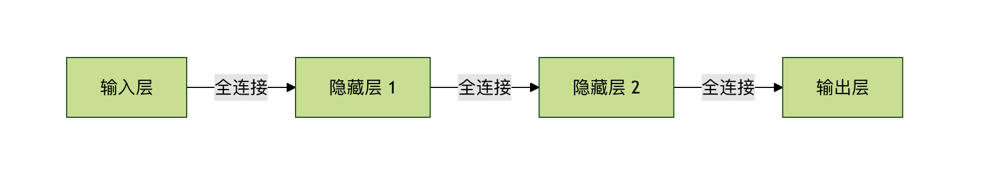

我们可以把它想象成一个极其密集的信息处理网络，数据从输入层进入，经过多个隐藏层的变换，最终从输出层得到结果。

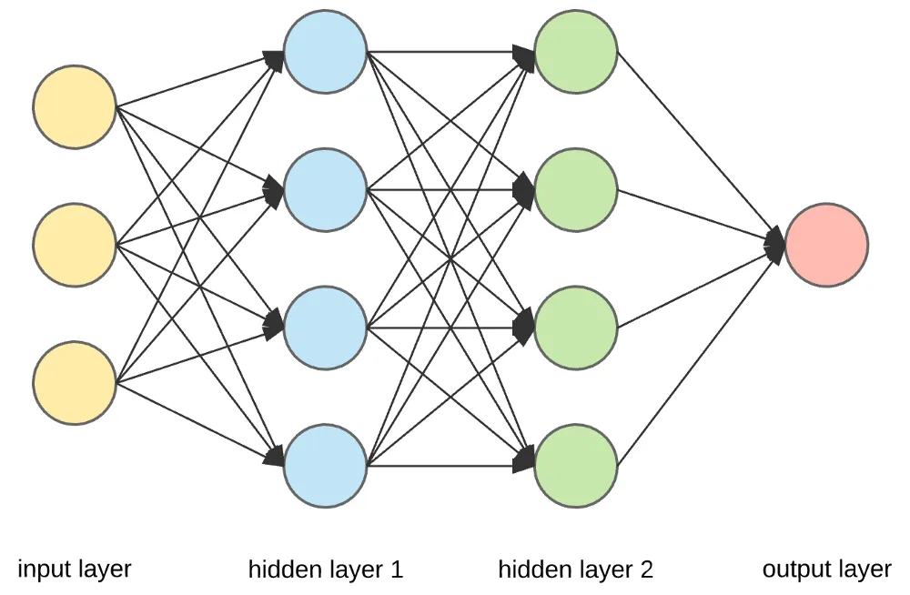

### 典型应用与局限性
应用：由于其强大的拟合能力，FCN 非常适合处理结构化数据（例如表格数据，如房价预测中的房屋面积、地段、房间数等）。

实例
```python
# 一个简单的全连接网络示例（使用 PyTorch）
import torch.nn as nn

class SimpleFCN(nn.Module):
    def __init__(self, input_size, num_classes):
        super(SimpleFCN, self).__init__()
        # 定义网络层
        self.fc1 = nn.Linear(input_size, 128)  # 第一隐藏层
        self.relu = nn.ReLU()                  # 激活函数
        self.fc2 = nn.Linear(128, 64)         # 第二隐藏层
        self.fc3 = nn.Linear(64, num_classes) # 输出层

    def forward(self, x):
        x = self.fc1(x)
        x = self.relu(x)
        x = self.fc2(x)
        x = self.relu(x)
        x = self.fc3(x)
        return x

# 假设输入是100维的特征，进行10分类
model = SimpleFCN(input_size=100, num_classes=10)
```
**局限性** ：当处理图像、语音等网格化数据时，FCN 会面临巨大挑战。因为图像中的像素在空间上是高度相关的，而 FCN 会忽略这种空间结构，将图像拍平为一维向量进行处理，导致参数数量爆炸且难以学习有效的空间特征。


## 卷积神经网络 —— 计算机视觉的基石
为了解决图像处理的问题，卷积神经网络 应运而生，它彻底改变了计算机视觉领域。

### 核心思想：局部感知与参数共享
CNN 的设计灵感来源于生物视觉皮层，其两大核心思想是：

* 局部感知：不像 FCN 那样让神经元连接整个图像，CNN 的每个神经元只感受图像的一小块局部区域（如 3x3 或 5x5 的像素块）。这更符合图像中相邻像素关联性更强的特性。
* 参数共享：使用同一个卷积核（或过滤器）在图像的不同位置进行滑动扫描，提取相同类型的特征（如边缘、纹理）。这极大地减少了网络参数。

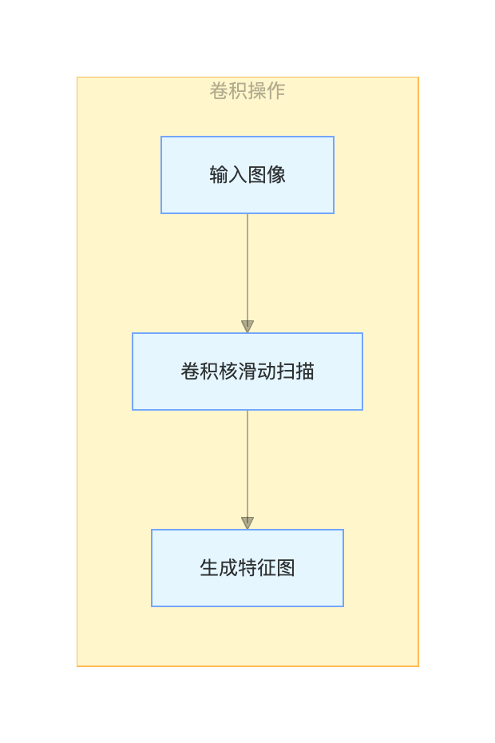

### 核心组件与典型应用
一个典型的 CNN 由以下组件堆叠而成：
* 卷积层：使用卷积核提取特征。
* 池化层（如最大池化）：对特征图进行下采样，减少数据量，增强特征不变性。
* 全连接层：在网络的最后，将学到的分布式特征映射到样本标记空间。
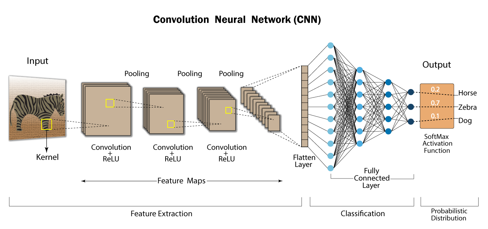
* 应用：图像分类、目标检测、人脸识别等几乎所有计算机视觉任务。

实例
```python
# 一个简单的CNN示例（用于图像分类）
class SimpleCNN(nn.Module):
    def __init__(self, num_classes=10):
        super(SimpleCNN, self).__init__()
        self.conv1 = nn.Conv2d(in_channels=3, out_channels=16, kernel_size=3, padding=1)
        self.pool = nn.MaxPool2d(kernel_size=2, stride=2)
        self.conv2 = nn.Conv2d(16, 32, 3, padding=1)
        self.fc1 = nn.Linear(32 * 8 * 8, 256) # 假设经过两次池化后特征图大小为8x8
        self.fc2 = nn.Linear(256, num_classes)

    def forward(self, x):
        x = self.pool(nn.functional.relu(self.conv1(x))) # 卷积 -> 激活 -> 池化
        x = self.pool(nn.functional.relu(self.conv2(x)))
        x = x.view(-1, 32 * 8 * 8) # 将特征图拍平成一维向量
        x = nn.functional.relu(self.fc1(x))
        x = self.fc2(x)
        return x
```

## 循环神经网络 —— 处理序列数据的专家
对于语言、语音、时间序列等具有**前后顺序依赖关系**的数据，我们需要一种能记住历史信息的网络，这就是 循环神经网络。
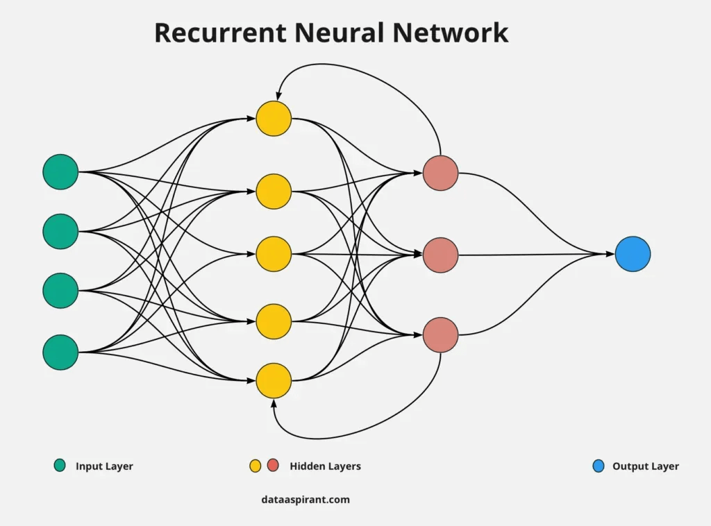
### 核心思想：引入记忆机制
RNN 的核心在于其循环结构。网络在处理当前输入时，会结合当前的输入和上一个时刻的隐藏状态，共同决定当前的输出和传递给下一个时刻的隐藏状态。这就像你在阅读一句话时，理解当前单词的含义需要依赖前面读过的单词。
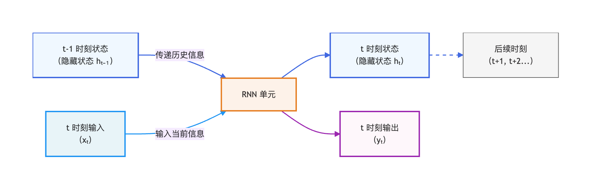
### 变体与典型应用
基础 RNN 存在长期依赖问题，难以学习长序列中的信息。因此产生了两个重要变体：
* 长短期记忆网络：通过精巧的门控机制（输入门、遗忘门、输出门），有选择地记住重要信息、忘记无用信息，有效解决了长序列依赖问题。
* 门控循环单元：LSTM 的一个简化版本，结构更简洁，计算效率更高，在许多任务上表现相当。

* 应用：机器翻译、文本生成、语音识别、股票价格预测。

实例
```python
# 一个简单的RNN示例（用于文本情感分类）
class SimpleRNN(nn.Module):
    def __init__(self, vocab_size, embed_size, hidden_size, num_classes):
        super(SimpleRNN, self).__init__()
        self.embedding = nn.Embedding(vocab_size, embed_size) # 词嵌入层
        self.rnn = nn.RNN(input_size=embed_size, hidden_size=hidden_size, batch_first=True)
        self.fc = nn.Linear(hidden_size, num_classes)

    def forward(self, x):
        # x 的形状: (batch_size, sequence_length)
        x = self.embedding(x) # 嵌入后: (batch_size, seq_len, embed_size)
        _, h_n = self.rnn(x)  # h_n 是最后一个时间步的隐藏状态
        out = self.fc(h_n.squeeze(0)) # 用最后的状态进行分类
        return out
```

## 生成对抗网络 —— 从学习到创造
如果说前几种网络是判别模型（学习区分数据），那么 生成对抗网络 则是生成式模型（学习创造数据）的杰出代表。
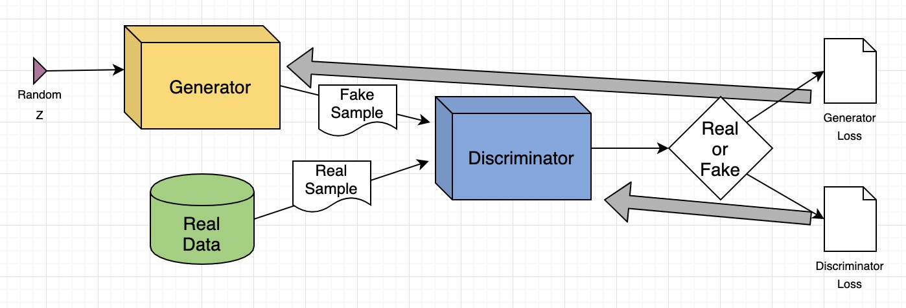

### 核心思想：博弈中进化
GAN 的灵感来自博弈论。它由两个相互对抗的网络组成：
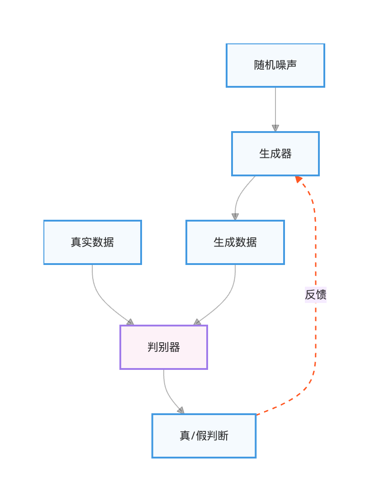
生成器：像一个造假者，目标是学习真实数据的分布，生成足以以假乱真的新数据。
判别器：像一个鉴定专家，目标是准确区分输入数据是来自真实数据集还是生成器。
两者在不断的对抗训练中共同进步：生成器努力生成更逼真的数据来骗过判别器，判别器则努力提高鉴别能力。最终，生成器能生成高质量的新数据。


### 典型应用
应用：图像生成、图像超分辨率、风格迁移、数据增强。

实例
```python
# GAN的核心训练循环伪代码示意
for epoch in range(num_epochs):
    # 1. 训练判别器：最大化判别真实数据为真、生成数据为假的能力
    real_data = get_real_data()
    noise = generate_random_noise()
    fake_data = generator(noise).detach() # 注意detach，防止生成器被更新

    d_loss_real = criterion(discriminator(real_data), real_labels)
    d_loss_fake = criterion(discriminator(fake_data), fake_labels)
    d_loss = d_loss_real + d_loss_fake
    d_loss.backward()
    optimizer_D.step()

    # 2. 训练生成器：最小化判别器将生成数据判为假的能力（即骗过判别器）
    noise = generate_random_noise()
    fake_data = generator(noise)
    g_loss = criterion(discriminator(fake_data), real_labels) # 让判别器认为生成的是真的
    g_loss.backward()
    optimizer_G.step()
```

## 总结与对比

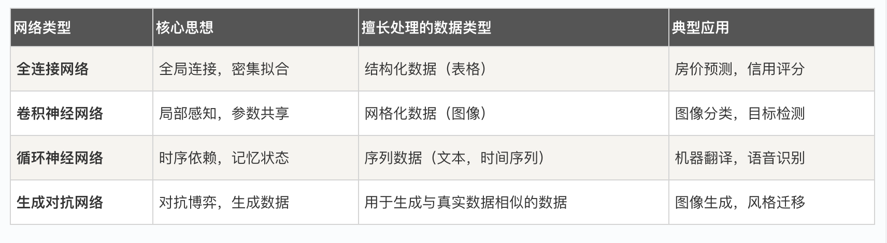