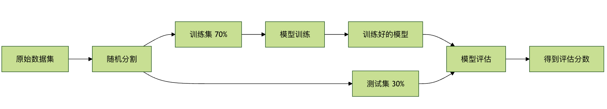
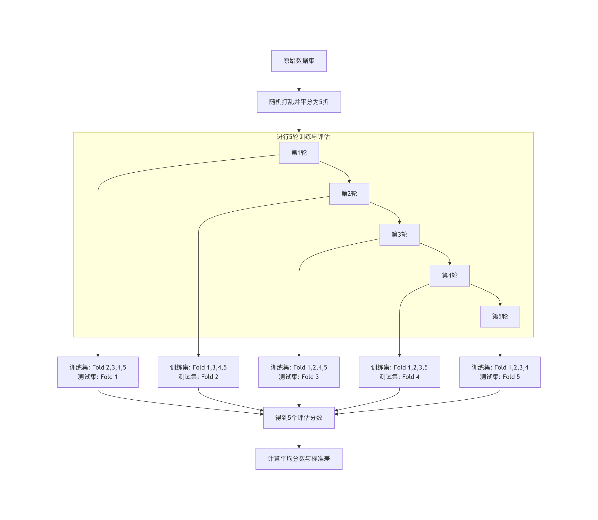

## 交叉验证

在机器学习的实践中，我们常常面临一个核心问题：如何评估一个模型的好坏？你可能会想到，用一部分数据训练模型，然后用另一部分没见过的数据来测试它的表现。这个思路完全正确，但具体怎么做才能更可靠、更稳定地评估模型呢？这就是 交叉验证 要解决的核心问题。
简单来说，交叉验证是一种通过反复划分数据集来评估模型泛化能力（即处理新数据的能力）的统计方法，它就像给模型安排了一场模拟考试，通过多套不同的模拟试卷（数据子集）来检验其真实水平，避免因一次考试的偶然性而误判。
本文将带你深入理解交叉验证的原理、常见方法及其在模型优化与工程化中的关键作用。

### 为什么需要交叉验证？
在深入技术细节前，我们先通过一个比喻来理解其必要性。
想象你是一名学生，要参加一场重要的数学考试，评估你水平的方法有两种：
* 方法 A（简单划分）：老师从题库里随机抽 10 道题给你做一次模拟考，就用这个分数预测你的最终考试成绩。
* 方法 B（交叉验证）：老师把题库分成 5 份。第一次，用第 2、3、4、5 份题训练你，用第1份测试；第二次，用第 1、3、4、5 份训练，用第 2 份测试……如此重复 5 次。最后，取 5 次测试成绩的平均值来评估你。
哪种方法更可靠？显然是方法 B。

* 方法 A的风险在于：如果抽到的 10 道题恰好都是你擅长的题型，你的模拟考分数会虚高，导致对真实水平过于乐观；反之，如果抽到的都是你的知识盲点，分数又会过低，导致过于悲观。评估结果波动大，不稳定。
* 方法 B通过多次、不同的训练/测试组合，让你经历了题库中各种题型的考验，得到的平均分数更能代表你的综合、稳定水平，预测最终考试结果也更准确。

在机器学习中：
* 题库 就是我们的整个数据集。
* 学生 就是我们要训练的机器学习模型。
* 模拟考分数 就是模型的评估指标（如准确率、均方误差等）。
* 最终考试 就是模型在未来真实、未知数据上的表现。

交叉验证的核心目标，就是提供一个对模型泛化能力更稳健、更无偏的估计，从而帮助我们进行更可靠的模型选择、参数调优和性能评估。

### 交叉验证的常见方法

交叉验证有多种实现方式，适用于不同的数据和场景，下面介绍最常用的几种。

#### 1、留出法 Hold-Out Validation
这是最简单、最直观的方法。
实例
```python
import numpy as np
from sklearn.model_selection import train_test_split
from sklearn.ensemble import RandomForestClassifier
from sklearn.metrics import accuracy_score

# 构造可运行的数据
# 200 条样本，4 个特征，二分类
np.random.seed(42)
X = np.random.randn(200, 4)
y = (X[:, 0] + X[:, 1] * 0.7 - X[:, 2] * 0.4 > 0).astype(int)

# 1. 划分训练集和测试集（7:3）
X_train, X_test, y_train, y_test = train_test_split(
    X, y, test_size=0.3, random_state=42
)

# 2. 训练模型
model = RandomForestClassifier(random_state=42)
model.fit(X_train, y_train)

# 3. 测试集评估
y_pred = model.predict(X_test)
accuracy = accuracy_score(y_test, y_pred)

print(f"模型准确率: {accuracy:.4f}")
```

输出结果：
```
模型准确率: 0.8833
```

流程说明：


优点： 简单快捷，计算成本低。
缺点： 评估结果高度依赖于单次随机划分。如果划分不幸运，评估结果可能不具有代表性。同时，由于测试集只使用了一次，数据利用不充分。


#### 2. K 折交叉验证 K-Fold Cross Validation
这是目前最常用、最标准的交叉验证方法。

**原理**： 将数据集均匀地随机分成 K 个互斥的子集（称为折或 Fold）。

每次实验，轮流将其中一个子集作为测试集，剩下的 K-1 个子集作为训练集。这个过程重复 K 次，确保每个子集都被用作一次测试集。最终，我们得到 K 个评估分数，取其平均值作为模型的最终性能估计。

实例
```python
import numpy as np
from sklearn.model_selection import cross_val_score, KFold
from sklearn.linear_model import LogisticRegression

# 构造可运行的示例数据
# 100 条样本，4 个特征，二分类标签
np.random.seed(42)
X = np.random.randn(100, 4)
y = (X[:, 0] + X[:, 1] * 0.5 > 0).astype(int)

# 1. 初始化模型
model = LogisticRegression(max_iter=1000)

# 2. 定义 K 折交叉验证拆分器（K=5）
kfold = KFold(n_splits=5, shuffle=True, random_state=42)

# 3. 执行交叉验证
scores = cross_val_score(model, X, y, cv=kfold, scoring='accuracy')

print(f"每次折叠的准确率: {scores}")
print(f"平均准确率: {scores.mean():.4f} (+/- {scores.std() * 2:.4f})")

```
```
每次折叠的准确率: [0.9  0.95 1.   0.95 1.  ]
平均准确率: 0.9600 (+/- 0.0748)

```

K=5 时的流程示意图：



**如何选择 K 值？**
* 常用值：5 或 10。这是一个经验性的权衡。
* K 值较小（如 3）：训练集更大，但评估次数少，估计的方差可能较大。
* K 值较大（如 10 或 20）：评估更稳定（方差小），但每次训练集与原始数据集更接近，可能带来更乐观的估计偏差，且计算成本显著增加。
* 极端情况 K = N（样本数）：这就是留一法，每次只用一个样本测试。评估最无偏，但计算成本极高，通常只用于极小数据集。

优点： 数据利用充分，评估结果稳定可靠。
缺点： 计算成本是留出法的 K 倍。

#### 3. 分层K折交叉验证 Stratified K-Fold Cross Validation
这是 K 折交叉验证的一个重要变体，特别适用于分类问题中类别分布不平衡的数据集。

解决的问题： 在普通的 K 折交叉验证中，随机分割可能导致某些折中某个类别的样本比例与原始数据集相差很大。例如，一个数据集中有 90% 的正类和 10% 的负类，随机分 5 折，有可能某一折里全是正类，没有负类，这会导致在该折上的评估失去意义。

分层 K 折交叉验证在分割时，会确保每一折中各个类别的样本比例与原始数据集中的总体比例保持一致。

实例
```python
from sklearn.model_selection import StratifiedKFold, cross_val_score

# 使用方式与 KFold 几乎相同，只需替换拆分器
stratified_kfold = StratifiedKFold(n_splits=5, shuffle=True, random_state=42)
scores = cross_val_score(model, X, y, cv=stratified_kfold, scoring='accuracy')
```

对于分类任务，尤其是在类别不平衡时，优先使用 StratifiedKFold。

#### 4. 时间序列交叉验证 Time Series Split

对于时间序列数据，数据的顺序至关重要（明天的数据依赖于今天和昨天的）。我们不能随机打乱数据，必须保持时间顺序。

其原理是：训练集总是由时间上较早的数据构成，测试集是紧随其后的数据。随着折数增加，训练集窗口不断扩大。

实例
```python
import numpy as np
from sklearn.model_selection import TimeSeriesSplit

# 构造可运行的时间序列数据
# 100 个时间点，2 个特征
np.random.seed(42)
X = np.random.randn(100, 2)

# TimeSeriesSplit 示例
tscv = TimeSeriesSplit(n_splits=5)

for train_index, test_index in tscv.split(X):
    print(f"训练集索引范围: {train_index[0]} 到 {train_index[-1]}")
    print(f"测试集索引范围: {test_index[0]} 到 {test_index[-1]}")
    print("---")

```
输出：

```
训练集索引范围: 0 到 19
测试集索引范围: 20 到 35
---
训练集索引范围: 0 到 35
测试集索引范围: 36 到 51
---
训练集索引范围: 0 到 51
测试集索引范围: 52 到 67
---
训练集索引范围: 0 到 67
测试集索引范围: 68 到 83
---
训练集索引范围: 0 到 83
测试集索引范围: 84 到 99
---
```

### 交叉验证在模型工程化中的应用
交叉验证不仅是评估工具，更是模型优化与工程化流程中的核心环节。

#### 应用一：模型选择与比较
当需要在多个候选模型（如线性回归、决策树、支持向量机）中选择一个时，我们不能用测试集来选（否则测试集就变成了训练过程的一部分，会"泄漏"信息）。正确的做法是：

对每个候选模型，在训练集上使用交叉验证得到其性能估计。
比较这些交叉验证的平均分数，选择分数最高的模型。
最后，用这个选出的模型在整个训练集上重新训练，并用独立的测试集做最终的一次性评估，报告这个分数作为模型的最终性能。
实例
```python
import numpy as np
from sklearn.model_selection import cross_val_score, StratifiedKFold, train_test_split
from sklearn.linear_model import LogisticRegression
from sklearn.svm import SVC
from sklearn.tree import DecisionTreeClassifier

# 构造可运行的分类数据
# 200 条样本，4 个特征，二分类
np.random.seed(42)
X = np.random.randn(200, 4)
y = (X[:, 0] + X[:, 1] * 0.8 - X[:, 2] * 0.3 > 0).astype(int)

# 划分训练集 / 测试集
X_train, X_test, y_train, y_test = train_test_split(
    X, y, test_size=0.25, random_state=42, stratify=y
)

# 定义模型
models = {
    'Logistic Regression': LogisticRegression(max_iter=1000),
    'SVM': SVC(),
    'Decision Tree': DecisionTreeClassifier()
}

# 分层 K 折交叉验证
cv = StratifiedKFold(n_splits=5, shuffle=True, random_state=42)
results = {}

# 交叉验证评估
for name, model in models.items():
    scores = cross_val_score(model, X_train, y_train, cv=cv, scoring='accuracy')
    results[name] = scores.mean()
    print(f"{name} 平均准确率: {scores.mean():.4f}")

# 选择最佳模型
best_model_name = max(results, key=results.get)
print(f"\n根据交叉验证，最佳模型是: {best_model_name}")

# 最终训练与测试集评估
best_model = models[best_model_name]
best_model.fit(X_train, y_train)
final_score = best_model.score(X_test, y_test)
print(f"最佳模型在独立测试集上的最终准确率: {final_score:.4f}")
```
输出：
```
Logistic Regression 平均准确率: 0.9533
SVM 平均准确率: 0.9400
Decision Tree 平均准确率: 0.8467

根据交叉验证，最佳模型是: Logistic Regression
最佳模型在独立测试集上的最终准确率: 1.0000
```
#### 应用二：超参数调优
超参数是模型训练前需要设定的参数（如随机森林的树数量 n_estimators、SVM 的惩罚系数 C）。寻找最佳超参数组合的过程称为超参数调优，交叉验证是其标准评估方法。

最常用的方法是 网格搜索交叉验证。

实例
```python
import numpy as np
from sklearn.model_selection import GridSearchCV, train_test_split
from sklearn.ensemble import RandomForestClassifier

# 构造可运行的分类数据
# 300 条样本，5 个特征，二分类
np.random.seed(42)
X = np.random.randn(300, 5)
y = (X[:, 0] * 0.6 + X[:, 1] * 0.4 - X[:, 2] > 0).astype(int)

# 划分训练集 / 测试集
X_train, X_test, y_train, y_test = train_test_split(
    X, y, test_size=0.25, random_state=42, stratify=y
)

# 1. 参数网格
param_grid = {
    'n_estimators': [50, 100, 200],
    'max_depth': [None, 10, 20],
    'min_samples_split': [2, 5, 10]
}

# 2. 基础模型
rf = RandomForestClassifier(random_state=42)

# 3. GridSearchCV
grid_search = GridSearchCV(
    estimator=rf,
    param_grid=param_grid,
    cv=5,
    scoring='accuracy',
    n_jobs=-1
)

# 4. 网格搜索（仅训练集）
grid_search.fit(X_train, y_train)

# 5. 最优参数与分数
print(f"最佳参数: {grid_search.best_params_}")
print(f"最佳交叉验证分数: {grid_search.best_score_:.4f}")

# 6. 测试集评估
best_rf_model = grid_search.best_estimator_
test_accuracy = best_rf_model.score(X_test, y_test)
print(f"调优后模型在测试集上的准确率: {test_accuracy:.4f}")
```

输出：
```
最佳参数: {'max_depth': None, 'min_samples_split': 2, 'n_estimators': 100}
最佳交叉验证分数: 0.9067
调优后模型在测试集上的准确率: 0.9467
```
* 关键点： GridSearchCV 内部已经完成了交叉验证。它将训练集 X_train 进一步拆分成更小的"训练子集"和"验证子集"来评估参数，因此我们传入的 X_train 相当于整个"题库"，而 X_test 是始终未参与调优过程的、最终检验用的"终极考题"。

### 实践练习与总结
#### 动手练习
1 基础实现：使用 sklearn 自带的鸢尾花数据集，分别用 train_test_split 和 cross_val_score (K=5) 训练并评估一个 KNeighborsClassifier，对比两种评估方法得到的分数。
2 模型比较：在同一个数据集上，使用交叉验证比较 SVC、RandomForestClassifier 和 GradientBoostingClassifier 的性能。
3 参数调优：为 SVC 模型设计一个参数网格（包含 C 和 gamma），使用 GridSearchCV 找到最优参数。

#### 核心要点总结
* 交叉验证的目的：获得对模型泛化能力更稳健、更可靠的估计。
* 核心方法：K折交叉验证是黄金标准，分类问题优先使用分层K折交叉验证。
* 关键区别：
    训练集/验证集：用于模型训练和开发过程中的评估（如选择模型、调参）。交叉验证发生在这个阶段。
    测试集：只在所有开发完成后，用于最终的一次性性能报告。必须严格隔离，绝不能用于任何决策。
* 工程化角色：交叉验证是连接模型开发（训练、调参）与模型评估（测试）的桥梁，是确保模型质量、防止过拟合、实现可靠模型选择与优化的基石。

