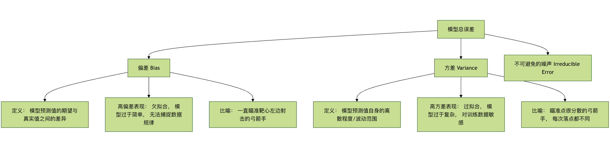
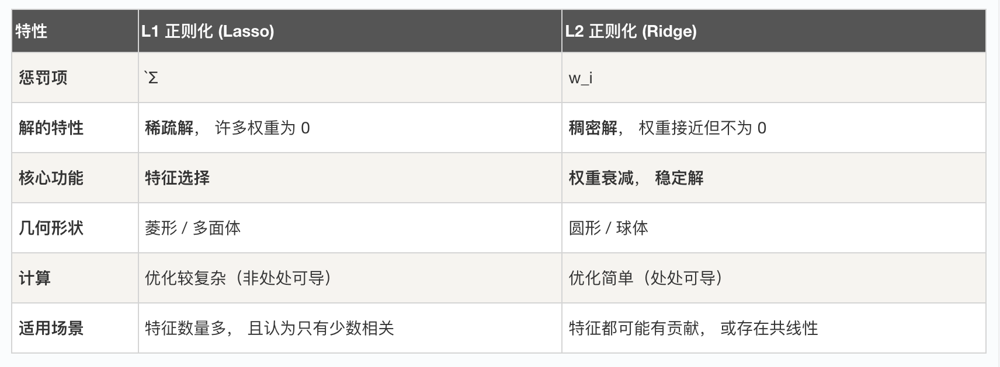

## 正则化
想象一下，我们正在学习骑自行车，一开始，可能会非常紧张，双手紧紧抓住车把，身体僵硬，试图记住每一个动作细节。这种过度关注细节、试图完美控制每一个微小动作的状态，在机器学习中被称为 过拟合。

我们的模型（就像初学时的你）过于复杂，完美地记住了训练数据中的每一个样本，甚至包括噪声和随机波动，导致它在面对新的、未见过的数据（比如实际骑行上路）时，表现得很差，缺乏泛化能力。

正则化 就是为解决这个问题而生的核心技术，它的核心思想是：给模型的学习热情降降温，防止它钻牛角尖，从而提升其在新环境下的适应能力。简单来说，正则化通过在模型训练的目标函数（损失函数）中增加一个额外的惩罚项，来限制模型的复杂度，避免其过度依赖训练数据中的特定模式。

本文将带你深入理解正则化的原理、常见方法及其在工程实践中的应用。

### 基本概念：偏差与方差的权衡
在深入正则化之前，我们需要理解机器学习模型误差的两个核心来源：偏差 和 方差。这有助于我们明白正则化究竟在调整什么。



* 偏差 衡量的是模型本身的系统性错误。高偏差意味着模型太简单，连训练数据中的基本模式都没学好（欠拟合）。
* 方差 衡量的是模型对训练数据中随机波动的敏感程度。高方差意味着模型太复杂，把训练数据中的噪声也当成了规律来学习（过拟合）。
我们的目标是找到一个 **偏差-方差权衡** 的最佳点，使总误差最小。正则化就是通过增加一点偏差（让模型稍微变简单）来显著降低方差，从而提升模型整体泛化性能的有效手段。

### L1 与 L2 正则化
最经典的正则化方法是在损失函数中直接添加一个基于模型权重参数的惩罚项。根据惩罚项的计算方式不同，主要分为 L1 和 L2 正则化。

#### 损失函数的变化
未正则化的损失函数（以均方误差 MSE 为例）： Loss = (1/n) * Σ(真实值 - 预测值)²

加入正则化项后的损失函数： Loss_正则化 = Loss + λ * Penalty(权重)

其中：
λ (lambda) 是 正则化强度系数，一个大于 0 的超参数。它控制着惩罚的力度。λ 越大，对模型复杂度的惩罚越重，模型会变得更简单。
Penalty(权重) 就是惩罚项，L1 和 L2 的定义不同。

#### L1 正则化 (Lasso Regression)
惩罚项： 模型所有权重参数的绝对值之和。
公式： Penalty = Σ|w_i|， 其中 w_i 是第 i 个权重。
损失函数： Loss_L1 = Loss + λ * Σ|w_i|
核心特点与效果：

特征选择： L1 正则化倾向于产生稀疏的权重矩阵，即它会将许多不重要的特征的权重直接压缩到 0。这相当于自动完成了特征选择，模型只保留那些最重要的特征。
几何解释： 其约束条件在几何上是一个"菱形"（在二维上是菱形）。最优解点更容易碰到这个菱形的"角"，而角上的点意味着某些坐标为 0。
代码示例：

实例
```python
from sklearn.linear_model import Lasso
from sklearn.datasets import make_regression
from sklearn.model_selection import train_test_split

# 生成模拟数据
X, y = make_regression(n_samples=100, n_features=10, noise=0.1, random_state=42)
X_train, X_test, y_train, y_test = train_test_split(X, y, test_size=0.2, random_state=42)

# 创建 L1 正则化模型 (Lasso)， 设置正则化强度 alpha (即 λ)
lasso_model = Lasso(alpha=0.1) # alpha 越大， 惩罚越强， 更多权重为 0
lasso_model.fit(X_train, y_train)

# 查看模型系数（权重）， 观察稀疏性
print("Lasso 模型系数：")
for i, coef in enumerate(lasso_model.coef_):
    print(f"  特征 {i}: {coef:.4f}")

# 统计非零权重的数量
non_zero_count = sum(lasso_model.coef_ != 0)
print(f"\n非零权重的特征数量： {non_zero_count} / {X.shape[1]}")
```
输出：
```
Lasso 模型系数：
  特征 0: 16.6855
  特征 1: 54.0447
  特征 2: 5.0302
  特征 3: 63.5492
  特征 4: 93.4587
  特征 5: 70.5421
  特征 6: 86.9569
  特征 7: 10.2711
  特征 8: 3.0697
  特征 9: 70.7835

非零权重的特征数量： 10 / 10
```

#### L2 正则化 (Ridge Regression)
* 惩罚项： 模型所有权重参数的平方和。
* 公式： Penalty = Σ(w_i)²
* 损失函数： Loss_L2 = Loss + λ * Σ(w_i)²

##### 核心特点与效果：
* 权重衰减： L2 正则化倾向于让所有权重参数都趋近于 0，但通常不等于 0。它均匀地缩小所有权重，防止任何单个权重变得过大。
* 改善病态问题： 对于特征之间存在多重共线性（高度相关）的数据，普通线性回归可能不稳定，L2 正则化能有效改善这个问题，使解更稳定。
* 几何解释： 其约束条件在几何上是一个"圆形"（在二维上是圆形）。最优解点更容易碰到这个圆形的"边"，而不是尖角。
代码示例：

实例
```python
from sklearn.linear_model import Ridge

# 创建 L2 正则化模型 (Ridge)
ridge_model = Ridge(alpha=1.0) # alpha 即 λ
ridge_model.fit(X_train, y_train)

# 查看模型系数， 观察权重衰减
print("Ridge 模型系数：")
for i, coef in enumerate(ridge_model.coef_):
    print(f"  特征 {i}: {coef:.4f}")

# 对比 Lasso 和 Ridge 的系数差异
print("\n系数对比 (Lasso vs Ridge):")
print("特征 | Lasso 系数 | Ridge 系数")
print("-" * 35)
for i in range(len(lasso_model.coef_)):
    print(f"{i:4d} | {lasso_model.coef_[i]:11.4f} | {ridge_model.coef_[i]:11.4f}")

```

#### L1 与 L2 对比总结


#### 弹性网络 (Elastic Net)
弹性网络是 L1 和 L2 正则化的折中方案，同时包含两者的惩罚项。 Loss_ElasticNet = Loss + λ1 * Σ|w_i| + λ2 * Σ(w_i)²

它结合了 L1 的特征选择能力和 L2 的稳定性，适用于特征维度非常高且特征间存在相关性的情况。

实例
```python
from sklearn.linear_model import ElasticNet

elastic_model = ElasticNet(alpha=0.1, l1_ratio=0.5) # l1_ratio 控制 L1 和 L2 的混合比例
elastic_model.fit(X_train, y_train)
```

#### 其他正则化技术
除了直接修改损失函数，还有一些通过改变训练过程或模型结构来实现正则化的方法。

##### Dropout (用于神经网络)
Dropout 是神经网络中极其有效的正则化技术。它在**训练过程中**，随机让网络中的一部分神经元暂时"失活"（将其输出置为0）。

###### 工作原理：
在每个训练批次（batch）中，以概率 p (如 0.5) 随机丢弃一部分神经元。
前向传播和反向传播只在剩下的神经元中进行。
在测试或预测时，使用所有的神经元，但神经元的输出要乘以 (1-p) 以保持期望值一致。
**核心思想**： 防止神经元之间产生复杂的协同适应，迫使网络学习到更加鲁棒和分散的特征表示。这好比一个团队，不能总依赖某几个核心成员，每个人都需要具备独立工作的能力，这样即使有人缺席，团队也能正常运转。

代码示例 (使用 TensorFlow/Keras)：

实例

```python
import tensorflow as tf
from tensorflow.keras.models import Sequential
from tensorflow.keras.layers import Dense, Dropout

model = Sequential([
    Dense(128, activation='relu', input_shape=(input_dim,)),
    Dropout(0.5), # 在上一层后添加 Dropout 层， 丢弃率 50%
    Dense(64, activation='relu'),
    Dropout(0.3), # 丢弃率 30%
    Dense(1, activation='sigmoid') # 输出层
])

model.compile(optimizer='adam', loss='binary_crossentropy', metrics=['accuracy'])
```

##### 早停法
早停法是一种简单而高效的正则化策略。它不修改损失函数，而是监控模型在验证集上的性能。

**操作步骤：*
* 将数据分为训练集和验证集。
* 在训练集上训练模型，并周期性地在验证集上评估性能（如每训练一个 epoch 后）。
* 一旦发现验证集上的性能（如损失）在连续多个周期内不再提升甚至开始下降，就立即停止训练。
**核心思想** ： 在模型即将开始过拟合训练数据（即验证集误差开始上升）的那个时刻停止训练，从而获得泛化能力最佳的模型权重。

实例
```python
from tensorflow.keras.callbacks import EarlyStopping

# 定义早停回调函数
# monitor: 监控的指标， 如 'val_loss'
# patience: 容忍轮次， 验证集性能在这么多轮内不改善则停止
# restore_best_weights: 是否恢复到监控指标最好的那个 epoch 的权重
early_stopping = EarlyStopping(
    monitor='val_loss',
    patience=10,
    restore_best_weights=True
)

# 在 model.fit 中使用
history = model.fit(
    X_train, y_train,
    validation_data=(X_val, y_val),
    epochs=100,
    callbacks=[early_stopping] # 传入回调函数列表
)

```


#### 实践练习：综合比较正则化效果
让我们通过一个完整的例子，比较不同正则化方法在一个回归任务上的效果。

实例
```python
import numpy as np
import matplotlib.pyplot as plt
from sklearn.linear_model import LinearRegression, Lasso, Ridge, ElasticNet
from sklearn.preprocessing import PolynomialFeatures
from sklearn.pipeline import make_pipeline
from sklearn.metrics import mean_squared_error

# 1. 生成带有噪声的非线性数据
np.random.seed(42)
X = np.linspace(-3, 3, 100).reshape(-1, 1)
y_true = 0.5 * X.ravel()**2 + X.ravel() # 真实的二次关系
y = y_true + np.random.randn(100) * 0.8 # 添加噪声

# 2. 创建不同复杂度的模型（使用多项式特征）
degree = 10 # 使用 10 次多项式， 这很容易过拟合

models = {
    '无正则化': make_pipeline(PolynomialFeatures(degree), LinearRegression()),
    'L1 (Lasso)': make_pipeline(PolynomialFeatures(degree), Lasso(alpha=0.01, max_iter=10000)),
    'L2 (Ridge)': make_pipeline(PolynomialFeatures(degree), Ridge(alpha=0.1)),
    'ElasticNet': make_pipeline(PolynomialFeatures(degree), ElasticNet(alpha=0.01, l1_ratio=0.5))
}

# 3. 训练并预测
X_plot = np.linspace(-3.5, 3.5, 200).reshape(-1, 1)
plt.figure(figsize=(12, 8))
plt.scatter(X, y, s=20, alpha=0.6, label='训练数据 (含噪声)')
plt.plot(X, y_true, 'k-', linewidth=3, label='真实函数')

for name, model in models.items():
    model.fit(X, y)
    y_plot = model.predict(X_plot)
    mse = mean_squared_error(y, model.predict(X))
    plt.plot(X_plot, y_plot, '--', linewidth=2, label=f'{name} (MSE: {mse:.3f})')

plt.xlabel('X')
plt.ylabel('y')
plt.title('不同正则化方法对过拟合的抑制效果对比 (10次多项式)')
plt.legend(loc='best')
plt.grid(True, alpha=0.3)
plt.show()
```

**练习任务：**
运行上述代码，观察无正则化的模型如何剧烈波动以拟合噪声（过拟合），而正则化后的模型曲线如何更加平滑，更接近真实函数。
尝试调整 degree（多项式阶数）和各个模型的 alpha（正则化强度）参数，观察它们对模型拟合效果的影响。
（进阶）将数据划分为训练集和测试集，计算各模型在测试集上的 MSE，验证正则化对泛化能力的提升。


#### 总结与工程化建议
正则化是机器学习工程师工具箱中的必备利器。要有效地应用它，请记住以下要点：

* 理解问题本质： 首先通过学习曲线、验证集表现等判断模型是否面临过拟合（高方差）问题。
* 从简单开始： 通常可以先尝试 L2 正则化，因为它稳定且易于调优。如果特征维度极高且需要特征选择，再考虑 L1 或 弹性网络。
* 调参是关键： 正则化强度 λ (或 alpha) 是一个至关重要的超参数。必须通过交叉验证来仔细选择。
* 组合使用： 在实践中，正则化技术常常组合使用。例如，在训练深度神经网络时，Dropout + L2 权重衰减 + 早停法 是极其常见的组合拳。
* 领域适配： 对于计算机视觉任务，Dropout 和 Batch Normalization（也具有一定的正则化效果）非常有效。对于序列模型（如RNN、Transformer），则常用 Dropout 和权重衰减。

正则化的最终目标，是引导模型从"死记硬背"的训练数据，走向"深刻理解"数据背后的普遍规律，从而在真实世界中做出更可靠的预测。掌握它，你就掌握了提升模型泛化能力的关键钥匙。


