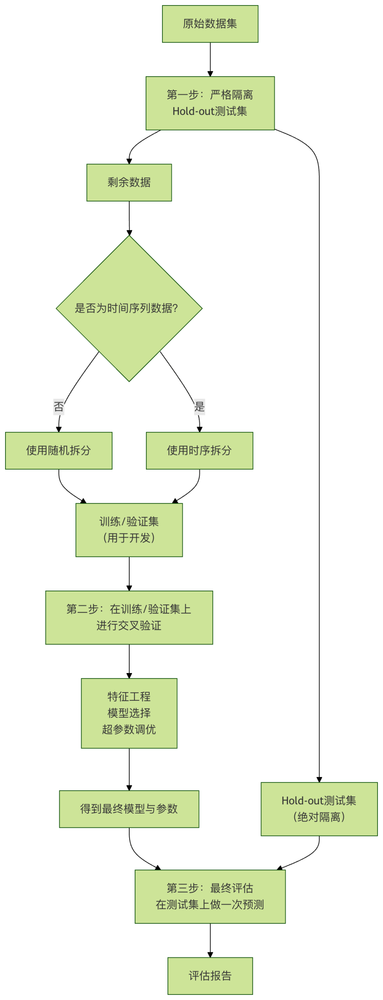

## 数据泄漏

在机器学习的实践中，我们常常会遇到一个令人困惑的现象：模型在训练集和验证集上表现优异，各项指标都接近完美，但一旦部署到真实的生产环境中，其性能就会断崖式下跌，变得几乎不可用。这种巨大的落差背后，一个最常见、也最危险的隐形杀手就是 数据泄漏。

数据泄漏是机器学习项目失败的一个主要原因，它破坏了模型评估的公正性，导致我们对模型性能产生盲目乐观的误判。理解、识别并预防数据泄漏，是每一位机器学习工程师和数据科学家必须掌握的核心工程化技能。

本文将带你系统地认识数据泄漏，理解其发生机制，学习诊断方法，并掌握一套有效的预防策略。

### 什么是数据泄漏？
#### 核心定义
**数据泄漏**，是指在模型训练过程中，不恰当地使用了在真实预测场景下无法获得的信息，导致模型学习到了本不该知道的"未来信息"或"全局信息"，从而在评估时产生过于乐观、但实际无效的性能表现。

简单来说，就是模型在"考试"前偷偷看了"答案"。这会让它在模拟考试（验证集）中取得高分，但在真正的、没有答案的考试（生产环境）中一败涂地。

#### 一个生动的比喻
想象你在教一个学生识别动物的图片。

* 正确的做法：你给他看一些猫和狗的图片（训练集），告诉他哪些是猫，哪些是狗。然后，你拿出一些他从未见过的新图片（测试集），让他来识别。
* 数据泄漏的做法：你在给他看训练图片时，不小心把一些测试集的图片也混了进去，并且告诉了他答案。结果，这个学生在面对真正的"新"图片时，其实早就见过并记住了答案。他看似学得很好，但实际上并没有学会"根据特征识别动物"这个通用能力，只是记住了特定图片的答案。

### 数据泄漏的常见类型与场景
数据泄漏并非总是显而易见，它常常隐藏在数据处理流程的细节中。主要可以分为以下两大类：

#### 1. 特征中的数据泄漏
这是最常见的一种类型，即用于训练的特征中包含了关于目标变量的直接或间接信息。

##### 场景一：未来信息的使用
这是时间序列预测中的典型陷阱。

错误示例：预测明天某支股票的价格，但在特征中使用了明天的新闻情绪指数或明天的交易量。在真实预测时，你绝对无法提前知道明天的这些信息。
正确做法：任何特征都必须是 在预测时刻已知的历史信息。例如，只能用截至今天收盘的历史价格、新闻等来预测明天。

##### 场景二：目标变量的影子
特征与目标变量存在因果倒置或高度关联。

错误示例：在医疗诊断模型中，用一个叫是否已服用特效药 A 作为特征来预测是否患有疾病 X。但实际上，只有确诊了疾病 X 的患者才会被开具特效药 A。这个特征几乎直接揭示了答案。
错误示例：在预测用户是否会流失的模型中，加入了客户最近一次联系客服的次数。如果联系客服是用户流失前的一个补救措施，那么这个特征就包含了即将流失的信息。

##### 场景三：数据预处理不当
在拆分训练集和测试集之前进行了全局的数据预处理操作。

错误操作：先对整个数据集进行归一化（减去全局均值、除以全局标准差），然后再拆分训练集和测试集。
问题所在：测试集的数据参与了全局均值和标准差的计算，这意味着训练模型时，已经"窥探"到了测试集的分布信息。
正确做法：先拆分，再预处理。用训练集的数据计算归一化参数（均值、标准差），然后用这些参数去转换训练集和测试集。
实例
```python
# 错误做法：数据泄漏！
from sklearn.preprocessing import StandardScaler

scaler = StandardScaler()
# 错误：在拆分前对整个数据拟合
X_scaled = scaler.fit_transform(X_all)
X_train, X_test, y_train, y_test = train_test_split(X_scaled, y_all, test_size=0.2)

# ----------------------------------------------------------------------

# 正确做法：先拆分，再分别处理
from sklearn.model_selection import train_test_split
from sklearn.preprocessing import StandardScaler

# 1. 首先拆分数据
X_train, X_test, y_train, y_test = train_test_split(X, y, test_size=0.2, random_state=42)

# 2. 只在训练集上拟合预处理器
scaler = StandardScaler()
X_train_scaled = scaler.fit_transform(X_train) # 仅用训练数据计算均值和标准差

# 3. 用训练集得到的参数转换测试集
X_test_scaled = scaler.transform(X_test) # 注意这里是transform，不是fit_transform！
```

#### 2. 评估过程中的数据泄漏
这种泄漏发生在模型训练和评估的流程设计上，使得模型在评估过程中间接接触到了测试数据。

##### 场景一：错误的交叉验证
在时间序列数据上使用标准的随机 K 折交叉验证。

问题：随机打乱数据会造成"用未来的数据训练模型去预测过去"的情况，严重违反时间先后原则。

正确做法：使用时序交叉验证，确保训练集的时间永远在验证集之前。
```python
from sklearn.model_selection import TimeSeriesSplit
tscv = TimeSeriesSplit(n_splits=5)
for train_index, test_index in tscv.split(X):
    X_train, X_test = X[train_index], X[test_index]
    y_train, y_test = y[train_index], y[test_index]
    # ... 训练和评估
```

##### 场景二：基于全部数据做特征选择或超参数调优
这是一个极其普遍且隐蔽的陷阱。

错误流程：

用全部数据做特征选择，挑出最好的特征子集。
用全部数据做超参数网格搜索，找到最优参数。
将上述"最优"特征和参数用于模型，再用一次 train_test_split 来评估性能。
问题所在：特征选择和调优的过程已经看到了全部数据（包括未来的测试集），所选出的"最优"特征和参数是针对整个数据集过拟合的结果，不能代表其在新数据上的泛化能力。

正确做法：将特征选择、超参数调优等步骤作为模型训练的一部分，封装在交叉验证循环的内部进行。使用 Pipeline 和 GridSearchCV 可以很好地自动化这个过程。

实例
```python
# 正确做法：使用Pipeline和GridSearchCV避免泄漏
from sklearn.pipeline import Pipeline
from sklearn.feature_selection import SelectKBest
from sklearn.model_selection import GridSearchCV
from sklearn.ensemble import RandomForestClassifier

# 创建管道：先特征选择，再建模
pipe = Pipeline([
    ('selector', SelectKBest()),      # 特征选择器
    ('classifier', RandomForestClassifier()) # 分类器
])

# 定义参数网格
param_grid = {
    'selector__k': [5, 10, 20], # 选择几个特征
    'classifier__n_estimators': [50, 100]
}


# 使用GridSearchCV进行交叉验证调优
# cv参数确保了在每一折交叉验证中，特征选择和调优只在训练fold上进行
grid_search = GridSearchCV(pipe, param_grid, cv=5, scoring='accuracy')
grid_search.fit(X_train, y_train) # 只在训练集上做！

print("最佳参数:", grid_search.best_params_)
print("交叉验证最佳分数:", grid_search.best_score_)

# 最终在独立的测试集上评估
final_score = grid_search.score(X_test, y_test)
print("独立测试集分数:", final_score)
```

#### 如何诊断数据泄漏？
1 性能落差警示：模型在训练/验证集上的性能（如准确率、AUC）远高于在真实业务场景或严格隔离的测试集上的性能，这是最明显的红灯。
2 特征重要性分析：检查模型认为最重要的特征。如果发现某个特征重要性异常地高，且从业务逻辑上它不应该有如此强的预测力（例如一个ID字段、或一个包含目标信息的字段），很可能存在泄漏。
3 检查特征与目标的相关性：计算所有特征与目标变量的相关性。如果某个特征在训练集上与目标的相关性奇高，但在业务逻辑上说不通，需要高度警惕。
4 进行"可用性测试"：在部署前，模拟一个完全封闭的测试：用历史某个时间点的数据训练，去预测之后一段时间的数据，并与真实结果对比。这是检验时间序列泄漏的最有效方法。
5 代码审查与流程复盘：仔细检查数据预处理、特征工程、模型训练和评估的整个代码流程，确保没有"先污染，后拆分"的操作。

#### 预防数据泄漏的最佳实践
遵循以下原则和流程，可以最大程度地避免数据泄漏：

建立严格的数据隔离观念：在项目开始时，就立即、随机地（或按时间）分出一部分数据作为 最终测试集，并将其锁起来，在整个模型开发周期内绝不使用。它只用于最后一步的模型评估。
遵循"先拆分，后处理"的铁律：任何从数据中学习参数的操作（归一化、填充缺失值、编码等），都必须只在训练集上进行，然后将学到的参数应用于验证集和测试集。
使用 Pipeline：Scikit-learn 的 Pipeline 工具能强制性地将预处理步骤和模型训练步骤捆绑在一起，确保在交叉验证时预处理步骤被正确重复执行，是防止预处理泄漏的利器。
对时间序列保持敬畏：处理时间数据时，永远假设"未来不可知"。使用时序交叉验证，并确保所有特征都是滞后特征。
深入理解业务逻辑：与领域专家沟通，理解每个特征的真实含义和产生时间。警惕那些与结果有因果倒置关系或包含事后信息的特征。
保持怀疑态度：如果一个模型的表现好得不真实（比如准确率99.9%），你的第一反应应该是"是不是数据泄漏了？"，而不是庆祝成功。

#### 总结
数据泄漏是机器学习工程化道路上的一个关键挑战。它不只是一个技术 bug，更是一种系统性思维漏洞的体现。对抗数据泄漏，需要我们：

* 在认知上：时刻保持警惕，理解其本质是信息的不当使用。
* 在流程上：建立并遵守严格的数据处理与模型评估规范。
* 在工具上：善用 Pipeline、正确的交叉验证方法等工具来构建防火墙。
