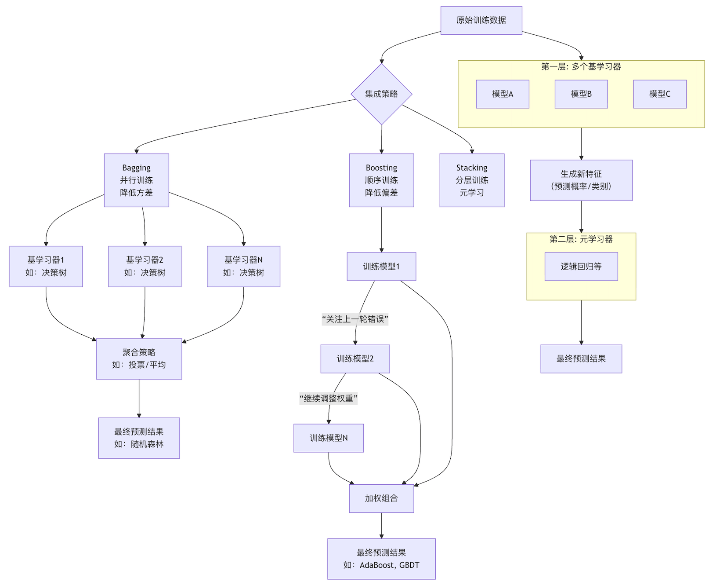
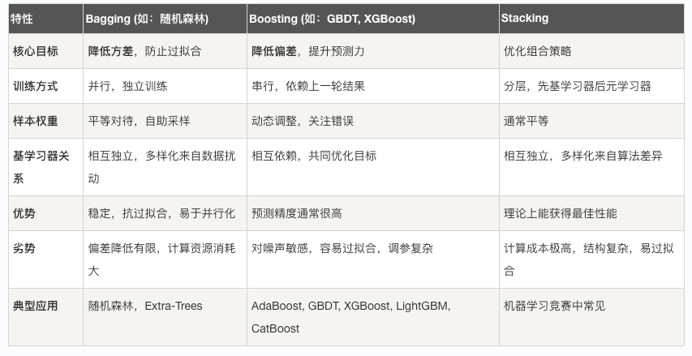

## 集成方法
在机器学习的中，你或许已经掌握了如何训练一个决策树或一个逻辑回归模型，单个模型（我们称之为基学习器）的表现有时会达到瓶颈。

这时，一个强大的思想应运而生：**集成方法** ，它不依赖于创造一种全新的、更复杂的算法，而是通过巧妙地将多个相对简单、甚至表现平平的模型组合起来，构建一个更强大、更稳定、更准确的超级模型。

简单来说，集成学习的核心哲学是 **三个臭皮匠，顶个诸葛亮。**

集成方法通过汇聚多个模型的集体智慧，来弥补单个模型可能存在的偏差、方差或偶然错误，从而显著提升整体预测性能。

本文将为你系统性地解析集成方法的原理、主流技术及其工程实践。

### 集成学习的基本思想与优势
在深入具体方法前，我们首先需要理解集成学习为何有效，以及它能带来哪些好处。

#### 核心思想：减少误差
一个模型的预测误差通常可以分解为三个部分：**偏差、方差和不可约误差。**
* 偏差：模型对问题本质的假设错误所导致的系统性误差。高偏差意味着模型欠拟合，无法捕捉数据中的基本关系。
* 方差：模型对训练数据微小波动的敏感程度。高方差意味着模型过拟合，过于关注训练数据中的噪声。
* 不可约误差：数据中固有的随机噪声，无法被任何模型消除。
集成方法的核心目标就是通过组合多个模型，来**降低整体模型的方差或偏差**，从而获得更鲁棒（稳定）和更准确的预测。

#### 主要优势
  1 提升准确率：这是最直接的目标，集成模型在绝大多数场景下的表现优于最好的单个基学习器。
  2 增强稳定性与鲁棒性：通过平均或投票，集成模型对噪声数据和异常值不那么敏感，减少了过拟合的风险。
  3 扩大假设空间：组合多个模型相当于探索了更广阔的解决方案空间，更有可能逼近问题的最优解。
为了更直观地理解集成方法如何通过组合多个模型来工作，我们可以看下面的流程图：


### 主流集成方法详解
根据基学习器的生成方式和组合策略，集成方法主要分为三大类：**Bagging、Boosting 和 Stacking** 。

#### Bagging：并行之道，稳定至上
Bagging 的核心思想是 Bootstrap Aggregating。

1 Bootstrap：从原始训练集中进行有放回的随机抽样，生成多个不同的子训练集。每个子集的大小可能与原集相同，但由于有放回，其中一些样本会被重复抽取，而另一些则不会被抽到。
2 并行训练：使用同一个学习算法（通常是高方差、低偏差的模型，如未剪枝的决策树），在每个子训练集上独立地训练一个基学习器。
Aggregating：对于分类任务，采用投票法（少数服从多数）决定最终类别；对于回归任务，采用平均法计算最终值。
3 代表性算法：随机森林 随机森林是Bagging思想的杰出代表，它在Bagging的基础上更进一步：在每棵决策树进行节点分裂时，不仅对样本进行随机采样，还会随机选取一部分特征进行最优划分。这种"双重随机性"进一步增强了模型的多样性和抗过拟合能力。

实例
```python
# 使用Scikit-learn实现随机森林
from sklearn.ensemble import RandomForestClassifier
from sklearn.datasets import load_iris
from sklearn.model_selection import train_test_split
from sklearn.metrics import accuracy_score

# 加载数据
iris = load_iris()
X, y = iris.data, iris.target

# 划分训练集和测试集
X_train, X_test, y_train, y_test = train_test_split(X, y, test_size=0.3, random_state=42)

# 创建随机森林分类器
# n_estimators: 森林中树的数量，基学习器的个数
# max_depth: 树的最大深度，控制模型复杂度
# random_state: 随机种子，确保结果可复现
rf_clf = RandomForestClassifier(n_estimators=100, max_depth=5, random_state=42)

# 训练模型
rf_clf.fit(X_train, y_train)

# 预测并评估
y_pred = rf_clf.predict(X_test)
print(f"随机森林准确率: {accuracy_score(y_test, y_pred):.4f}")

# 查看单棵树的深度（示例）
print(f"第一棵树的深度: {rf_clf.estimators_[0].get_depth()}")
```

#### Boosting：序贯之智，专注纠错
Boosting 采用完全不同的策略。
1 序贯训练：基学习器被依次训练，而不是并行。
2 关注错误：每一个后续的模型都会更加关注前序模型预测错误的样本。通常通过调整训练样本的权重来实现（给错分样本更高的权重）。
3 加权组合：将所有基学习器进行加权求和得到最终模型，表现好的基学习器权重更高。
Boosting的核心是不断修正前人的错误，将一群"弱学习器"（仅比随机猜测好一点）提升为一个强大的"强学习器"。

**代表性算法：AdaBoost 与 梯度提升决策树**

* AdaBoost：最早的Boosting算法之一。它通过增加错分样本的权重，迫使后续模型重点学习这些"难"样本。
* 梯度提升决策树：目前最流行、最强大的Boosting算法之一。它不再调整样本权重，而是将训练过程视为一个梯度下降的优化过程。每一棵新树的目标是去拟合当前模型预测结果与真实标签之间的残差（负梯度）。
实例
```python
# 使用Scikit-learn实现梯度提升分类器
from sklearn.ensemble import GradientBoostingClassifier

# 创建梯度提升分类器
# n_estimators: 提升阶段的数量（树的数量）
# learning_rate: 学习率，控制每棵树对最终结果的贡献程度（收缩系数）
# max_depth: 每棵回归树的最大深度，通常很小（3-5），代表弱学习器
gb_clf = GradientBoostingClassifier(n_estimators=100, learning_rate=0.1, max_depth=3, random_state=42)

# 训练模型
gb_clf.fit(X_train, y_train)

# 预测并评估
y_pred_gb = gb_clf.predict(X_test)
print(f"梯度提升树准确率: {accuracy_score(y_test, y_pred_gb):.4f}")

# 查看特征重要性（集成方法通常能提供）
print("特征重要性:", gb_clf.feature_importances_)
```
输出：
```
随机森林准确率: 1.0000
第一棵树的深度: 4
```

#### Stacking：模型堆叠，元学习策略
Stacking 是一种更高级的集成技术，它引入了"元学习器"的概念。
1 第一层：多样化的基学习器。使用不同的学习算法（如KNN、SVM、决策树）在原始数据上训练多个模型。
生成新特征：用这些第一层模型对训练数据进行预测（通常使用交叉验证避免数据泄露），将它们的预测结果（类别标签或概率）作为新的特征。
2 第二层：训练元学习器。以这些新特征为输入，原始标签为输出，训练一个最终的模型（如逻辑回归、线性回归）。这个元学习器负责学习如何最好地组合第一层模型的输出。
Stacking的潜力很大，但计算成本高，且需要小心设计以防止过拟合。

### 方法对比与工程实践建议
了解原理后，如何在实际项目中选择和应用这些方法呢？


#### 三大方法对比



#### 工程实践指南
##### 首选基线模型：不要一开始就使用复杂的集成方法。先用一个简单的模型（如逻辑回归、单棵决策树）建立性能基线。

##### 根据问题选择：

* 如果你的基模型（如深度很深的决策树）过拟合严重（高方差），优先尝试 Bagging（随机森林）。
* 如果你的基模型欠拟合（高偏差），或者追求极高的预测精度，优先尝试 Boosting（如XGBoost, LightGBM）。
* 在机器学习竞赛或对精度有极致要求的场景，且计算资源充足时，可以考虑 Stacking 或 Blending。

##### 利用现代优化库：在实践中，直接使用高度优化的库，它们实现了最先进的集成算法：

* Scikit-learn：提供了 RandomForest, GradientBoosting 等优秀实现，适合入门和快速原型开发。
* XGBoost：速度快、精度高、功能全，是Kaggle竞赛中的常胜将军。
* LightGBM：由微软推出，训练速度更快，内存消耗更少，尤其适合大数据集。
* CatBoost：由Yandex推出，能很好地处理类别特征，且默认参数表现就很好。

##### 注意调参：集成模型超参数较多。重点关注的参数包括：

* n_estimators：基学习器的数量（越多越好，但计算成本增加）。
* learning_rate (Boosting)：学习率，控制每步的贡献。通常需要与 n_estimators 权衡（小学习率需要更多树）。
* max_depth (树方法)：控制模型复杂度和过拟合的关键。
* 使用交叉验证和网格搜索/随机搜索来系统性地调参。