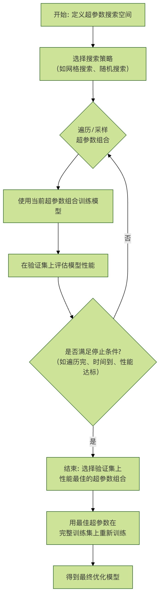
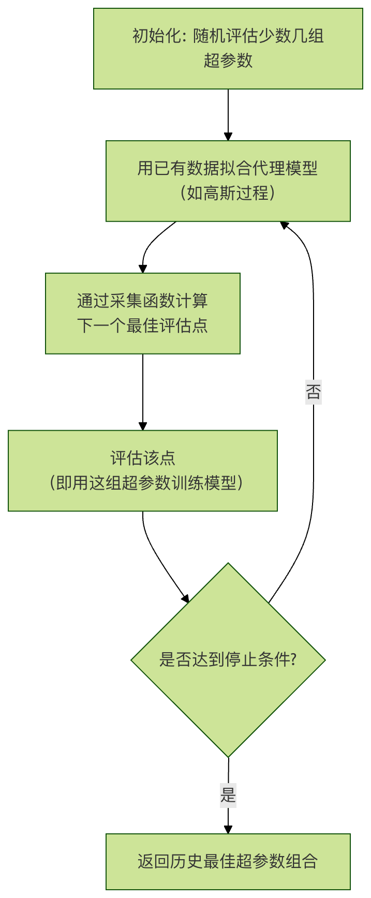

## 超参搜索
在机器学习的实践中，我们常常会遇到这样的困惑：为什么用同样的算法，别人的模型准确率能达到 95%，而我的却只有 85%？除了数据质量和特征工程的差异，一个关键因素往往在于 **超参数** 的设置。

如果说模型算法是汽车的引擎，那么超参数就是引擎的点火时机、燃油喷射量等精细调节旋钮。调得好，引擎动力澎湃；调得不好，就可能动力不足或损耗严重。

本文将带你系统性地了解超参数搜索，这是模型优化与工程化中至关重要的一环。


### 什么是超参数？
在深入搜索方法之前，我们必须先厘清一个核心概念：超参数 与 模型参数 的区别。

#### 模型参数 vs 超参数
特性	模型参数	                                   超参数
定义	模型从训练数据中学习得到的内部变量。	在模型训练开始前，由开发者手动设定或通过算法选择的配置变量。
学习方式	通过优化算法（如梯度下降）自动调整。	不通过训练数据学习，需要外部设定。
示例	线性回归中的权重 w 和偏置 b；神经网络中的权重和偏置。	学习率、决策树的最大深度、随机森林中树的数量、KNN 中的 K 值。
影响	决定了模型对具体数据的拟合能力。	决定了模型的学习过程、容量和结构，从而影响最终性能。

**一个生动的比喻**： 想象你在学习烹饪一道新菜（训练模型）。

* 模型参数 就像你在这次烹饪过程中，根据食材和火候摸索出的"盐少许、糖半勺"的具体量。这个量是通过实践（训练）得出的。
* 超参数 则是在你开始做菜前就决定的：是用大火爆炒还是小火慢炖（学习率）？总共要翻炒多少次（训练轮数）？这些选择会从根本上影响你做菜的过程和最终味道。

##### 常见超参数举例
不同的机器学习算法有其独特的超参数：

###### 通用超参数：

* learning_rate：学习率，控制模型参数更新的步长。太大容易"跳过"最优点，太小则学习过慢。
* n_estimators：集成模型中弱学习器（如树）的数量。
* max_iter / epochs：最大迭代次数或训练轮数。

###### 线性模型/神经网络：

* alpha / lambda：正则化项的强度，用于防止过拟合。
* batch_size：每次参数更新所使用的样本数量。
* hidden_layer_sizes：神经网络的隐藏层大小。

###### 树模型：

* max_depth：树的最大深度，控制模型的复杂度。
* min_samples_split：内部节点再划分所需的最小样本数。
* min_samples_leaf：叶节点所需的最小样本数。


### 为什么需要超参数搜索？
既然超参数如此重要，我们能否凭经验或直觉随意设置？答案是否定的。原因如下：
* 性能影响巨大：同一模型，不同的超参数组合可能导致性能（如准确率、F1分数）产生天壤之别。
* 无通用最优值：最优超参数高度依赖于具体的数据集、任务和模型，不存在放之四海而皆准的"默认神参"。
* 组合空间庞大：多个超参数相互影响，构成一个高维的搜索空间。手动试错效率极低，且容易陷入局部思维。
因此，我们需要系统化、自动化的方法来探索这个庞大的参数空间，寻找性能更优的配置，这个过程就是 **超参数搜索 或 超参数优化**。
其核心目标是在可接受的计算成本内，找到一组超参数，使得模型在未见过的数据（验证集）上的性能指标最优。


### 主流超参数搜索策略
#### 1. 网格搜索
网格搜索是最基础、最直观的搜索方法。

工作原理：
* 为每个待搜索的超参数定义一个候选值列表。
* 搜索算法会生成这些列表的笛卡尔积，即所有可能的组合。
* 遍历每一种组合，训练模型并评估。
* 选择在验证集上性能最好的组合。
示例： 搜索支持向量机（SVM）的两个超参数。

实例
```python
# 假设我们定义以下搜索网格
param_grid = {
    'C': [0.1, 1, 10, 100],           # 正则化强度，4个候选值
    'gamma': [0.001, 0.01, 0.1, 1]    # 核函数系数，4个候选值
}
# 网格搜索将尝试 4 * 4 = 16 种不同的组合
```

##### 优点：
* 简单可靠：只要网格足够细，就一定能搜索到给定范围内的最优解。
* 易于并行：每个参数组合的训练评估相互独立，非常适合并行计算。

##### 缺点：
* 维度灾难：超参数数量稍多或候选值稍密，组合数就会呈指数级增长，计算成本无法承受。例如，5个参数，每个取10个值，就需要训练评估 10^5 = 100,000 个模型！
* 效率低下：可能会在"不重要的"参数上浪费大量计算资源。


#### 2. 随机搜索
随机搜索是针对网格搜索缺点的有效改进。

##### 工作原理：
* 为每个超参数定义一个概率分布（如均匀分布、对数均匀分布）。
* 在指定的总试验次数（n_iter）内，随机采样一组超参数值。
* 对每组采样参数进行训练和评估。
* 选择性能最好的组合。

**示例**： 使用随机搜索优化随机森林。
实例
```python
from sklearn.model_selection import RandomizedSearchCV
from scipy.stats import randint, uniform

param_dist = {
    'n_estimators': randint(100, 500),        # 整数均匀分布，100到500
    'max_depth': randint(5, 30),              # 整数均匀分布，5到30
    'min_samples_split': uniform(0.01, 0.2)   # 连续均匀分布，0.01到0.21
}

# 随机进行 50 次试验
random_search = RandomizedSearchCV(estimator=rf_model,
                                   param_distributions=param_dist,
                                   n_iter=50,
                                   cv=5,
                                   verbose=2)
random_search.fit(X_train, y_train)

```

**为什么随机搜索更高效？** 研究（Bergstra & Bengio, 2012）表明，对于大多数问题，模型性能通常只对少数几个超参数敏感。随机搜索允许我们在每个维度上都进行更多次探索，从而有更高概率找到重要参数的最佳区域，而不像网格搜索那样被不重要参数的固定网格所束缚。

###### 优点：
* 计算效率高：在相同的计算预算下，比网格搜索有更高概率找到更优解。
* 灵活：可以方便地指定参数的概率分布（如对数尺度搜索学习率）。

###### 缺点：
* 随机性：结果可能因随机种子而异，可能错过某些区域。
* 无记忆性：每次试验都是独立的，不会利用之前试验的信息来指导后续搜索。

#### 3. 贝叶斯优化
贝叶斯优化是一种更智能的搜索方法，适用于评估成本非常高的函数优化（如训练一个大型深度学习模型需要几天时间）。

**核心思想**：
* 代理模型：用一个计算成本低的概率模型（如高斯过程）来"模拟"真实的、计算成本高的目标函数（即模型性能与超参数的关系）。
* 采集函数：根据代理模型的不确定性，选择一个"最有希望"的超参数组合进行下一次评估。它平衡了 探索（在不确定性高的区域采样）和 利用（在已知性能好的区域附近采样）。
工作流程：



* 优点：
    极其高效：能用最少的试验次数找到接近最优的解，特别适合昂贵模型。
    自适应性：利用历史信息智能地指导搜索方向。

* 缺点：
    实现复杂：相比前两者更复杂。
    并行困难：标准的贝叶斯优化是顺序的，难以直接并行化（虽有改进方法）。
    对高维空间：随着超参数维度增加，代理模型的拟合和优化会变难。
常用工具： scikit-optimize, BayesianOptimization, Optuna, Hyperopt。


#### 工程化实践与注意事项
##### 1. 验证策略：不要污染你的测试集！
在搜索超参数时，绝对不能使用测试集来指导搜索过程，否则会导致信息泄露和过于乐观的泛化性能估计。

正确做法：
 *   将数据分为：训练集、验证集、测试集。
 *   超参数搜索在"训练集+验证集"上进行（例如使用交叉验证）。
 *   选出最佳超参数后，用这组参数在完整的训练集（或训练集+验证集合并）上重新训练最终模型。
 *   最后，用从未参与过任何训练或调优过程的 测试集 来公正地评估最终模型的泛化能力。
##### 2. 使用交叉验证
为了更稳健地评估超参数性能，避免因单次数据划分带来的偶然性，应使用交叉验证。

实例
```python
from sklearn.model_selection import GridSearchCV

# 使用 5 折交叉验证进行网格搜索
grid_search = GridSearchCV(estimator=model,
                           param_grid=param_grid,
                           cv=5,          # 5折交叉验证
                           scoring='accuracy',
                           return_train_score=True)
grid_search.fit(X_train_val, y_train_val) # 这里使用训练+验证数据

print(f"最佳参数: {grid_search.best_params_}")
print(f"最佳交叉验证分数: {grid_search.best_score_:.4f}")

# 获取最佳模型（已用最佳参数在全部数据上重新拟合）
best_model = grid_search.best_estimator_
```

##### 3. 超参数空间的设计技巧
* 尺度敏感参数：对于学习率、正则化强度等参数，其有效范围往往跨越多个数量级。应在对数尺度上进行搜索（如 [0.001, 0.01, 0.1, 1]），而不是线性尺度（如 [0.1, 0.2, ..., 1.0]）。
* 先粗后精：可以先进行大范围的随机搜索或稀疏的网格搜索，定位性能较好的区域，然后在该区域进行更精细的搜索。
* 利用先验知识：根据算法原理和经验文献，设定合理的初始范围和分布。
##### 4. 自动化与工具链
在实际工程中，超参数搜索常被集成到 MLOps 流水线中。
* 框架：Scikit-learn 提供了 GridSearchCV 和 RandomizedSearchCV。
* 高级库：Optuna, Ray Tune, Keras Tuner 等提供了更强大、分布式友好的搜索能力，并支持早停、剪枝等高级特性。
* 云服务：AWS SageMaker, Google Vertex AI 等平台提供了托管的超参数优化服务。

#### 动手练习
现在，让我们用 Scikit-learn 和 随机森林 数据集完成一个完整的超参数搜索练习。

任务：使用葡萄酒数据集，通过随机搜索优化一个随机森林分类器。

实例
```python
# 1. 导入必要的库
import numpy as np
from sklearn.datasets import load_wine
from sklearn.ensemble import RandomForestClassifier
from sklearn.model_selection import train_test_split, RandomizedSearchCV
from sklearn.metrics import classification_report
from scipy.stats import randint

# 2. 加载数据并划分
data = load_wine()
X, y = data.data, data.target
X_train, X_test, y_train, y_test = train_test_split(X, y, test_size=0.2, random_state=42)
X_train_val, X_val, y_train_val, y_val = train_test_split(X_train, y_train, test_size=0.25, random_state=42) # 0.25 * 0.8 = 0.2

# 3. 定义模型和参数分布
rf = RandomForestClassifier(random_state=42)
param_dist = {
    'n_estimators': randint(50, 300),       # 树的数量
    'max_depth': randint(3, 20),            # 树的最大深度
    'min_samples_split': randint(2, 10),    # 内部节点分裂所需最小样本数
    'min_samples_leaf': randint(1, 5),      # 叶节点最小样本数
    'max_features': ['sqrt', 'log2']        # 寻找最佳分割时考虑的特征数
}

# 4. 执行随机搜索（带3折交叉验证）
random_search = RandomizedSearchCV(estimator=rf,
                                   param_distributions=param_dist,
                                   n_iter=30,          # 随机尝试30组参数
                                   cv=3,               # 3折交叉验证
                                   scoring='accuracy',
                                   random_state=42,
                                   verbose=1,
                                   n_jobs=-1)          # 使用所有CPU核心并行
random_search.fit(X_train_val, y_train_val)

# 5. 输出搜索结果
print("="*50)
print("随机搜索最佳参数：")
print(random_search.best_params_)
print(f"\n最佳交叉验证准确率：{random_search.best_score_:.4f}")

# 6. 在独立验证集上评估最佳模型
best_model = random_search.best_estimator_
y_val_pred = best_model.predict(X_val)
print("\n在验证集上的性能报告：")
print(classification_report(y_val, y_val_pred, target_names=data.target_names))

# 7. （最终步骤）用最佳参数在整个训练集上重新训练，并在测试集上评估
final_model = RandomForestClassifier(**random_search.best_params_, random_state=42)
final_model.fit(X_train, y_train) # 使用全部训练数据
y_test_pred = final_model.predict(X_test)
print("="*50)
print("最终模型在测试集（全新数据）上的性能报告：")
print(classification_report(y_test, y_test_pred, target_names=data.target_names))
```

输出：
```
Fitting 3 folds for each of 30 candidates, totalling 90 fits
==================================================
随机搜索最佳参数：
{'max_depth': 9, 'max_features': 'log2', 'min_samples_leaf': 1, 'min_samples_split': 8, 'n_estimators': 156}

最佳交叉验证准确率：0.9812

在验证集上的性能报告：
              precision    recall  f1-score   support

     class_0       1.00      1.00      1.00        11
     class_1       1.00      0.94      0.97        16
     class_2       0.90      1.00      0.95         9

    accuracy                           0.97        36
   macro avg       0.97      0.98      0.97        36
weighted avg       0.98      0.97      0.97        36

==================================================
最终模型在测试集（全新数据）上的性能报告：
              precision    recall  f1-score   support

     class_0       1.00      1.00      1.00        14
     class_1       1.00      1.00      1.00        14
     class_2       1.00      1.00      1.00         8

    accuracy                           1.00        36
   macro avg       1.00      1.00      1.00        36
weighted avg       1.00      1.00      1.00        36

```