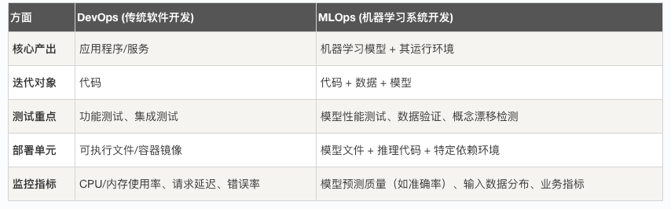
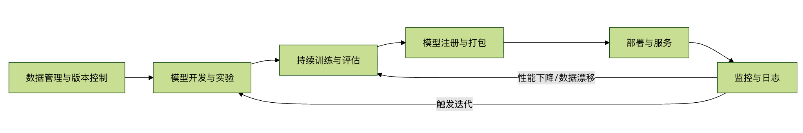

## MLOps 概念
想象一下，你是一位数据科学家，经过数周的努力，终于训练出了一个在测试集上表现优异的机器学习模型。你兴奋地将这个 model.pkl 文件交给了软件工程师同事。然而，问题接踵而至：这个模型如何在每天处理百万级请求的服务器上稳定运行？如何监控它在真实数据上的表现是否下滑？当新数据到来时，又该如何自动重新训练并更新模型？

这个场景揭示了机器学习项目中的一个核心挑战：如何将实验性质的模型代码，转化为能为业务持续创造价值的、可靠的生产系统。MLOps 正是为了解决这一鸿沟而诞生的一套理念与实践体系。

简单来说，MLOps 是 Machine Learning 与 DevOps 的结合。它借鉴了软件开发中 DevOps 的自动化、协作与监控思想，将其应用于机器学习系统的生命周期管理，旨在实现 ML 模型的高效开发、可靠部署与持续运营。


### 什么是 MLOps？
#### 核心定义
MLOps 是一套工程实践，用于标准化和自动化机器学习系统生命周期中的各个步骤，包括：

模型开发与实验
模型持续训练与评估
模型部署与服务
生产环境下的监控、维护与迭代
其最终目标是构建可重复、可扩展、可审计且协作高效的机器学习工作流，让模型能够快速、安全地从实验室走向生产，并持续保持价值。

#### 一个简单的类比：对比 DevOps
为了更好地理解，我们可以将 MLOps 与大家更熟悉的 DevOps 进行类比：



### 为什么需要 MLOps？
没有 MLOps 的机器学习项目常陷入"原型炼狱"——模型永远停留在实验阶段，无法产生实际影响。MLOps 通过解决以下关键问题来打破这一困境：

#### 1. 协作与复现性挑战
* 问题：数据科学家在 Jupyter Notebook 中实验，环境依赖混乱，实验步骤无法复现。
* MLOps 方案：使用版本控制（如 Git）管理代码、数据版本（如 DVC）和模型版本，容器化（如 Docker）固化环境，确保任何实验都可被精确复现。
#### 2. 部署与运维复杂性
* 问题：手动部署模型，过程繁琐易错；模型服务难以扩展，监控缺失。
* MLOps 方案：自动化 CI/CD 流水线，将模型一键部署为 API 服务；利用云原生技术实现弹性伸缩；建立全面的监控仪表盘。
#### 3. 模型性能衰减
* 问题：生产环境数据分布随时间变化（概念漂移），导致模型性能 silently 下降，无人察觉。
* MLOps 方案：持续监控预测性能与输入数据分布，设置自动化警报，触发模型重新训练流程。
#### 4. 治理与合规需求
* 问题：无法追溯某个预测是由哪个版本的模型、基于哪份数据做出的，难以满足审计和法规要求。
* MLOps 方案：贯穿始终的版本追踪、实验日志记录和预测结果溯源。

### MLOps 的核心组件与工作流
一个典型的 MLOps 系统包含多个相互协作的组件，其工作流可以可视化为一个循环：

下面我们来分解图中的每个关键环节：

#### 1. 数据管理与版本控制
这是 MLOps 的基石。不同于代码，数据文件通常很大且不断变化。

实践：使用如 DVC (Data Version Control) 或 LakeFS 等工具，像 Git 管理代码一样管理数据和模型文件。它们存储数据的版本元信息，而实际文件可存放在云存储中。
示例：每次实验都能关联到特定的数据快照，确保结果可复现。
#### 2. 模型开发与实验
这是数据科学家的主战场，但需要工程化规范。

实践：将实验代码从 Notebook 重构为模块化的 Python 脚本；使用 MLflow Tracking 或 Weights & Biases 记录每次实验的超参数、指标和产出模型，方便比较。
#### 3. 持续训练与评估
当新数据到来或监控到性能下降时，系统应能自动或半自动地重新训练模型。

实践：构建自动化训练流水线（如使用 Kubeflow Pipelines 或 Apache Airflow）。流水线包括数据验证、特征工程、模型训练、评估（在不同于训练集的验证集上）等步骤。只有评估达标的模型才能进入下一阶段。
#### 4. 模型注册与打包
训练出的模型需要被妥善管理并准备部署。

实践：使用 模型注册中心（如 MLflow Model Registry）。它将模型作为一个可版本化的资产进行存储、注释和管理。模型通常与推理代码一起被打包成 Docker 容器镜像，确保生产环境一致性。
#### 5. 部署与服务
将模型提供给用户或其他系统使用。

模式：
批量预测：定期对大量数据进行预测，生成报表。
实时 API 服务：模型作为 REST API 或 gRPC 服务，实时响应请求。常用工具包括 FastAPI, TensorFlow Serving, TorchServe 或云服务商的托管服务。
策略：可采用 蓝绿部署 或 金丝雀发布，逐步将流量切到新模型，以降低风险。
#### 6. 监控与日志
这是确保生产模型健康运行的"眼睛"。
监控内容：
    系统指标：API 延迟、吞吐量、错误率、资源使用率。
    模型指标：预测结果的分布、重要特征的变化（检测数据漂移）。
    业务指标：模型决策最终带来的业务影响（如点击率、转化率）。
实践：集成监控工具（如 Prometheus, Grafana）和日志系统（如 ELK Stack），设置关键指标的警报规则。


#### 一个简化的 MLOps 实践示例
让我们通过一个概念性的代码流程，看看如何用 MLflow 这个流行工具实现实验跟踪、模型注册和打包。

实例
```python
# 1. 导入必要的库
import mlflow
import mlflow.sklearn
from sklearn.datasets import load_iris
from sklearn.ensemble import RandomForestClassifier
from sklearn.model_selection import train_test_split
from sklearn.metrics import accuracy_score

# 2. 设置 MLflow 跟踪服务器（假设已在本地运行）
mlflow.set_tracking_uri("http://127.0.0.1:5000")
mlflow.set_experiment("Iris_Classification")

# 3. 开始一次实验运行
with mlflow.start_run():
    # 加载数据并划分
    data = load_iris()
    X_train, X_test, y_train, y_test = train_test_split(data.data, data.target, test_size=0.2)
   
    # 定义并训练模型
    n_estimators = 100
    model = RandomForestClassifier(n_estimators=n_estimators, random_state=42)
    model.fit(X_train, y_train)
   
    # 预测与评估
    y_pred = model.predict(X_test)
    acc = accuracy_score(y_test, y_pred)
   
    # 4. 记录实验信息到 MLflow Tracking Server
    mlflow.log_param("n_estimators", n_estimators) # 记录超参数
    mlflow.log_metric("accuracy", acc) # 记录评估指标
   
    # 5. 记录模型本身（包含其依赖环境）
    # mlflow.sklearn.log_model 会记录模型，并生成一个 conda.yaml 环境文件
    mlflow.sklearn.log_model(model, "random_forest_model")
   
    print(f"模型训练完成，准确率：{acc:.4f}")
    print(f"实验已记录，可在 MLflow UI (http://127.0.0.1:5000) 中查看。")

# 6. （后续步骤）在 MLflow UI 中，可以将这个记录好的模型"注册"到 Model Registry。
# 7. 然后，可以从 Registry 中获取模型，并使用 `mlflow models build-docker` 命令将其打包为 Docker 镜像。
# 8. 最后，将这个镜像部署到 Kubernetes 或云服务器上提供服务。
```
代码解释：

这个示例展示了 MLOps 中 实验跟踪 和 模型记录 的核心环节。
mlflow.log_param 和 mlflow.log_metric 确保了实验的可追溯性。
mlflow.sklearn.log_model 不仅保存了模型文件，还自动记录了创建该模型的 Python 库版本（环境），这是实现可复现性的关键一步。
后续的注册、打包和部署步骤通常在 UI 或通过 CI/CD 流水线完成。


#### MLOps 的成熟度等级
MLOps 的实施不是一蹴而就的，通常被认为有三个演进阶段：

* MLOps 基础级 (手动流程)：部署和训练流程由手动触发，监控有限。这是许多团队的起点。
* MLOps 中级 (自动化流水线)：实现了模型训练和部署的持续集成 (CI) 与持续交付 (CD)，自动化程度高。
* MLOps 高级 (持续训练 CT)：系统具备完整的自动化监控和反馈循环，能够自动触发数据收集、重新训练、评估和部署，实现真正的 持续训练 (Continuous Training)。

#### 总结与展望
MLOps 不是某个特定的工具，而是一个涵盖文化、流程和技术的综合性框架。它要求数据科学家、机器学习工程师和运维工程师紧密协作。

对于初学者而言，理解 MLOps 的概念是构建可靠机器学习系统的第一步。你可以从以下实践开始：

使用 Git 进行严格的代码版本控制。
尝试 MLflow 来管理你的实验和模型。
将模型服务化，例如用 FastAPI 写一个简单的预测 API。
思考如何监控你的模型预测结果。
随着机器学习在产业中的应用日益深入，MLOps 已成为确保机器学习项目成功、可控、可扩展的关键工程能力。掌握 MLOps 思想，能帮助你将手中的模型，从实验室里的璀璨水晶，转变为驱动业务增长的稳定引擎。