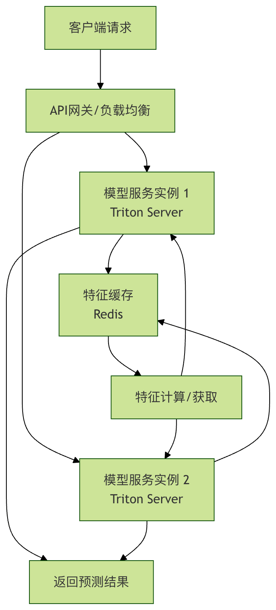
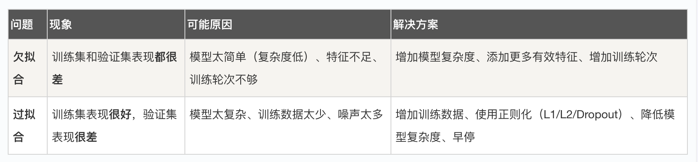

## 常见问题排查
机器学习项目从实验室原型走向生产环境，常常会遇到一系列预料之外的挑战。

模型在训练集上表现优异，但在实际部署后效果不佳，甚至完全失效，这是许多机器学习工程师和初学者都会经历的困境。

本文将系统性地梳理机器学习模型在优化与工程化过程中最常见的几类问题，并提供清晰的排查思路与解决方案，帮助你构建更健壮、可靠的机器学习系统。

### 一、 模型性能问题：训练好，上线差
这是最经典也最令人头疼的问题。你的模型在 Jupyter Notebook 里准确率高达 95%，一旦部署到线上，效果却一落千丈。

#### 1. 数据分布不一致
这是导致性能下降的"头号杀手"。训练数据和线上实时数据在统计分布上存在差异。

常见场景与排查点：
```
特征工程不一致：离线特征处理（如归一化、分桶、缺失值填充）的代码与线上服务代码不完全一致。

排查：对比离线预处理和线上预处理后的样本数据。确保使用的 Scaler（如 StandardScaler）在线上使用的是离线拟合好的参数（scaler.mean_, scaler.scale_），而不是重新拟合。
```
```
数据采集时间偏差：训练数据是过去三个月的数据，而线上数据来自当前，用户行为、市场环境可能已发生变化（概念漂移）。

排查：监控模型输入特征的分布随时间的变化。可以定期计算特征的均值、方差、分位数，与训练集进行对比。
```
```

样本选择偏差：训练数据不能代表全体用户。例如，只用活跃用户的数据训练一个推荐模型，对新用户或沉默用户就会失效。

排查：分析训练集和线上请求的用户画像分布（如新老用户比例、地域分布等）。
```

解决方案： 建立完善的数据监控和模型监控体系。不仅要监控模型的输出（如AUC、准确率），更要监控输入特征的分布。一旦发现漂移，需要触发告警并考虑更新训练数据或重新训练模型。

实例
```python
# 示例：使用滑动窗口监控特征均值漂移
import numpy as np
import pandas as pd

# 假设这是线上实时收到的特征'feature_a'的值
online_feature_values = [0.1, 0.5, 1.2, 0.8, 1.5, 2.0, 2.5]
training_mean = 0.5  # 训练集上'feature_a'的均值
training_std = 0.3   # 训练集上'feature_a'的标准差

current_online_mean = np.mean(online_feature_values[-100:]) # 最近100个点的均值

# 计算Z-score，简单判断是否发生显著漂移
z_score = (current_online_mean - training_mean) / training_std
print(f"当前在线特征均值: {current_online_mean:.3f}")
print(f"与训练集均值的Z-score: {z_score:.3f}")

if abs(z_score) > 3:  # 阈值，例如3个标准差
    print("警告：检测到特征'feature_a'可能发生分布漂移！")

```


#### 2. 数据泄露
模型在训练时"偷看"了本应在预测时才知道的信息，导致评估结果虚高。

#### 常见场景：

在划分训练集/测试集之前进行了全局的归一化或缺失值填充（使用了测试集的信息）。
时间序列问题中，用未来的数据预测过去。
特征中包含与目标变量强相关的"未来信息"（例如，用"今日是否收到投诉"来预测"今日是否会取消订单"）。
排查与解决： 严格遵守机器学习工作流。任何从数据中学习参数的操作（如拟合 Scaler、填充缺失值、特征选择），都必须在训练集上进行，然后仅用这些参数去转换验证集和测试集。 使用 sklearn 的 Pipeline 可以很好地避免这个问题。

实例
```python
# 错误示例：先全局处理，再划分数据集（导致数据泄露）
from sklearn.preprocessing import StandardScaler
from sklearn.model_selection import train_test_split

# X, y 是原始数据和标签
scaler = StandardScaler()
X_scaled = scaler.fit_transform(X) # 错误！这里用了全部数据来拟合scaler
X_train, X_test, y_train, y_test = train_test_split(X_scaled, y, test_size=0.2)
# 此时X_test的信息已经"泄露"给scaler，进而影响了X_train的转换

# 正确示例：先划分，再分别处理
X_train_raw, X_test_raw, y_train, y_test = train_test_split(X, y, test_size=0.2)
scaler = StandardScaler()
X_train = scaler.fit_transform(X_train_raw) # 只用训练集拟合
X_test = scaler.transform(X_test_raw)       # 用训练集拟合的参数转换测试集

```

### 二、 工程化与部署问题
模型从文件变成一个可稳定服务的高可用 API，中间坑点无数。

#### 1. 环境依赖与版本冲突
"在我机器上是好的！"—— 经典难题。训练环境和线上推理环境的 Python 版本、库版本不一致。

**排查清单：**
*    Python 主版本 (3.7 vs 3.9)
*    核心库版本 (tensorflow==2.8 vs tensorflow==2.12)
*    系统依赖（如某些库依赖特定的 C++ 运行时库）
*    模型序列化格式（用 pickle 保存的模型，如果 Python 版本跨度大，可能无法加载）

解决方案：
*    容器化：使用 Docker 将模型及其所有依赖打包成一个镜像。这是保证环境一致性的黄金标准。
*    依赖管理：使用 requirements.txt 或 environment.yml 精确记录所有包及其版本。
*    模型格式：考虑使用跨语言、跨环境的模型格式，如 ONNX 或 PMML，或者框架原生的安全格式（如 TensorFlow SavedModel, PyTorch TorchScript）。

#### 2. 线上推理性能低下
接口响应时间太长，吞吐量（TPS）上不去，无法满足业务需求。

##### 常见瓶颈与优化：
* 单次预测开销大：模型本身复杂（如大型深度学习模型）。
    优化：模型剪枝、量化、知识蒸馏，或用更高效的模型架构重写。
* 频繁的IO或网络调用：每次预测都要从数据库或远程服务获取特征。
    优化：实现特征缓存、预计算，或将特征服务化以减少延迟。
* 未利用硬件加速：在 CPU 上跑适合 GPU 的模型。
    优化：根据模型类型选择正确的推理硬件（CPU/GPU/专用AI芯片）和推理框架（如 TensorRT, OpenVINO）。
* 服务框架效率低：使用 Flask 直接加载模型，处理并发能力弱。
    优化：使用高性能 ML 服务框架，如 TensorFlow Serving, TorchServe, 或 Triton Inference Server。它们支持模型热更新、动态批处理、多模型托管等高级功能。



图：一个高性能模型服务架构示例，包含负载均衡、特征缓存和专用模型服务器。

#### 3. 资源管理不当
模型服务内存泄漏，或随着时间推移占用内存越来越多，最终导致服务崩溃。

##### 排查：
* 模型加载方式：是否每次请求都重新加载模型？正确的做法是在服务启动时加载一次到内存，后续请求共享。
* 全局变量累积：服务代码中是否有全局的 List 或 Dict 在不断累积数据而未清理？
* 大预测结果：返回的预测结果（如图片、大文本）是否占用了大量内存且未及时释放？

##### 解决：
* 使用 gunicorn、uvicorn 等多进程/异步服务器时，理解其 Worker 模型。
* 定期重启服务进程（通过进程管理工具如 systemd 或 supervisor）。
* 使用专业的内存分析工具（如 memory_profiler）定位泄漏点。

### 三、 模型本身与算法问题
#### 1. 过拟合与欠拟合
这是模型能力的根本问题。

排查： 绘制学习曲线是判断拟合情况的最佳方式。

#### 2. 梯度消失/爆炸
在训练深度神经网络时常见，导致模型无法收敛或训练不稳定。

##### 现象：
 *   模型损失变成 NaN。
 *   权重值变得极大或极小。
 *   训练早期，损失值不再变化。

##### 解决方案：
 *   权重初始化：使用 He初始化 (ReLU激活函数) 或 Xavier初始化 (Tanh/Sigmoid)。
 *   梯度裁剪：设置一个阈值，当梯度超过时将其裁剪。
 *   批归一化：在激活函数前加入 BatchNorm 层，可以稳定训练并允许使用更高的学习率。
 *   调整网络结构：使用 ResNet 中的残差连接等结构。

 ### 四、 建立系统化的排查流程
当线上模型出现问题时，一个系统化的排查流程能帮你快速定位。
1 确认问题：是全体预测错误，还是针对特定人群/场景？错误率是多少？
2 检查输入：获取一批线上出错的请求数据，检查输入特征是否完整、格式是否正确、数值是否在合理范围（如出现 NaN, Inf 或极端值）。
3 本地复现：用线上出错的输入数据，在本地开发环境用相同的模型和代码进行预测，看是否能复现问题。
4 对比数据：将线上请求的数据分布与训练数据分布进行对比，检查是否存在漂移。
5 检查代码与配置：核对线上服务的代码版本、模型文件版本、配置文件是否与测试通过的环境一致。
6 检查日志与监控：查看服务日志是否有异常报错，监控系统的 CPU、内存、响应时间指标是否异常。
7 简化与定位：如果可能，尝试用一个极简的模型或规则系统处理出错的输入，判断是数据问题还是模型问题。

