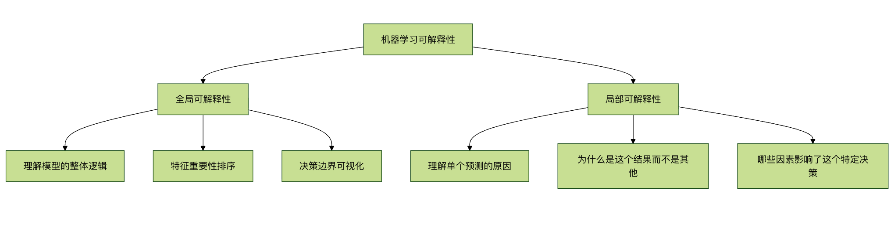
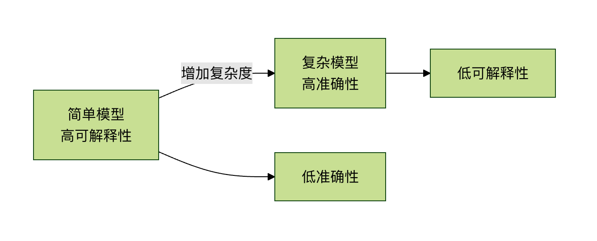
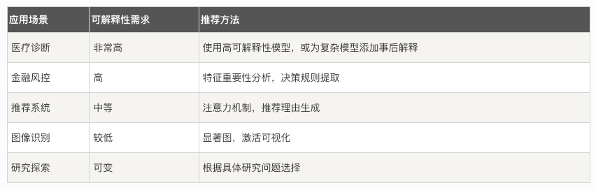

## 可解释性问题
想象一下，你去看医生，医生告诉你：根据我的高级诊断系统，你需要做这个手术，但我无法解释为什么。 你会同意吗？大多数人都会犹豫，因为我们希望理解决策背后的原因。

在机器学习领域，我们正面临类似的困境。许多先进的机器学习模型，尤其是深度学习模型，就像一个个黑箱——我们能看到输入和输出，却难以理解内部是如何做出决策的。这就是 机器学习可解释性问题，它已成为制约 AI 技术在实际关键领域（如医疗、金融、司法）广泛应用的主要障碍之一。

本文将带你了解什么是可解释性，为什么它如此重要，以及当前面临的挑战和解决方案。

## 什么是机器学习的可解释性？
### 基本概念
**机器学习可解释性** 指的是我们能够理解、信任和有效管理人工智能决策过程的能力。

简单来说，就是回答这个模型为什么做出这样的预测的能力。
### 可解释性的两个层面


#### 全局可解释性 关注模型的整体行为：
* 模型学到了什么规律？
* 哪些特征对预测最重要？
* 模型的决策边界是什么形状？
* 局部可解释性 关注单个预测：

#### 为什么这个样本被预测为 A 类而不是 B 类？
* 如果某个特征值改变一点，预测会如何变化？
* 哪些特征对这个特定预测贡献最大？

### 为什么可解释性如此重要？
#### 1. 建立信任与透明度
在医疗、自动驾驶、金融风控等高风险领域，人们需要知道 AI 决策的依据。如果一个模型拒绝贷款申请或诊断疾病，我们必须能够解释原因。

#### 2. 满足法规要求
欧盟的 GDPR（通用数据保护条例）明确规定，用户有权获得"有意义的关于逻辑的信息"。许多行业法规都要求决策过程透明。

#### 3. 调试与改进模型
通过理解模型如何工作，我们可以：
    发现并纠正模型中的偏见
    识别模型学到的虚假相关性
    改进模型架构和特征工程

#### 4. 知识发现与科学洞察
有时，模型可能发现人类专家未曾注意到的模式，这些洞察可能推动科学进步。

#### 5. 安全性与对抗性攻击
理解模型弱点有助于防御对抗性攻击（精心设计的输入导致模型错误分类）。


### 不同类型的模型与可解释性
#### 模型透明度光谱


#### 示例对比：决策树 vs 神经网络
#####  决策树（高可解释性）示例：
实例
```python
# 简单的决策树分类示例
from sklearn.tree import DecisionTreeClassifier, plot_tree
import matplotlib.pyplot as plt

# 创建并训练模型
model = DecisionTreeClassifier(max_depth=3, random_state=42)
model.fit(X_train, y_train)

# 可视化决策树
plt.figure(figsize=(12, 8))
plot_tree(model, feature_names=feature_names,
          class_names=['Not Approved', 'Approved'],
          filled=True, rounded=True)
plt.title("贷款审批决策树 - 完全可解释")
plt.show()
```
决策树的优势在于，我们可以直接跟踪从根节点到叶节点的路径，完全理解每个决策是如何做出的。


#####  神经网络（低可解释性）示例：

实例
```python
# 简单的神经网络示例
import tensorflow as tf
from tensorflow import keras

# 创建一个简单的神经网络
model = keras.Sequential([
    keras.layers.Dense(128, activation='relu', input_shape=(10,)),
    keras.layers.Dense(64, activation='relu'),
    keras.layers.Dense(32, activation='relu'),
    keras.layers.Dense(1, activation='sigmoid')  # 二分类输出
])

model.compile(optimizer='adam',
              loss='binary_crossentropy',
              metrics=['accuracy'])

# 训练模型
history = model.fit(X_train, y_train,
                    epochs=50,
                    validation_split=0.2,
                    verbose=0)
```
神经网络由数百甚至数百万个相互连接的神经元组成，每个连接都有权重，这些权重通过训练自动调整。虽然我们可以查看所有权重值，但理解这些数字如何共同产生特定预测几乎是不可能的。

### 可解释性面临的挑战
#### 1. 准确性与可解释性的权衡
通常，模型越复杂、性能越好，可解释性就越差。这被称为 准确性-可解释性权衡。


#### 2. 技术复杂性
深度学习模型可能有：

数百万个参数
复杂的非线性变换
多层抽象表示

#### 3. 人类认知限制
即使我们获得了技术解释，也可能超出人类的理解能力。例如，一个包含 1000 个特征的复杂交互作用解释，对人脑来说难以处理。

#### 4. 评估标准缺乏
如何衡量解释的"好坏"？目前缺乏统一、客观的评估标准。

### 当前的可解释性技术
#### 1. 特征重要性分析
实例
```python
# 使用 SHAP 值进行特征重要性分析
import shap
import xgboost as xgb
import matplotlib.pyplot as plt

# 训练一个 XGBoost 模型
model = xgb.XGBClassifier()
model.fit(X_train, y_train)

# 创建 SHAP 解释器
explainer = shap.TreeExplainer(model)
shap_values = explainer.shap_values(X_test)

# 可视化特征重要性
shap.summary_plot(shap_values, X_test, plot_type="bar")
plt.title("特征重要性排序")
plt.show()

# 单个预测的解释
shap.force_plot(explainer.expected_value, shap_values[0,:], X_test.iloc[0,:])
```
SHAP（SHapley Additive exPlanations）基于博弈论，为每个特征分配一个重要性值，显示该特征对预测的贡献。

#### 2. LIME（局部可解释模型无关解释）
实例
```python
# 使用 LIME 解释图像分类
import lime
from lime import lime_image
from skimage.segmentation import mark_boundaries

# 创建 LIME 解释器
explainer = lime_image.LimeImageExplainer()

# 解释单个图像预测
explanation = explainer.explain_instance(
    image_array,
    model.predict,
    top_labels=3,
    hide_color=0,
    num_samples=1000
)

# 显示哪些区域支持预测
temp, mask = explanation.get_image_and_mask(
    explanation.top_labels[0],
    positive_only=True,
    num_features=5,
    hide_rest=False
)
plt.imshow(mark_boundaries(temp, mask))
plt.title("图像中支持预测的区域")
plt.axis('off')
plt.show()
```
LIME 的核心思想是：在单个预测点附近创建一个简单的、可解释的模型（如线性模型）来近似复杂模型的行为。

#### 3. 注意力机制
在自然语言处理中，注意力机制可以显示模型在做出预测时"关注"输入文本的哪些部分：

实例
```python
# 简化版的注意力可视化
import numpy as np
import matplotlib.pyplot as plt

def visualize_attention(text, attention_weights):
    """
    可视化注意力权重
   
    参数：
    text: 分词后的文本列表
    attention_weights: 每个词的注意力权重
    """
    fig, ax = plt.subplots(figsize=(10, 2))
   
    # 创建热图
    im = ax.imshow([attention_weights], cmap='YlOrRd', aspect='auto')
   
    # 设置坐标轴
    ax.set_xticks(range(len(text)))
    ax.set_xticklabels(text, rotation=45, ha='right')
   
    # 添加颜色条
    plt.colorbar(im)
    plt.title("注意力权重可视化")
    plt.tight_layout()
    plt.show()

# 示例使用
sample_text = ["我", "喜欢", "机器学习", "的", "可解释性", "研究"]
sample_attention = [0.1, 0.15, 0.4, 0.05, 0.25, 0.05]

visualize_attention(sample_text, sample_attention)
```
#### 4. 决策边界可视化
对于低维数据，我们可以直接可视化模型的决策边界：

实例
```python
# 决策边界可视化示例
import numpy as np
import matplotlib.pyplot as plt
from sklearn.linear_model import LogisticRegression

def plot_decision_boundary(model, X, y):
    """
    绘制二维数据的决策边界
   
    参数：
    model: 训练好的分类器
    X: 特征数据（二维）
    y: 标签
    """
    # 创建网格
    x_min, x_max = X[:, 0].min() - 0.5, X[:, 0].max() + 0.5
    y_min, y_max = X[:, 1].min() - 0.5, X[:, 1].max() + 0.5
    xx, yy = np.meshgrid(np.arange(x_min, x_max, 0.02),
                         np.arange(y_min, y_max, 0.02))
   
    # 预测整个网格
    Z = model.predict(np.c_[xx.ravel(), yy.ravel()])
    Z = Z.reshape(xx.shape)
   
    # 绘制决策边界和散点图
    plt.figure(figsize=(10, 8))
    plt.contourf(xx, yy, Z, alpha=0.4, cmap=plt.cm.RdYlBu)
    plt.scatter(X[:, 0], X[:, 1], c=y, s=50,
                edgecolor='k', cmap=plt.cm.RdYlBu)
    plt.xlabel('特征 1')
    plt.ylabel('特征 2')
    plt.title('决策边界可视化')
    plt.show()

# 生成示例数据并训练模型
np.random.seed(42)
X = np.random.randn(200, 2)
y = (X[:, 0] + X[:, 1] > 0).astype(int)  # 简单的线性决策边界

model = LogisticRegression()
model.fit(X, y)

plot_decision_boundary(model, X, y)
```

### 实践建议：如何在项目中处理可解释性问题

#### 1. 根据应用场景选择策略


#### 2. 实施可解释性的步骤
实例
```python
# 可解释性实施框架示例
class ExplainableMLPipeline:
    def __init__(self, model, feature_names):
        self.model = model
        self.feature_names = feature_names
        self.explanations = {}
   
    def add_global_explanation(self, method='shap'):
        """添加全局解释"""
        if method == 'shap':
            explainer = shap.TreeExplainer(self.model)
            shap_values = explainer.shap_values(self.X)
            self.explanations['global_shap'] = shap_values
           
            # 生成特征重要性图
            shap.summary_plot(shap_values, self.X,
                              feature_names=self.feature_names)
   
    def add_local_explanation(self, instance_index, method='lime'):
        """添加局部解释"""
        if method == 'lime':
            # 这里简化表示，实际需要根据模型类型选择解释器
            print(f"实例 {instance_index} 的预测解释:")
            print(f"预测值: {self.model.predict([self.X[instance_index]])[0]}")
            print("主要影响因素:")
            # 显示最重要的特征及其贡献
   
    def generate_report(self):
        """生成可解释性报告"""
        report = {
            'model_type': type(self.model).__name__,
            'global_importance': self.get_feature_importance(),
            'sample_explanations': self.get_sample_explanations(3),
            'fairness_metrics': self.check_fairness()
        }
        return report
   
    def get_feature_importance(self):
        """获取特征重要性"""
        # 实现特征重要性计算
        pass
   
    def check_fairness(self):
        """检查模型公平性"""
        # 实现公平性检查
        pass
```

#### 3. 实用检查清单

在部署机器学习模型前，询问这些问题：

##### 技术层面
    我们能否解释模型的整体逻辑？
    我们能否解释单个预测？
    哪些特征对预测影响最大？
    模型是否依赖于虚假相关性？

##### 伦理与合规层面
    模型是否存在偏见？对哪些群体？
    是否符合相关法规要求？
    用户能否获得有意义的解释？
    是否有机制纠正错误预测？

##### 实用层面
    解释是否能让领域专家理解？
    解释是否有助于改进模型？
    解释是否支持决策制定？
    是否记录了关键决策的解释？


### 未来展望与研究方向
#### 1. 内在可解释模型的发展
研究人员正在开发既强大又可解释的新型模型架构，如：

神经符号系统：结合神经网络和学习规则
可解释的神经网络：设计具有透明结构的网络
胶囊网络：提供更好的层次化表示

#### 2. 标准化与评估框架
业界需要：

可解释性评估的标准化指标
解释质量的客观衡量方法
不同解释方法的一致性验证

#### 3. 人机协作解释系统
未来的系统可能：

根据用户背景提供不同层次的解释
支持交互式探索和提问
结合领域知识生成更有意义的解释

#### 4. 可解释性的自动化
工具的发展方向：

自动选择最适合的解释方法
实时生成解释而不过度影响性能
解释的个性化适配

### 总结与核心要点
    1 可解释性不是可选的：在高风险领域，可解释性是部署 AI 系统的必要条件。
    2 权衡是现实的：在准确性和可解释性之间需要根据应用场景做出明智权衡。
    3 工具箱是丰富的：从 SHAP、LIME 到注意力机制，有多种技术可以提高模型可解释性。
    4 过程是系统的：可解释性应该贯穿整个机器学习生命周期，从数据收集到模型部署。
    5 未来是光明的：随着研究深入，我们正在开发既强大又可解释的新方法。

#### 给初学者的建议
如果你是机器学习初学者：
    从可解释模型开始：先掌握线性回归、逻辑回归、决策树等可解释模型
    理解基础再进阶：在理解简单模型如何工作后，再学习复杂模型
    实践解释技术：使用 SHAP、LIME 等工具解释你的模型
    培养批判性思维：始终问"为什么模型会这样预测？"
机器学习可解释性不仅是一个技术问题，更是连接人工智能与人类信任的桥梁。随着技术进步，我们正朝着更透明、更可信的 AI 系统迈进，这将使机器学习在更多关键领域发挥重要作用。

### 实践练习
#### 练习 1：比较不同模型的可解释性
使用鸢尾花数据集，比较不同模型的可解释性：

实例
```python
from sklearn.datasets import load_iris
from sklearn.model_selection import train_test_split
from sklearn.linear_model import LogisticRegression
from sklearn.tree import DecisionTreeClassifier
from sklearn.ensemble import RandomForestClassifier
import shap

# 加载数据
iris = load_iris()
X_train, X_test, y_train, y_test = train_test_split(
    iris.data, iris.target, test_size=0.2, random_state=42
)

# 训练不同模型
models = {
    '逻辑回归': LogisticRegression(max_iter=1000),
    '决策树': DecisionTreeClassifier(max_depth=3),
    '随机森林': RandomForestClassifier(n_estimators=100)
}

# 为每个模型生成解释并比较
for name, model in models.items():
    model.fit(X_train, y_train)
    accuracy = model.score(X_test, y_test)
    print(f"{name} - 准确率: {accuracy:.3f}")
   
    # 尝试解释（这里以特征重要性为例）
    if hasattr(model, 'feature_importances_'):
        print(f"  特征重要性: {model.feature_importances_}")
    elif hasattr(model, 'coef_'):
        print(f"  系数: {model.coef_}")
```

#### 练习 2：使用 SHAP 解释房价预测模型
实例
```python
import pandas as pd
from sklearn.datasets import fetch_california_housing
from sklearn.ensemble import RandomForestRegressor
import shap
import matplotlib.pyplot as plt

# 加载加州房价数据集
housing = fetch_california_housing()
X = pd.DataFrame(housing.data, columns=housing.feature_names)
y = housing.target

# 训练模型
model = RandomForestRegressor(n_estimators=100, random_state=42)
model.fit(X, y)

# 使用 SHAP 解释
explainer = shap.TreeExplainer(model)
shap_values = explainer.shap_values(X)

# 1. 特征重要性总结
plt.figure(figsize=(10, 6))
shap.summary_plot(shap_values, X, plot_type="bar")
plt.title("加州房价预测特征重要性")
plt.tight_layout()
plt.show()

# 2. 单个预测解释
sample_idx = 10  # 选择一个样本
print(f"样本 {sample_idx} 的实际房价: ${y[sample_idx]:.2f}千")
print(f"样本 {sample_idx} 的预测房价: ${model.predict([X.iloc[sample_idx]])[0]:.2f}千")

shap.force_plot(explainer.expected_value,
                shap_values[sample_idx,:],
                X.iloc[sample_idx,:],
                matplotlib=True)

```


