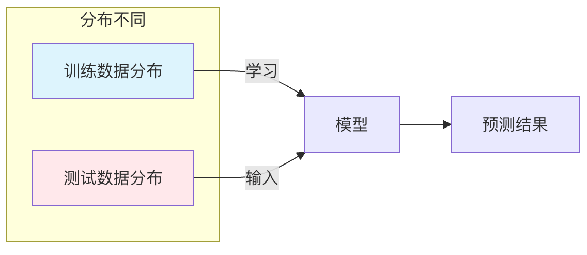

## 假设限制
机器学习作为人工智能的核心驱动力，已经在图像识别、自然语言处理和推荐系统等领域取得了令人瞩目的成就。

然而，正如任何强大的工具一样，机器学习并非万能。它的有效性在很大程度上依赖于一系列基础假设，当现实世界的数据或问题场景违背了这些假设时，模型的性能就会大打折扣，甚至得出完全错误的结论。

理解这些限制与边界，特别是其背后的假设限制，对于正确、安全地应用机器学习至关重要，这不仅能帮助我们规避陷阱，也能指引我们选择更合适的模型或改进数据，从而构建更鲁棒、更可信的智能系统。

### 独立同分布假设
这是监督学习中最核心的假设之一。

#### 基本概念
独立同分布假设是指：我们用于训练模型的数据样本，与模型未来将要预测的数据样本，是从同一个概率分布中独立抽取的。
 *   独立：一个数据样本的出现不会影响另一个数据样本出现的概率。
 *   同分布：所有数据（训练集、验证集、测试集以及未来的真实数据）都服从同一个潜在的数据生成规律。

#### 为何重要
机器学习模型的本质是通过分析训练数据来学习这个潜在的数据分布规律。如果训练数据和测试数据来自不同的分布，就意味着模型学到的规律不适用于测试场景，其预测结果将不可靠。

#### 假设违背的后果与示例
当这个假设被打破时，就会发生分布偏移问题，主要有以下几种类型：

##### 协变量偏移

描述：输入特征 X 的分布发生了变化，但输入 X 与输出 Y 之间的关系（即条件分布 P(Y|X)）保持不变。
示例：用一个在白天拍摄的清晰图片数据集训练了一个猫狗分类器，然后将其用于识别夜间拍摄的模糊图片。这里，图片的清晰度和光照（特征 X）的分布发生了巨大变化，但"猫"和"狗"本身的视觉特征（关系 P(Y|X)）没变。模型可能因为不熟悉夜间模糊特征而表现不佳。

##### 标签偏移
描述：输出标签 Y 的分布发生了变化，但给定标签后，输入特征的分布 P(X|Y) 保持不变。
示例：用一个健康人群占比99%、患病人群占比1%的数据集训练疾病诊断模型。在另一个地区，该疾病的患病率可能上升到10%。虽然对于真正患病的人，其症状（P(X|Y=患病)）是相似的，但模型之前见到的"患病"样本太少，可能会在新的数据中严重低估患病概率。

##### 概念偏移
描述：输入 X 和输出 Y 之间的映射关系本身随着时间或环境发生了变化。
示例：股票价格预测模型。影响股价的市场规律（P(Y|X)）是动态变化的，用过去十年数据训练的模型，可能无法准确预测未来在全新经济政策下的股价走势。

### 训练数据代表性假设
这个假设要求训练数据集必须充分代表模型可能遇到的整个数据空间。

#### 基本概念
模型只能从它"见过"的数据中学习。如果训练数据缺失了某些重要的情形、类别或特征范围，模型在面对这些"未见"情况时就会无所适从。

#### 假设违背的后果与示例
这直接导致了泛化能力差和偏见问题。

##### 数据覆盖不全
示例：用于训练自动驾驶汽车感知模型的数据集中，如果缺少在暴雨、大雪等极端天气下的图像，那么模型在遇到这种天气时，其识别行人和车辆的能力会显著下降，甚至失效。

##### 样本选择偏差
描述：收集数据的方式系统性地排除了某些群体。
示例：如果一个人脸识别系统的训练数据主要来自特定肤色和年龄段的成年人，那么它在识别儿童、老年人或其他肤色人群时，准确率会明显偏低。这不是因为模型"不好"，而是因为它没有机会学习这些群体的特征。

### 平稳性假设
这个假设主要针对时间序列数据，要求数据的基本统计特性（如均值、方差）不随时间变化。

#### 基本概念
许多经典的时间序列模型（如ARIMA）或应用于序列数据的机器学习模型，都隐含地假设数据生成过程是平稳的，或者可以通过差分等方法变得平稳。

#### 为何重要
非平稳数据中的趋势或季节性会主导模型的学习过程，导致模型捕捉的是这些随时间变化的伪规律，而非真正的内在关联，从而对未来做出糟糕的预测。

#### 假设违背的后果与示例
示例：预测每月冰淇淋销量。数据呈现明显的上升趋势（可能是由于公司成长）和夏季高峰。如果直接用非平稳数据建模，模型可能会简单地预测下个月比这个月高，而无法准确区分长期趋势、季节效应和真正的随机波动。一旦市场饱和（趋势改变），预测就会完全错误。

### 特征与标签存在相关关系假设
这个假设是机器学习能够工作的根本前提：我们提供的特征 X 必须与我们要预测的标签 Y 存在某种可被模型学习的相关关系。

#### 基本概念
机器学习模型的任务就是发现 X 和 Y 之间的这种关联模式。如果两者本质上毫无关联，那么任何模型都无法做出比随机猜测更好的预测。

#### 假设违背的后果与示例
示例：试图用咖啡杯的颜色来预测明天的股票大盘涨跌。这两个变量之间几乎不存在任何有意义的因果关系或稳定的统计关联，因此无论用什么高级模型，其结果都是无效的。

### 实践练习：诊断你的问题
在启动一个机器学习项目前，请先思考以下问题清单，以评估潜在的假设限制风险：
1 数据来源一致性：我的训练数据（历史数据）和未来的应用场景数据，是在相同条件下产生的吗？有没有未考虑的环境、时间或群体差异？
2 数据完整性检查：我的训练集是否包含了所有可能的重要类别和极端情况？数据收集过程是否有系统性遗漏？
3 关系合理性：我选择的特征，从业务逻辑或常识上看，是否真的与预测目标相关？
4 稳定性评估：如果我的数据是时间序列，它的统计特性（如平均值）是否随时间剧烈波动？

### 总结
认识到机器学习的假设限制，不是要否定其价值，而是为了更科学、更负责任地使用它。在实际应用中，绝对完美的假设几乎不存在。我们的目标是通过数据预处理（如数据增强、重采样）、算法选择（如对分布偏移鲁棒的算法）和持续的模型监控与评估，来尽可能缓解这些假设被违背所带来的影响。

一个优秀的机器学习实践者，不仅是一个调参高手，更是一个深刻理解数据、问题与模型边界的数据侦探。理解这些限制，是你从入门走向精通的必经之路。