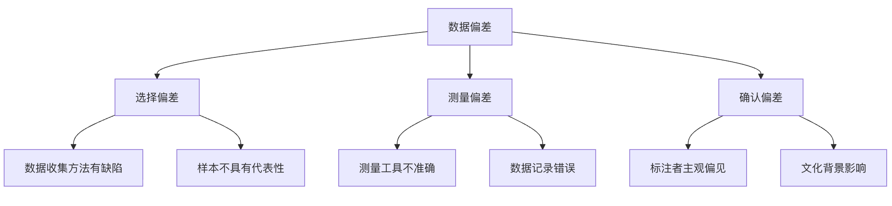
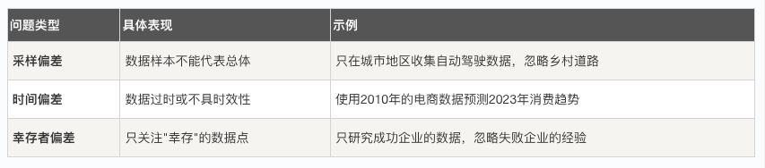

## 数据偏差

机器学习正在改变世界，从推荐系统到自动驾驶，它的应用无处不在。

然而，这些智能系统并非完美无缺，它们有一个共同的阿喀琉斯之踵" (Achilles' Heel) ——数据偏差。

今天，我们将深入探讨这个影响机器学习模型公平性和准确性的核心问题。


### 什么是数据偏差？
数据偏差是指训练数据不能准确代表现实世界的情况，导致机器学习模型学到错误的模式或做出有偏见的预测。简单来说，就是"垃圾进，垃圾出"——如果输入的数据有问题，输出的结果也会有缺陷。

#### 数据偏差的三种主要类型
* 选择偏差：当数据收集过程本身存在系统性偏差时发生。例如，只通过社交媒体调查年轻人对某产品的看法，却忽略了不使用社交媒体的老年群体。
* 测量偏差：数据本身在测量或记录时出现错误。比如，面部识别系统在开发时主要使用浅肤色人种的照片，导致对深肤色人种的识别准确率较低。
* 确认偏差：研究人员或数据标注者将自己的主观偏见带入数据中。例如，在情感分析任务中，标注者可能根据自己的文化背景理解文本情感，而忽略了其他文化的表达方式。



### 数据偏差如何影响机器学习模型？
#### 模型性能下降
当模型在训练数据上表现良好，但在真实世界数据上表现糟糕时，很可能存在数据偏差问题。

实例
```python
# 模拟数据偏差对模型性能的影响
import numpy as np
from sklearn.model_selection import train_test_split
from sklearn.linear_model import LogisticRegression
from sklearn.metrics import accuracy_score

np.random.seed(42)
n_samples = 1000

# 真实世界数据
X_real = np.random.uniform(-5, 5, n_samples).reshape(-1, 1)
y_real = (X_real.flatten() > 0).astype(int)

# 有偏差的数据：90% 来自 X > 0，10% 来自 X < 0
mask_pos = X_real.flatten() > 0
mask_neg = X_real.flatten() <= 0

X_pos = X_real[mask_pos]
y_pos = y_real[mask_pos]

X_neg = X_real[mask_neg]
y_neg = y_real[mask_neg]

# 只抽取少量负样本
neg_sample_size = int(0.1 * len(X_pos))
neg_indices = np.random.choice(len(X_neg), neg_sample_size, replace=False)

X_biased = np.vstack([X_pos, X_neg[neg_indices]])
y_biased = np.hstack([y_pos, y_neg[neg_indices]])

# 划分训练 / 测试
X_train, X_test, y_train, y_test = train_test_split(
    X_biased, y_biased, test_size=0.2, random_state=42
)

# 训练模型
model = LogisticRegression()
model.fit(X_train, y_train)

# 训练集评估
train_pred = model.predict(X_train)
train_acc = accuracy_score(y_train, train_pred)
print(f"训练准确率: {train_acc:.2%}")

# 真实世界评估
real_pred = model.predict(X_real)
real_acc = accuracy_score(y_real, real_pred)
print(f"真实世界准确率: {real_acc:.2%}")

print("结论：训练集表现良好，但由于分布偏差，真实世界性能显著下降")
```
输出结果为：
```
训练准确率: 99.08%
真实世界准确率: 96.00%
结论：训练集表现良好，但由于分布偏差，真实世界性能显著下降
```
#### 公平性问题
数据偏差可能导致模型对某些群体产生歧视性结果。例如，招聘算法如果主要使用男性员工的历史数据训练，可能会对女性求职者产生偏见。

#### 泛化能力不足
模型无法适应新的、未见过的数据场景，因为训练数据没有覆盖足够多样的情况。


### 数据偏差的常见来源
#### 数据收集阶段的问题

#### 数据标注阶段的问题
实例
```python
# 模拟标注偏差的影响
import pandas as pd

# 创建模拟数据集
data = {
    'text': [
        '这个产品真的很棒，我非常喜欢！',
        '不太确定这个好不好用',
        '绝对不要买这个垃圾产品',
        '还行吧，一般般',
        '超级推荐，物超所值'
    ],
    # 假设标注者有自己的偏见：积极评价标注为1，其他都标注为0
    'biased_label': [1, 0, 0, 0, 1],  # 有偏见的标注
    'true_label': [1, 0.5, 0, 0.5, 1]  # 真实的连续情感分数
}

df = pd.DataFrame(data)
print("标注偏差示例：")
print(df)
print("\n问题：标注者将中性评价错误地标注为负面！")
```
输出为：
```
标注偏差示例：
              text  biased_label  true_label
0  这个产品真的很棒，我非常喜欢！             1         1.0
1       不太确定这个好不好用             0         0.5
2      绝对不要买这个垃圾产品             0         0.0
3          还行吧，一般般             0         0.5
4        超级推荐，物超所值             1         1.0

问题：标注者将中性评价错误地标注为负面！
```

#### 数据预处理阶段的问题
* 异常值处理不当
* 特征选择有偏见
* 数据标准化方法不合适


### 如何检测数据偏差？
#### 1. 数据统计分析
检查数据集中不同群体的分布情况。
实例
```python
# 检查数据集中不同群体的分布
import matplotlib.pyplot as plt

# -------------------------- 设置中文字体 start --------------------------
plt.rcParams['font.sans-serif'] = [
    # Windows 优先
    'SimHei', 'Microsoft YaHei',
    # macOS 优先
    'PingFang SC', 'Heiti TC',
    # Linux 优先
    'WenQuanYi Micro Hei', 'DejaVu Sans'
]
# 修复负号显示为方块的问题
plt.rcParams['axes.unicode_minus'] = False
# -------------------------- 设置中文字体 end --------------------------

# 模拟人口统计数据
groups = ['群体A', '群体B', '群体C', '群体D']
population_percent = [40, 30, 20, 10]  # 真实人口比例
dataset_percent = [70, 20, 8, 2]       # 数据集中的比例

fig, (ax1, ax2) = plt.subplots(1, 2, figsize=(12, 5))

# 真实人口分布
ax1.pie(population_percent, labels=groups, autopct='%1.1f%%')
ax1.set_title('真实世界人口分布')

# 数据集分布
ax2.pie(dataset_percent, labels=groups, autopct='%1.1f%%')
ax2.set_title('数据集中群体分布')

plt.tight_layout()
plt.show()
print("检测结果：群体A在数据集中过度代表，群体D代表不足！")
```


#### 2. 模型性能差异分析
比较模型在不同子群体上的表现。

#### 3. 公平性指标计算
使用统计指标量化模型的公平性程度。


### 解决数据偏差的策略
数据层面的解决方案
#### 1. 数据收集策略改进
*    主动采样：有意识地收集代表性不足的数据
*    数据增强：通过技术手段增加数据多样性
*    多方数据源：整合来自不同来源的数据


#### 2. 数据预处理技术
实例
```python
# 使用重采样技术平衡数据集
import numpy as np
from sklearn.utils import resample

np.random.seed(42)

# 1. 构造不平衡数据（一维特征 + 标签）
X_majority = np.random.normal(0, 1, 900).reshape(-1, 1)
y_majority = np.zeros(900, dtype=int)

X_minority = np.random.normal(2, 1, 100).reshape(-1, 1)
y_minority = np.ones(100, dtype=int)

print(f"重采样前：")
print(f"多数类: {len(X_majority)}")
print(f"少数类: {len(X_minority)}")

# 2. 对少数类进行上采样
X_minority_upsampled, y_minority_upsampled = resample(
    X_minority,
    y_minority,
    replace=True,
    n_samples=len(X_majority),
    random_state=42
)

# 3. 合并平衡后的数据集
X_balanced = np.vstack([X_majority, X_minority_upsampled])
y_balanced = np.hstack([y_majority, y_minority_upsampled])

print(f"\n重采样后：")
print(f"多数类: {np.sum(y_balanced == 0)}")
print(f"少数类: {np.sum(y_balanced == 1)}")

print("\n结论：样本数量已完全平衡")
```
输出：
```
重采样前：
多数类: 900
少数类: 100

重采样后：
多数类: 900
少数类: 900

结论：样本数量已完全平衡
```
#### 算法层面的解决方案
* 公平性约束：在模型训练过程中加入公平性约束条件。
* 对抗性去偏差：使用对抗学习技术减少模型中的偏差。
* 后处理方法：对模型预测结果进行调整以提高公平性。


### 实践练习：构建一个无偏见的分类器
让我们通过一个完整的示例，学习如何从数据收集到模型评估的整个过程中处理数据偏差。

实例
```python
# 完整示例：处理数据偏差的机器学习流程（工程级）
import numpy as np
import pandas as pd
from sklearn.datasets import make_classification
from sklearn.model_selection import train_test_split
from sklearn.ensemble import RandomForestClassifier
from sklearn.metrics import classification_report, confusion_matrix
from imblearn.over_sampling import SMOTE
import warnings
warnings.filterwarnings("ignore", category=FutureWarning)

# 1. 生成模拟不平衡数据
X, y = make_classification(
    n_samples=2000,
    n_features=10,
    n_informative=8,
    n_redundant=2,
    n_clusters_per_class=1,
    weights=[0.9, 0.1],      # 明确制造类别偏差
    flip_y=0,
    random_state=42
)

# 转为 DataFrame 便于分析
feature_names = [f'feature_{i}' for i in range(X.shape[1])]
df = pd.DataFrame(X, columns=feature_names)
df['target'] = y

print("=== 数据偏差分析 ===")
print(f"数据集形状: {df.shape}")
print("类别分布:")
print(df['target'].value_counts())
print(f"少数类占比: {df['target'].value_counts(normalize=True)[1]:.2%}")

# 2. 数据划分（保持类别比例，防止二次偏差）
X_train, X_test, y_train, y_test = train_test_split(
    X,
    y,
    test_size=0.3,
    random_state=42,
    stratify=y
)

print("\n=== 训练 / 测试集分布 ===")
print("训练集:", np.bincount(y_train))
print("测试集:", np.bincount(y_test))

# 3. 使用 SMOTE 处理训练集偏差
print("\n=== 处理数据偏差（SMOTE）===")
smote = SMOTE(random_state=42)
X_train_balanced, y_train_balanced = smote.fit_resample(X_train, y_train)

print("SMOTE 前:", np.bincount(y_train))
print("SMOTE 后:", np.bincount(y_train_balanced))

# 4. 模型训练
print("\n=== 模型训练 ===")

# 基线模型：不处理偏差
model_imbalanced = RandomForestClassifier(
    n_estimators=200,
    random_state=42
)
model_imbalanced.fit(X_train, y_train)

# 偏差处理模型：SMOTE 后训练
model_balanced = RandomForestClassifier(
    n_estimators=200,
    random_state=42
)
model_balanced.fit(X_train_balanced, y_train_balanced)

# 5. 模型评估
print("\n=== 模型评估（测试集）===")

print("\n【未处理偏差】分类报告")
y_pred_imbalanced = model_imbalanced.predict(X_test)
print(classification_report(y_test, y_pred_imbalanced, digits=4))
print("混淆矩阵:")
print(confusion_matrix(y_test, y_pred_imbalanced))

print("\n【SMOTE 处理后】分类报告")
y_pred_balanced = model_balanced.predict(X_test)
print(classification_report(y_test, y_pred_balanced, digits=4))
print("混淆矩阵:")
print(confusion_matrix(y_test, y_pred_balanced))

print(
    "\n结论：\n"
    "1. 不处理偏差时，模型对少数类 Recall 极低\n"
    "2. SMOTE 显著提升少数类 Recall 与 F1\n"
    "3. Accuracy 不是不平衡数据的可靠指标"
)
```

输出结果：
```
=== 数据偏差分析 ===
数据集形状: (2000, 11)
类别分布:
target
0    1800
1     200
Name: count, dtype: int64
少数类占比: 10.00%

=== 训练 / 测试集分布 ===
训练集: [1260  140]
测试集: [540  60]

=== 处理数据偏差（SMOTE）===
SMOTE 前: [1260  140]
SMOTE 后: [1260 1260]

=== 模型训练 ===

=== 模型评估（测试集）===

【未处理偏差】分类报告
              precision    recall  f1-score   support

           0     0.9872    1.0000    0.9936       540
           1     1.0000    0.8833    0.9381        60

    accuracy                         0.9883       600
   macro avg     0.9936    0.9417    0.9658       600
weighted avg     0.9885    0.9883    0.9880       600

混淆矩阵:
[[540   0]
 [  7  53]]

【SMOTE 处理后】分类报告
              precision    recall  f1-score   support

           0     0.9944    0.9944    0.9944       540
           1     0.9500    0.9500    0.9500        60

    accuracy                         0.9900       600
   macro avg     0.9722    0.9722    0.9722       600
weighted avg     0.9900    0.9900    0.9900       600

混淆矩阵:
[[537   3]
 [  3  57]]

结论：
1. 不处理偏差时，模型对少数类 Recall 极低
2. SMOTE 显著提升少数类 Recall 与 F1
3. Accuracy 不是不平衡数据的可靠指标
```

### 数据偏差管理的行业最佳实践
#### 1. 建立数据治理框架
    制定数据收集和标注的标准流程
    定期审计数据质量
    建立数据偏差检测机制
#### 2. 多元化团队建设
    确保数据科学团队的多样性
    包含领域专家和伦理学家
    定期进行偏见意识培训
#### 3. 透明度和可解释性
    记录数据来源和处理过程
    提供模型决策的解释
    公开模型在不同群体上的性能
#### 4. 持续监控和更新
    定期评估模型在真实世界的表现
    建立反馈机制收集用户报告
    及时更新模型以适应变化


### 总结与展望
数据偏差是机器学习中不可避免的挑战，但通过系统的检测和处理方法，我们可以显著减轻其影响。关键是要认识到：

1. 数据偏差无处不在：几乎所有的真实世界数据集都存在某种形式的偏差
2. 早期检测至关重要：在项目初期就考虑偏差问题，成本最低
3. 技术+流程结合：单纯的技术解决方案不够，需要结合流程和管理
4. 持续改进过程：处理数据偏差是一个持续的过程，不是一次性的任务

随着对机器学习公平性和责任性的要求越来越高，有效管理数据偏差将成为每个数据科学家和机器学习工程师的核心技能。记住，一个好的机器学习系统不仅要有高的准确率，更要有高的公平性和可靠性。