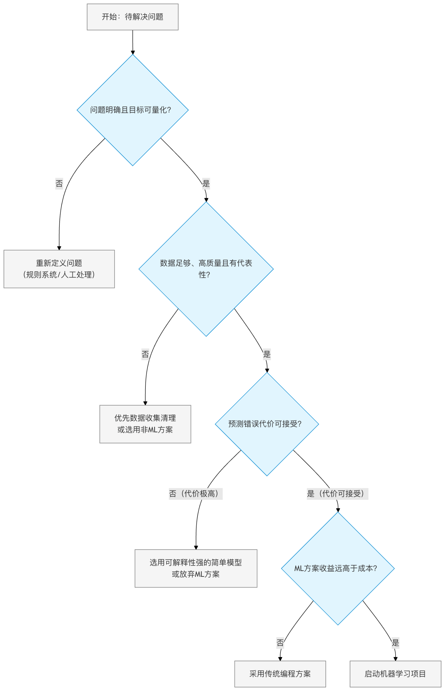

### 模型的现实成本
想象一下，你刚刚训练了一个在测试集上准确率达到 99% 的图像识别模型，你满怀信心地将它部署到一家工厂的生产线上。

然而，几周后你收到反馈：模型频繁误判，导致生产线多次无故停机，造成了巨大的经济损失。问题出在哪里？

这个场景揭示了机器学习领域一个常被忽视的真相：**一个模型在实验室或测试环境中的优异表现，并不等同于它在现实世界中的成功。**

在模型从开发到部署的旅程中，存在着诸多限制和隐藏的成本。

本文将带你深入探讨这些现实成本，帮助你建立更全面、更务实的机器学习视角。


### 超越准确率 - 理解模型的综合成本
当我们谈论一个模型的成本时，大多数人首先想到的是训练模型所消耗的 GPU 时间和电费。但这仅仅是冰山一角。

一个完整的机器学习项目成本，至少包含以下四个维度：

#### 1. 数据成本：燃料的获取与净化
机器学习模型以数据为"燃料"，而获取高质量燃料的成本极高。

##### 数据收集成本：
* 金钱成本：购买标注数据集、使用数据采集服务（如众包平台 MTurk）的费用。
* 时间成本：从定义标注规范、培训标注人员到完成初步标注，周期可能长达数周甚至数月。
* 合规成本：确保数据收集符合 GDPR（通用数据保护条例）、CCPA（加州消费者隐私法案）等法律法规，可能需要法律咨询和流程设计。

数据预处理与标注成本：
* 清洗成本：现实数据充满噪声、缺失值和异常值。清洗工作通常占整个项目 60-80% 的时间。
* 标注成本：以图像边界框标注为例，一张复杂图片的标注可能需要几分钟，一个十万张的数据集，其标注人力和管理成本非常可观。

```python
实例
# 一个简单的示例：估算数据标注成本
def estimate_labeling_cost(num_images, time_per_image, cost_per_hour):
    """
    估算数据标注的总成本

    参数:
        num_images (int): 需要标注的图片总数
        time_per_image (float): 标注单张图片的平均时间（小时）
        cost_per_hour (float): 标注人员每小时成本（货币单位）

    返回:
        total_hours, total_cost: 总耗时和总成本
    """
    total_hours = num_images * time_per_image
    total_cost = total_hours * cost_per_hour
    return total_hours, total_cost

# 假设一个项目有10万张图片，每张标注需0.05小时（3分钟），每小时成本为20元
hours, cost = estimate_labeling_cost(100000, 0.05, 20)
print(f"总耗时: {hours:.0f} 小时")
print(f"总成本: {cost:.2f} 元")
# 输出: 总耗时: 5000 小时
# 输出: 总成本: 100000.00 元
```

#### 2. 计算成本：训练与推理的能耗账单
计算成本分为一次性训练成本和持续性的推理成本。

##### 训练成本：
* 使用云服务（如 AWS SageMaker， Google Cloud AI Platform）按小时计费的 GPU 实例。
* 模型调参（超参数优化）过程可能需要训练数十上百个模型副本，成本倍增。

##### 推理成本：
* 模型部署后，每次处理用户请求（即进行预测）都会产生计算成本。
* 对于高并发服务（如千人千面的推荐系统），即使单次推理成本很低，累积起来也极为庞大。

实例
```python
# 示例：估算云上训练成本
def estimate_training_cost(training_hours, instance_hourly_rate, num_trials=1):
    """
    估算在云平台上训练模型的成本

    参数:
        training_hours (float): 单次训练所需小时数
        instance_hourly_rate (float): GPU实例每小时费率（美元）
        num_trials (int): 超参数搜索或实验的次数

    返回:
        total_cost: 预估总成本
    """
    total_cost = training_hours * instance_hourly_rate * num_trials
    return total_cost

# 假设训练一个模型需10小时，使用每小时4美元的P3实例，并进行20组超参数实验
cost = estimate_training_cost(10, 4, 20)
print(f"预估训练总成本: {cost} 美元")
# 输出: 预估训练总成本: 800 美元
```

#### 3. 部署与维护成本：让模型持续奔跑
将模型部署到生产环境并保持其稳定运行，是一个长期投入。

##### 基础设施成本：

* 服务器、容器管理（如 Kubernetes）、负载均衡、网络流量的费用。
* 开发部署流水线（CI/CD for ML）的工具和人力成本。

##### 监控与维护成本：
* 需要持续监控模型的预测性能、延迟和资源使用情况。
* 数据分布可能随时间变化（概念漂移），需要定期用新数据重新训练或微调模型，这产生了持续的再训练成本。

#### 4. 机会成本与风险成本：看不见的代价
这是最容易被低估的部分。

##### 机会成本：
* 团队花费 3 个月开发一个机器学习方案，可能意味着错过了用更简单的规则系统在 1 个月内解决问题的机会。

##### 风险成本：
* 模型偏差：如果训练数据不能代表全体用户，模型可能对某些群体不公平，引发伦理问题和公关危机。
* 预测错误：在医疗、金融、自动驾驶等领域，一个错误预测可能导致人身伤害或重大财产损失，带来法律风险。


### 技术的天花板 - 机器学习的内在限制
即使不考虑成本，机器学习技术本身也存在固有的边界。

#### 1. 数据依赖与"垃圾进，垃圾出"
机器学习模型完全依赖于其训练数据。如果数据质量差、规模小或有偏差，模型的表现就会受限。

小数据问题：对于某些小众领域（如罕见病诊断），可能根本无法获取足够的高质量数据来训练一个可靠的模型。
数据偏差：历史数据中若存在社会偏见（如招聘中的性别歧视），模型会学习并放大这些偏见。

#### 2. 可解释性困境：黑盒的代价
许多高性能模型（如深度神经网络）是复杂的"黑盒"，我们难以理解其内部决策逻辑。

在需要高可靠性和可审计性的领域（如信贷审批、司法辅助），使用黑盒模型可能不被允许。
当模型出错时，难以诊断根本原因，从而增加了调试和修复的难度。

#### 3. 泛化能力的边界
模型在训练集和测试集上表现好，不代表能应对现实中的所有情况。

分布外数据：模型可能无法处理与训练数据分布差异过大的输入。例如，一个只在晴天图片上训练过的自动驾驶系统，在雾天可能完全失效。
对抗性样本：对输入进行人类难以察觉的微小扰动，就可能导致模型做出完全错误的预测，这对安全性要求高的系统是重大威胁。
实例
```python
# 一个概念性示例：展示模型对分布外数据的脆弱性
import numpy as np

# 假设一个简单的"猫狗分类器"在训练时只见过清晰图片
def trained_classifier_confidence(image):
    """模拟一个在清晰图片上训练的模型"""
    # 这里简化处理：如果图片像素值方差大（表示细节多，清晰），则置信度高
    clarity = np.var(image)
    if clarity > 1000: # 清晰图片的假设阈值
        return 0.95 # 高置信度
    else:
        return 0.55 # 低置信度，表示模型不确定

# 模拟一张清晰图片（高方差）和一张模糊图片（低方差）
clear_image = np.random.randn(100, 100) * 255 # 高方差，模拟清晰
blurry_image = np.random.randn(100, 100) * 50 + 128 # 低方差，模拟模糊

print(f"清晰图片预测置信度: {trained_classifier_confidence(clear_image):.2f}")
print(f"模糊图片预测置信度: {trained_classifier_confidence(blurry_image):.2f}")
# 输出可能: 清晰图片预测置信度: 0.95
# 输出可能: 模糊图片预测置信度: 0.55
# 说明模型对未见过的模糊图片信心不足
```

### 成本效益分析 - 何时使用机器学习？
面对这些成本和限制，我们不应盲目应用机器学习。在启动项目前，请务必进行成本效益分析，并考虑以下替代方案：

#### 决策流程图：该用机器学习吗？



#### 务实的替代方案
* 基于规则的系统：如果业务逻辑清晰、稳定，且异常情况少，编写 if-else 规则可能更快速、便宜、可靠。
* 统计方法：对于许多分析任务，线性回归、假设检验等经典统计方法可能已经足够，且更易解释。
* 人机协作：在某些场景下，将机器学习作为辅助工具（如筛选出高概率案例供人工复核），比全自动化更具性价比和安全性。

### 总结与行动指南
机器学习是一项强大的技术，但它不是解决所有问题的"银弹"。它的成功应用，建立在对现实成本的清醒认知和对技术边界的充分尊重之上。

#### 给初学者的行动建议
* 从小处着手：开始第一个项目时，选择范围小、数据易获取、错误代价低的场景（如对公开数据集进行电影评论情感分析）。
* 全面估算成本：在项目规划阶段，就有意识地从数据、计算、部署、风险四个维度进行粗略的成本估算。
* 优先考虑简单方案：在尝试复杂的深度学习模型前，先试试逻辑回归、决策树等简单模型。它们成本更低、更快、也更容易解释。
* 持续监控与评估：模型上线不是终点。建立监控指标，定期评估模型在真实环境中的表现和业务价值。
记住，一个优秀的机器学习实践者，不仅是模型架构师，更是一名权衡成本、效益与风险的工程师。