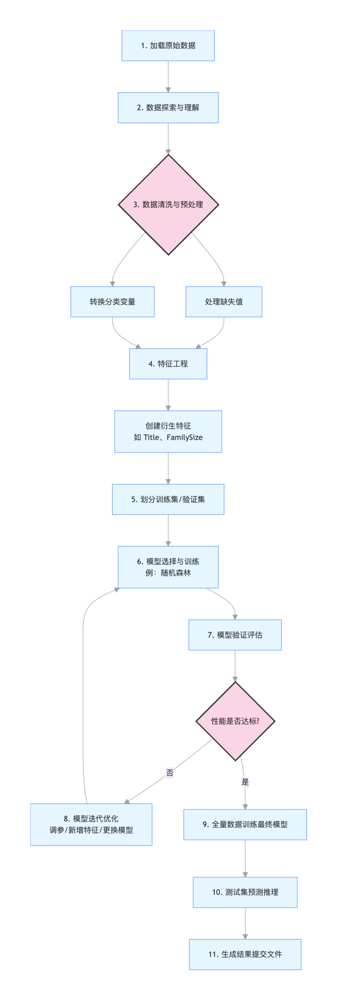

### 泰坦尼克号生存预测
如果你刚开始学习机器学习，可能会觉得那些复杂的算法和数学公式离现实世界很遥远。但今天，我们将通过一个经典案例——泰坦尼克号生存预测，来亲手体验一次完整的机器学习项目流程。

泰坦尼克号数据集是机器学习领域最著名的入门项目之一，它基于 1912 年泰坦尼克号沉船事件中乘客的真实信息。我们的目标是：根据乘客的年龄、性别、船票等级等信息，构建一个模型来预测他们是否能在灾难中幸存。

这个项目之所以经典，是因为它完美地涵盖了机器学习项目的核心步骤：
* 1 数据理解与探索
* 2 数据清洗与预处理
* 3 特征工程
* 4 模型选择与训练
* 5 模型评估与优化
通过这个实战案例，你将不再只是阅读理论，而是真正理解如何将机器学习应用于解决实际问题。

#### 第一步：理解我们的数据
在动手写任何代码之前，我们必须先了解手头的数据。泰坦尼克号数据集通常包含以下字段（特征）：

核心洞察：从历史知识我们知道，当时奉行"妇女和儿童优先"的原则，且头等舱乘客有优先使用救生艇的权利。因此，我们预期 Sex, Age, Pclass 等特征将对预测结果产生重大影响。

#### 第二步：数据清洗与预处理
原始数据几乎从不完美。
数据清洗就像为模型准备高质量的食材，这一步至关重要。
把以下数据存储到 train.csv 文件中：
```
    PassengerId,Survived,Pclass,Name,Sex,Age,SibSp,Parch,Ticket,Fare,Cabin,Embarked
    1,0,3,"Braund, Mr. Owen Harris",male,22,1,0,A/5 21171,7.25,,S
    2,1,1,"Cumings, Mrs. John Bradley",female,38,1,0,PC 17599,71.2833,C85,C
    3,1,3,"Heikkinen, Miss. Laina",female,26,0,0,STON/O2. 3101282,7.925,,S
    4,1,1,"Futrelle, Mrs. Jacques Heath",female,35,1,0,113803,53.1,C123,S
    5,0,3,"Allen, Mr. William Henry",male,35,0,0,373450,8.05,,S
    6,0,3,"Moran, Mr. James",male,,0,0,330877,8.4583,,Q
    7,0,1,"McCarthy, Mr. Timothy J",male,54,0,0,17463,51.8625,E46,S
    8,0,3,"Palsson, Master. Gosta Leonard",male,2,3,1,349909,21.075,,S
    9,1,3,"Johnson, Mrs. Oscar W",female,27,0,2,347742,11.1333,,S
    10,1,2,"Nasser, Mrs. Nicholas",female,14,1,0,237736,30.0708,,C
```
把以下数据存储到 test.csv 文件中：
```
PassengerId,Pclass,Name,Sex,Age,SibSp,Parch,Ticket,Fare,Cabin,Embarked
11,3,"Kelly, Mr. James",male,34.5,0,0,330911,7.8292,,Q
12,3,"Wilkes, Mrs. James",female,47,1,0,363272,7,,S
13,2,"Myles, Mr. Thomas Francis",male,62,0,0,240276,9.6875,,Q
14,3,"Dwyer, Miss. Ellen",female,18,0,0,330959,7.75,,Q
15,1,"Jones, Mr. Charles",male,,1,0,PC 17603,82.1708,B28,C
```
我们将使用 Python 的 pandas 和 numpy 库来完成这项工作。

实例
```python
# 导入必要的库
import pandas as pd
import numpy as np

# 加载数据
train_data = pd.read_csv('train.csv') # 训练集，包含目标变量 Survived
test_data = pd.read_csv('test.csv')   # 测试集，不包含 Survived，用于最终评估

# 1. 初步查看数据
print("训练集形状：", train_data.shape)
print(train_data.info()) # 查看数据类型和缺失情况
print(train_data.head()) # 查看前几行数据
```
输出：
```
训练集形状： (10, 12)
<class 'pandas.core.frame.DataFrame'>
RangeIndex: 10 entries, 0 to 9
Data columns (total 12 columns):
 #   Column       Non-Null Count  Dtype  
---  ------       --------------  -----  
 0   PassengerId  10 non-null     int64  
 1   Survived     10 non-null     int64  
 2   Pclass       10 non-null     int64  
 3   Name         10 non-null     object 
 4   Sex          10 non-null     object 
 5   Age          9 non-null      float64
 6   SibSp        10 non-null     int64  
 7   Parch        10 non-null     int64  
 8   Ticket       10 non-null     object 
 9   Fare         10 non-null     float64
 10  Cabin        3 non-null      object 
 11  Embarked     10 non-null     object 
dtypes: float64(2), int64(5), object(5)
memory usage: 1.1+ KB
None
   PassengerId  Survived  Pclass                          Name     Sex  ...  Parch            Ticket     Fare Cabin  Embarked
0            1         0       3       Braund, Mr. Owen Harris    male  ...      0         A/5 21171   7.2500   NaN         S
1            2         1       1    Cumings, Mrs. John Bradley  female  ...      0          PC 17599  71.2833   C85         C
2            3         1       3        Heikkinen, Miss. Laina  female  ...      0  STON/O2. 3101282   7.9250   NaN         S
3            4         1       1  Futrelle, Mrs. Jacques Heath  female  ...      0            113803  53.1000  C123         S
4            5         0       3      Allen, Mr. William Henry    male  ...      0            373450   8.0500   NaN         S

[5 rows x 12 columns]
```
运行上述代码后，你可能会发现两个主要问题：缺失值 和 非数值型数据。

##### 处理缺失值
实例
```python
# 检查各列缺失值的数量
print(train_data.isnull().sum())

# 处理 Age（年龄）：中位数填充
train_data['Age'] = train_data['Age'].fillna(train_data['Age'].median())
test_data['Age'] = test_data['Age'].fillna(test_data['Age'].median())

# 处理 Embarked（登船港口）：众数填充
most_common_port = train_data['Embarked'].mode()[0]
train_data['Embarked'] = train_data['Embarked'].fillna(most_common_port)
test_data['Embarked'] = test_data['Embarked'].fillna(most_common_port)

# 处理 Fare（船票价格）：测试集
test_data['Fare'] = test_data['Fare'].fillna(test_data['Fare'].median())

# 处理 Cabin（船舱）：直接删除
train_data.drop(columns=['Cabin'], inplace=True)
test_data.drop(columns=['Cabin'], inplace=True)
```

##### 转换非数值型数据
机器学习模型通常只能处理数值。我们需要将 Sex 和 Embarked 这样的文本列转换为数字。

实例
```python
# 将 Sex 列转换为数值：female -> 0, male -> 1
train_data['Sex'] = train_data['Sex'].map({'female': 0, 'male': 1})
test_data['Sex'] = test_data['Sex'].map({'female': 0, 'male': 1})

# 将 Embarked 列转换为数值（独热编码 One-Hot Encoding）
# 因为港口之间没有大小顺序，所以不适合用 0,1,2 简单映射
train_data = pd.get_dummies(train_data, columns=['Embarked'])
test_data = pd.get_dummies(test_data, columns=['Embarked'])
```

#### 第三步：特征工程

特征工程是机器学习中的"魔法"，它通过创造或转换特征来帮助模型更好地学习。我们从 Name 列中提取"称谓"就是一个经典例子。

实例
```python
# 从 Name 列中提取称谓（如 Mr., Mrs., Miss., Master.）
# 称谓往往能反映年龄、社会地位和性别，可能影响获救优先级
train_data['Title'] = train_data['Name'].str.extract(' ([A-Za-z]+)\.', expand=False)
test_data['Title'] = test_data['Name'].str.extract(' ([A-Za-z]+)\.', expand=False)

# 查看有哪些称谓
print(pd.crosstab(train_data['Title'], train_data['Sex']))

# 将不常见的称谓归类为'Rare'
title_mapping = {
    'Mr': 'Mr', 'Miss': 'Miss', 'Mrs': 'Mrs',
    'Master': 'Master', 'Dr': 'Rare', 'Rev': 'Rare',
    'Col': 'Rare', 'Major': 'Rare', 'Mlle': 'Miss',
    'Countess': 'Rare', 'Ms': 'Miss', 'Lady': 'Rare',
    'Jonkheer': 'Rare', 'Don': 'Rare', 'Dona': 'Rare',
    'Mme': 'Mrs', 'Capt': 'Rare', 'Sir': 'Rare'
}
train_data['Title'] = train_data['Title'].map(title_mapping)
test_data['Title'] = test_data['Title'].map(title_mapping)

# 将处理后的 Title 列也进行独热编码
train_data = pd.get_dummies(train_data, columns=['Title'])
test_data = pd.get_dummies(test_data, columns=['Title'])

# 创建新特征：家庭规模
train_data['FamilySize'] = train_data['SibSp'] + train_data['Parch'] + 1
test_data['FamilySize'] = test_data['SibSp'] + test_data['Parch'] + 1

# 创建新特征：是否独自一人
train_data['IsAlone'] = (train_data['FamilySize'] == 1).astype(int)
test_data['IsAlone'] = (test_data['FamilySize'] == 1).astype(int)

# 删除不再需要的原始列
columns_to_drop = ['PassengerId', 'Name', 'Ticket', 'SibSp', 'Parch']
train_data.drop(columns_to_drop, axis=1, inplace=True)
test_passenger_ids = test_data['PassengerId'] # 保存测试集ID用于后续提交
test_data.drop(columns_to_drop, axis=1, inplace=True)

print("特征工程后的训练集列名：", train_data.columns.tolist())
```

#### 第四步：选择与训练模型
现在，我们有了干净且富含信息的数值数据。接下来，我们将其分为**特征 (X) 和目标变量 (y)**，然后选择一个模型进行训练。

我们将从简单且高效的 **随机森林 (Random Forest)** 模型开始。
实例
```python
# 导入机器学习库
from sklearn.model_selection import train_test_split
from sklearn.ensemble import RandomForestClassifier
from sklearn.metrics import accuracy_score

# 准备数据
# X 是特征矩阵，y 是我们要预测的目标向量
X = train_data.drop('Survived', axis=1)
y = train_data['Survived']

# 为了在训练过程中评估模型性能，我们将数据分为训练集和验证集
# test_size=0.2 表示 20% 的数据用于验证，80% 用于训练
# random_state 是一个随机种子，确保每次分割的结果一致
X_train, X_val, y_train, y_val = train_test_split(X, y, test_size=0.2, random_state=42)

# 初始化随机森林分类器
# n_estimators: 森林中树的数量
# max_depth: 树的最大深度，控制模型复杂度，防止过拟合
# random_state: 确保结果可复现
model = RandomForestClassifier(n_estimators=100, max_depth=5, random_state=42)

# 训练模型（让模型从数据中学习规律）
model.fit(X_train, y_train)

# 在验证集上进行预测
y_pred = model.predict(X_val)

# 评估模型准确率
accuracy = accuracy_score(y_val, y_pred)
print(f"模型在验证集上的准确率为：{accuracy:.4f} (即 {accuracy*100:.2f}%)")
```

#### 第五步：模型评估、优化与提交
##### 评估与优化
一次训练的结果可能不是最优的。我们可以通过以下方式改进：
1 调整模型参数：例如，尝试不同的 n_estimators 或 max_depth。
2 尝试其他模型：比如逻辑回归、支持向量机、梯度提升树等。
3 进一步的特征工程：比如对 Age 或 Fare 进行分箱处理。
实例
```python
# 示例：尝试不同的最大深度
for depth in [3, 5, 10, None]: # None 表示不限制深度
    model_temp = RandomForestClassifier(n_estimators=100, max_depth=depth, random_state=42)
    model_temp.fit(X_train, y_train)
    y_pred_temp = model_temp.predict(X_val)
    acc = accuracy_score(y_val, y_pred_temp)
    print(f"max_depth={depth} 时，验证集准确率：{acc:.4f}")
```

##### 特征重要性分析
随机森林可以告诉我们哪些特征对预测贡献最大。

实例
```python
# 获取特征重要性
feature_importances = pd.DataFrame({
    'feature': X_train.columns,
    'importance': model.feature_importances_
}).sort_values('importance', ascending=False)

print("特征重要性排名：")
print(feature_importances)
```
你可能会发现 Sex, Fare（关联 Pclass）, Age, Title 是最重要的特征，这与我们的历史直觉相符。

在测试集上生成最终预测
当我们对模型性能满意后，就用全部训练数据重新训练，并对真正的测试集进行预测。

实例
```python
# 使用全部训练数据重新训练最终模型
final_model = RandomForestClassifier(n_estimators=100, max_depth=5, random_state=42)
final_model.fit(X, y) # 这次使用全部训练数据 X, y

# 确保测试集的特征列与训练集完全一致（顺序和列数）
# pd.get_dummies 可能导致训练集和测试集列数不同（如果某个类别只在一方出现）
# 这里我们需要对齐列。一个简单的方法是先合并再分割，但更稳健的做法是确保编码一致性。
# 为简化，假设我们处理后的测试集列已对齐。
final_predictions = final_model.predict(test_data)

# 创建提交文件
submission = pd.DataFrame({
    'PassengerId': test_passenger_ids,
    'Survived': final_predictions
})
submission.to_csv('my_titanic_submission.csv', index=False)
print("预测结果已保存至 'my_titanic_submission.csv'，可以提交到Kaggle平台查看排名！")
```

#### 总结与项目流程图
我们已经完成了一个完整的机器学习管道，用流程图回顾整个过程：



通过这个实战项目，你不仅学会了 pandas 进行数据处理、sklearn 构建模型的技巧，更重要的是，你掌握了解决一个机器学习问题的标准思路。
这个流程——从数据理解到模型部署——是绝大多数数据科学项目的核心。