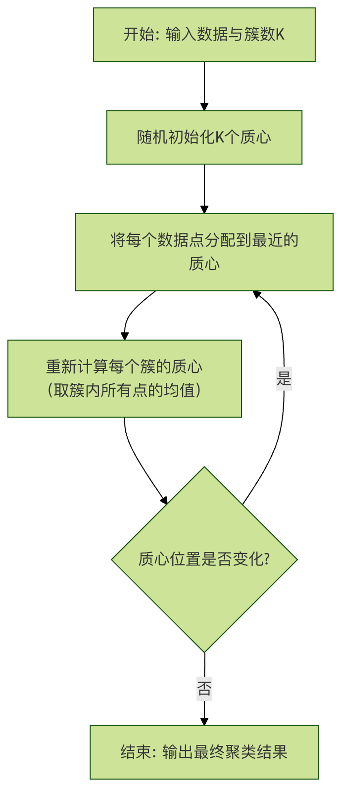
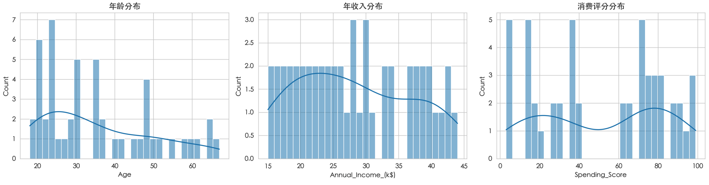
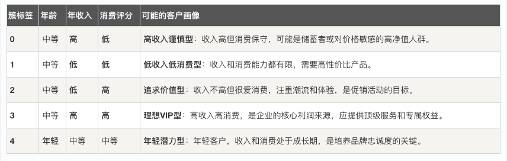

## 机器学习 - 客户分群
在当今数据驱动的商业世界中，理解客户是成功的关键。

然而，当你的客户数量达到成千上万甚至百万级别时，手动分析每个客户的特征和行为模式变得不切实际。

这时，机器学习技术，特别是 无监督学习 中的聚类算法，就成为了一个强大的工具。

客户分群，也称为客户细分，其核心目标是将庞大的客户群体划分为若干个具有相似特征的子群体。这就像一位经验丰富的店主，不再将顾客视为一个模糊的整体，而是能清晰地识别出追求性价比的家庭主妇、热衷新品的技术发烧友和注重服务体验的高端客户等不同群体。通过对不同群体采取针对性的营销、服务和产品策略，企业可以显著提升运营效率和客户满意度。

本文将带你一步步完成一个完整的客户分群实战项目。我们将使用经典的 K-Means 聚类算法，对一个模拟的零售客户数据集进行分析，从数据理解到模型评估，最终获得具有商业洞察力的分群结果。

### 理解聚类分析与 K-Means 算法
在开始实战之前，我们需要理解即将使用的核心工具。

#### 什么是聚类分析？
聚类分析是一种无监督学习方法。与监督学习（如预测房价或识别猫狗图片）不同，聚类算法没有预先标注好的"正确答案"（即标签）。它的任务是探索数据内在的结构，将相似的数据点自动归入同一组（称为"簇"），同时让不同组之间的数据点尽可能不相似。

一个简单的比喻：想象你有一筐混合的水果，里面有苹果、橘子和香蕉。聚类算法的任务就是在没有人告诉你类别名称的情况下，自动把形状、颜色、大小相似的果子分别堆成一堆。

#### K-Means 算法的工作原理
K-Means 是最常用、最直观的聚类算法之一。"K"代表我们想要将数据划分成的簇的数量。其工作原理可以概括为四个步骤：
1 初始化：随机选择 K 个数据点作为初始的"簇中心"（质心）。
2 分配：计算每个数据点到各个质心的距离（通常使用欧氏距离），然后将每个点分配到离它最近的质心所在的簇。
3 更新：重新计算每个簇的质心（即该簇所有点的平均值）。
4 迭代：重复步骤 2 和 3，直到质心的位置不再发生显著变化，或者达到预设的迭代次数。
下面的流程图清晰地展示了这个过程：



算法核心要点：
* 距离度量：通常使用欧氏距离来衡量数据点之间的相似度，距离越近，相似度越高。
* 质心：代表一个簇的"平均点"或中心点。
* 目标：最小化每个簇内数据点到其质心的距离平方和（称为"簇内平方和"或 Inertia）。

### 实战演练：零售客户分群
现在，让我们将理论付诸实践。我们将使用 Python 及其强大的数据科学生态库来完成这个项目。

#### 第1步：环境准备与数据加载
首先，确保你的 Python 环境中安装了必要的库：pandas 用于数据处理，numpy 用于数值计算，matplotlib 和 seaborn 用于可视化，scikit-learn 是核心的机器学习库。
实例
```python
# 导入必要的库
import pandas as pd
import numpy as np
import matplotlib.pyplot as plt
import seaborn as sns
from sklearn.cluster import KMeans
from sklearn.preprocessing import StandardScaler
from sklearn.metrics import silhouette_score
import warnings
warnings.filterwarnings('ignore') # 忽略非关键警告

# 设置可视化风格
sns.set_style("whitegrid")
# -------------------------- 设置中文字体 start --------------------------
plt.rcParams['font.sans-serif'] = [
    # Windows 优先
    'SimHei', 'Microsoft YaHei',
    # macOS 优先
    'PingFang SC', 'Heiti TC',
    # Linux 优先
    'WenQuanYi Micro Hei', 'DejaVu Sans'
]
# 修复负号显示为方块的问题
plt.rcParams['axes.unicode_minus'] = False
# -------------------------- 设置中文字体 end --------------------------
```

我们将使用一个模拟的客户数据集 customer_data.csv，它通常包含以下特征：
* CustomerID: 客户唯一标识
* Annual_Income_(k$): 客户年收入（千美元）
* Spending_Score: 消费评分（0-100，由购买频率、金额等综合得出）
* Age: 年龄

内容如下：
```
CustomerID,Age,Annual_Income_(k$),Spending_Score
1,19,15,39
2,21,15,81
3,20,16,6
4,23,16,77
5,31,17,40
6,22,17,76
7,35,18,6
8,23,18,94
9,64,19,3
10,30,19,72
11,67,20,14
12,35,20,99
13,58,21,15
14,24,21,77
15,37,22,13
16,22,22,79
17,35,23,35
18,20,23,66
19,52,24,29
20,35,24,98
21,46,25,35
22,25,25,73
23,54,26,5
24,28,26,73
25,45,27,28
26,23,28,82
27,40,28,36
28,35,28,61
29,60,29,4
30,21,30,87
31,62,30,17
32,23,30,73
33,18,31,92
34,49,33,14
35,21,33,81
36,42,34,17
37,30,34,73
38,36,37,26
39,20,37,75
40,65,38,35
41,24,38,92
42,48,39,36
43,31,39,61
44,49,40,29
45,24,40,98
46,50,41,15
47,27,42,65
48,29,43,88
49,31,43,19
50,49,44,75
```

实例
```python
# 加载数据
df = pd.read_csv('customer_data.csv')
print("数据形状（行数，列数）:", df.shape)
print("\n数据前5行:")
print(df.head())
print("\n数据基本信息:")
print(df.info())
print("\n描述性统计:")
print(df.describe())
```

输出：
```
数据形状（行数，列数）: (50, 4)

数据前5行:
   CustomerID  Age  Annual_Income_(k$)  Spending_Score
0           1   19                  15              39
1           2   21                  15              81
2           3   20                  16               6
3           4   23                  16              77
4           5   31                  17              40

数据基本信息:
<class 'pandas.core.frame.DataFrame'>
RangeIndex: 50 entries, 0 to 49
Data columns (total 4 columns):
 #   Column              Non-Null Count  Dtype
---  ------              --------------  -----
 0   CustomerID          50 non-null     int64
 1   Age                 50 non-null     int64
 2   Annual_Income_(k$)  50 non-null     int64
 3   Spending_Score      50 non-null     int64
dtypes: int64(4)
memory usage: 1.7 KB
None

描述性统计:
       CustomerID        Age  Annual_Income_(k$)  Spending_Score
count    50.00000  50.000000           50.000000       50.000000
mean     25.50000  35.560000           28.160000       51.680000
std      14.57738  14.283085            8.739682       31.506682
min       1.00000  18.000000           15.000000        3.000000
25%      13.25000  23.000000           21.000000       20.750000
50%      25.50000  31.000000           27.500000       61.000000
75%      37.75000  47.500000           36.250000       77.000000
max      50.00000  67.000000           44.000000       99.000000

```

#### 第2步：数据探索与预处理
在应用算法前，我们必须先了解数据并做好"清洗"工作。

##### 1. 探索性数据分析 通过可视化和统计，初步发现规律。
实例
```python
# 可视化特征分布
fig, axes = plt.subplots(1, 3, figsize=(15, 4))
sns.histplot(df['Age'], bins=30, kde=True, ax=axes[0])
axes[0].set_title('年龄分布')
sns.histplot(df['Annual_Income_(k$)'], bins=30, kde=True, ax=axes[1])
axes[1].set_title('年收入分布')
sns.histplot(df['Spending_Score'], bins=30, kde=True, ax=axes[2])
axes[2].set_title('消费评分分布')
plt.tight_layout()
plt.show()

# 查看特征间关系
sns.pairplot(df[['Age', 'Annual_Income_(k$)', 'Spending_Score']])
plt.suptitle('特征关系散点图矩阵', y=1.02)
plt.show()
```




##### 2. 数据预处理 
聚类算法对特征的量纲（单位）非常敏感。年收入（数万）和年龄（数十）的数值范围差异巨大，会严重影响距离计算，导致收入特征主导聚类结果。因此，我们需要进行特征标准化，将各个特征缩放到均值为0、方差为1的标准正态分布。
实例
```python
# 选择用于聚类的特征
features = ['Age', 'Annual_Income_(k$)', 'Spending_Score']
X = df[features].copy()

# 特征标准化
scaler = StandardScaler()
X_scaled = scaler.fit_transform(X) # fit 计算均值和方差，transform 应用转换
X_scaled_df = pd.DataFrame(X_scaled, columns=features)
print("标准化后的数据前5行:")
print(X_scaled_df.head())
```


#### 第3步：确定最佳簇数（K值）
K-Means 需要我们预先指定 K 值。如何选择一个合理的 K？我们使用两种经典方法：

**1. 肘部法则** 绘制不同 K 值对应的簇内平方和（Inertia）。Inertia 会随着 K 增大而减小，我们寻找曲线拐点（像手肘一样），其后的 K 值带来的收益（Inertia下降）变小。

实例
```python
inertia = []
K_range = range(1, 11) # 测试 K 从 1 到 10

for k in K_range:
    kmeans = KMeans(n_clusters=k, random_state=42, n_init='auto') # n_init='auto' 是较新版本用法
    kmeans.fit(X_scaled)
    inertia.append(kmeans.inertia_) # 获取该K值下的Inertia

# 绘制肘部法则图
plt.figure(figsize=(8,5))
plt.plot(K_range, inertia, 'bo-')
plt.xlabel('簇的数量 (K)')
plt.ylabel('簇内平方和 (Inertia)')
plt.title('肘部法则：选择最佳K值')
plt.xticks(K_range)
plt.show()
```

**2. 轮廓系数法**  轮廓系数衡量一个数据点与自身簇的相似度（内聚度）和与其他簇的分离度。其值在 -1 到 1 之间，越高越好，表示聚类效果越佳。

实例
```python
silhouette_scores = []
K_range = range(2, 11) # 轮廓系数要求至少2个簇

for k in K_range:
    kmeans = KMeans(n_clusters=k, random_state=42, n_init='auto')
    cluster_labels = kmeans.fit_predict(X_scaled)
    score = silhouette_score(X_scaled, cluster_labels)
    silhouette_scores.append(score)

# 绘制轮廓系数图
plt.figure(figsize=(8,5))
plt.plot(K_range, silhouette_scores, 'go-')
plt.xlabel('簇的数量 (K)')
plt.ylabel('轮廓系数')
plt.title('轮廓系数法：选择最佳K值')
plt.xticks(K_range)
plt.show()
```

综合肘部法则图（拐点）和轮廓系数图（峰值），我们假设确定 K=5 是一个不错的选择。

#### 第4步：应用 K-Means 进行聚类
使用选定的 K 值训练模型，并为每个客户打上簇标签。
实例
```python
# 使用 K=5 训练最终模型
final_k = 5
kmeans_final = KMeans(n_clusters=final_k, random_state=42, n_init='auto')
df['Cluster'] = kmeans_final.fit_predict(X_scaled) # 将聚类标签添加到原始数据框

# 查看每个簇的客户数量
cluster_counts = df['Cluster'].value_counts().sort_index()
print("各簇客户数量分布:")
print(cluster_counts)

# 查看每个簇的特征均值（原始尺度）
cluster_profile = df.groupby('Cluster')[features].mean().round(2)
print("\n各簇特征平均值:")
print(cluster_profile)
```
#### 第5步：结果分析与可视化
将抽象的簇标签转化为直观的洞察。

**1.可视化聚类结果** 由于我们有三个特征，可以在二维平面上选择两个最重要的特征进行可视化（例如收入和消费评分）。

实例
```python
# 选择两个特征进行二维可视化
plt.figure(figsize=(10, 6))
scatter = plt.scatter(df['Annual_Income_(k$)'], df['Spending_Score'],
                     c=df['Cluster'], cmap='viridis', s=50, alpha=0.7)
plt.colorbar(scatter, label='簇标签')
plt.xlabel('年收入 (k$)')
plt.ylabel('消费评分')
plt.title('客户分群结果（基于年收入与消费评分）')
plt.show()
```
**2. 刻画客户群画像** 根据 cluster_profile 表格，我们可以为每个簇赋予商业含义：



#### 第 6 步：模型评估与应用建议
评估：除了轮廓系数，可以查看簇内样本分布是否均衡，以及结合业务逻辑判断分群是否合理。

##### 应用建议：
* 精准营销：向"理想VIP型"（簇3）推送高端新品和独家活动；向"追求价值型"（簇2）发送折扣券和团购信息。
* 产品开发：针对"年轻潜力型"（簇4）设计时尚、社交属性强的产品。
* 客户服务：为"高收入谨慎型"（簇0）提供详细的产品数据和安全保障，打消其顾虑。
* 资源分配：将更多客服和营销资源倾斜到高价值客户群。

#### 总结与扩展
通过这个实战案例，你已完整地体验了使用 K-Means 算法进行客户分群的流程：数据准备 -> 探索分析 -> 预处理 -> 确定K值 -> 训练模型 -> 分析结果。

##### 关键要点回顾：
* 聚类是无监督学习，用于发现数据内在分组。
* 特征标准化是使用基于距离的聚类算法前的关键步骤。
* 肘部法则和轮廓系数是确定最佳簇数的实用工具。
* 聚类结果的解读必须结合业务知识，才能产生真正的价值。
