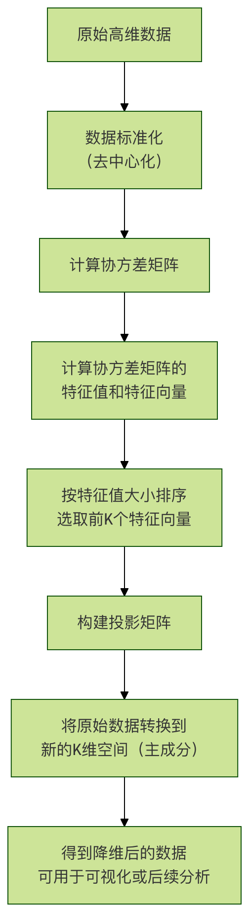

### 机器学习 - PCA 可视化案例
想象一下，你正在整理一个塞满各种物品的杂乱房间，为了更清晰地了解房间的布局，你可能会从不同角度（比如正面、侧面、俯视）给它拍几张照片。

**主成分分析（Principal Component Analysis，简称 PCA）** 在机器学习中所做的事情与此类似。

PCA 是一种强大的数据降维和可视化工具。当我们的数据包含成百上千个特征（维度）时，这些数据就像身处一个超高维度的空间中，人类无法直观理解。

PCA 可以帮助我们找到数据中最重要的视角（即主成分），将数据投影到最重要的两三个维度上，从而让我们能够用二维或三维散点图来观察高维数据的结构和分布。

简单来说，PCA的目标是：

* 降维：用更少的特征来代表原始数据，减少计算量和存储空间，同时去除噪声。
* 可视化：将高维数据降至2维或3维，以便于我们直观地观察数据点之间的关系（如聚类、分离情况）。

#### PCA 核心原理与工作流程
PCA 的核心思想是寻找数据方差最大的方向。

方差越大，意味着数据在这个方向上的投影点越分散，所包含的信息量也就越多。

第一个找到的方向就是第一主成分（PC1），第二个与 PC1 正交且方差次大的方向是第二主成分（PC2），以此类推。
##### PCA 工作流程图


##### 流程关键步骤说明：
**标准化**：让每个特征的平均值为 0，标准差为 1，确保所有特征在计算时具有同等重要性。
**协方差矩阵**：计算特征之间的相关性。PCA 通过分析这个矩阵来找到数据变化的主要方向。
**特征值与特征向量：**
    **特征向量**：就是我们要找的主成分方向。
    **特征值**：对应特征向量方向上的数据方差大小。特征值越大，该主成分越重要。
**选择主成分**：我们将特征值从大到小排序，选择前 K 个最大的特征值对应的特征向量。K 就是我们想要降维到的目标维度（例如，对于可视化，K=2 或 3）。
**数据转换**：用选出的 K 个特征向量组成一个投影矩阵，将原始数据点乘这个矩阵，就得到了在 K 个新主成分上的坐标，即降维后的数据。

### 实战案例：鸢尾花数据集的可视化
我们将使用经典的鸢尾花（Iris）数据集来演示PCA。这个数据集包含150个样本，每个样本有4个特征（萼片长度、萼片宽度、花瓣长度、花瓣宽度），并属于3个不同的品种。

我们的目标是：将这 4 维的数据用 PCA 降到 2 维，并在二维平面上画出来，观察不同品种的花是否能被区分开。

#### 环境准备与数据加载
首先，确保你安装了必要的Python库：scikit-learn, matplotlib, numpy，pandas。

实例
```python
# 导入必要的库
import numpy as np
import pandas as pd
import matplotlib.pyplot as plt
from sklearn import datasets
from sklearn.decomposition import PCA
from sklearn.preprocessing import StandardScaler

# 设置中文字体和图表样式（可选）
plt.rcParams['font.sans-serif'] = ['SimHei']  # 用来正常显示中文标签
plt.rcParams['axes.unicode_minus'] = False  # 用来正常显示负号

# 加载鸢尾花数据集
iris = datasets.load_iris()
X = iris.data  # 特征数据，形状为 (150, 4)
y = iris.target  # 目标标签（品种），形状为 (150,)
target_names = iris.target_names  # 品种名称：['setosa', 'versicolor', 'virginica']

print(f"数据集形状: {X.shape}")
print(f"特征名称: {iris.feature_names}")
print(f"目标类别: {target_names}")
```
输出：
```
    数据集形状: (150, 4)
    特征名称: ['sepal length (cm)', 'sepal width (cm)', 'petal length (cm)', 'petal width (cm)']
    目标类别: ['setosa' 'versicolor' 'virginica']
```


#### 数据标准化
在应用 PCA 之前，对数据进行标准化是至关重要的一步。

因为 PCA 对特征的尺度非常敏感，如果一个特征的数值范围（例如花瓣长度以厘米计，数值在 1-10 之间）远大于另一个特征（例如萼片宽度以毫米计，数值在 0.1-1 之间），那么数值范围大的特征会主导主成分的方向，这通常不是我们想要的。

实例
```python
# 数据标准化（去中心化并缩放到单位方差）
scaler = StandardScaler()
X_scaled = scaler.fit_transform(X)
print("标准化后，前5个样本的数据：")
print(X_scaled[:5])
```

#### 应用PCA进行降维
我们使用 scikit-learn 的 PCA 类，它可以轻松完成所有数学计算。

实例
```python
# 创建PCA对象，指定降维到2维
pca = PCA(n_components=2)

# 在标准化后的数据上拟合PCA模型，并进行数据转换
X_pca = pca.fit_transform(X_scaled)

print(f"降维后的数据形状: {X_pca.shape}")
print(f"前5个样本在PC1和PC2上的坐标:\n{X_pca[:5]}")

# 查看各主成分的方差解释率
print(f"主成分方差解释率: {pca.explained_variance_ratio_}")
print(f"前两个主成分累计方差解释率: {sum(pca.explained_variance_ratio_):.4f}")
```

**代码解析：**
n_components=2：指定我们要将数据降至 2 维。
fit_transform(X_scaled)：该方法一次性完成两件事：
*    fit：根据输入数据 X_scaled 计算 PCA 所需的参数（如主成分方向）。
*    transform：使用计算好的参数，将数据 X_scaled 转换到新的二维空间。结果存储在 X_pca 中。
explained_variance_ratio_：这是一个非常重要的属性。它告诉我们每个主成分捕获的原始数据方差的比例。例如，如果输出是 [0.73, 0.23]，意味着PC1保留了原始数据73%的信息，PC2保留了23%的信息，两者加起来保留了96%的信息。这帮助我们评估降维后的信息损失。


#### 可视化结果
现在，我们有了二维数据 X_pca，可以轻松地用散点图将其可视化。

实例
```python
# 创建可视化图表
plt.figure(figsize=(8, 6))

# 为每个品种设置不同的颜色和标记
colors = ['navy', 'turquoise', 'darkorange']
lw = 2  # 线宽

# 遍历三个品种，分别绘制
for color, i, target_name in zip(colors, [0, 1, 2], target_names):
    plt.scatter(X_pca[y == i, 0],  # 选择属于当前品种i的样本的PC1坐标
                X_pca[y == i, 1],  # 选择属于当前品种i的样本的PC2坐标
                color=color, alpha=0.8, lw=lw,
                label=target_name)

# 添加图表标题和坐标轴标签
plt.title('鸢尾花数据集的PCA二维可视化')
plt.xlabel(f'第一主成分 (PC1) - 方差解释率: {pca.explained_variance_ratio_[0]:.2%}')
plt.ylabel(f'第二主成分 (PC2) - 方差解释率: {pca.explained_variance_ratio_[1]:.2%}')
plt.legend(loc='best', shadow=False, scatterpoints=1)
plt.grid(True, linestyle='--', alpha=0.6)

# 显示图表
plt.tight_layout()
plt.show()
```

可视化结果解读： 运行上述代码后，你会得到一张二维散点图。

**X轴（PC1）**：代表了原始4个特征中方差最大的方向，是区分数据最重要的维度。从图中可以看出，它很好地将 Setosa（山鸢尾） 品种与其他两个品种分离开。
**Y轴（PC2）**：代表了与PC1正交且方差次大的方向，提供了额外的区分信息。它帮助进一步区分 Versicolor（杂色鸢尾） 和 Virginica（维吉尼亚鸢尾），尽管两者有一些重叠。
**结论**：通过PCA，我们成功将4维数据投影到2维平面，并清晰地观察到三个品种的聚类情况。Setosa完全分离，而Versicolor和Virginica在二维投影上存在部分重叠，这说明仅用前两个主成分（保留了约95%的信息）还不足以完美区分后两个品种，但它们的主要分布趋势已经非常明显。

### 深入探索与思考
#### 如何选择主成分的数量（K值）？
在实际项目中，我们可能不知道应该降到几维。一个常用的方法是绘制 碎石图（Scree Plot），它展示了每个主成分的方差解释率。

实例
```python
# 首先，用所有主成分拟合PCA
pca_full = PCA()
pca_full.fit(X_scaled)

# 绘制碎石图
plt.figure(figsize=(8, 5))
plt.plot(range(1, len(pca_full.explained_variance_ratio_) + 1),
         pca_full.explained_variance_ratio_, 'o-', linewidth=2)
plt.title('PCA方差解释率碎石图')
plt.xlabel('主成分序号')
plt.ylabel('方差解释率')
plt.grid(True, linestyle='--', alpha=0.6)
plt.xticks(range(1, len(pca_full.explained_variance_ratio_) + 1))
plt.tight_layout()
plt.show()

# 绘制累计方差解释率图
plt.figure(figsize=(8, 5))
plt.plot(range(1, len(pca_full.explained_variance_ratio_) + 1),
         np.cumsum(pca_full.explained_variance_ratio_), 's-', linewidth=2, color='red')
plt.title('PCA累计方差解释率')
plt.xlabel('主成分数量')
plt.ylabel('累计方差解释率')
plt.axhline(y=0.95, color='gray', linestyle='--', label='95% 阈值') # 常用阈值
plt.legend()
plt.grid(True, linestyle='--', alpha=0.6)
plt.xticks(range(1, len(pca_full.explained_variance_ratio_) + 1))
plt.tight_layout()
plt.show()
```

#### 如何选择 K 值？
* 看拐点：在碎石图中，寻找方差解释率下降趋势突然变缓的点（即肘部），其后的主成分贡献较小。
* 设定阈值：在累计方差图中，选择能使累计解释率达到一个满意阈值（如 95% 或 99%）的最小K值。从鸢尾花数据的累计图可以看出，前两个主成分已能解释超过 95% 的方差，因此 K=2 是一个很好的选择。

#### 理解主成分的含义
我们还可以查看主成分的载荷（Loadings），即每个原始特征对主成分的贡献权重，这有助于解释主成分的实际意义。

实例
```python
# 获取前两个主成分的载荷矩阵（特征向量）
pca_components = pca.components_  # 形状为 (2, 4)

# 用DataFrame展示，更清晰
df_components = pd.DataFrame(pca_components,
                             columns=iris.feature_names,
                             index=['PC1', 'PC2'])
print("主成分载荷矩阵（特征向量）：")
print(df_components)

# 可以用热力图可视化
import seaborn as sns
plt.figure(figsize=(8, 4))
sns.heatmap(df_components, annot=True, cmap='RdBu_r', center=0)
plt.title('主成分载荷热力图')
plt.tight_layout()
plt.show()
```

**解读载荷矩阵：**
* 对于 PC1，如果花瓣长度和花瓣宽度有较大的正权重，而萼片宽度有较大的负权重，那么 PC1 可能主要代表了花瓣大小与萼片宽度的对比这个综合特征。
* 对于 PC2，权重模式不同，它可能代表了另一种特征组合。通过分析这些权重，我们可以为抽象的主成分赋予一些实际的生物学或业务含义。

#### 关键要点总结
* PCA 是什么：一种无监督的线性降维方法，通过寻找数据方差最大的正交方向（主成分）来重新表述数据。
* 核心步骤：标准化 -> 计算协方差矩阵 -> 计算特征值与特征向量 -> 选择主成分 -> 数据投影。
* 重要概念：
*     主成分：新的、不相关的特征轴。
*     方差解释率：衡量每个主成分重要性的指标。
*     载荷：连接原始特征与主成分的桥梁，用于解释主成分的意义。
* 主要应用：数据可视化、去除噪声和冗余、作为其他模型（如分类、回归）的预处理步骤以加速训练。


##### 动手练习
为了巩固知识，请尝试完成以下练习：

**练习1：探索不同数据集** 尝试对 scikit-learn 中的其他数据集（如 digits 手写数字数据集或 wine 葡萄酒数据集）进行 PCA 可视化。观察降维后的图像是否还能保留不同类别之间的区分度。

实例
```python
# 提示：加载葡萄酒数据集
from sklearn.datasets import load_wine
wine = load_wine()
# ... 重复PCA流程
```

练习2：三维可视化 将鸢尾花数据降至3维，并使用 mpl_toolkits.mplot3d 库进行三维散点图绘制。看看增加一个维度后，Versicolor和Virginica的重叠是否减少。
实例
```python
from mpl_toolkits.mplot3d import Axes3D
pca3 = PCA(n_components=3)
X_pca3 = pca3.fit_transform(X_scaled)
# ... 创建3D图形进行绘制
```