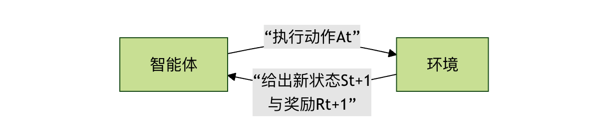
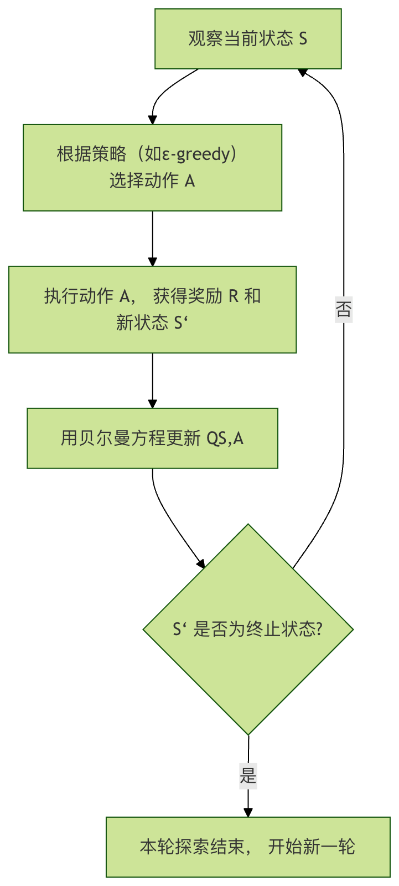
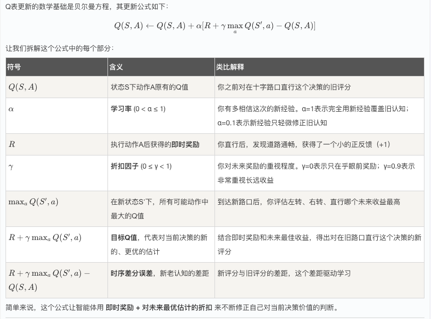

### 机器学习 - 强化学习示例
想象一下，你在教一只小狗学习坐下这个指令。你不会直接告诉它坐下这个单词是什么意思，而是通过奖励和惩罚来引导它。

* 当小狗偶然做出坐下的动作时，你立刻给它一块零食（奖励）。
* 当它做错时，你就不给零食（惩罚）。
经过多次尝试，小狗最终会明白坐下这个指令与获得零食之间的关联，从而学会这个技能。

**强化学习** 就是让计算机（或智能体）通过类似试错的方式，在与环境的互动中学习如何做出最优决策，以获得最大累积奖励的一种机器学习方法。

**强化学习**与我们之前学过的监督学习（有标准答案）和无监督学习（寻找数据内在结构）有本质区别。强化学习的核心是 智能体 与 环境 的持续交互。


#### 核心概念解析
在深入代码之前，我们先来理解几个关键概念，它们就像游戏规则，定义了强化学习世界如何运转。

* 智能体：智能体就是我们的学习者或决策者。在上面的比喻中，它就是那只小狗。在程序中，它是一个算法，负责观察环境、做出动作并从结果中学习。
* 环境：环境是智能体所处的外部世界。它接收智能体的动作，并给出两个反馈：新的环境状态和本次动作带来的即时奖励。
* 状态：状态是环境在某一时刻的具体情况描述。例如，在一个走迷宫的游戏里，状态就是智能体当前所在的位置坐标。
* 动作：动作是智能体在某个状态下可以做出的选择。比如，在迷宫中，动作可以是向上、向下、向左、向右。
* 奖励：奖励是环境对智能体动作的直接评价信号，通常是一个数值。正奖励 表示鼓励，负奖励 表示惩罚。智能体的终极目标就是最大化从开始到结束所获得的 总奖励（累积奖励）。
* 策略：策略是智能体的行为准则，它定义了在每一个可能的状态下，应该选择哪个动作。学习的过程，本质上就是优化这个策略的过程。

为了更直观地理解这些概念如何协同工作，我们来看一下强化学习的基本交互流程：



这个循环会一直持续，直到达到终止状态（如游戏通关或失败）。

### 经典问题：悬崖寻路
为了将理论付诸实践，我们将使用一个经典的强化学习示例环境：CliffWalking-v0（悬崖寻路）。它来自 gymnasium 库（原 OpenAI Gym 的维护分支）。

#### 环境描述
* 场景：一个 4x12 的网格世界。
* 起点：左下角（坐标 [3, 0]）。
* 终点：右下角（坐标 [3, 11]）。
* 悬崖：最底部一排除了起点和终点的所有位置（[3, 1] 到 [3, 10]），掉入悬崖会获得巨大惩罚并回到起点。
* 目标：智能体要从起点安全地走到终点，并避免掉下悬崖。
* 动作：上（0）、右（1）、下（2）、左（3）。
* 奖励：
*    每走一步普通网格：-1（鼓励用更少步数到达）
*    掉下悬崖：-100，并被送回起点
*    到达终点：0，并结束本次尝试


### 算法简介：Q-Learning
我们将使用 Q-Learning 算法来解决这个问题。它是一种 无模型 的强化学习算法，意味着智能体不需要预先知道环境的运作规则（如状态转移概率），它通过不断尝试来学习。
它的核心是一个名为 Q表 的表格。
* 行 代表所有可能的状态。
* 列 代表所有可能的动作。
* 单元格的值（Q值） 代表在某个状态下，采取某个动作的长期期望收益。
Q-Learning 的学习过程可以概括为以下几步，它展示了智能体如何通过一次经验来更新自己的知识（Q表）：


#### 核心公式：贝尔曼方程
Q表更新的数学基础是贝尔曼方程，其更新公式如下：


### 实战：编写Q-Learning智能体
现在，让我们用代码实现一个解决悬崖寻路问题的Q-Learning智能体。

#### 步骤1：安装与导入库
首先，确保你已安装必要的库。在终端或命令行中运行：

实例
```python
pip install gymnasium numpy
```
然后，在Python文件中导入它们：

实例
```python
import gymnasium as gym
import numpy as np
import random
```

#### 步骤2：初始化环境和Q表
实例
```python
# 1. 创建环境
env = gym.make("CliffWalking-v0", render_mode="human") # render_mode="human" 用于可视化

# 2. 获取环境信息
n_states = env.observation_space.n  # 状态总数 (4*12=48)
n_actions = env.action_space.n      # 动作总数 (4个方向)

# 3. 初始化Q表， 形状为 [状态数, 动作数]， 初始值全为0
Q_table = np.zeros((n_states, n_actions))
print(f"环境状态数: {n_states}, 动作数: {n_actions}")
print(f"Q表形状: {Q_table.shape}")
```


#### 步骤3：设置超参数
超参数是控制算法行为的旋钮，需要根据问题调整。

实例
```python
# 定义超参数
alpha = 0.1   # 学习率：新信息的影响程度
gamma = 0.99  # 折扣因子：未来奖励的重要性
epsilon = 0.1 # 探索率：以多大概率进行随机探索（而非选择已知最优）
num_episodes = 500  # 训练轮数（智能体玩游戏的次数）

```

#### 步骤4：实现ε-greedy策略
这是智能体做决策的核心策略，它平衡了 探索 和 利用。

探索：随机选择动作，以发现可能更好的策略。
利用：选择当前Q表认为最优的动作，以获取最大收益。
实例
```python
def choose_action(state, Q_table, epsilon):
    """
    根据ε-greedy策略选择动作。

    参数:
        state: 当前状态
        Q_table: Q值表
        epsilon: 探索概率

    返回:
        action: 选择的动作 (0, 1, 2, 3)
    """
    # 生成一个0-1之间的随机数
    if random.uniform(0, 1) < epsilon:
        # 探索：随机选择一个动作
        action = env.action_space.sample()
    else:
        # 利用：选择当前状态下Q值最大的动作
        # np.argmax 返回最大值的索引，即最优动作
        action = np.argmax(Q_table[state])
    return action
```

#### 步骤5：核心训练循环
这是算法学习的主要过程。

实例
```python
# 用于记录每轮的总奖励，以便观察学习进展
reward_history = []

for episode in range(num_episodes):
    # 重置环境，获取初始状态
    state, _ = env.reset()
    total_reward = 0  # 本轮累积奖励
    terminated = False  # 是否到达终止状态（终点/悬崖）
    truncated = False   # 是否因步数超限而终止（本环境一般不会）

    # 本轮交互循环，直到游戏结束
    while not (terminated or truncated):
        # 1. 选择动作
        action = choose_action(state, Q_table, epsilon)

        # 2. 执行动作，获取环境反馈
        next_state, reward, terminated, truncated, _ = env.step(action)

        # 3. 更新Q表 (Q-Learning 核心更新公式)
        # 获取当前Q值
        current_q = Q_table[state, action]
        # 计算目标Q值：即时奖励 + 未来最大Q值的折扣
        # 注意：如果下一状态是终止状态，则没有未来Q值
        if terminated:
            target_q = reward
        else:
            target_q = reward + gamma * np.max(Q_table[next_state])

        # 应用贝尔曼方程更新Q值
        Q_table[state, action] = current_q + alpha * (target_q - current_q)

        # 4. 转移到下一个状态，并累积奖励
        state = next_state
        total_reward += reward

    # 记录本轮总奖励
    reward_history.append(total_reward)

    # 每100轮打印一次进度
    if (episode + 1) % 100 == 0:
        avg_reward = np.mean(reward_history[-100:])  # 最近100轮的平均奖励
        print(f"轮次 {episode + 1}, 最近100轮平均奖励: {avg_reward:.2f}")

# 训练结束，关闭环境
env.close()    
```

#### 步骤6：测试训练好的智能体
训练完成后，我们关闭探索，让智能体纯粹利用学到的知识（Q表）来走一遍，看看它的表现。

实例
```python
print("\n=== 开始测试 ===")
# 创建新的测试环境（可以不加render_mode，或改为"human"观看）
test_env = gym.make("CliffWalking-v0", render_mode="human")
state, _ = test_env.reset()
test_terminated = False
test_truncated = False
step_count = 0

while not (test_terminated or test_truncated):
    # 测试时，我们设置 epsilon=0， 即完全利用，不探索
    action = choose_action(state, Q_table, epsilon=0)
    state, reward, test_terminated, test_truncated, _ = test_env.step(action)
    step_count += 1
    print(f"步骤 {step_count}: 状态 {state}, 动作 {action}, 奖励 {reward}")

print(f"测试完成！总步数: {step_count}, 总奖励: {reward} (到达终点奖励为0)")
test_env.close()
```

### 运行结果与分析
完整代码：

实例
```python
import gymnasium as gym
import numpy as np
import random

# =========================
# 1. 创建环境
# =========================
env = gym.make("CliffWalking-v0", render_mode="human")

# =========================
# 2. 获取环境信息
# =========================
n_states = env.observation_space.n
n_actions = env.action_space.n

# =========================
# 3. 初始化 Q 表
# =========================
Q_table = np.zeros((n_states, n_actions))

print(f"环境状态数: {n_states}")
print(f"动作数: {n_actions}")
print(f"Q表形状: {Q_table.shape}")

# =========================
# 4. 设置超参数
# =========================
alpha = 0.1
gamma = 0.99
epsilon = 0.1
num_episodes = 500

# =========================
# 5. ε-greedy 策略
# =========================
def choose_action(state, Q_table, epsilon):
    if random.uniform(0, 1) < epsilon:
        return env.action_space.sample()
    return np.argmax(Q_table[state])

# =========================
# 6. 训练循环
# =========================
reward_history = []

for episode in range(num_episodes):
    state, _ = env.reset()
    total_reward = 0
    terminated = False
    truncated = False

    while not (terminated or truncated):
        action = choose_action(state, Q_table, epsilon)
        next_state, reward, terminated, truncated, _ = env.step(action)

        current_q = Q_table[state, action]

        if terminated:
            target_q = reward
        else:
            target_q = reward + gamma * np.max(Q_table[next_state])

        Q_table[state, action] = current_q + alpha * (target_q - current_q)

        state = next_state
        total_reward += reward

    reward_history.append(total_reward)

    if (episode + 1) % 100 == 0:
        avg_reward = np.mean(reward_history[-100:])
        print(f"轮次 {episode + 1}，最近100轮平均奖励: {avg_reward:.2f}")

env.close()

# =========================
# 7. 测试训练结果
# =========================
print("\n=== 开始测试 ===")

test_env = gym.make("CliffWalking-v0", render_mode="human")
state, _ = test_env.reset()
terminated = False
truncated = False
step_count = 0
total_reward = 0

while not (terminated or truncated):
    action = choose_action(state, Q_table, epsilon=0)
    state, reward, terminated, truncated, _ = test_env.step(action)
    step_count += 1
    total_reward += reward
    print(f"步骤 {step_count}: 状态 {state}, 动作 {action}, 奖励 {reward}")

print(f"测试完成，总步数: {step_count}，总奖励: {total_reward}")

test_env.close()
```

运行上述完整代码后，你将看到两个非常直观的现象：训练阶段的奖励变化，以及测试阶段智能体的实际行动路径。

##### 1. 训练阶段：奖励逐步提升
在训练过程中，控制台会每 100 轮输出一次最近 100 轮的平均奖励。例如：
```
轮次 100, 最近100轮平均奖励: -120.45
轮次 200, 最近100轮平均奖励: -65.32
轮次 300, 最近100轮平均奖励: -32.18
轮次 400, 最近100轮平均奖励: -18.06
轮次 500, 最近100轮平均奖励: -13.94
```
你会发现一个明显趋势：平均奖励在不断上升（负值绝对值变小）。

这说明什么？
* 在训练初期，智能体频繁掉入悬崖，受到大量 -100 的惩罚。
* 随着训练进行，Q 表逐渐学习到"哪些路径危险、哪些路径安全"。
* 智能体开始主动绕开悬崖，选择一条虽然更长、但惩罚更小的安全路线。
* 奖励的提升，本质上反映了策略质量的提升。

##### 2. 测试阶段：智能体的行为表现
在测试阶段，我们将 epsilon 设置为 0，意味着：
* 不再进行任何随机探索
* 完全按照 Q 表中学到的最优策略行动

如果你开启了 render_mode="human"，会看到一个非常典型的行为：
* 智能体从起点出发
* 沿着悬崖上方一格的位置水平移动
* 在接近终点时再向下移动，安全抵达终点
这正是 CliffWalking 环境中被认为的最优策略：
* 不是最短路径（贴着悬崖）
* 而是期望惩罚最小的路径

这体现了强化学习的一个核心特征：它追求的是长期累计回报，而不是短期最优。

##### 3. 为什么学到的是绕路，而不是冒险直走？
这是一个非常重要、也非常经典的问题。
从人类直觉来看，贴着悬崖走是最短路径，但对智能体来说：
* 一旦走错一步，立刻获得 -100 的巨大惩罚
* 相比之下，多走几步只会多几个 -1
在贝尔曼方程的累计效应下：

**稳定的小损失 < 偶发的大灾难**

因此，Q-Learning 会自然收敛到一条更保守、但整体期望回报更高的策略


### 常见问题与参数影响
#### 1. 学习率 α 过大或过小会发生什么？
α 过大：学习过程震荡，策略不稳定，容易反复推翻已有经验
α 过小：学习非常慢，需要大量轮次才能收敛
在这个示例中，0.1 是一个相对稳妥的选择。

#### 2. 折扣因子 γ 的直观含义
γ → 0：智能体只关心眼前奖励，容易变得短视
γ → 1：智能体非常重视长期后果，更像有远见的规划者
在悬崖寻路问题中，较大的 γ 能帮助智能体意识到现在多走一步，是为了未来避免更大损失。

#### 3. ε 的作用本质
ε 决定了智能体的性格：

ε 大 → 爱冒险，探索多
ε 小 → 保守，更多利用已有经验
在真实项目中，通常会使用 ε 衰减策略：

前期多探索
后期逐渐收敛到稳定策略


### 本示例的局限与扩展方向
虽然 Q-Learning 非常经典，但它也有明显限制：
* Q表大小随状态空间线性增长
* 无法直接处理连续状态（如真实物理世界）
* 在复杂环境中收敛速度慢

这也是为什么在更复杂问题中，我们会引入：
* Deep Q-Network（DQN）
* Policy Gradient
* Actor-Critic

它们用神经网络替代Q表，使强化学习能够应用到游戏、机器人控制、自动驾驶等真实场景。

### 总结
通过这个完整的强化学习示例，你已经：
1    理解了强化学习与监督 / 无监督学习的根本区别
2    掌握了智能体、环境、状态、动作、奖励、策略的完整闭环
3    亲手实现了一个可运行、可观察、可收敛的 Q-Learning 智能体
4    理解了最大化长期回报这一强化学习的核心思想
