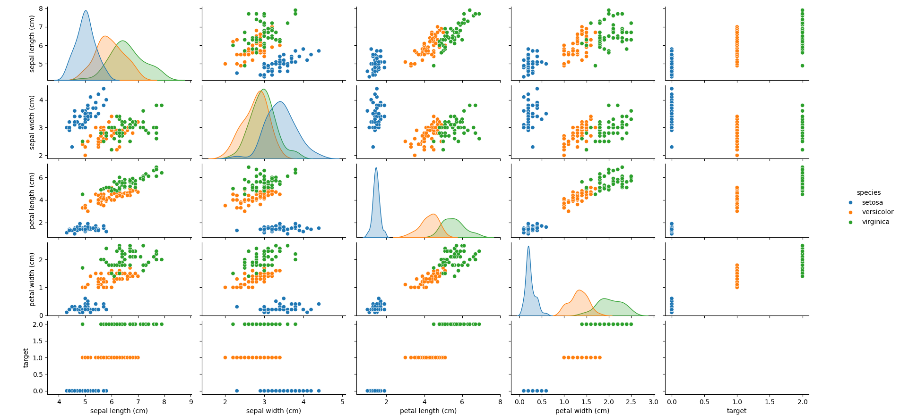
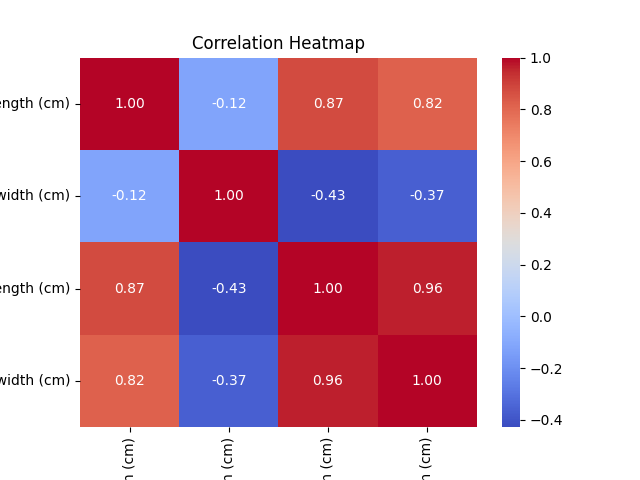

### Sklearn 应用案例
鸢尾花数据集（Iris Dataset）是机器学习中最经典的入门数据集之一。

鸢尾花数据集包含了三种鸢尾花（Setosa、Versicolor、Virginica）每种花的 4 个特征：花萼长度、花萼宽度、花瓣长度和花瓣宽度。

接下来我们的任务是基于这些特征来预测鸢尾花的种类。

本章节案例将涵盖数据加载、可视化、特征选择、数据预处理、建立分类模型、模型评估及优化等步骤。
***

### 1、数据加载与可视化
#### 数据加载
首先，加载鸢尾花数据集，scikit-learn 提供了直接加载鸢尾花数据集的接口。

实例
```python
from sklearn.datasets import load_iris
import pandas as pd

# 加载鸢尾花数据集
data = load_iris()

# 转换为 DataFrame 方便查看
df = pd.DataFrame(data.data, columns=data.feature_names)
df['target'] = data.target
df['species'] = df['target'].apply(lambda x: data.target_names[x])

# 查看前几行数据
print(df.head())
```

输出结果：
```
   sepal length (cm)  sepal width (cm)  petal length (cm)  petal width (cm)  target species
0                 5.1               3.5                1.4               0.2       0   setosa
1                 4.9               3.0                1.4               0.2       0   setosa
2                 4.7               3.2                1.3               0.2       0   setosa
3                 4.6               3.1                1.5               0.2       0   setosa
4                 5.0               3.6                1.4               0.2       0   setosa
```
此时，数据已经成功加载，并且我们可以看到每条数据的特征和对应的花卉种类。

#### 数据可视化
为了更好地理解数据，可以通过可视化的方式查看不同特征之间的关系，我们可以使用 matplotlib 和 seaborn 库来进行可视化。

实例
```python
from sklearn.datasets import load_iris
import pandas as pd
import seaborn as sns
import matplotlib.pyplot as plt

# 加载鸢尾花数据集
data = load_iris()

# 转换为 DataFrame 方便查看
df = pd.DataFrame(data.data, columns=data.feature_names)
df['target'] = data.target
df['species'] = df['target'].apply(lambda x: data.target_names[x])

# 绘制特征之间的关系
sns.pairplot(df, hue="species")
plt.show()
```
pairplot 会绘制特征之间的散点图矩阵，使用不同颜色标识不同的鸢尾花种类，这有助于我们了解各特征的分布和它们之间的关系。

显示图如下：



#### 热力图可视化特征之间的相关性
通过热力图可以查看特征之间的相关性，较强的相关性可以帮助我们在建模时做出更好的选择。

实例
```python
from sklearn.datasets import load_iris
import pandas as pd
import seaborn as sns
import matplotlib.pyplot as plt

# 加载鸢尾花数据集
data = load_iris()

# 转换为 DataFrame 方便查看
df = pd.DataFrame(data.data, columns=data.feature_names)
df['target'] = data.target
df['species'] = df['target'].apply(lambda x: data.target_names[x])

# 绘制特征之间的关系
correlation_matrix = df.drop(columns=['target', 'species']).corr()
sns.heatmap(correlation_matrix, annot=True, cmap="coolwarm", fmt=".2f")
plt.title("Correlation Heatmap")
plt.show()
```
显示图如下：


***
### 2、特征选择与数据预处理
#### 数据预处理
在机器学习中，数据预处理是非常重要的一步。

对于鸢尾花数据集，特征值已经是数值型数据，不需要太多的预处理。但是，我们可以对数据进行标准化，以提高模型的训练效果。

实例
```python
from sklearn.preprocessing import StandardScaler

# 提取特征和标签
X = df.drop(columns=['target', 'species'])
y = df['target']

# 标准化特征
scaler = StandardScaler()
X_scaled = scaler.fit_transform(X)
```
标准化的目的是使每个特征的均值为 0，方差为 1，这对于一些基于距离的模型（如 KNN、SVM）非常重要。

#### 特征选择
虽然鸢尾花数据集的特征比较简单，但在实际问题中，有时我们需要通过特征选择来减少特征维度，提升模型效果。

我们可以使用 SelectKBest 或 Recursive Feature Elimination (RFE) 等方法。

例如，使用 SelectKBest 选择与标签最相关的 2 个特征：

实例
```python
from sklearn.feature_selection import SelectKBest, f_classif

# 使用卡方检验选择 2 个最相关的特征
selector = SelectKBest(f_classif, k=2)
X_new = selector.fit_transform(X_scaled, y)

# 打印选择的特征
selected_features = selector.get_support(indices=True)
print("Selected features:", X.columns[selected_features])
```
这将选出与目标标签相关性最高的 2 个特征。

***

### 3、建立一个分类模型：使用决策树或 SVM 进行分类
#### 使用决策树分类器
我们将首先尝试使用决策树（Decision Tree）模型进行分类。

实例
```python
from sklearn.model_selection import train_test_split
from sklearn.tree import DecisionTreeClassifier
from sklearn.metrics import accuracy_score

# 划分数据集
X_train, X_test, y_train, y_test = train_test_split(X_scaled, y, test_size=0.2, random_state=42)

# 初始化决策树分类器
model_dt = DecisionTreeClassifier(random_state=42)

# 训练模型
model_dt.fit(X_train, y_train)

# 预测
y_pred_dt = model_dt.predict(X_test)

# 评估模型
accuracy_dt = accuracy_score(y_test, y_pred_dt)
print(f"Decision Tree Accuracy: {accuracy_dt:.4f}")
```
#### 使用支持向量机（SVM）进行分类
接下来，我们可以尝试使用支持向量机（SVM）进行分类。

实例
```python
from sklearn.svm import SVC

# 初始化 SVM 分类器
model_svm = SVC(kernel='linear', random_state=42)

# 训练模型
model_svm.fit(X_train, y_train)

# 预测
y_pred_svm = model_svm.predict(X_test)

# 评估模型
accuracy_svm = accuracy_score(y_test, y_pred_svm)
print(f"SVM Accuracy: {accuracy_svm:.4f}")
```

***

### 4、评估模型并优化
#### 模型评估
除了准确率外，我们还可以使用其他评估指标，如混淆矩阵、精度、召回率和 F1 分数等。

实例
```python
from sklearn.metrics import classification_report, confusion_matrix

# 混淆矩阵
cm = confusion_matrix(y_test, y_pred_dt)
print("Confusion Matrix (Decision Tree):")
print(cm)

# 精度、召回率、F1 分数
report = classification_report(y_test, y_pred_dt)
print("Classification Report (Decision Tree):")
print(report)
```
#### 网格搜索调优
为了优化模型，我们可以使用网格搜索（GridSearchCV）对模型的超参数进行调优，找到最佳的参数组合。

实例
```python
from sklearn.model_selection import GridSearchCV

# 定义决策树的参数网格
param_grid = {
    'max_depth': [3, 5, 10, None],
    'min_samples_split': [2, 5, 10],
    'min_samples_leaf': [1, 2, 4]
}

# 初始化 GridSearchCV
grid_search = GridSearchCV(estimator=DecisionTreeClassifier(random_state=42), param_grid=param_grid, cv=5)

# 训练网格搜索
grid_search.fit(X_train, y_train)

# 获取最佳参数和最佳模型
print("Best Parameters:", grid_search.best_params_)
best_model = grid_search.best_estimator_

# 预测和评估
y_pred_optimized = best_model.predict(X_test)
accuracy_optimized = accuracy_score(y_test, y_pred_optimized)
print(f"Optimized Decision Tree Accuracy: {accuracy_optimized:.4f}")
```
通过网格搜索，我们可以找到最适合当前数据的决策树参数，并提升模型的预测准确率。

#### 交叉验证
为了进一步评估模型的稳定性，我们可以使用交叉验证来评估模型的性能。

实例
```python
from sklearn.model_selection import cross_val_score

# 进行 5 折交叉验证
cross_val_scores = cross_val_score(best_model, X_scaled, y, cv=5)
print(f"Cross-validation Scores: {cross_val_scores}")
print(f"Mean CV Accuracy: {cross_val_scores.mean():.4f}")
```
交叉验证可以帮助我们评估模型在不同数据子集上的表现，避免模型过拟合。

***

### 5、完整代码
以下是一个完整的代码案例，涵盖了鸢尾花数据集的加载、数据预处理、特征选择、建立分类模型、模型评估与优化等步骤。我们将使用决策树和 SVM 分类器，并通过网格搜索优化模型超参数。
实例
```python
# 导入必要的库
import numpy as np
import pandas as pd
import seaborn as sns
import matplotlib.pyplot as plt
from sklearn.datasets import load_iris
from sklearn.model_selection import train_test_split, GridSearchCV, cross_val_score
from sklearn.preprocessing import StandardScaler
from sklearn.tree import DecisionTreeClassifier
from sklearn.svm import SVC
from sklearn.metrics import accuracy_score, classification_report, confusion_matrix

# 1. 数据加载
# 加载鸢尾花数据集
data = load_iris()

# 转换为 DataFrame 方便查看
df = pd.DataFrame(data.data, columns=data.feature_names)
df['target'] = data.target
df['species'] = df['target'].apply(lambda x: data.target_names[x])

# 查看前几行数据
print("数据预览：")
print(df.head())

# 2. 数据可视化
# 绘制特征之间的关系
sns.pairplot(df, hue="species")
plt.show()

# 绘制热力图查看特征之间的相关性
correlation_matrix = df.drop(columns=['target', 'species']).corr()
sns.heatmap(correlation_matrix, annot=True, cmap="coolwarm", fmt=".2f")
plt.title("Correlation Heatmap")
plt.show()

# 3. 特征选择与数据预处理
# 提取特征和标签
X = df.drop(columns=['target', 'species'])
y = df['target']

# 数据标准化
scaler = StandardScaler()
X_scaled = scaler.fit_transform(X)

# 4. 建立分类模型
# 划分数据集
X_train, X_test, y_train, y_test = train_test_split(X_scaled, y, test_size=0.2, random_state=42)

# 使用决策树分类器
model_dt = DecisionTreeClassifier(random_state=42)
model_dt.fit(X_train, y_train)

# 预测
y_pred_dt = model_dt.predict(X_test)

# 输出决策树的准确率
accuracy_dt = accuracy_score(y_test, y_pred_dt)
print(f"Decision Tree Accuracy: {accuracy_dt:.4f}")

# 使用支持向量机（SVM）分类器
model_svm = SVC(kernel='linear', random_state=42)
model_svm.fit(X_train, y_train)

# 预测
y_pred_svm = model_svm.predict(X_test)

# 输出SVM的准确率
accuracy_svm = accuracy_score(y_test, y_pred_svm)
print(f"SVM Accuracy: {accuracy_svm:.4f}")

# 5. 模型评估
# 决策树模型评估
print("\nDecision Tree Classification Report:")
print(classification_report(y_test, y_pred_dt))

print("\nDecision Tree Confusion Matrix:")
print(confusion_matrix(y_test, y_pred_dt))

# SVM模型评估
print("\nSVM Classification Report:")
print(classification_report(y_test, y_pred_svm))

print("\nSVM Confusion Matrix:")
print(confusion_matrix(y_test, y_pred_svm))

# 6. 网格搜索调优
# 定义决策树的参数网格
param_grid = {
    'max_depth': [3, 5, 10, None],
    'min_samples_split': [2, 5, 10],
    'min_samples_leaf': [1, 2, 4]
}

# 初始化 GridSearchCV
grid_search = GridSearchCV(estimator=DecisionTreeClassifier(random_state=42), param_grid=param_grid, cv=5)
grid_search.fit(X_train, y_train)

# 获取最佳参数和最佳模型
print("\nBest Parameters from GridSearchCV (Decision Tree):")
print(grid_search.best_params_)

# 使用最佳模型进行预测
best_model = grid_search.best_estimator_
y_pred_optimized = best_model.predict(X_test)

# 输出优化后的决策树准确率
accuracy_optimized = accuracy_score(y_test, y_pred_optimized)
print(f"Optimized Decision Tree Accuracy: {accuracy_optimized:.4f}")

# 7. 交叉验证
# 进行 5 折交叉验证
cross_val_scores = cross_val_score(best_model, X_scaled, y, cv=5)
print("\nCross-validation Scores (Optimized Decision Tree):")
print(cross_val_scores)
print(f"Mean CV Accuracy: {cross_val_scores.mean():.4f}")
```
代码解析：

1 数据加载：

  - 使用 load_iris() 加载鸢尾花数据集，并将数据转换为 DataFrame 格式，以便查看和分析。

2 数据可视化：

  - 使用 seaborn 的 pairplot 绘制各特征之间的散点图矩阵，并通过 heatmap 绘制特征之间的相关性热力图。

3 特征选择与数据预处理：

  - 提取特征（X）和标签（y），并对特征数据进行标准化处理，使得每个特征的均值为 0，方差为 1。

4 建立分类模型：

 - 使用 DecisionTreeClassifier 和 SVC 分别训练决策树分类器和支持向量机分类器，并评估它们在测试集上的准确率。

5 模型评估：

  - 使用 classification_report 和 confusion_matrix 输出模型的详细评估指标，包括精度、召回率、F1 分数以及混淆矩阵。

6 网格搜索调优：

  - 使用 GridSearchCV 对决策树模型进行超参数调优，寻找最佳的超参数组合，并输出优化后的模型准确率。

7 交叉验证：

  - 使用 cross_val_score 进行 5 折交叉验证，评估优化后的决策树模型的稳定性和表现。

输出如下：


数据预览：

```
sepal length (cm)  sepal width (cm)  petal length (cm)  petal width (cm)  target species
0                 5.1               3.5                1.4               0.2       0   setosa
1                 4.9               3.0                1.4               0.2       0   setosa
2                 4.7               3.2                1.3               0.2       0   setosa
3                 4.6               3.1                1.5               0.2       0   setosa
4                 5.0               3.6                1.4               0.2       0   setosa

Decision Tree Accuracy: 1.0000
SVM Accuracy: 1.0000

Decision Tree Classification Report:
              precision    recall  f1-score   support

           0       1.00      1.00      1.00         9
           1       1.00      1.00      1.00         8
           2       1.00      1.00      1.00         8

    accuracy                           1.00        25
   macro avg       1.00      1.00      1.00        25
weighted avg       1.00      1.00      1.00        25

Decision Tree Confusion Matrix:
[[9 0 0]
 [0 8 0]
 [0 0 8]]

SVM Classification Report:
              precision    recall  f1-score   support

           0       1.00      1.00      1.00         9
           1       1.00      1.00      1.00         8
           2       1.00      1.00      1.00         8

    accuracy                           1.00        25
   macro avg       1.00      1.00      1.00        25
weighted avg       1.00      1.00      1.00        25

SVM Confusion Matrix:
[[9 0 0]
 [0 8 0]
 [0 0 8]]

Best Parameters from GridSearchCV (Decision Tree):
{'max_depth': 5, 'min_samples_leaf': 1, 'min_samples_split': 2}

Optimized Decision Tree Accuracy: 1.0000

Cross-validation Scores (Optimized Decision Tree):
[1.         1.         1.         1.         1.        ]
Mean CV Accuracy: 1.0000
```
***


