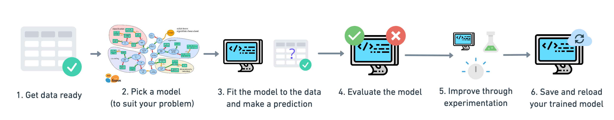
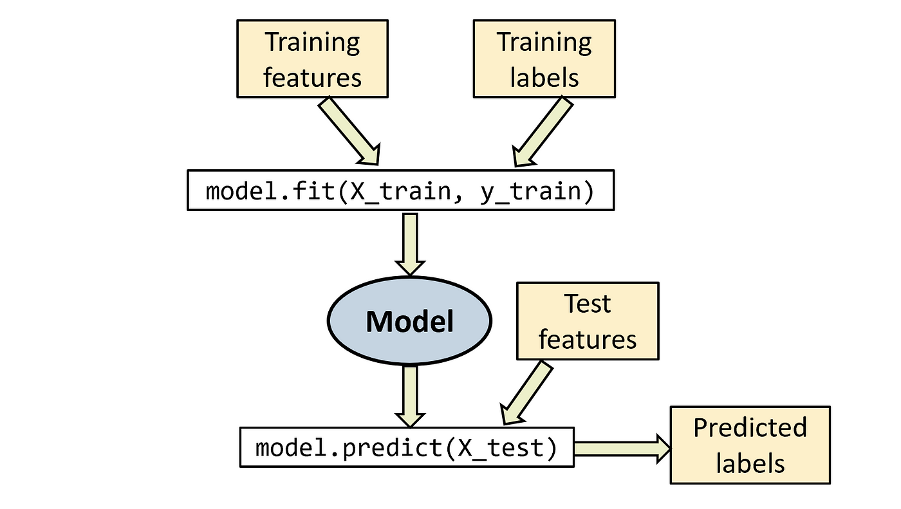
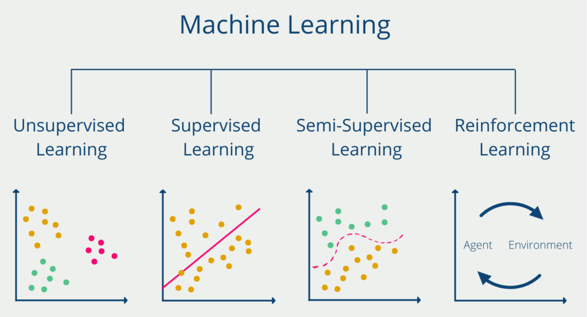
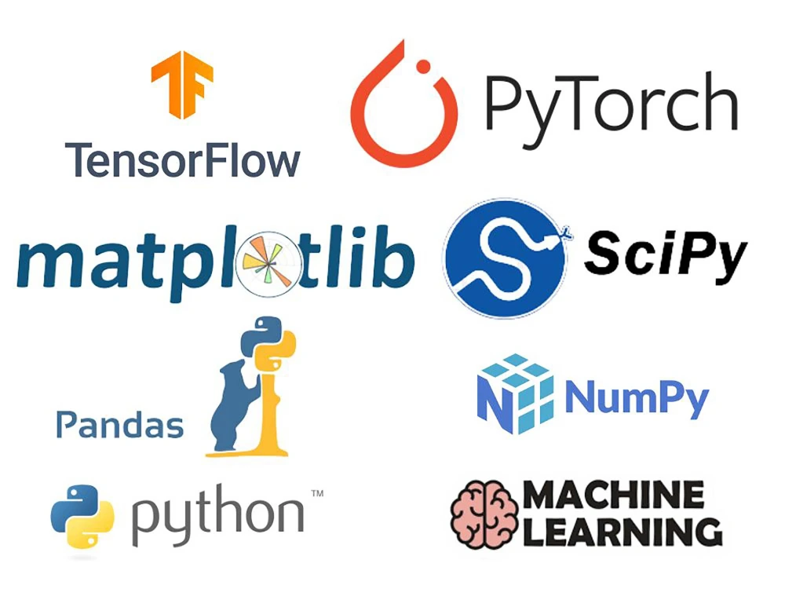

### Sklearn 简介
Sklearn，全称为 Sklearn，是一个基于 Python 的开源机器学习库。

Sklearn 是一个功能强大、易于使用的机器学习库，提供了从数据预处理到模型评估的一整套工具。

Sklearn 构建在 NumPy 和 SciPy 基础之上，因此它能够高效地处理数值计算和数组操作。

Sklearn 适用于各类机器学习任务，如分类、回归、聚类、降维等。

Sklearn 凭借其简洁而一致的 API，Sklearn 已经成为了机器学习爱好者和专家的必备工具之一。

#### Sklearn 如何工作
在 Sklearn 中，机器学习的流程遵循一定的模式：数据加载、数据预处理、训练模型、评估模型 和 调优模型。

具体工作流程如下：

* 数据加载：使用 Sklearn 或其他库加载数据集，例如通过 datasets.load_iris() 加载经典的鸢尾花数据集，或使用 train_test_split() 分割数据。
* 数据预处理：根据数据的类型，可能需要进行标准化、去噪、缺失值填充等操作。
* 选择算法和训练模型：选择适合的算法（如逻辑回归、支持向量机等），使用 .fit() 方法对模型进行训练。
* 模型评估：使用交叉验证或单一训练/测试集来评估模型的准确性、召回率、F1分数等性能指标。
* 模型优化：使用网格搜索（GridSearchCV）或随机搜索（RandomizedSearchCV）对模型进行超参数优化，提高模型性能。

#### Sklearn 的特点
* 易用性：Sklearn 的 API 设计简洁且一致，使得学习曲线较为平缓。通* 过简单的 fit、predict、score 等方法，可以快速实现机器学习任务。
* 高效性：虽然 Sklearn 是纯 Python 编写，但它的底层大多数实现依赖于 Cython 和 NumPy，这使得它在执行机器学习算法时速度非常快。
* 丰富的功能：Sklearn 提供了大量经典的机器学习算法，包括：
  -  分类算法：如逻辑回归、支持向量机（SVM）、K近邻（KNN）、随机森林等
  -  回归算法：如线性回归、岭回归、Lasso回归等
  -  聚类算法：如 K均值、层次聚类、DBSCAN 等
  -  降维算法：如主成分分析（PCA）、t-SNE 等
  -  模型选择与评估：交叉验证、网格搜索、模型评估指标等
* 兼容性好：Sklearn 可以很好地与 NumPy、SciPy、Pandas 等 Python 数据处理库兼容，支持多种数据格式（如 NumPy 数组、Pandas DataFrame）进行输入和输出。

#### Sklearn 支持的机器学习任务
Sklearn 提供了丰富的工具，支持以下几类机器学习任务：

* 监督学习（Supervised Learning）：
  -  分类问题：预测数据的类别（例如，电子邮件垃圾邮件分类、图像分类、疾病预测等）。
  -  回归问题：预测连续值（例如，房价预测、股票价格预测等）。
* 无监督学习（Unsupervised Learning）：
  -  聚类问题：将数据分组为不同的类群（例如，客户分群、文档聚类等）。
  -  降维问题：将高维数据投影到低维空间，便于可视化或减少计算复杂度（例如，PCA、t-SNE）。
* 半监督学习（Semi-supervised Learning）：部分数据是带标签的，部分数据是无标签的，模型尝试从这些数据中提取信息。
* 强化学习（Reinforcement Learning）：虽然 Sklearn 主要专注于监督和无监督学习，但也有一些相关的工具，可以用来处理强化学习问题。

### Sklearn 中常见的模块和类
* 分类（Classification）
  -  sklearn.linear_model.LogisticRegression：逻辑回归
  -  sklearn.svm.SVC：支持向量机分类
  -  sklearn.neighbors.KNeighborsClassifier：K近邻分类
  -  sklearn.ensemble.RandomForestClassifier：随机森林分类
* 回归（Regression）
  -  sklearn.linear_model.LinearRegression：线性回归
  -  sklearn.linear_model.Ridge：岭回归
  -  sklearn.ensemble.RandomForestRegressor：随机森林回归
* 聚类（Clustering）
  -  sklearn.cluster.KMeans：K均值聚类
  -  sklearn.cluster.DBSCAN：基于密度的空间聚类
* 降维（Dimensionality Reduction）
  -  sklearn.decomposition.PCA：主成分分析（PCA）
  -  sklearn.decomposition.NMF：非负矩阵分解
* 模型选择（Model Selection）
  -  sklearn.model_selection.train_test_split：将数据集划分为训练集和测试集
  -  sklearn.model_selection.GridSearchCV：网格搜索，寻找最佳超参数
* 数据预处理（Preprocessing）
  -  sklearn.preprocessing.StandardScaler：标准化
  -  sklearn.preprocessing.MinMaxScaler：最小-最大标准化
  -  sklearn.preprocessing.OneHotEncoder：独热编码

### 常用术语解释
* 拟合（Fit）：指将模型应用于训练数据，并通过训练调整模型的参数。model.fit(X_train, y_train)
* 预测（Predict）：根据训练好的模型，对未知数据进行预测。model.predict(X_test)
* 评估（Score）：评估模型的性能，通常返回一个评分指标，例如准确率。model.score(X_test, y_test)
* 交叉验证（Cross-validation）：将数据集划分为多个子集，通过多次训练和验证，评估模型的稳定性和泛化能力。 

### Sklearn与其他库的关系
* 与 NumPy 和 SciPy 的关系：Sklearn 构建在 NumPy 和 SciPy 基础之上，因此它能够高效地处理数值计算和数组操作。
* 与 Pandas 的关系：Pandas 提供了强大的数据处理能力，而 Sklearn 支持从 Pandas 的 DataFrame 中直接提取数据进行模型训练和预测。
* 与 TensorFlow 和 PyTorch 的关系：Sklearn 主要关注传统的机器学习方法，而 TensorFlow 和 PyTorch 则更侧重于深度学习模型。尽管如此，Sklearn 与这些库可以结合使用，处理一些前期的特征工程任务，或作为基础模型与深度学习进行比较。
