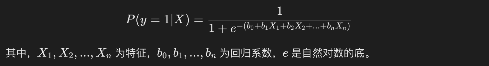

### Sklearn 机器学习模型
机器学习模型是实现自动化数据分析、模式识别和预测的核心工具。

根据任务的不同，机器学习模型可以分为分类模型、回归模型和聚类模型等。

本章节将详细介绍这些常见的机器学习模型，并介绍如何评估和优化模型。

***
#### 1、分类模型
分类问题是机器学习中最常见的问题之一，其目的是将输入数据映射到离散的类别标签。
常见的分类模型有: 逻辑回归、K-近邻、支持向量机、决策树和随机森林等。
#### 逻辑回归（Logistic Regression）
逻辑回归是一种经典的线性分类模型，虽然名字中有"回归"，但它实际上用于二分类问题。它通过将线性回归的输出通过逻辑函数（sigmoid）映射到 0 和 1 之间，从而预测事件的概率。

逻辑回归的核心公式为：

scikit-learn 实现:

实例
```python
from sklearn.linear_model import LogisticRegression
from sklearn.model_selection import train_test_split

# 假设 X 是特征矩阵，y 是标签
X_train, X_test, y_train, y_test = train_test_split(X, y, test_size=0.3, random_state=42)

model = LogisticRegression()
model.fit(X_train, y_train)

# 预测
y_pred = model.predict(X_test)
```

#### K-近邻（K-Nearest Neighbors, KNN）
K-近邻（KNN）是一种基于实例的学习方法，预测时通过计算待预测样本与训练集中所有样本的距离，选取距离最近的 K 个邻居，并根据邻居的标签进行预测。

主要参数:

 - K：选择的邻居数量。
 - 距离度量：常用欧氏距离，也可以使用曼哈顿距离、闵可夫斯基距离等。
scikit-learn 实现:

实例
```python
from sklearn.neighbors import KNeighborsClassifier
from sklearn.model_selection import train_test_split

# 假设 X 是特征矩阵，y 是标签
X_train, X_test, y_train, y_test = train_test_split(X, y, test_size=0.3, random_state=42)

model = KNeighborsClassifier(n_neighbors=3)
model.fit(X_train, y_train)

# 预测
y_pred = model.predict(X_test)
```

***
#### 2、回归模型
***
#### 3、聚类模型
***
#### 4、模型评估与选择
***

